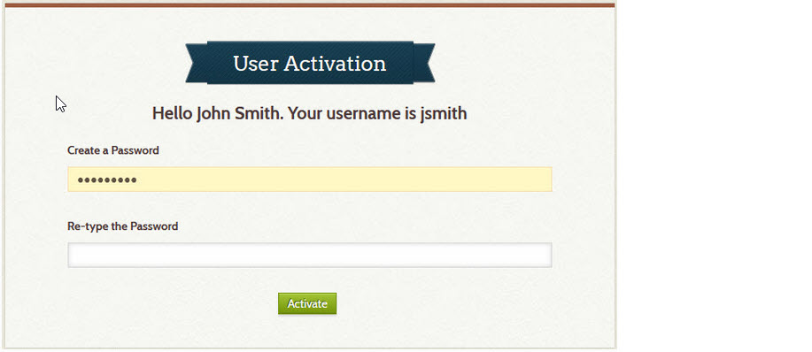
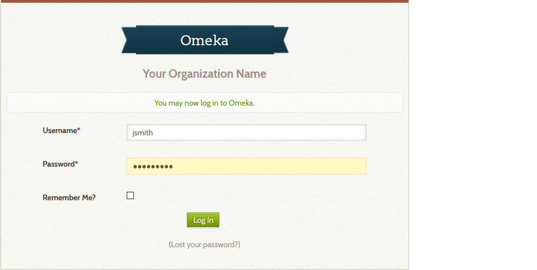

# Add a New User

An administrator can create new accounts for archivists, guests, and other administrators.
[Learn about kinds of users](#kinds-of-users).

Follow these steps to add a new user.

1 &ndash; Send email to the new user
:   Before creating a new user account, it's a good idea to first send an email
    message, like the one below, to the new user so they won't be surprised when
    they get an email from Omeka about their new account.

``` text
I have created a Digital Archive account for you. You will receive  an email with a link
to activate the account. Click the link, and then on the User Activation screen, type a
password in the two password fields (it's a little confusing because the Create a Password
field looks like it's already filled in). After you click the Activate button on that
screen, you'll get another screen that will let you log in.
```

2 &ndash; Create the new account
:   **To learn how to add a new user**, follow the instructions in the
    [users section](https://omeka.org/classic/docs/Admin/Users/) of the Omeka
    Classic user manual.

    The user will receive an email similar to the one below.

``` text
Welcome!

Your account for the Your Organization Name repository has been created.
Please click the following link to activate your account:

https://yourdomain.net/admin/users/activate?u=20961f80494906909852c967632e

Your Organization Name Administrator
```

3 &ndash; Follow up with the new user
:   Make contact with the new user to verify they they received the email
    from Omeka and that they were able to activate their account and login.
    When they click the link in the email, they'll see a page like the one below.



:   After they click the **_Activate_** button, they'll see the login page as shown below.




4 &ndash; Manual activation
:   If the user did not receive the email, or received it, but could not activate their
    account, you can manually active their account:
    
    -   Go to the Omeka **_Browse Users_** page
    -   Click the **_Edit_** link for the new account
    -   Check the **_Activate_** box at the bottom of the **_Edit User_** page
    -   On the **_Change Password_** tab, create a password
    -   Verify that you can log in to the account as the new user
    -   Send the login information to the new user


## Kinds of users

The terminology for users in this Digital Archive documentation differs from
[Omeka terminology for user roles](https://omeka.org/classic/docs/Admin/Users/). 
The table below shows the differences.

Digital Archive term | Omeka user role
---:|:---
Guest|researcher
Archivist|admin *or* contributor
Administrator|super

### Guest user

A user logged in as *Guest* will see non-public items and private fields in search results.
To learn about public and non-public items, see the section on [what gets searched](/archivist/what-gets-searched/).

Guest users **do not see**:

-   The gray menu bar that archivists and administrators see at the top of every
    page. Hiding the menu bar from guests prevents them from accessing an administrative features.
-   [Quick access links](/archivist/special-features-archivist/#quick-access-links)

A guest user account is useful for people who should be able to see all of the data in the
collection, but not be able to make any change. Examples of guest users would be trusted researchers
and members of your organization's board of trustees. You don't need to create a separate guest
user account for each person. You can create just one guest account and let multiple people use it.


