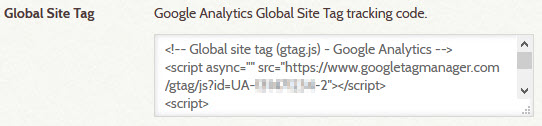

# Digital Archive Administration

The Digital Archive provides additional administrative features beyond those built into Omeka.

You can learn how to use most of these features by reading other parts of this documentation,
but this page provides some additional guidance.

## Add zoomable images

[Zoomable images](/user/viewing-items/#viewing-zoomable-images) are easy to create, but you need
to be able to use FTP to upload the images to your Digital Archive server. This is something that
an archivist could do on their own once taught how by the administrator.
[Learn how to create zoomable images](/administrator/zoomable-images/).


## Enable Google Analytics

If your organization has a Google Analytics account, you can have it track visits to
your Digital Archive site. To enable analytics, go to the **_Themes_** tab on the
**_Appearance_** page and enter your Google Analytics Global Site Tag tracking code
into the **_Global Site Tag_** field as shown below.



## Change the site's appearance

You can make these changes to your site's appearance:

-   Replace the banner image that appears at the top of every page
-   Edit the text that appears in the footer on every page
-   Edit the CSS that controls the overall appearance of the site

To make these kinds of changes, go to the **_Themes_** tab on the **_Appearance_** page.

##### CSS

The CSS properties below are used to control:

-   The background color that appears *around* the main content area of pages
-   The color of the navigation links that appear in the banner such as menu items
-   The color of other links
-   The color of h1 and h2 headings

```
:root {
    --background-color: #ebf3ff;
    --nav-link-color: #3d5a98;
    --nav-link-hover-color: #7596b9;
    --link-color: #3d5a98;
    --link-hover-color: #7596b9;
    --headings-color: #1a77bd;
}
```

---

!!! note "Caution"
    Do not edit CSS unless you know what you are doing. The smallest mistake can drastically
    change the appearance of your site. To be safe, before making any changes, first copy
    the CSS and save it to a file as a backup. If you get into trouble with your changes,
    you can restore the good CSS by copying it into the CSS field from the file.


## Configure Digital Archive plugins

The Digital Archive is built on top of [Omeka Classic](https://omeka.org/classic/) using several
plugins created by AvantLogic that add additional features, and in some cases, change the way Omeka
features work. An administrator can customize the configuration of some of these plugins.

As shown in the table below, the AvantElements and AvantSearch plugins provide most of the configuration
options that an administrator would change.

 Plugin                                           | Configuration
:---                                              | :---
[AvantAdmin](/plugins/avantadmin)                 | Do not modify
[AvantCommon](/plugins/avantcommon)               | Specify which Omeka elements should be private
[AvantCustom](/plugins/avantcustom)               | Has no configuration options
[AvantElasticsearch](/plugins/avantelasticsearch) | Do not modify
[AvantElements](/plugins/avantelements)           | Many options - [see the plugin documentation](/plugins/avantelements)
[AvantRelationships](/plugins/avantrelationships) | Specify which fields have implicit relationships
[AvantS3](/plugins/avants3)                       | Do not modify
[AvantSearch](/plugins/avantsearch)               | Many options - [see the plugin documentation](/plugins/avantsearch)
[AvantZoom](/plugins/avantzoom)                   | Has no configuration options

To change a plugin's configuration, go the **_Plugins_** page and then click the **_Configure_**
button for the plugin you want to configure. 

!!! note "Caution"
    Be very careful when making changes to plugin configurations. If you are not sure about
    what you are doing, consult your Digital Archive developer.

## Rebuild Elasticsearch indexes

Some changes that you make using Omeka or Digital Archive administrative features, require
that you rebuild your site's Elasticsearch indexes. This can happen, for example, if you
[add a new Omeka element](/administrator/omeka-elements/), or modify a plugin
configuration setting such as changing an existing element from private to public or vice-versa.

Learn about [rebuilding Elasticsearch indexes](/administrator/reindex/).

## Import data from a CSV file

It is possible to bring data into a Digital Archive collection in bulk from a CSV file.
While this is most commonly done when setting up a new site, you can do it for an
existing site if you are careful.

Learn about [importing CSV data](/administrator/import-csv/).

---

