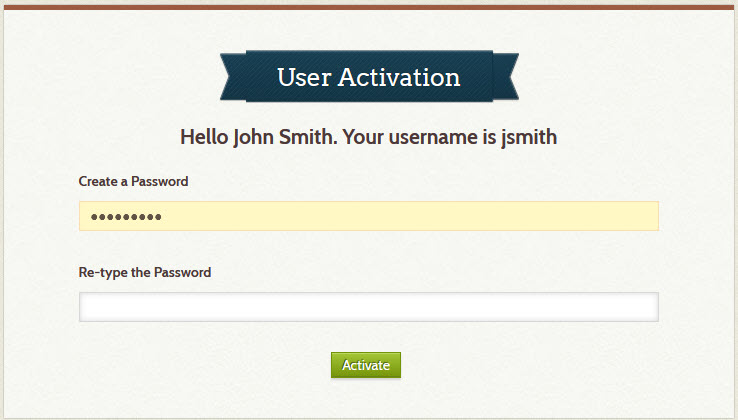
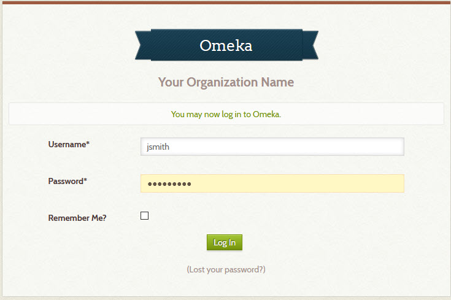

# Frequently Asked Questions

---
## How to log in

See the link at the bottom of the page -- click `login`


## How to add or edit menu items

Read these sections from the Omeka Classic user manual:

-   [Navigation](https://omeka.org/classic/docs/Admin/Appearance/Navigation/)
-   [Simple Pages](https://omeka.org/classic/docs/Plugins/SimplePages/)


## How to set the Home page

The Home page is the one that appears when a visitor first comes to your site or
when they click on the banner that appears at the top of every page. The home page
can be an informative page like About or Browse, or it can be search results. To
learn how to set the home page, read these sections from the Omeka Classic user manual:

-   [Add a navigation link to the home page](https://omeka.org/classic/docs/Admin/Appearance/Navigation/#add-navigation-links)
-   [Choose the home page](https://omeka.org/classic/docs/Admin/Appearance/Navigation/#choose-a-homepage)

Here are some examples of navigation links you could use for the home page. To use these examples, replace `mysite.net` with the domain name for your site.

```
https://mysite.net/digitalarchive/find?query=&view=4&limit=100
https://mysite.net/digitalarchive/avant/dashboard
https://mysite.net/digitalarchive/find
```

## How to add a new user

Read the [users section](https://omeka.org/classic/docs/Admin/Users/) in the Omeka Classic user manual.

Suggest sending an email to the user first saying:

``` text
I have created a Digital Archive account for you. You will receive  an email with a link
to activate the account. Click the link, and then on the User Activation screen, type a
password in the two password fields (it's a little confusing because the Create a Password
field looks like it's already filled in). After you click the Activate button on that
screen, you'll get another screen that will let you log in.
```

Then create the user account which will automatically send the email below to the new user.

``` text
Welcome!

Your account for the Your Organization Name repository has been created.
Please click the following link to activate your account:

https://yourdomain.net/digitalarchive/admin/users/activate?u=20961f8049490f15d7e0cff6a6909852c967632e

Your Organization Name Administrator
```




