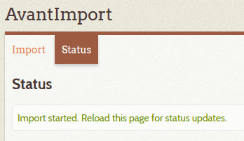

# Import CSV data

You can import data into the Digital Archive to create or update items from metadata in a CSV file.
You can also import files to be attached to an imported item.

---

## Prerequisites

To import CSV data:

-   The [AvantImport] plugin must be installed and activated
-   The [AvantElasticsearch] plugin must be deactivated (explained later)
-   You must be logged into Omeka as a super user. If logged in with a lesser
    role, **AvantImport** will not appear in Omeka's left admin menu.
-   You must configure AvantImport for each CSV file to import as explained below.

## Preparation

Read this section carefully before attempting to import a CSV file.

### Configuration

You must configure AvantImport to tell it which columns you want to import from the CSV file (source column names) and what the corresponding Omeka element names should get created for each column (target column names).

Follow these steps to configure the import:

-	Go to the Omeka `Plugins` page
-	Click the `Configure` button for `AvantImport`
-   In the `Mappings` field, provide a list of source/target column pairs, separated by a colon, as shown in the screenshot below. 
-   Click the `Save Changes` button.

Read the [Import steps](#import-steps) section below to learn how to do the actual import.

### CSV file syntax

The CSV file must have UTF-8 encoding as explained below.

-   The first row must contain the source column names used in the configuration above
-   Cells that contain multiple values for a single element must use a semicolon as the value delimeter.
    For example, if an item has three subjects "one", "two" and "three", its Subject cell would contain `one;two;three`.

### Importing image files

If you will be importing files to be attached to imported items, upload all of the files into the
`digitalarchive/files/import` folder. In the CSV column used to specify the files, you'll specify just
the file name (with no path) and AvantImport will look for the files in the `import` folder.

To indicate that a CSV column contains a file name, or a semicolon-separated list of file names, use the
pseudo-element name `<files>` in the **Mappings** field on the AvantImport configuration page. In the
screenshot above, the CSV `IMAGES` column will contain file names.
   
### UTF-8 encoding

AvantImport will only import a CSV file that has [UTF-8](https://en.wikipedia.org/wiki/UTF-8) encoding.
This is to ensure that text containing non-ASCII characters, like the the `é` in `Hébert` will import
without triggering an error when saved by Omeka to the MySQL database.

When saving an Excel file as CSV, choose the `CSV UTF-8` option as shown below.

If working with CSV in a text editor like Notepad++, be sure that the file's encoding is set to UTF-8-BOM
as shown below. The file must have the BOM (Byte Order Mark) in order for AvantImport to recognize it as UTF-8.
Excel will insert the BOM when you choose the option shown above.

If creating a CSV file using Python, use the `utf-8-sig` encoding.

### Excel issues

CSV data often originates in Excel. Verify that the resulting CSV file does not suffer from these issues.

-   Make sure that no cells contain `#######` due to a formatting problem in Excel. If you see this in the
    CSV data, go back to Excel and change the format of all columns to General.
-	If the CSV contains a column containing dates, verify that the date format looks correct. Excel is
    notorious for changing dates to a different format.
-   If Excel insists on converting dates improperly when you save the Excel as a CSV file, your only
    recourse may be to work with the data in a text editor like Notepad++ which is more well-behaved.

### AvantElasticsearch considerations

Follow these steps to avoid contention with the [AvantElasticsearch] plugin.

- Before performing an import, deactivate AvantElasticsearch
- Import
- Activate AvantElasticsearch
- Go to the Elasticsearch page:
    -   Export all items
    -   Import into a new local index
    -   Import into the existing shared index

## Import steps

To import from a CSV file, click `AvantImport` in Omeka's left admin menu. The first pages of a two-step
series will appear.

### Import step 1
On the Step 1 page:

-	Click the `Browse` button and choose a UTF-8 encoded CSV file to import
-   Check the **Make items public*** checkbox if you want the imported items to be public.
-	Click the `Next` button
-   The `Step 2` page should appear
-   If instead, an error message in red appears at the top of the page, correct the error and try again

### Import step 2
On the Step 2 page:

-	Verify that the mappings are correct
-   Click the `Import` button at the bottom of the page
-   The `Status` page should appear saying that the import has started
-   To reload the page, click the `Status` tab

!!! note "Suggestion"
    Before attempting to import all of your data, create a test CSV file that contains only two or three rows of CSV data. Use this file to perform all the steps on this page. Only import a file containing all of your data after achieving success with the test file. 

### Status page

Verify that the import worked correctly
    -	If the import Completed, but records were skipped, click on the import date/log to see what happened.
-	Import all of the data
    -	Method  1:
        -	Break the CSV file into chunks of 100 or 200 rows and import the individual files one at a time.
        -	After each import, if any records were skipped, look at the import log to identify and resolve the problem.
    -	Method 2:
        -	Attempt to import the entire CSV file.
        -	As errors are encountered:
            o	Fix the offending row in the CSV using Notepad++ or TextPad
            o	Delete all of the good rows above it except for the header row
            o	Save the CSV with a new file name
            o	Try again and repeat until all rows imported.

---

## Cleanup import folder
Once the import is successful, delete the files from the  `digitalarchive/files/import` folder.

[AvantAdmin]:         ../../plugins/avantadmin
[AvantCommon]:        ../../plugins/avantcommon
[AvantCustom]:        ../../plugins/avantcustom
[AvantDPLA]:          ../../plugins/avantdpla
[AvantElements]:      ../../plugins/avantelements
[AvantElasticsearch]: ../../plugins/avantelasticsearch
[AvantImport]:        ../../plugins/avantimport
[AvantRelationships]: ../../plugins/avantrelationships
[AvantSearch]:        ../../plugins/avantsearch
[AvantS3]:            ../../plugins/avants3
[AvantZoom]:          ../../plugins/avantzoom
[AvantVocabulary]:    ../../plugins/avantvocabulary
[cPanel]:             web-host.md#cpanel
