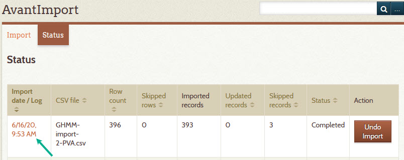

# Import CSV data

You can import data into the Digital Archive to create or update items from metadata in a CSV file.
You can also import files to be attached to an imported item.

---

!!! note "Caution"
    Importing from a CSV file involves many steps and requires the ability to
    use FTP to upload files to the server. You should only attempt to import after carefully
    reading all of the instructions on this page. Be sure you are comfortable with the process
    *before* you begin.

---

## Import steps

1 &ndash; Prepare the import CSV file
:   The CSV file must adhere to the following:

    -   The CSV file must have UTF-8 encoding as explained in the next section.
    -   The first row must contain the source column names used in the configuration above
    -   Cells that contain multiple values for a single element must use a semicolon as the value delimeter.
        For example, if an item has three subjects "one", "two" and "three", its Subject cell would contain `one;two;three`.
    
    **UTF-8 encoding**

    AvantImport will only import a CSV file that has [UTF-8](https://en.wikipedia.org/wiki/UTF-8) encoding.
    This is to ensure that text containing non-ASCII characters, like the the `é` in `Hébert` will import
    without triggering an error when saved by Omeka to the MySQL database.

    When saving an Excel file as CSV, choose the `CSV UTF-8` option as shown below.

    

    If working with CSV in a text editor like Notepad++, be sure that the file's encoding is set to UTF-8-BOM
    as shown below. The file must have the BOM (Byte Order Mark) in order for AvantImport to recognize it as UTF-8.
    Excel will insert the BOM when you choose the option shown above.

    

    If creating a CSV file using Python, use the `utf-8-sig` encoding.

    **Excel issues**

    CSV data often originates in Excel. Verify that the resulting CSV file does not suffer from these issues:

    -   Make sure that no cells contain `#######` due to a formatting problem in Excel. If you see this in the
        CSV data, go back to Excel and change the format of all columns to General.
    -	If the CSV file contains a column containing dates, verify that the date format looks correct. Excel is
        notorious for changing dates to a different format, and for displaying dates differently than they
        actually exist in the CSV file.
    -   If Excel insists on converting dates improperly when you save the Excel as a CSV file, your only
        recourse may be to work with the data in a text editor like Notepad++ which is more well-behaved.

    !!! note "Suggestion"
        Before attempting to import all of your data, create a test CSV file that contains only two or three rows of CSV data. Use this file to perform all the steps on this page. Only import a file containing all of your data after achieving success with the test file. 

2 &ndash; Upload file to be imported
:   If you will be importing files to be attached to imported items, upload all of the files into the
    `digitalarchive/files/import` folder using FTP. In the CSV column used to specify the files, you'll specify just
    the file name (with no path) and AvantImport will look for the files in the `import` folder.

    To indicate that a CSV column contains a file name, or a semicolon-separated list of file names, use the
    pseudo-element name `<files>` in the **_Mappings_** field on the AvantImport configuration page. In the
    screenshot in step 3 below, the CSV `Images` column will contain file names.

3 &ndash; Configure AvantImport
:   You must configure AvantImport to tell it which columns from the CSV file that you want to import
    (source column names) and what the corresponding Omeka element names are for each column
    (target column names). It's okay if the CSV file contains columns that you don't want to import.

    Follow these steps to configure the import:

    -	Go to the Omeka **_Plugins_** page
    -	Click the **_Configure_** button for `AvantImport`
    -   In the **_Mappings_** field, provide a list of source/target column pairs, separated by a colon, as shown in the screenshot below
    -   If the source and target names are the same, you can specify only the source name
    -   Click the **_Save Changes_** button

4 &ndash; Choose the import file
:   -   **Deactivate the AvantElasticsearch plugin**
    -   Click **_Import CSV File_** in Omeka's left admin menu
    -   The **_Step 1_** page will appear
    -	Click the **_Browse_** button and choose a UTF-8 encoded CSV file to import
    -   Check the **_Make items public_** checkbox if you want the imported items to be public
    -	Click the **_Next_** button
    -   The **_Step 2_** page will appear

5 &ndash; Verify the field mappings
:   On the Step 2 page:

    -   Verify that the mappings are correct. To change the mappings, see step 3 above.
    -   Click the **_Import CSV file_** button
    -   The **_Status_** page will appear and the import will begin
    -   Refresh the browser every so often until the status is `Completed`

6 &ndash; Verify that the import worked correctly
:   The screenshot below shows that the import completed, but three records were skipped.

    

    Click on the import date/log to see why the records were skipped. The import log appears showing details
    about the import process. The 4th row on the next screen shot shows that one of the file names in the CSV file was not
    readable or does not exist. The 5th rows says that the record on row #121 was skipped.

     

    The row # in the message is the row number in the CSV file. For example, row #1 is the header row in the
    CSV file and row #2 is the first item to be imported.

7 &ndash; Fix import errors
:   To import the skipped rows:

    -   Determine the cause of the problem. Often it's a misspelling of a file name, or even a difference in letter
        casing. For example, if the CSV file refers to a file named `1234.jpg`, but the actual file name is
        `1234.JPG`, the file won't be found. The presence of a `#` in a file name seems to cause the
        import logic to truncate the name before the `#` which then causes a file name mismatch.
    -   Make a copy of the import file with all the rows removed except the offending row(s). A good way to do this is to
        use a color to highlight the bad rows, then delete all the rows except for the highlighted ones. If you
        simply start deleting the good rows, the row numbers in the error report will no longer match the rows in the
        CSV file.
    -   Fix the row data and/or the file name
    -   Reimport the copy of the import file that contains only the skipped rows
    -   Repeat this process as necessary until all the data is imported.

8 &ndash; Rebuild the Site Terms table
:   Because the import occurs with [Elasticsearch](/glossary/#elasticsearch) disabled, which in turn disables the
    Common Vocabulary feature, you need to rebuild the site terms table.

    -   **Activate the AvantElasticsearch plugin**
    -   Choose **_Vocabulary Editor_** from the left admin menu
    -   Click the **_Rebuild Site Terms table_** button
    -   Click **_OK_** on the confirmation dialog
    -   When the build completes, refresh the page to see the updated local terms

    !!! note
        You must rebuild the site terms table *before* rebuilding the Elasticsearch indexes.
        If you reindex first, you'll see `UNTRACKED` in the **_Refine Your Search_** panel on any
        new terms that came from the import that were not already in the site vocabulary.

9 &ndash; Rebuild the Elasticsearch indexes
:   Because the import occurs with [Elasticsearch](/glossary/#elasticsearch) disabled, you need to [rebuild
    the site's Elasticsearch indexes](/administrator/reindex/). Be sure to do this **after**
    you rebuild the site terms table.

10 &ndash; Cleanup the import folder
:   Once the import is successful, use FTP to delete the files from the `digitalarchive/files/import`
    folder on the server.

[AvantAdmin]:         ../../plugins/avantadmin
[AvantCommon]:        ../../plugins/avantcommon
[AvantCustom]:        ../../plugins/avantcustom
[AvantDPLA]:          ../../plugins/avantdpla
[AvantElements]:      ../../plugins/avantelements
[AvantElasticsearch]: ../../plugins/avantelasticsearch
[AvantImport]:        ../../plugins/avantimport
[AvantRelationships]: ../../plugins/avantrelationships
[AvantSearch]:        ../../plugins/avantsearch
[AvantS3]:            ../../plugins/avants3
[AvantZoom]:          ../../plugins/avantzoom
[AvantVocabulary]:    ../../plugins/avantvocabulary
[cPanel]:             web-host.md#cpanel
