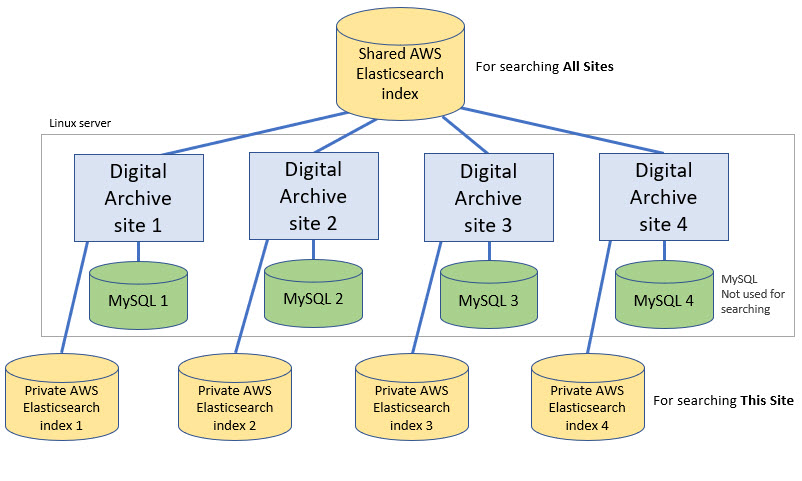
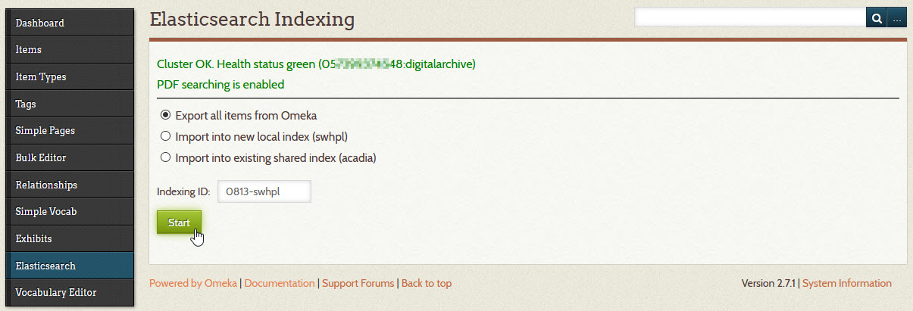

# Rebuilding Elasticsearch Indexes

This page explains:

-   What Elasticsearch indexes are used for
-   When you need to rebuild them
-   How to rebuild them

## What Elasticsearch indexes are used for

Elasticsearch is an open-source, distributed search and analytics engine. 
Since its release in 2010, Elasticsearch has quickly become the most popular search engine.
It is used by the Digital Archive for full-text search and for display of the facets in the
**_Refine Your Search_** panel. Elasticsearch is the technology that makes it possible
for Digital Archive users to [search one site or all sites](/user/how-to-search/#search-one-site-or-all-sites).

In the diagram below, each gold shape with "AWS" in the text represents a single Elasticsearch
index. An index is like a database, but the index data is structured in a way that makes
it possible to search and analyze huge volumes of data from multiple collections and get back
results instantly.



The Digital Archive is built on top of [Omeka](https://omeka.org/classic/) which uses a MySQL
database to store the metadata for the items in your collection. In the diagram above, each
green shapes that says "MySQL" represents a single MySQL database.

The diagram shows that each Digital Archive site has one MySQL database and one private index.
There is one more index, shown at the top of the diagram, that all sites share. It contains
metadata from the public fields of the public items of all collections.
[Learn about public items and fields](/archivist/what-gets-searched/).

When you do a **This Site** search, the Digital Archive searches the private index. If you are logged in,
the search returns results from both public and non-public items in the private index. If you are not
logged in, it only returns results from public items in the private index.

When you do an **All Sites** search, the Digital Archive searches the shared index. All
items in the shared index are public.

### Keeping MySQL and the indexes in sync

When you add, edit, or delete an item in your Digital Archive:

-   Omeka updates the MySQL database with your changes
-   The Digital Archive's [AvantElasticsearch](/plugins/avantelasticsearch) plugin:
    -   Updates your site's private index with the same changes
    -   Updates the shared index with changes to public fields of public items

In other words, whenever you modify an item, the changes go into both the MySQL database and
the Elasticsearch indexes so that both contain the same data. This same synchronization occurs
when you use the [Vocabulary Editor](/archivist/vocabulary-editor/) to edit a vocabulary term.
The Vocabulary Editor updates all items that use the old term to use the new term and it applies
the change to both MySQL and the Elasticsearch indexes.

## When to rebuild Elasticsearch indexes

The synchronization mechanism described above works perfectly until you make changes
using one of the "back door" methods listed below:

-   Update metadata field values using the [Bulk Metadata Editor](/administrator/omeka-administration/#make-bulk-edits)
-   Bulk edit or deleting items using the Omeka **_Browse Items_** page
-   Directly edit your MySQL database to
    [rename an Omeka element](/administrator/omeka-elements/#rename-an-element)
-   Add or remove an Omeka element        
-   Change an element from private to public, or vice versa, by adding it to or removing it from
    the **_Private Elements_** option on the [AvantCommon](/plugins/avantcommon) configuration page

They are called "back door" methods because they bypass the Digital Archives synchronization logic.
They update the MySQL database, but not the Elasticsearch indexes. This causes the MySQL database and
the Elasticsearch indexes to get out of sync.

Fortunately, you will rarely perform any of these operations to make changes, but if you do, you must rebuild
the indexes to get them back in sync with MySQL. If you don't rebuild the indexes, you'll see your changes
when you are [viewing an item](/user/viewing-items/), but search results will show the old values from before
the changes got made. There's no harm done if this happens, but it can be confusing.                 

## How to rebuild Elasticsearch indexes

Follow the step below to update your site's private (local) Elasticsearch index and the shared index so
that both indexes are in sync with your MySQL database.

1 &ndash; Go to the **_Elasticsearch Indexing_** page

:   Click on **_Elasticsearch_** in the left admin menu to see the page shown below.

    

---

!!! note ""
    In the steps that follow, **do not change** the value of the **_Indexing ID_** field.

2 &ndash; Export all items from Omeka

:   Select the first radio button and then click the **_Start_** button.

    This step exports all of the items from the MySQL database into a form that
    will allow them to be imported into an Elasticsearch index.
    Exporting thousands of items can take a few minutes.
    During the export, progress messages will appear as shown below. In this example,
    it took nearly two and a half minutes to export data for almost 11,965
    items. For a site with only a few hundred items, the export will only take a few seconds.

``` text
2020-07-21 16:30:58
Start export
Fetch items data from SQL database
Fetch file data from SQL database
Fetch tag data from SQL database
Begin exporting 11965 items
Export complete. 11965 items
File Attachments:
1618 - application/pdf (3,069.60 MB)
10174 - image/jpeg (6,390.44 MB)
48.85 MB written 0721-swhpl.json
Log file: 0721-swhpl-export.log
Memory used: 3.13 MB
Peak usage: 28.50 MB
Execution time: 149 seconds
DONE
```

3 &ndash; Import into a new local index
:   This step will create a new private (local) index containing the exported items.

    Select the second radio button and then click the **_Start_** button.

4 &ndash; Remove all items from the shared index
:   This step removes all of your site's items from the shared index.
    This is done so that any items that got deleted from the MySQL database
    by using a back door method, will get removed from the shared index.
    If this step is not performed, those deleted items will persist as ghosts.

    Select the third radio button and then click the **_Start_** button.

5 &ndash; Import into existing shared index
:   This step adds the exported items to the shared index.

    Select the fourth radio button and then click the **_Start_** button.

    The progress for this last step is shown below. Indexing
    is much faster than exporting.

``` text
11965 documents indexed (5,875.64 MB)
204 non-public documents skipped
Memory used: 0.84 MB
Peak usage: 117.95 MB
Execution time: 17 seconds
DONE
```

!!! note "Important"
    Inform your site's archivists that you will be reindexing so that they will not edit items
    during that time. Or, you can temporarily disable everyone's accounts except your own.

    While a site is being reindexed, it will be in an incomplete state. Someone searching the site
    may get incomplete or inconsistent search results. Because of this, its best to do reindexing
    during off hours like late at night or very early on a weekend morning.
    
    If your internet connection goes down while reindxing, your site will be left in an incomplete state.
    If that happens, wait until you have a reliable connection, and then perform all of the steps again. If you are
    not comfortable with this task, contact your Digital Archive developer for assistance.