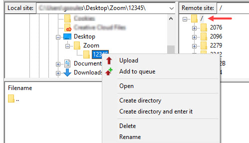
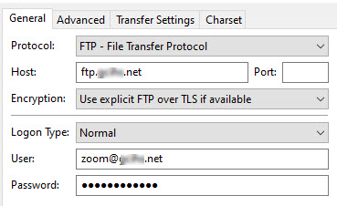

# Zoomable images

The Digital Archive supports zoomable images using [OpenSeadragon](https://openseadragon.github.io/) as the viewer. It expects tile
sources created by the [Zoomify](https://openseadragon.github.io/examples/tilesource-zoomify/) desktop program for Windows.

To make an image zoomable is simply a matter of creating
tiles from the image’s high resolution file and then uploading a folder containing the tiles to the appropriate location on the server. When the Digital Archive software detects the existence of tiles for an item’s image, it automatically displays the image using the OpenSeadragon viewer.

---

!!! note ""
    You must be able to upload files to your Digital Archive webserver to perform these steps.

## Create tiles
-   Choose the high resolution file to be made zoomable.  
    Use a TIF image if available instead of a JPEG image.
-   Copy the high resolution image to a temporary location such as a folder on your desktop
    Do not use a Dropbox folder because doing so will cause Dropbox to start syncing the generated
    tiles to the Dropbox cloud.
-   Run the `Zoomify Unlimited Converter.exe` program which is located in the  
    `Digital Archive SWHPL\Zoomify` Dropbox folder
-   Set:
    -	**_Output Path_**: `Same as input file`
    -	**_Output Format_**: `Zoomify folders`
    -	**_JPEG Compression Quality_**: `80`
    -	**_Compression Format_**: `JPEG Tile Compression`
-   Drag the high resolution file from the item’s Dropbox folder onto the converter (or choose `Open` from the converter’s menu)
-   The conversion begins automatically and typically takes only a few seconds
-   The generated tiles folder will appear in the folder containing the high resolution image
    The tiles folder name will be the same as the name of the image

## Upload tiles to the Server
-   Rename the newly created tiles folder to the item’s Identifier number
-   Transfer the entire output folder to the server. See [upload methods](#upload-methods) below to learn how.
-   Delete the temporary folder you created earlier since you no longer need those files
-   View the item in the Digital Archive and verify that the image is zoomable.

!!! Note ""
    In order for a zoomable image to display, the item must already have a JPEG image attached to it.
    The JPEG is necessary to allow the user to toggle between the zoomable and web-size images.
    If the item that has no JPEG image, attach one in the usual way.

## Multiple zoomable images 
-   If the item has more than one image, e.g. a newspaper with eight pages, follow the steps above to
    create one folder of tiles for each image, but give each folder a unique
    name e.g. `1234-001, 1234-002, 1234-003` etc. where `1234` is the item’s identifier
-   Create a single folder for the item named using the item’s identifier
-   Move the tile folders into this single folder. The structure should be as shown below
-   Upload the single folder with all of its subfolders to the server as described above. The Digital Archive
    software will automatically detect that the item has multiple zoomable images and display them appropriately.

```
    1234  
        1234-001  
        1234-002  
        1234-003
```

## Tag the Item as zoomable
-   Edit the item and choose the **_Tags_** tab
-   In the **_Add Tags_** box type `Zoomable`  (it will start to fill in automatically as you type)
-   Click the **_Add Tags_** button
-   Click **_Save Changes_**
-   Note that the tag simply makes it easier for people to find the image
    The image will be zoomable whether you tag it or not

## Zoom tiles upload methods

There are two ways to upload image tiles to the web server: FTP and cPanel.

**FTP method**

A Digital Archive site administrator can follow these steps to upload a tile folder using an FTP
program called [FileZilla](https://filezilla-project.org/). Connection settings for Filezilla are at the end of this page.

-   Run FileZilla
-	Choose `File` > `Site Manager` from the top menu bar
-	On the **_Site Manger_** dialog, click the name of your connection for the `zoom` folder
-   Click the **_Connect_** button
-   In the right panel (remote site):
    -   You should see a list of the tile folders that have been previously uploaded
    -   Click on the `/` at the top of the list (see red arrow in screenshot below)
-   In the left panel (local site):
    -   Right click on the folder you want to upload and choose `upload`
-   Verify that the uploaded folder now appears in the right panel




!!! note ""
    In the instructions above, be very careful to click on the `/` at the top of the right panel as pointed
    to by the red arrow in the screen shot above.
    If instead you click on an existing folder, the folder you are uploading will go into that existing folder.

**cPanel method**

A Digital Archive developer can use cPanel to upload a zip file containing the zoom tiles.
This method involves more steps, but is faster because uploading one large file takes less
time than FTPing several folders that each contain dozens of files.

- Compress the zoom tiles folder into a single zip file
- [Upload and extract the zip file](../../developer/web-host#upload-and-extract-a-zip-file) into the 
`digitalarchive/files/zoom` folder

## Filezilla FTP settings

Follow the steps below to create a FileZilla connection that will allow you to upload an
image tile folder to the Digital Archive `zoom` folder. For the *zoom username* and *zoom password*,
use the credentials provided to you by the Digital Archive developer.

-	Run FileZilla
-	Choose `File` > `Site Manager` from the top menu bar
-	On the `Site Manger` dialog click the `New site` buttons
-	Fill in the site name in the `My Sites` tree
-	On the `General Tab` set:
    -	**_Protocol_**: `FTP - File Transfer Protocol`
    -	**_Host_**: Example: `ftp.mydomain.net`
    -	**_Port_**: leave blank
    -   **_Encryption_**: `Use explicit FTP over TLS if available`
    -	**_Logon Type_**: `Normal`
    -	**_User_**: *zoom username* e.g. `zoom@mydomain.net`
    -	**_Password_**: *zoom password*
-	Click the `Connect` button




