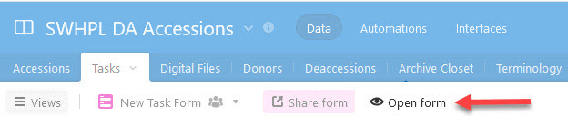
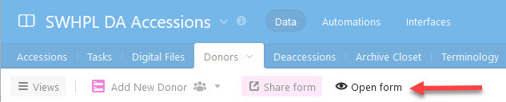
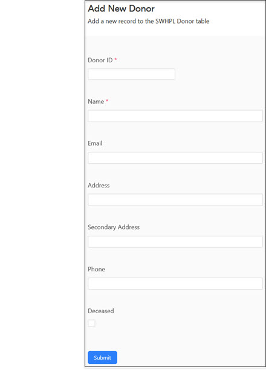
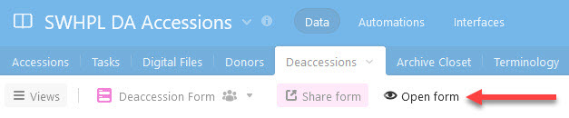

# Accessioning

---

!!! note ""
    This section describes how the [Southwest Harbor Public Library](https://swhplibrary.org) (SWHPL) performs accessioning for its [Digital Archive](https://swhplibrary.net). The information is provided solely for information-sharing purposes.

At SWHPL (pronounced *swiple*, rhymes with *triple*), accessioning is the process of transferring archival materials from a donor, or the Library's
backlog, into the Library's accessions database, and eventually, into the Digital Archive where the items become publicly accessible.

#### History
In early 2020, SWHPL had no formal accessioning process and no longer had a curator. At that time, the Digital Archive already had more than
10,000 items and an even greater backlog of materials, none of which were accessible to the public. In an effort to reduce the backlog and
better handle new donations, George Soules and Elliot Santavicca developed an initial accessioning process. In October 2022, George assumed
the role of interim curator. He and archivist Sadie Cooley, with support from Library director Erich Reed, worked together to refine and
document the process described here.

---

## Accessioning Goals
Accessioning is much more than a bookkeeping process. It is how SWHPL assists researchers and honors community members by making donor contributions accessible to the public via the Digital Archive as quickly as possible. 

#### Accessibility

The primary goal at SWHPL is to make as much information (metadata, images, and searchable documents) available to the public as quickly as possible
via the Digital Archive. This is easier said than done given the Library's enormous backlog of archival materials which were acquired during the past several decades. 

In the early days, SWHPL archivists had the luxury of researching and documenting items one at a time before making them publicly available. While such thorough
curation is still the holy grail, today, the primary and realistic goal is to make it possible for the public to find what the Library possesses even though detailed
information about individual items might not yet be available. This is not a case of quantity vs quality, but rather one of broad vs deep. It is better
for a researcher to discover an uncurated photograph than to not know it exists.

#### Backlog reduction
The secondary goal is to reduce and eventually eliminate the Library's backlog of tens of thousands of digital and physical items. The Library does not know the
exact number of items in the backlog because these items were acquired before the Library followed the accessioning process described here. By breaking the backlog
into manageable sets of items, and then accessioning those sets, the Library will eventually get a handle on what's in the backlog and how large it is.

#### Manageability
An overarching goal at SWHPL is to follow an accessioning process that is manageable regardless of the number of archivist hours available during any given period
of time. While the most progress can made when plenty of human resources are available, the process must allow even a single part-time archivist to make progress
toward achieving the goals of accessibility and backlog reduction. It must also allow new archivists and volunteers to quickly come up to speed and become productive.

The Library achieves its goal of manageability by providing archivists with the right tools and a documented process for using those tools to accession materials
and ingest items into the Digital Archive. Subsequent sections in this documentation describe those processes and tools.

#### Transferability
The accessioning process must be such that responsibility for accessioning and the Digital Archive can be transferred to a new archivist with minimal
dependence on tribal knowledge, that is, unwritten knowledge that resides only in the minds of a few individuals.

---

## Terminology

This section defines the terms used throughout this accessioning documentation. Italics within a definition refer to another term in this section

Accession
:   An accession consists of one or more physical or digital items that are treated as a set. The items in the set might or might
    not have anything to do with one another.

    When the accession is for a *new donation*, the items are what was donated, for example, the contents of a shoebox. When a new donation consists
    of a very large number of items, the archivist should divide the items among multiple accessions to make each more manageable.
    
    When the accession is from the *backlog*, the items are whatever the archivist who creates the accession chooses. For example, they could choose
    all the physical items in a binder, or all the digital files in a folder on the *archival hard drive*. If the folder has a large number of files, the archivist should divide the files among multiple accessions to make each more manageable.

Accessions Database
:   A database, separate from the Digital Archive database, that SWHPL uses to record information about accessions and everything
    related to them like donors and the locations of digital files. Learn more in the [Accessions database](#accessions-database) section.

Accession Number
:   SWHPL uses a four-digit integer, starting at 1000, to identify an accession. An archivist assigns the next available number to each
    new accession. The number appears in the **_Accession #_** field of Digital Archive items, though it's blank for most items.
    This is because most items were added to the Digital Archive before the accessioning process was established.
    
    Note that some items with a blank **_Accession #_** field belong to an an accession that was recently created, but the
    **_Accession #_** fields for the accession's items were not updated when the accession was created because of the extra time that would
    be required to perform this bookkeeping task.

Archival Hard Drive
:   A removable PC hard drive affectionately known at SWHPL as the terabyte drive. It contains the Library's extensive backlog of digital files.
    On August 22, 2017, the hard drive was locked to be read-only and three copies were distributed among three separate geographic locations
    for safe-keeping. One copy is located in a locked cabinet within the *archive closet*. At that time, SWHPL began transferring digital files to *S3* to ultimately eliminate the need to access the hard drive.
    
    As of November 2022, 22.5% of the folders on the archival hard drive (806 of 3575) had been accessioned and uploaded to S3, with the
    remaining folders still in the *backlog*.

Archival Materials
:   Photographic prints and negatives (including glass plates), documents, maps, ephemera, and various other kinds of flat (2D) objects.
    SWHPL has a small number of 3D objects that were acquired in the past, but now avoids accepting them as donations.

Archive Closet
:   A locked room (formerly a large closet) on the second floor of the Library where physical *archival materials* are stored.
    The room contains four shelving units and each shelf within a unit is numbered. For example, the first shelf on unit 1 is 1-1,
    and the third shelf on unit 2 is 2-3.
    
    The binders and boxes on each shelf are labeled with an accession number. In some cases, the contents of an accession
    are kept on multiple shelves. The *accessions database* contains an Archive Closet table showing a photographs of the shelf
    contents so that an archivist can look at a shelf without going into the closet.

Backlog
:   Physical and digitized versions of *archival materials* that have not yet been accessioned and have not been ingested into
    the Digital Archive.

Collection
:   At SWHPL, a collection is a name such as "The Smith Family Collection" used to identify a set of items that came from
    the same donor or are of a similar nature such as a postcard collection. In the Digital Archive, if an item
    belongs to a collection, the collection name is specified in the item's **_Source_** field. Many items do not belong
    to a collection because they were added to the Digital Archive before consistent use of collection names was established. 
    
    Items in a collection often come from multiple accessions. For instance, each donation from the Smith family would
    be assigned to a separate accessions, but the items in each accession would belong to the "Smith Family Collection".
    
    If the items in a collection were added to the Digital Archive before the accessioning process was established,
    those items will not be associated with any accessions.

Contact Sheet
:   A PDF file containing one or more pages where every page in the file is either 30-up or 1-up. The 30-up contact sheets
    contain thumbnails of items, usually belonging to an *uncurated accession item*. The 1-up contact sheets show one image per
    page.

Curated Item
:   A Digital Archive item that has metadata and file attachments. All Digital Archive items are curated items with the exception
    of *uncurated accession items*.

Item
:   Generically, an item is a single object (physical or digital) such as a photograph, document, map, or book. In the Digital
    Archive, an item is an Omeka item which is a record in the underlying MySQL database. 

Item Number
:   SWHPL uses an integer, starting at 1000, to identify a single *item* in the Digital Archive. The item number is generated
    automatically by the Digital Archive and appears in the item's **_Identifier_** field. As of November 2022,
    the most recent item number was around 16680.

New Donation
:   A donation of physical or digital items from a donor that was made starting around the year 2000 when the accessioning process
    described here was first implemented. The word "new" distinguishes these donations from those made prior to 2000.

S3
:   Cloud storage using Amazon's Simple Storage Service. S3 is an integral part of SWHPL's accessioning process.
    Learn more in the [tools section](#tools).

Uncurated Accession Item
:   An uncurated accession, referred to as a UA, contains items that have not yet been individually or collectively curated, except
    for creation of an index, to derive metadata to describe them. An uncurated accession item is a Digital Archive item that makes
    the UA's index, and contact sheet, accessible. Eventually, items that are part of a UA are ingested into the Digital Archive
    as *curated items*.

---

## Accessions vs Collections
It is important to understand the difference between accessions and collections. Items in an accession are associated with
one another by virtue of the fact that they were all accessioned together at the same time from the same source.

The items in an accession
might or might not be related to or be similar to one another. For instance, one shoebox might contain
closely related items such as letters all written by the same person, whereas another shoebox might contain a completely
random set of objects like a map, a photograph, and a document, none having anything to do with the others. 
An accession simply records *what* the Library received from *whom* on what *date*.

In contrast, all of the items in a collection have one of two kinds of association with one another. The first kind 
is when all the items came from the same source, such as the Smith family, even if the items are dissimilar such as a random set of things that
the Smith's collected over time. The second kind of association is when the items are somehow similar to each
other such as a collection of postcards or glass plates.

Over time, the Smith family might make several donations. Each donation is recorded as a separate accessions, but all of
the items from all of the donations are identified as belonging to the "Smith Family Collection".

In the Digital Archive, an item's **_Source_** field shows what collection, if any, an item belongs to. If a user clicks on
the collection name's hyperlink, they will see a list of all other items that are in that collection. At item's **_Accession #_**
field shows what accession, if any, an item belongs to. If a user clicks on the accession number's hyperlink, they will see a list
of all other items that are part of that accession.

The diagram below shows the distinction between accessions and collections. The fives items from the two accessions 1001 and 1100 belong
to the single "Smith Collection". The single item from accession 1500 belongs to the "Postcard Collection". Both collections might also contain
items that were added to the Digital Archive before the accessioning process was established.

---

## Accessioning workflow
The flowchart below shows the sequence of steps in the accessioning process.

-   Yellow steps at left and middle produce a Digital Archive item for an uncurated accession item.
-   Green steps at right produce a curated Digital Archive item for the accession's images. 

The process makes an accession's items publicly accessible very quickly. For an uncurated accession item, only the
index is initially accessible, but it allows the public to search the Digital Archive without having to wait
for scanning to occur which is usually the most time-consuming step.

---

## Accessioning steps
This section explains each step in the accessioning workflow shown in the previous section.

In the explanations below, `####` means the accession number.

1 &ndash; Record deed of gift
:   Procure a signed and dated deed of gift form from the donor.

2 &ndash; Create new accession
:   This step results in an accession number which will be needed in subsequent steps.

    -   Open the **_New Accession Form_** in Airtable (shown in the [Accessions table](#accessions-table) section below).
    -   Fill in all required fields.
        -  Use the next available number as the accession number.
        -  See the **_Next Step_** field to `Create Index`.
        -  For accessions from the archival hard drive, use the form's **_Digital Files_** selector to
            choose the folders that are part of the new accession.
   -   Record the accession number on the deed of gift form.

---

3A &ndash; Add private UA item to Digital Archive
:   This step results in an item identifier number which will be needed in subsequent steps.

    -   [Add a new item](/archivist/items/#add-a-new-item) to the Digital Archive and leave it set to
        [private](/archivist/special-features-archivist/#private-metadata-fields).
    -   Set the item's **_Type_** to `Uncurated Accession`.
    -   Set the item's **_Accession #_** to the accession number.
    -   Provide as much metadata in other fields as is known about the accession's contents.

4A &ndash; Create index PDF and upload to S3\Accessions
:   The real work of accessioning occurs in this step. The archivist assesses the items in the accession and
    creates a table in a Word document that lists the contents of the accession. Depending on the information available,
    the table may be complete and detailed, or it may be sparse, only
    identifying the most significant items in the accession.

    When creating the index, use as many relevant keywords as possible since the text in the index will be searchable.
    The words in the index will determine whether someone will be able to search for and find something of
    interest in the accession.

    -   Make a copy of the [Google Drive](#google-drive) file named `accession-index-template.docx`
    -   Rename the copy to `accession-index-####.docx` where `####` is the accession number.
    -   [Index the accession](#create-an-index-for-an-accession).
    -   Save the index Word document as a PDF file named `accession-index-####.pdf`.
    -   Create a new S3 folder named `S3\Accessions\####`.
    -   Upload the PDF and Word files to the S3 folder.

5A &ndash; Attach index to UA item and make item public
:   This step makes the UA's index PDF publicly accessible.

    -   In the Digital Archive, [edit the item](/archivist/items/#edit-an-item) created in step 3A.
    -   Go to the **_Files_** tab to see the contents of `S3\Accessions\####` created in step 4A.
    -   Check the box for the index PDF file uploaded in step 4A.
    -   Make the item public.
    -   Save the item.
    -   Verify that the index PDF appears as the item's image.
    -   Add a relation ship from the UA to its Reference Item if one exists.
    -   Update the Accessions table to set the accession's Next Step to scanning or contact sheet.

6A &ndash; Digitize items
:   Scan or photograph the items in the accession to create digital files. Name the files according to their identifiers in the index
    file created in step 4A.

7A &ndash; Create 30-up contact sheet
:   This step creates a PDF file containing thumbnails of the accession's items.

    -   Go to the folder containing the digitized items.
    -   Remove any files that should not appear in the contact sheet.
    -   Run the contact sheet app and choose 30-up as the contact sheet type.
    -   The app will save the file within the folder as `accession-contact-sheet-####.pdf`.

8A &ndash; Upload files and contact sheet to `S3\Accessions`
:   Upload the accessions files and the contact sheet to `S3\Accessions\####`.

9A &ndash; Attach contact sheet to public UA item
:   This step makes thumbnails of the accession's images publicly accessible.

    -   In the Digital Archive, [edit the item](/archivist/items/#edit-an-item) created in step 3A.
    -   Go to the **_Files_** tab to see the contents of `S3\Accessions\####` created in step 4A.
    -   Check only the box for the contact sheet PDF file uploaded in step 8A.
    -   Save the item.
    -   Verify that the contact sheet appears as the item's image.
    -   Update the Accessions table to set the accession's Next Step to ingestion.

10A &ndash; Ingest individual items into Digital Archive
:   At this point, accessioning is complete and the work of curating begins.
    For most accessions, only the most important items will be ingested into the Digital Archive as individual items.

    One criterion for ingestion is whether there is sufficient knowledge of an item to provide metadata that distinguishes
    the item from other items. Typically, this information comes from the index or other supplementary documentation
    that is included with the accession, but it may be necessary to research the item
    to obtain additional information.

---

3B &ndash; Add private curated item to Digital Archive
:   This step results in an item identifier number which will be needed in subsequent steps.

    -   [Add a new item](/archivist/items/#add-a-new-item) to the Digital Archive and leave it set to
        [private](/archivist/special-features-archivist/#private-metadata-fields).
    -   Set the item's **_Type_** and **_Subject_** based on the contents of the accession.
    -   Set the item's **_Accession #_** to the accession number.
    -   Provide as much metadata in other fields as is known about the accession's contents.

4B &ndash; Create 1-up contact sheet
:   This step creates a PDF file containing large images of the accession's items.

    -   Go to the folder containing the digitized items. You may need to download it from S3.
    -   Remove any files that should not appear in the contact sheet.
    -   Run the contact sheet app and choose 1-up as the contact sheet type.
    -   Specify the identifier from step 3B when prompted.
    -   The app will save the file as `item-######.pdf` where `######` is the identifier from step 3B.

    As an alternative to a contact sheet, an archivist could attach individual web-sized image files 
    and upload those in step 5B. Creating the contact sheet is simply more expedient.

5B &ndash; Upload files and contact sheet to `S3\Database`
:   This step creates an S3 folder for the curated item and uploads files.

    -   Create a new S3 folder named `S3\Database\####\#####` where `####` and `######` are the item's identifier number
        grouping and identifier. For example, if the identifier is `12345`, the grouping is `12000` and
        the identifier is `12345`.
    -   Upload only the contact sheet PDF to the newly created S3 folder.

6B &ndash; Attach contact sheet to item and make item public
:   This step makes the accession's images publicly accessible.

    -   In the Digital Archive, [edit the item](/archivist/items/#edit-an-item) created in step 3B.
    -   Go to the **_Files_** tab to see the contents of `S3\Database\####\#####` created in step 5B.
    -   Check the box for the contact sheet PDF file uploaded in step 5B.
    -   Make the item public.
    -   Save the item.
    -   Verify that the contact sheet appears as the item's image.
    -   Add a relation ship from the item to its Reference Item if one exists.
    -   Update the Accessions table to set the accession's Next Step to completed.

## Accessions Database
SWHPL uses [Airtable](https://www.airtable.com/) as its accessions database to record information about accessions and related information.
The diagram below shows the five tables in the database followed by an explanation of each table.

The lines connecting the tables indicate the relationships between tables.

-   The Tasks table has a many-to-one relationship with the Accessions table. This means that multiple records in the Tasks
    table can be for the same accession, but a Task table record can be for only one accession. For example, one task could
    be to index accession 1234 while another task could be to perform research on accession 1234.

-   The Donors table has a one-to-many relationship with the Accessions table. This means that a record in the Donor table
    can be for more than one accession, but a record in the Accessions table can have only one Donor.

-   The Digital Files table has a many-to-one relationship with the Accessions. This means that multiple records in the
    Digital Files table can be for the same accession, but a Digital Files table record can be for only one accession.

-   The Deaccessions table has a one-to-one relationship with the Accessions table. This means that a record in the
    Deaccessions table can be associated with only one record in the Accessions table and vice versa.

### Accessions table
The Accessions table contains one record for each SWHPL accession. The records contain fields for storing information that is
specific to a single accession such as the Id of the donor, but not information about the donor. The donor information is kept
in the Donor table because the same donor could be associated with more than one accession. 

Learn how to [add a new accession to the **_Accessions_** table](#add-a-new-accession-to-the-accessions-table).

The screenshot below shows just some of the fields and a few of the rows of the Accessions table. Note the **_Next Step_** field
which indicates where each accession is within the accessioning process.

### Deaccessions table
The Deaccessions table is used to keep a record of which accessions have been deaccessioned. A deaccessioned record still
exists in the Accessions table so that information about it is never lost, but the Accessions table is normally filtered
to hide records for accessions in the Deaccessions table.

Learn how to [deaccession an accession](#deaccession-an-accession).

The screenshot below shows most of the fields and a few of the rows of the Deaccessions table.

### Donors table
The Donor table contains information about each unique donor. It also shows which accessions the donor has given. You can double-click
on an accession number to see the information for that accession. SWHPL uses donor ID 1000 to indicate that the donor is unknown.

Learn how to [add a new donor to the **_Donor_** table](#add-a-new-donor-to-the-donor-table).

The screenshot below shows some of the fields and a few of the rows of the Donor table.

### Tasks table
The Tasks table is used to achieve the [manageability goal](/archivist/accessioning/#manageability) described earlier.
The purpose of the Task table is to allow the curator to quickly see who is doing what, and to make it easy for archivists
to know what they should be working on.

The Task table should always reflect reality based on the availability of resources. For example, if at the present time no
archivists are available to work, there should be no In Progress tasks. If a task was in progress when an archivist
became unavailable, its priority should be lowered (perhaps to Next or High) to record its importance for when resources
become available again.

Learn how to [add a new task to the **_Task_** table](#add-a-new-task-to-the-task-table).

The screenshot below shows the fields and rows that are typically visible in the Tasks table at any given
time. You want to minimize the number of In Progress and Next tasks so that the table
only shows work that is being performed or is slated to be performed very soon.

### Digital Files table
The Digital Files table is the largest SWHPL table. It contains more than 3,500 rows representing the more than 3,500 folders
on the archival hard drive. Little by little, SWHPL archivists create accessions from the folders, chipping away at the enormous backlog. In the process, they discover folders that can be rejected for various reasons such as being redundant or containing files with insufficient quality. The table contains a **_Rejected_** field (not shown in the screenshot below) to record the reason a folder was rejected.

You may never need to add a record to this table. If you do, add it manually, using existing records as examples.

An important use of the Digital Files table at SWHPL is to track which folders on the archival hard drive have been uploaded
to S3 as part of the accessioning process. When every row in the table has an accession associated with it (or has been rejected), the
entire backlog of digital files will have finally been accessioned and stored in the cloud.

The screenshot below shows some of the fields and a few of the many rows of the Digital File Location table.

## Deed of gift

Describe what the fields mean

## Storing physical items
Discuss transferring accession to archival boxes, labeling, multiple accessions within a box etc.

## Tools
This section describes the software tools that SWHPL uses to carry out its accessioning process.

#### Contact Sheet app
The Contact Sheet app is a custom-written Python application created for SWHPL by AvantLogic. It allows an archivist to create 30-up and 1-up
contact sheets from a folder of files. Documentation will be added here in the future. An example appears below.

#### AvantS3
AvantS3 is the [plugin](/plugins/avants3) that allows Amazon AWS S3 to be integrated with the Digital Archive.

#### AWS Management Console for S3
The [AWS Management Console](https://aws.amazon.com/console) is how you access and work with AWS services such as S3.
Learn how SWHPL uses it for [uploading files to S3](/archivist/attach-file/#upload-files-to-your-s3-server).

#### S3 Browser
[S3 Browser](https://s3browser.com) is a 3rd-party Windows utility that makes it possible and/or easier to perform tasks
than with the AWS Management Console for S3.

These S3 Browser features do not exist in the S3 console:

-   Preview an image (with the console, you have to download the image to view it).
-   Download multiple files or a folder (the console only lets you download one file at a time).

## How To
This section explains how to perform common accessioning tasks.

---

### Add a new accession to the Accessions table
Follow these steps to add a new record to the **_Accessions_** table.

-   If the accession is from a new donor, first [add the donor to the **_Donor_** table](#add-a-new-donor-to-the-donor-table).
-   View the **_Accessions_** table in Airtable.
-   Click the **_New Accession Form_** view.
-   Click the **_Open form_** button in the top menu (red arrow in screenshot below).

    

-   A form like in the screenshot below appears (all fields will be in one column).
-   Fill in required fields.
    -   Use the next largest available number as the accession number.
    -   [Choose a next step](#choose-an-accessions-next-step) for the accession.
    -   For accessions from the archival hard drive, use the form's **_Digital Files_** selector
        to choose the folders that are part of the new accession.
-   Click the **_Submit_** button at the bottom of the form.
-   A new record will have been added to the **_Accessions_** table.

!!! Note ""
    Always add new accessions using the **_New Accession Form_**, not by editing the table directly.  
    Using the form is easier and ensures that required fields are filled in.

---

## Choose an accession's next step
This section explains the meaning of the values in the **_Next Step_** field in the **_Accessions_** table.

Step                        | Meaning
----------------------------| ------------
**_Assess_**                | Determine what the next step should be. Only choose this option for a new accession when it's not obvious what to do next such as when it's not known whether the accession items are already in the Digital Archive and the accession can be considered **_Completed_** or if an index is required, or if the accession is small enough that a curated item should be created from it or if a UA should be created.
**_Create index_**          | See how to [create an index for an accession](#create-an-index-for-an-accession).
**_Create curated item_**   | and two
**_Create UA_**             | threee
**_Create contact sheet_**  | threee
**_Scanning_**              | threee
**_Ingest item into DA_**   | threee
**_Break into separate accessions_**   | threee
**_Special treatment_**   | threee
**_Find materials_**   | threee
**_Research_**   | threee
**_Completed_**   | threee

--- 

### Add a new task to the task table
Follow these steps to add a new record to the **_Tasks_** table.

-   View the **_Tasks_** table in Airtable.
-   Click the **_New Task Form_** view.
-   Click the **_Open form_** button in the top menu (red arrow in screenshot below).

    

-   A form like in the screenshot below appears.
-   Fill in the fields.
-   Click the **_Submit_** button at the bottom of the form.
-   A new record will have been added to the **_Tasks_** table.

---

### Add a new donor to the Donor table
Follow these steps to add a new record to the **_Donor_** table.

-   View the **_Donor_** table in Airtable.
-   Click the **_New Donor Form_** view.
-   Click the **_Open form_** button in the top menu (red arrow in screenshot below).

    

-   A form like in the screenshot below appears.
-   Use the next largest available number as the donor number.
-   Click the **_Submit_** button at the bottom of the form.
-   A new record will have been added to the **_Donor_** table.

---

### Add a note to an accession record
Use the notation `<date>-<initials>:<text>`

###### Example
`11/23/2022 - GS: The donor says they will pick up the materials next June.`

---

### Create an index for an accession
yyy

---

### Deaccession an accession
You deaccession an accession by adding a record to the **_Deaccessions_** table.

!!! warning "Warning"
    Never deaccession by deleting a record from the Accessions table.  
    Doing so will cause all information about the accession to be lost.

Follow these steps to add a new record to the **_Deccessions_** table.

-   View the **_Deaccessions_** table in Airtable.
-   Click the **_Deaccession Form_** view.
-   Click the **_Open form_** button in the top menu (red arrow in screenshot below).

    

-   A form like in the screenshot below appears.
-   Choose the accession to be deaccessions using the **_Accession_** selector
-   Enter the date.
-   Choose your initials from the **_Archivist_** field. 
-   Type a reason for the deaccession in the **_Reason_** field.
-   Click the **_Submit_** button at the bottom of the form.
-   A new record will have been added to the **_Deaccessions_** table.

---

## Google Drive

