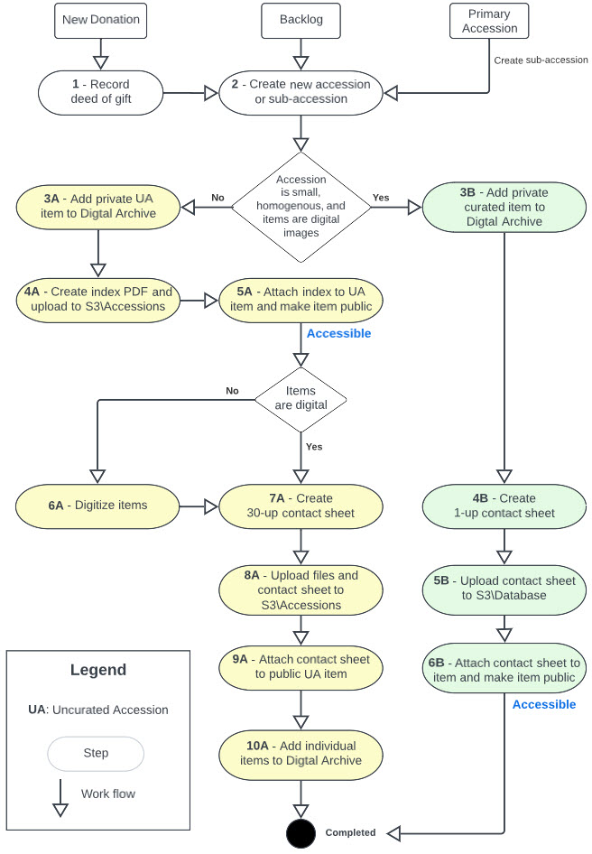

# Accessioning

---

!!! note ""
    This section describes how the [Southwest Harbor Public Library](https://swhplibrary.org) (SWHPL) performs accessioning for its [Digital Archive](https://swhplibrary.net). The information is provided solely for information sharing purposes and is not a recommendation for how other organizations should perform accessioning.

At SWHPL, accessioning is the process of transferring archival materials from a donor or from the backlog into the Library's accessions database, and eventually,
into the Digital Archive where they become publicly accessible.

## Accessioning Goals
Accessioning is much more than a bookkeeping process. It is how SWHPL assists researchers and honors donors by making contributions accessible to the public as quickly
as possible. 

#### Accessibility

The primary goal at SWHPL is to make as much information (metadata, images, and searchable documents) available to the public as quickly as possible
via the Digital Archive. This is easier said than done given the Library's enormous backlog of archival materials which were acquired during the past decades.

In the early days, SWHPL archivists had the luxury of researching and documenting items one at a time before making them publicly available. While such thorough
curation is still the holy grail, today, the primary and realistic goal is to make it possible for the public to find what the Library possesses even though detailed
information about individual items might not yet be available. This is not a case of quantity vs quality, but rather one of broad vs deep. It is better
for a researcher to discover an uncurated photograph than to not know it exists.

#### Backlog reduction
The secondary goal is to reduce and eventually eliminate the Library's backlog of tens of thousands of digital and physical items. The Library does not know the
exact number of items in the backlog because these items were acquired before the Library followed the accessioning process described here. By breaking the backlog
into manageable sets of items, and then accessioning those sets, the Library will eventually get a handle on what's in the backlog and how large it is.

#### Manageability
An overarching goal at SWHPL is to follow an accessioning process that is manageable regardless of the number of archivist hours available during any given period
of time. While the most progress can made when plenty of human resources are available, the process must allow even a single part-time archivist to make progress
toward achieving the goals of accessibility and backlog reduction. It must also allow new archivists and volunteers to quickly come up to speed and become productive.

The Library achieves its goal of manageability by providing archivists with the right tools and a documented process for using those tools to accession materials
and ingest items into the Digital Archive. Subsequent sections in this documentation describe those processes and tools.

#### Transferability
The accessioning process must be such that responsibility for accessioning and the Digital Archive can be transferred to a new archivist with minimal
dependence on tribal knowledge, that is, unwritten knowledge that resides only in the minds of a few individuals.

## Terminology

This section defines the terms used throughout this accessioning documentation. Italics within a definition refer to another term in this section

Accession
:   One or more physical or digital *items* that are treated as a set. The items in the set might or might not have any relationship to one another.
    As a general rule, an accession should not contain more than a few hundred items. 

    When the accession is for a *new donation*, the items are what was donated, for example, the contents of a shoebox. When a new donation consists
    of a very large number of items, the archivist should divide the itmes among multiple accessions to make each more manageable.
    
    When the accession is from the *backlog*, the items are whatever the archivist who created the accession chose, for example, all the physical items
    in a binder, or all the files in a folder on the *archival hard drive*. If the folder has a large number of files and subfolders, the archivist
    should divide the files among multiple accessions to make each more manageable.

Accessions Database
:   A database, separate from the Digital Archive database, that SWHPL uses to to record information about accessions and everything
    related to them like donors and the locations of digital files. Learn more in the [Accessions database](#accessions-database) section.

Accession Number
:   SWHPL uses a four-digit integer, starting at 1000, to identify an accession. Each new accession is assigned the next available number.

Archival Hard Drive
:   A removable PC hard drive affectionately known at SWHPL as the terabyte drive. It contains the Library's extensive backlog of digital files.
    On August 22, 2017, the hard drive was locked to be read-only and three copies were distributed among three separate geographic locations
    for safe keeping. One copy is located in a locked cabinet within the *archive closet*. At that time, SWHPL began transferring digital files to *S3* with the goal of ultimately eliminating the need to access the hard drive. As of November 2022, approximately 20% of the files had
    been accessioned and uploaded to S3, with the remaining files still in the *backlog*.

Archival Materials
:   Photographic prints and negatives (including glass plates), documents, maps, ephemera, and various other kinds of flat (2D) objects.
    SWHPL has a small number of 3D objects that were acquired in the past, but now avoids accepting them as donations.

Archive Closet
:   A locked room (formerly a large closet) on the second floor of the Library where physical *archival materials* are stored.
    The room contains four shelving units and each self within a unit is numbered. For example, the first shelf on unit 1 is 1-1,
    and the third shelf on unit 2 is 2-3.
    
    The *accessions database* contains a table of shelves showing a photograph of the shelves
    contents. The binders and boxes on each shelf are labeled with an accession number. In some cases, the contents of an accession
    or on multiple shelves.

Backlog
:   Physical and digitized versions of *archival materials* that have not yet been accessioned and have not been ingested into
    the Digital Archive.

Collection
:   A loose term used to identify *items* that came from the same source, usually a donor, or are of the same kind of item.
    In the Digital Archive, an item's collection identifier is specified in the Source field. The items in a large collection
    usually come from multiple accessions or no accession at all in the case of items that pre-date the accessioning process.
    The primary use of this identifier is to relate accessions in the *accession database* that are related either by content,
    such as a postcard collection, or by a donor designation, such as The Smith Family Collection.

Contact Sheet
:   A PDF file containing one or more pages where every page in the file is either 30-up or 1-up. The 30-up contact sheets
    contain thumbnails of items, usually belonging to an *uncurated accession*. The 1-up contact sheets show one image per
    page.

Item
:   Generically, an item is a single object (physical or digital) such as a photograph, document, map, or book. In the Digital
    Archive, an item is an Omeka item which is a record in the underlying MySQL database. 

Item Number
:   SWHPL uses an integer, starting at 1000, to identify a single *item* in the Digital Archive. The item number is specified
    in the Identifier field. A Digital Archive item also has an Accession field which specifies the item's *accession number*
    if it has one (most items don't have an accession number because most pre-date the accessioning process).

New Donation
:   A donation of physical or digital *items* from a donor that was made starting around the year 2000 when accessioning process
    was first implemented. The word "new" distinguishes these donations from those page prior to 2000.

Non-accessioned Item
:   An *item* that does not belong to an accession. At present, most of the items in the SWHPL Digital Archive are non-accessioned
    items because they were added to the archive before the accessioning process was in place.
    
    In the Digital Archive, the Accession
    field is left blank for a non-accessioned item, though in reality, there are many items that do belong to an accession, but
    their Accession field was not updated when the accession was created because of the overhead involved.

S3
:   Cloud storage using Amazon's Simple Storage Service. S3 is an integral part of SWHPL's accessioning process.
    Learn more in the [tools section](#tools).

Uncurated Accession
:   An accession containing items that have not yet been individually or collectively curated to derive metadata to describe them.
    Also referred to as a UA.

## Accession components
The diagram below ties together the discussion and terminology presented thus far. It shows the three kinds of item sources (backlog, new donation, and items created before the accession process was in place), and how those items are associated with accessions and with collections.

## Accessioning steps
The flowchart below shows the sequence of steps that SWHPL archivists perform as part of the accessioning process. The steps at right (shown
in green) result in creation of a single Digital Archive item for the entire accession. The item's type is set to reflect the nature of
the content, for example, `Image, Photograph`. The steps at left and in the middle (shown in yellow) also result in creation of a single Digital
Archive item, but its type is set to `Uncurated Accession`. 

The steps above show that both items have a contact sheet attached to them, but the uncurated accession item's contact sheet contains 30 thumbnails
per page whereas each page in the curated item's contact sheet shows a single image. More importantly, the accession process for the curated item
is complete whereas the ingestion step still awaits the uncurated accession item.

In both cases, the process makes the accession's items publicly accessible as quickly as possible. For the uncurated accession, only the
index is initially accessible until the items have been scanned, but this allows the public to search the Digital Archive without having to wait
for scanning to occur which is usually the most time-consuming step.

### Explanation of steps

1 &ndash; Record deed of gift
:   Procure a signed and dated gift of deed form from the donor.

2 &ndash; Create new accession
:   This step results in an accession number which will be needed in subsequent steps.

    -   Add a new row to the Accessions table.
    -   Provide values for every field for which information is available.
    -   Write the accession number on the deed of gift form if one exists.

3A &ndash; Create private UA item in DA
:   This step results in an item identifier number which will be needed in subsequent steps.

    -   [Add a new item](/archivist/items/#add-a-new-item) to the Digital Archive and leave it set to
        [private](/archivist/special-features-archivist/#private-metadata-fields).
    -   Set the item's Type to `Uncurated Accession`.
    -   Set the item's Accession # to the accession number.

4A &ndash; Create index PDF and upload to S3\Accessions
:   The real work of accessioning occurs in this step. The archivist needs to assess the items in the accession and
    create a table in a Word document that lists the contents of the accession. Depending on the nature of the
    accession and how much time the archivist has, the table may be complete and detailed, or it may be sparse, only
    identifying the most significant items in the accession.

    When creating the index, use as many relevant keywords as possible since the text in the index will be searchable.
    What is, or is not, in the index will determine whether someone will be able to search for and find something of
    interest in the accession.

    In the sub-steps that follow `####` means the accession number.

    -   Create the index as a Word document.
    -   Save the index as a PDF file named `accession-index-####.pdf`.
    -   Create a new S3 folder named `S3\Accessions\####`.
    -   Upload the PDF file, but not the Word document, to the S3 folder.

5A &ndash; Attach index to UA item and make item public
:   

    -   In the Digital Archive, [edit the item](/archivist/items/#edit-an-item) created in step 3A above.
    -   Go to the **_Files_** tab. The **_Files_** page should display the contents of the S3 accession folder created in step 4A above.
    -   Check the box for the index PDF file uploaded in step 4A above.
    -   Make the item public.
    -   Save the item.
    -   Verify that the index PDF appears as the item's image.
    -   Update the accession in the Accessions table to indicate that it's next step is either scanning or creating a contact sheet.

    Depending on the importance of the accession, the archivist may continue to the next step or mark the accession in the work queue
    as being Done, causing the accession to disappear from the work queue until it is added back at some point in the future. Even
    if work on this accession temporarily stops, it is now accessible by virtue of the fact that its index is searchable in the
    Digital Archive.

6A &ndash; Digitize items
:   Scan or photograph the items in the accession to create digital files. Name the files according to their identifiers in the index
    file created in step 4A above.

7A &ndash; Create 30-up contact sheet
:   Run the contact sheet app to create a PDF file containing thumbnails of the items in the accession's S3 folder.

    -   Go to the folder containing the digitized items.
    -   Remove any files that you don't want to include in the contact sheet.
    -   Run the contact sheet app and choose 30-up as the contact sheet type.
    -   The app will save the file as `accession-contact-sheet-####.pdf` where `####` is the accession number

8A &ndash; Upload files and contact sheet to `S3\Accessions`
:   Upload the files and the contact sheet PDF to `S3\Accessions\####` where `####` is the accession number.

9A &ndash; Attach contact sheet to public UA item
:   

    -   In the Digital Archive, [edit the item](/archivist/items/#edit-an-item) created in step 3A above.
    -   Go to the **_Files_** tab. The **_Files_** page should display the contents of the S3 accession folder created in step 4A above.
    -   Check the box for the contact sheet PDF file uploaded in step 7A above.
    -   Save the item.
    -   Verify that the contact sheet appears as the item's image.
    -   Update the accession in the Accessions table to indicate that it's next step is ingestion.

10A &ndash; Ingest individual items into DA
:   At this point, accessioning is complete and the work of curating occurs in this step.
    For most accessions, only some of the items should be ingested into the Digital Archive as individual items.

    One criterion for ingestion is whether there is sufficient knowledge of an item to provide metadata that distinguishes
    the item from other items. Typically this information comes from the index or other supplementary documentation
    that is included with the accession, but if there is insufficient information, it may be necessary to research the item
    to obtain additional information.

3B &ndash; Create private curated item in DA
:   This step results in an item identifier number which will be needed in subsequent steps.

    -   [Add a new item](/archivist/items/#add-a-new-item) to the Digital Archive and leave it set to
        [private](/archivist/special-features-archivist/#private-metadata-fields).
    -   Set the item's Type and Subject based on the contents of the accession.
    -   Set the item's Accession # to the accession number.

4B &ndash; Create 1-up contact sheet
:   Run the contact sheet app to create a PDF file containing the item's images.

    -   Go to the folder containing the digitized items.
    -   Remove any files that you don't want to include in the contact sheet.
    -   Run the contact sheet app and choose 1-up as the contact sheet type.
    -   The app will save the file as `item-######.pdf` where `######` is the identifier number from step 3B above.

5B &ndash; Upload files and contact sheet to `S3\Database`
:   
    -   Create a new S3 folder named `S3\Database\####` where `####` and `######` are the item's identifier number
        grouping and identifier. For example, if the identifier is `12345`, the grouping is `12000` and
        the identifier is `12345`.
    -   Upload the files and the contact sheet PDF to the newly created S3 folder.

6B &ndash; Attach contact sheet to item and make item public
:   

    -   In the Digital Archive, [edit the item](/archivist/items/#edit-an-item) created in step 3B above.
    -   Go to the **_Files_** tab. The **_Files_** page should display the contents of the S3 database folder created in step 5B above.
    -   Check the box for the contact sheet PDF file uploaded in step 5B above.
    -   Save the item.
    -   Verify that the contact sheet appears as the item's image.
    -   Update the accession in the Accessions table to indicate that it's next step is Completed.

## Accessions Database
SWHPL uses [Airtable](https://www.airtable.com/) as its accessions database to record information about accessions and related information.
The diagram below shows the five tables in the database followed by an explanation of each table.

### Accessions table
The Accessions table contains one record for each SWHPL accession. The records contain fields for storing information that is
specific to a single accession such as the Id of the donor, but not information about the donor. The donor information is kept
in the Donor table because the same donor could be associated with more than one accession. 

The screenshot below shows just some of the fields and a few of the rows of the Accessions table. Note the **_Next Step_** field
which indicates where each accession is within the accessioning process.

### Donors table
The Donor table contains information about each unique donor. It also shows which accessions the donor has given. You can double-click
on an accession number to see the information for that accession. SWHPL uses donor ID 1000 to indicate that the donor is unknown.

The screenshot below shows some of the fields and a few of the rows of the Donor table.

### Digital File Locations table

The screenshot below shows some of the fields and a few of the many rows of the Digital File Location table.

### Deaccessions table
The screenshot below shows most of the fields and a few of the rows of the Deaccessions table.

### Work Queue table
The work queue is used to maintain a relatively short and not overwhelming list of work that is in progress and work to be done in the near
future. An available resource always know exactly what they should do next.
s
-   The Work Queue table has a many-to-one relationship with the Accessions table to allow one or more tasks in the queue
    to be associated with the same accession.

The screenshot below shows most of the fields and rows that are typically visible in the Work Queue table at any given
time.

## Tools
This section describes the software tools that SWHPL uses to manage its accessioning process.

### AvantS3

### Contact Sheet maker app

### S3 Browser

### S3 AWS Console

