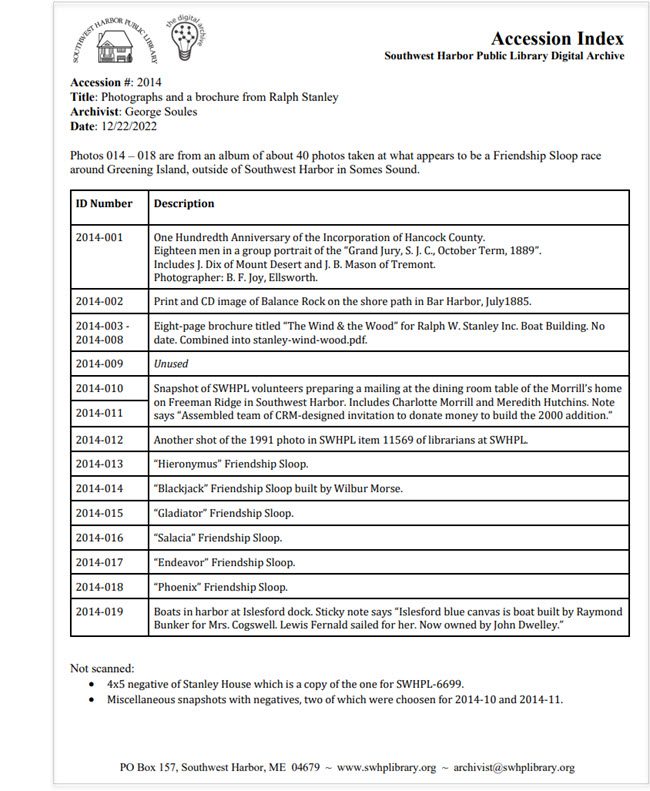
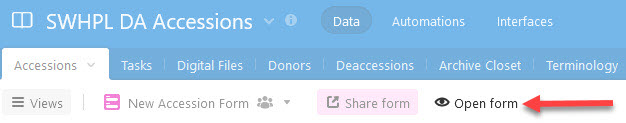
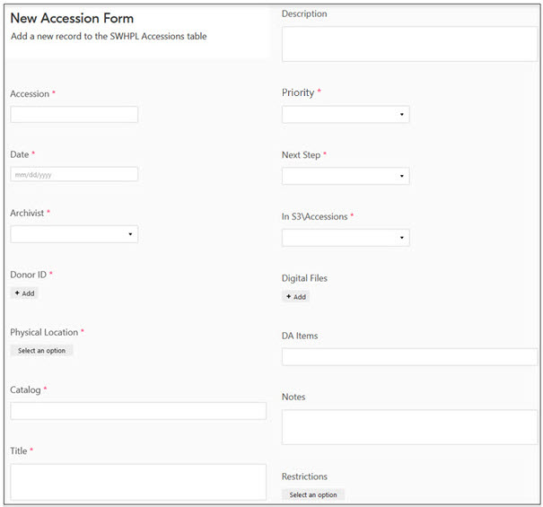
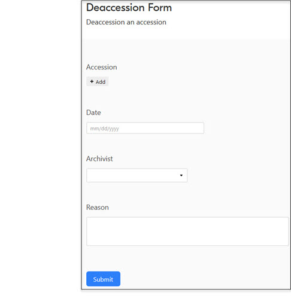
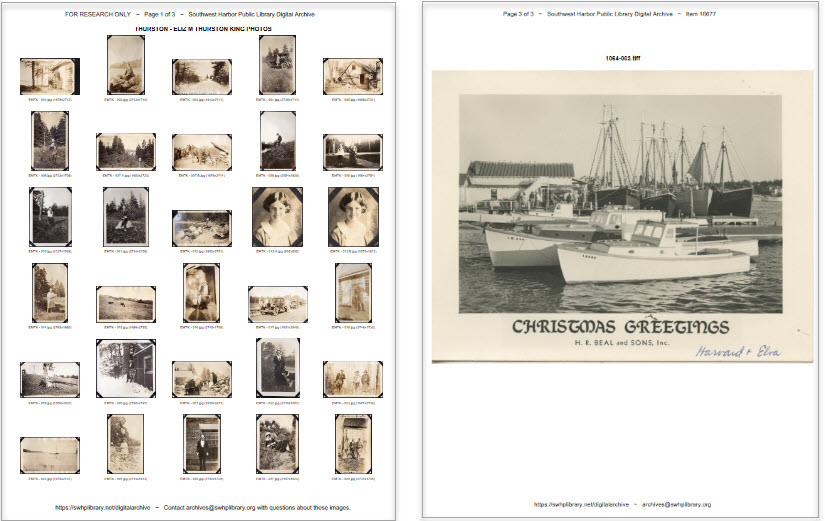
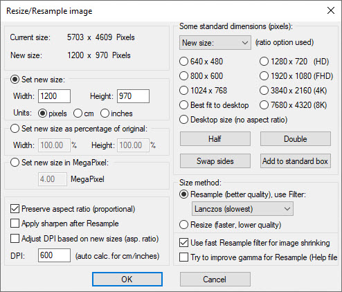

# Accessioning and Curating

---

!!! note ""
    This section describes how the [Southwest Harbor Public Library](https://swhplibrary.org) (SWHPL) performs accessioning and curating for its [Digital Archive](https://swhplibrary.net). The information is provided solely for information-sharing purposes.

At SWHPL (pronounced *swiple*, rhymes with *triple*), *accessioning* is the process of transferring archival materials from a donor, or the backlog, and recording information about the accession in the Library's accessions database. *Curating* is the process of making the materials in an accession publicly accessible as searchable and viewable items in the Digital Archive.

### Contents

-   [Accession and curation goals](#accession-and-curation-goals)
-   [Terminology](#terminology)
-   [Accessions vs Collections](#accessions-vs-collections)
-   [Backlog reduction strategy](#backlog-reduction-strategy)
-   [Accessioning and curating workflow](#accessioning-and-curating-workflow)
    -   [Workflow steps](#workflow-steps)
-   [Accessions database](#accessions-database)
    -   [**_Accessions_** table](#accessions-table)
    -   [**_Deaccessions_** table](#deaccessions-table)
    -   [**_Donors_** table](#donors-table)
    -   [**_Tasks_** table](#tasks-table)
    -   [**_Digital Files_** table](#digital-files-table)
-   [Accession index](#accession-index)
-   [How To](#how-to)
    -   [Add a new accession to the **_Accessions_** table](#add-a-new-accession-to-the-accessions-table)
    -   [Choose an accession's next step](#choose-an-accessions-next-step)
    -   [Add a new donor to the **_Donors_** table](#add-a-new-donor-to-the-donors-table)
    -   [Add a note to an accession record](#add-a-note-to-an-accession-record)
    -   [Deaccession an accession](#deaccession-an-accession)
    -   [Scan documents and images](#scan-documents-and-images)
-   [Accepting a donation for accession](#accepting-a-donation-for-accession)    
    -   [Collection development policy](#collection-development-policy)
    -   [Deed of gift](#deed-of-gift)
    -   [Storing physical items](#storing-physical-items)
-   [Tools](#tools)
    -   [Contact sheet app](#contact-sheet-app)
    -   [Avant S3](#avants3)
    -   [AWS Management Console for S3](#aws-management-console-for-s3)
    -   [S3 Browser](#s3-browser)
    -   [PDF Editor](#pdf-editor)
    -   [Epson scanner software](#epson-scanner-software)
    -   [IrfanView](#irfanview)
    -   [Zoomify](#zoomify)

### History
In early 2020, SWHPL had no formal accessioning and curating process and no longer had a curator. At that time, the Digital Archive already had more than 10,000 items and an even greater backlog of materials that are not accessible to the public. In an effort to reduce the backlog and better handle new donations, George Soules and Elliot Santavicca developed an initial accessioning process. In October 2022, George assumed the role of interim curator. He and archivist Sadie Cooley, with support from Library director Erich Reed, worked together to refine and document the accessioning and curating process described here.

---

## Accession and curation goals
The process described here was developed to achieve the following goals:

-   **Accessibility** &mdash; Make items accessible to the public as quickly as possible.
-   **Efficiency** &mdash; Use a process that can be performed quickly and easily with limited resources.
-   **Backlog reduction** &mdash; Reduce and eventually eliminate the Library's backlog of items.
-   **Transferability** &mdash; Ensure that the process can be transferred to others in the future.

### Accessibility

The primary goal at SWHPL is to make as much useful information (metadata, images, and searchable documents) available to the public as quickly as possible via the Digital Archive. This is easier said than done given the Library's enormous backlog of archival materials which were acquired during the past several decades. 

In the early days, SWHPL archivists had the luxury of researching and documenting items one at a time before making them publicly available. While such thorough curation is still the holy grail, today, the primary and realistic goal is to make it possible for the public to find what the Library possesses even though detailed information about individual items might not yet be available. This is not a case of  quantity vs quality, but rather one of broad vs deep. It is better for a researcher to discover an uncurated photograph than to not know it exists.

### Efficiency
SWHPL achieves its accessibility goal by following an accessioning and curating process that is efficient and manageable regardless of the number of archivist hours available during any given period of time. While the most progress can made when ample human resources are available, the process must allow even a single part-time archivist to make progress toward achieving the goals of accessibility and backlog reduction. It must also allow new archivists and volunteers to quickly come up to speed and become productive.

The Library achieves its goal of efficiency by providing archivists with the right tools, and a documented process for using those tools, to accession and curate materials. This documentation describes those tools and processes.

### Backlog reduction
An overarching goal at SWHPL is to reduce and eventually eliminate the Library's backlog of tens of thousands of digital and physical items. As the backlog is reduced, more and more items become publicly accessible. SWHPL works toward this goal by following a [backlog reduction strategy](#backlog-reduction-strategy).

### Transferability
The accessioning and curating process must be such that responsibility for accessioning and the Digital Archive can be transferred to a new archivist with minimal dependence on institutional knowledge that resides only in the minds of a few individuals. Achievement
of this goal is critical to ensure that the Library can continue to meet the other goals if key personnel leave the organization.

---

## Terminology

This section defines the terms used throughout this accessioning and curating documentation. Italics within a definition refer to another term in this section

Accession
:   In museum parlance, an accession is typically defined as one or more items acquired at the same
    time from the same source. This definition applies at SWHPL for new donations, but not for backlog items.
    
    For new donations, the items are what was donated, for example, the contents of a shoebox. When a new donation
    consists of a large number of items, the archivist may divide the items into *subs-accessions* which are each
    more manageable than the accession as a whole (the *primary accession*).
    
    When the accession is from the *backlog*, the items are whatever the archivist who creates the accession chooses.
    For example, they could choose all the physical items in a three-ring binder, or all the digital files in a folder on the
    *archival hard drive*. As with new donations, the archivist may divide the physical items or digital files into
    more manageable *subs-accessions*.

Accessions Database
:   A database, separate from the Digital Archive database, that SWHPL uses to record information about an accession
    and everything related to it such as donor and the location of digital files. Learn more in the [Accessions database](#accessions-database) section.

Accession Number
:   SWHPL uses a four-digit integer, starting at 1000, to identify an accession. An archivist assigns the next available
    number to each new accession. The number for a *subs-accession* is the accession number followed by a numeric suffix
    as explained in the definition for *sub-accession*.
    
    The accession number appears in the **_Accession #_** field of Digital Archive items, though it's
    blank for most items. This is because most items were added to the Digital Archive before the accessioning and curating process was
    established.
    
    Note that some items with a blank **_Accession #_** field belong to an accession that was recently created, but the
    **_Accession #_** fields for the accession's items were not updated when the accession was created because of the extra
    time that would be required to perform this bookkeeping task.

Archival Hard Drive
:   A removable PC hard drive affectionately known at SWHPL as the terabyte drive. It contains the Library's extensive
    backlog of digital files. On August 22, 2017, the hard drive was locked to be read-only and three copies were
    distributed among three separate geographic locations for safe-keeping. One copy is located in a locked cabinet
    within the *archive closet*. At that time, SWHPL began transferring digital files to *S3* to ultimately eliminate
    the need to access the hard drive.

    As of November 2022, 22.5% of the folders on the archival hard drive (806 of 3575) had been accessioned and uploaded
    to S3, with the remaining folders still in the *backlog*.

Archival Materials
:   Photographic prints and negatives (including glass plates), documents, maps, ephemera, and various other kinds of flat (2D) objects.
    SWHPL has a small number of 3D objects that were acquired in the past, but now avoids accepting them as donations.

Archive Closet
:   A locked room (formerly a large closet) on the second floor of the Library where physical *archival materials* are stored.
    The room contains four shelving units and each shelf within a unit is numbered. For example, the first shelf on unit 1 is 1-1,
    and the third shelf on unit 2 is 2-3.
    
    The binders and boxes on each shelf are labeled with an accession number. In some cases, the contents of an accession
    are kept on multiple shelves. The *accessions database* contains an Archive Closet table showing a photograph of the shelf's
    contents so that an archivist can look at a shelf without going into the closet.

Backlog
:   Physical and digitized versions of *archival materials* that have not yet been accessioned and have not been added to
    the Digital Archive.

    A factor that contributes to the backlog is the ongoing acquisition of new items that donors gift to the Library.
    Archivists must choose whether to devote their limited time to making new items publicly accessible versus making
    items from the backlog publicly accessible. New items that are not immediately added to the Digital
    Archive implicitly become part of the backlog, thus increasing its size.

Collection
:   At SWHPL, a collection is a name such as "The Smith Family Collection" used to identify a set of items that came from
    the same donor or are of a similar nature such as a postcard collection. In the Digital Archive, if an item
    belongs to a collection, the collection name is specified in the item's **_Source_** field. Many items do not belong
    to a collection because they were added to the Digital Archive before consistent use of collection names was established. 
    
    Items in a collection often come from multiple accessions. For instance, each donation from the Smith family would
    be assigned to separate accessions, but the items in each accession would belong to the "Smith Family Collection".
    
    If the items in a collection were added to the Digital Archive before the accessioning and curating process was established,
    those items will not be associated with any accessions.

Contact Sheet
:   A PDF file containing one or more pages where every page in the file is either 30-up or 1-up. Each 30-up page
    contains six rows and five columns of thumbnails. The 1-up contact sheet show one image per page. Archivists
    create these using the [contact sheet app](#contact-sheet-app) described in the Tools section.

Curated Item
:   A Digital Archive item that has metadata and file attachments. All Digital Archive items are curated items with the exception
    of *uncurated accession items*.

Curation
:   At SWHPL, curation refers to selecting, identifying, organizing, storing, digitizing,
    relating, and writing metadata for *archival materials*, and ultimately, adding them to the Digital Archive.

Google Drive
:   A Google Drive that is shared with Library personnel and the curator or other archivists who are not Library employees.
    The drive contains documents (such as accessioning policies and procedures), copies of software tools, and other files
    that archivists utilize as part of the accessioning and curating process.

Item
:   Generically, an item is a single object (physical or digital) such as a photograph, document, map, or book. In the Digital
    Archive, an item is an Omeka item which is a record in the underlying MySQL database. 

Item Number
:   SWHPL uses an integer, starting at 1000, to identify a single *item* in the Digital Archive. The item number is generated
    automatically by the Digital Archive and appears in the item's **_Identifier_** field. As of November 2022,
    the most recent item number was around 16680.

New Donation
:   A donation of physical or digital items from a donor that was made starting around the year 2020 when the accessioning and curating process
    described here was first implemented. The word "new" distinguishes these donations from those made prior to 2020.

Primary Accession
:   An accession that has one or more *sub-accessions*. Primary just means the entire original accession before it was
    divided into sub-accessions.

S3
:   Cloud storage using Amazon's Simple Storage Service. S3 is an integral part of SWHPL's accessioning and curating process.
    Learn more in the [tools section](#tools).

Sub-accession
:   A part of an accession that has been separated from the accession as a whole (the *primary accession*).
    For example, if the accession for a new donation consists of a photo album, a packet of letters, and
    a variety of miscellaneous objects, an archivist might choose to create one sub-accession for the album,
    another for the letters, and a third for the rest.

    A sub-accession gets its own *accession number* which is the primary accession number followed by a suffix. For
    example, if the primary accession number is `1234`, the sub-accession would be identified as `1234_01`, `1234_02`, `1234_03`
    and so on.

    Utilization of sub-accessions is a key element of the Library's [backlog reduction strategy](#backlog-reduction-strategy).

    Except where stated otherwise, a sub-accession is treated the same way as an accession with regard to the process. For
    instance, a sub-accession gets its own record in the **_Accessions_** table just like a *primary accession*.

UA
:   See *uncurated accession item*.

Uncurated Accession Item
:   An uncurated accession, referred to as a UA, contains items that have not yet been individually or collectively curated, except
    for creation of an index, to derive metadata to describe them. An *uncurated accession item* is a Digital Archive item that makes
    the UA's index, and contact sheet, accessible. Eventually, items that are part of a UA are added to the Digital Archive
    as *curated items*.

---

## Accessions vs Collections
It is important to understand the difference between accessions and collections. Items in an accession are associated with
one another by virtue of the fact that they were all accessioned together at the same time from the same source.

The items in an accession
might or might not be related to or be similar to one another. For instance, one shoebox might contain
closely related items such as letters all written by the same person, whereas another shoebox might contain a completely
random set of objects like a map, a photograph, and a document, none having anything to do with the others. 
An accession simply records *what* the Library received from *whom* on what *date*.

In contrast, all of the items in a collection have one of two kinds of association with one another. The first kind 
is when all the items came from the same source, such as the Smith family, even if the items are dissimilar such as a random set of things that
the Smith's collected over time. The second kind of association is when the items are somehow similar to each
other such as a collection of postcards or glass plates.

Over time, the Smith family might make several donations. Each donation is recorded as a separate accession, but all of
the items from all of the family's donations are identified as belonging to the "Smith Family Collection".

In the Digital Archive, an item's **_Source_** field shows what collection, if any, an item belongs to. If a user clicks on
the collection name's hyperlink, they will see a list of all other items that are in that collection. At item's **_Accession #_**
field shows what accession, if any, an item belongs to. If a user clicks on the accession number's hyperlink, they will see a list
of all other items that are part of that accession.

The diagram below shows the distinction between accessions and collections. The fives items from the two accessions 1001 and 1100 belong
to the single "Smith Collection". The single item from accession 1500 belongs to the "Postcard Collection". Both collections might also contain
items that were added to the Digital Archive before the accessioning and curating process was established.

---

## Backlog reduction strategy
 As of November 2022, the Library did not know the exact number of items in the backlog because most were acquired before the Library followed the accessioning and curating process described here. The number is, however, overwhelmingly large when you count the tens of thousands of digital files and thousands of physical items. 

Desmond Tutu once said that “there is only one way to eat an elephant: a bite at a time.” What he meant is that everything in life that seems daunting, overwhelming, and even impossible can be accomplished gradually by taking on just a little at a time.

Tutu's philosophy applies to backlog reduction, but only when combined with an efficient accessioning and curating process. Without a process to guide them, an archivist is like a deer in the headlights staring at what seems like an insurmountable challenge and not knowing how to approach it or get it under control. Simply taking one bite at a time is not enough because it will take forever.

### What doesn't work
Before describing how SWHPL eats the elephant, let's discuss a strategy that is *not* effective at achieving the Library's [accession and curation goals](#accession-and-curation-goals).

-   Randomly curating one item at a time.
-   Devoting effort to the newest things instead of the most important.
-   Attempting to curate an entire accession from start to finish.
-   Being consistent for consistency's sake.
-   Letting perfect become the enemy of good.

The list above describes a linear, shinier is better process whereby archivists attempt to eat and digest every bit of the elephant, starting at the trunk and working toward the tail, but then switching to devour a new beast when one comes along. This approach equally favors important and unimportant items and wastes time performing unproductive tasks such as indexing and labeling every item in an accession instead of only those that are the best candidates for the Digital Archive.

Another fault with this process is that it delays making an item accessible to the public until it has been fully researched, digitized, and post-processed to look as good as possible. A better approach would be to make a good-enough version of the item available and then track what additional tasks could be performed in the future to make it even better.

### What does work
The list below highlights the key elements of the strategy that SWHPL employs.

-   Prioritizing items and tasks based on the [accession and curation goals](#accession-and-curation-goals).
-   Dividing large accessions into sub-accessions and processing them in steps.
-   Making partial information about not-yet-curated items available to the public.
-   Only performing work that contributes to the goals.
-   Quickly producing a quantity of good results instead of a minuscule amount of perfect results.

This list describes a holistic process that divides the work into prioritized pieces. Multiple pieces can be worked on in parallel by different people. Each piece can be worked on in steps by individuals. The amount of work required to complete a step can be easily managed by a single archivist in a small amount of time and every step contributes toward the [accession and curation goals](#accession-and-curation-goals). Most importantly, the steps are sequenced in a way that makes partial information about items available to the public without waiting until all steps for that item have been completed.

### The importance of sub-accessions
A key element of the backlog reduction strategy is the division of large accessions into sub-accessions. This division breaks the work of processing an entire accession into manageable pieces that can each be started and completed by one person in an estimable amount of time. It also allows the grouping of similar items which organizes the primary accession and introduces the efficiency of processing like items all at the same time,for example scanning all the negatives in one sub-accession and then creating PDFs from documents in another sub-accession.

How archivists use sub-accessions is different for the physical backlog than for the digital backlog.

#### Physical backlog
Use of sub-accessions for the physical backlog is best understood by an example.

The Library accepts as a gift a crate containing a photo album, a manila folder full of documents and type-written letters, and a box of glass plate negatives. An archivist [creates a new accession](#add-a-new-accession-to-the-accessions-table), number `1234`, and labels the crate with that number. The curator determines that of all the items, the letters are of most immediate interest because they were written by someone for whom the Library often receives requests for information.

Since it could be quite a while before a volunteer becomes available to scan and OCR the letters, the curator assigns an archivist to create an index for them.

Upon receiving this assignment, the archivist:

-   Creates a sub-accession for the letters and assigns it number `1234_01`.
-   Removes the letters from the crate and puts them in an archival box labeled with that number.
-   Puts the box on a shelf in the archive closet, perhaps next to, but not inside the crate.
-   [Creates an index](#accession-index) for the letters.
-   Adds the index to the Digital Archive as an uncurated accession item.
-   [Sets the **_Next Step_**](#choose-an-accessions-next-step) for the sub-accession `1234_01` to `Digitize`.

At this point, partial information about the letters is now accessible to the public, and the accession database records that the letters still need to be scanned. The remainder of the primary accession is still in the crate, and because the letters have been removed from the crate, archivists know that what's left in the crate has not yet been processed. Eventually, over time, as other items in the accession are deemed important enough to work on relative to everything else in the backlog, more sub-accessions will get created and the process just described will be repeated until the crate is empty and can be disposed of.

An empty crate does not necessarily mean that all items from the primary accession have been added to the Digital Archive. It may even be the case that none of the items have made it that far. This is because each sub-accession has its own **_Next Step_** such as `Create index` or `Digitize`. The crate's emptiness simply means that the entire primary accession has been divided into sub-accessions which can be worked on in parallel based on importance and availability of an archivist. In this example, it may be the case that nothing else in the primary accession is important as the letters and so archivists devote time to other accessions before eventually getting back to this accession one day.

Note that as an alternative to emptying the crate, you could store sub-accession items back in the create as long as they are within their own container that is clearly labeled. You'll know the create was "emptied" when all of its contents are sub-accessions.

#### Digital backlog
The SWHPL digital backlog consists of a hierarchy of nested folders that together contain tens of thousands of files. At the higher levels of the hierarchy, the folders are unrelated, but deeper down there are folders that contain sub-folders that are closely related. The screenshot below shows the `Carroll` folder and some of its 131 sub-folders which together contain 1,295 files.

Because everything in the `Carroll` folder is about the Carroll family, an archivist chose to treat the folder as a single accession, number `1002`. Since an attempt to curate this accession as a whole would be overwhelming, the archivist broke off one piece, Jacob Carroll's letters, into a sub-accession `1002_01`. This is the equivalent of removing the three-ring binder from the crate in the previous example. They recorded this action in the [**_Accessions_** table](#accessions-table) as shown below.

The archivist also updated the [**_Digital Files_** table](#digital-files-table) to mark `CARROLL - JACOB WILLIAM CARROLL - LETTERS` and its sub-folders as belonging to sub-accession `1002_01` as shown below.

Having performed the simple bookkeeping tasks just described, the archivist is free to focus solely on Jacob's letters without the burden of having to deal with the entire Carroll accession. Later they can choose another folder to break into a sub-accession.

#### One bite at a time.

The two previous examples demonstrated that it is not necessary to completely break an accession into sub-accessions at the outset. While that might make sense for a smaller accession, for a large one like the Carroll family, it would require evaluation of the entire accession of 1,295 files to determine how to divide it. That task alone could feel like trying to eat a whole baby elephant which is still a large creature. In contrast, by creating just one sub-accession, an archivist can quickly make its items available to the public and gain a sense of personal accomplishment from having contributed toward the [goal of accessibility](#accessibility).

One-at-a-time creation of sub-accessions is manageable because of cross-checks that are built into the process. The cross-checks make it easy to see what parts of a primary accession have been broken out into sub-accessions and which have not. For physical accessions, the cross-check is whether the crate is empty. For digital accessions, the cross-check is whether the **_Accession_** column in the [**_Digital Files_** table](#digital-files-table) is filled in for every folder in the primary accession. In the screenshot above, it is obvious that many sub-folders in the `\SCANS\Carroll` folder have not yet become sub-accessions because the **_Accession_** column in their row is blank. Because those rows stand out, it's easy for an archivist to see which sub-folders have not yet been processed.

---

## Accessioning and curating workflow
The flowchart below shows the sequence of steps in the accessioning and curating process.

-   Yellow steps at left and middle produce an uncurated accession item.
-   Green steps at right produce a curated item for the accession's images. 

The process makes information about an accession's items publicly accessible very quickly because it allows the public
to search the Digital Archive without having to wait for scanning and curating to occur which are the most time-consuming steps.
In the chart below, the word "Accessible" in blue indicates the point within the process when an accession becomes
public and searchable in the Digital Archive. 

---

### Workflow steps
This section explains each step in the accessioning workflow shown in the previous section. See the section on
[accepting a donation for accession](#accepting-a-donation-for-accession) to learn about the policy and procedures
that archivists adhere to prior to acceptance of a new donation.

In the explanations below, `####` means the accession number.

1 &ndash; Record deed of gift
:   Procure a signed and dated deed of gift form from the donor.

2 &ndash; Create new accession or sub-accession
:   This step results in an accession number which will be needed in subsequent steps.

    -   Follow the instructions for how to [add a new accession to the **_Accession_** table](#add-a-new-accession-to-the-accessions-table).
    -   For a new donation, Record the accession number on the deed of gift form.

---

!!! Note ""
    If the accession is from the digital backlog and there is no existing index and you will
    not be creating an index, skip **3A** and **4A** and go to **7A**
    to create the contact sheet and make the item public.

3A &ndash; Add private UA item to Digital Archive
:   This step results in an item identifier number which will be needed in subsequent steps.

    -   [Add a new item](/archivist/items/#add-a-new-item) to the Digital Archive and leave it set to
        [private](/archivist/special-features-archivist/#private-metadata-fields).
    -   Set the item's **_Type_** to `Uncurated Accession`.
    -   Set the item's **_Accession #_** to the accession number.
    -   Provide as much metadata in other fields as is known about the accession's contents.

4A &ndash; Create index PDF and upload to S3\Accessions
:   This step produces a searchable index that, once attached to the UA in step 5A, makes a detailed description of the
    accession searchable via the Digital Archive.

    -   Follow the instructions for [creating an accession index](#creating-an-accession-index).
    -   Create a new S3 folder named `S3\Accessions\####`.
    -   Upload the PDF and Word files to the S3 folder.

5A &ndash; Attach index to UA item and make item public
:   This step makes the UA's index PDF publicly accessible.

    -   In the Digital Archive, [edit the item](/archivist/items/#edit-an-item) created in step 3A.
    -   Go to the **_Files_** tab to see the contents of `S3\Accessions\####` created in step 4A.
    -   Check the box for the index PDF file uploaded in step 4A.
    -   Make the item public.
    -   Save the item.
    -   Verify that the index PDF appears as the item's image.
    -   Add a relationship from the UA to a relevant [Reference Item](/relationships/reference-items) if one exists.
    -   Update the **Accessions** table to set the accession's **_Next Step_** to `Digitize` or `Contact sheet`.

6A &ndash; Digitize items
:   Scan or photograph the items in the accession to create digital files. Name the files according to their identifiers
    in the index file created in step 4A.

7A &ndash; Create 30-up contact sheet
:   This step creates a PDF file containing thumbnails of the accession's items.

    -   Go to the folder on your computer that contains the digitized items.
    -   Remove any files that should not appear in the contact sheet.
    -   Run the contact sheet app and choose `30-up` as the contact sheet type.
    -   The app will save the file within the folder as `accession-contact-sheet-####.pdf`.

8A &ndash; Upload files and contact sheet to `S3\Accessions`
:   Upload the accessions files and the contact sheet to `S3\Accessions\####`.

9A &ndash; Attach contact sheet to public UA item
:   This step makes thumbnails of the accession's images publicly accessible.

    -   In the Digital Archive, [edit the item](/archivist/items/#edit-an-item) created in step 3A.
    -   Go to the **_Files_** tab to see the contents of `S3\Accessions\####` created in step 4A.
    -   Check only the box for the contact sheet PDF file uploaded in step 8A.
    -   Save the item.
    -   Verify that the contact sheet appears as the item's first image.
    -   Update the **_Accessions_** table to set the accession's **_Next Step_** to `Add item to DA`.

10A &ndash; Add individual items to Digital Archive
:   At this point, accessioning is complete and the work of curating begins.
    For most accessions, only the most important items will be added to the Digital Archive as individual items.

    One criterion for whether an item gets added to the Digital Archive is whether there is sufficient knowledge of
    the item to provide metadata that distinguishes the item from other items. Typically, this information comes from
    the index or other supplementary documentation that is included with the accession, but it may be necessary to
    research the item to obtain additional information.

---

3B &ndash; Add private curated item to Digital Archive
:   This step results in an item identifier number which will be needed in subsequent steps.

    -   [Add a new item](/archivist/items/#add-a-new-item) to the Digital Archive and leave it set to
        [private](/archivist/special-features-archivist/#private-metadata-fields).
    -   Set the item's **_Type_** and **_Subject_** based on the contents of the accession.
    -   Set the item's **_Accession #_** to the accession number.
    -   Provide as much metadata in other fields as is known about the accession's contents.

4B &ndash; Create 1-up contact sheet
:   This step creates a PDF file containing large images of the accession's items.

    -   Go to the folder on your computer that contains the digitized items.  
        You may need to download the files from S3 using the [S3 Browser](#s3-browser) tool.
    -   Remove any files that should not appear in the contact sheet.
    -   Run the contact sheet app and choose `1-up` as the contact sheet type.
    -   Specify the identifier from step 3B when prompted.
    -   The app will save the file as `item-######.pdf` where `######` is the identifier from step 3B.

    As an alternative to a contact sheet, an archivist could attach individual web-sized image files 
    and upload those in step 5B. Creating the contact sheet is simply more expedient.

5B &ndash; Upload contact sheet to `S3\Database`
:   This step creates an S3 folder for the curated item and uploads its contact sheet.

    -   Create a new S3 folder named `S3\Database\####\#####` where `####` and `######` are the item's identifier number
        grouping and identifier. For example, if the identifier is `12345`, the grouping is `12000` and
        the identifier is `12345`.
    -   Upload only the contact sheet PDF to the newly created S3 folder.  
        The accessions files stay in `S3\Accessions\####`.

6B &ndash; Attach contact sheet to item and make item public
:   This step makes the accession's images publicly accessible.

    -   In the Digital Archive, [edit the item](/archivist/items/#edit-an-item) created in step 3B.
    -   Go to the **_Files_** tab to see the contents of `S3\Database\####\#####` created in step 5B.  
        The only file should be the contact sheet PDF.
    -   Check the box for the contact sheet PDF file.
    -   Make the item public.
    -   Save the item.
    -   Verify that the contact sheet appears as the item's image.
    -   Add a relationship from the item to a relevant [Reference Item](/relationships/reference-items) if one exists.
    -   Update the **_Accessions_** table to set the accession's **_Next Step_** to `Completed`.

## Accessions Database
SWHPL uses [Airtable](https://www.airtable.com/) as its accessions database. The database records information about accessions
and related information. The diagram below shows five tables in the database followed by explanations of each table.

The lines connecting the tables indicate the relationships between tables.

-   The **_Tasks_** table has a many-to-one relationship with the **_Accessions_** table. This means that multiple records in the Tasks
    table can be for the same accession, but a **_Tasks_** table record can be for only one accession. For example, one task could
    be to index accession 1234 while another task could be to perform research on accession 1234.

-   The **_Donors_** table has a one-to-many relationship with the **_Accessions_** table. This means that a record in the **_Donors_** table
    can be for more than one accession, but a record in the **_Accessions_** table can have only one donor.

-   The **_Digital Files_** table has a many-to-one relationship with the Accessions. This means that multiple records in the
    **_Digital Files_** table can be for the same accession, but a **_Digital Files_** table record can be for only one accession.

-   The **_Deaccessions_** table has a one-to-one relationship with the **_Accessions_** table. This means that a record in the
    **_Deaccessions_** table can be associated with only one record in the **_Accessions_** table and vice versa.

### Accessions table
The **_Accessions_** table contains one record for each SWHPL accession. The records contain fields for storing information that is
specific to a single accession such as the Id of the donor, but not information about the donor. The donor information is kept
in the **_Donors_** table because the same donor could be associated with more than one accession. 

Learn how to [add a new accession to the **_Accessions_** table](#add-a-new-accession-to-the-accessions-table).

The screenshot below shows just some of the fields and a few of the rows of the **_Accessions_** table. Note the **_Next Step_** field
which indicates where each accession is within the accessioning and curating process.

#### Sub-accessions
Sub-accessions appear in the **_Accessions_** table immediately below their primary accession (when the view is sorted by the accession number) as shown below.

#### Prioritizing accessions
The **_Accessions_** table contains a **_Priority_** field that is set by the curator to rank an accession relative to other accessions with
regard to when the accession should get attention. The priority values 1 to 5 represent lowest to highest priority, except for 0 which means not yet determined.
A way to think about the values 1 to 5 is: lowest, low, medium, high, and highest priority. Very few accessions should have priority 5. Only
use 5 to identify accessions that should soon make their way into the [**_Task_** table](#tasks-table). An accession with priority 1 is so unimportant
that perhaps it should be deaccessioned.

An accession's priority should not be interpreted to indicate its importance within the collection, though that is usually the case. The curator may
temporarily assign a high priority to accessions of lower importance for administrative purposes. For example, while assessing a set of accessions to
determine their importance, the curator may set the priority of each to 5 so that they can then view all the accessions grouped by priority and have
those accessions all appear in the same group.

### Deaccessions table
The **_Deaccessions_** table is used to keep a record of which accessions have been deaccessioned. A deaccessioned record still
exists in the **_Accessions_** table so that information about it is never lost, but the **_Accessions_** table is normally filtered
to hide records for accessions in the **_Deaccessions_** table.

Learn how to [deaccession an accession](#deaccession-an-accession).

The screenshot below shows most of the fields and a few of the rows of the **_Deaccessions_** table.

### Donors table
The **_Donors_** table contains information about each unique donor. It also shows which accessions the donor has given. You can double-click
on an accession number to see the information for that accession. SWHPL uses donor ID 1000 to indicate that the donor is unknown.

Learn how to [add a new donor to the **_Donors_** table](#add-a-new-donor-to-the-donors-table).

The screenshot below shows some of the fields and a few of the rows of the **_Donors_** table.

### Tasks table
SWHPL uses the **_Tasks_** table to achieve the [efficiency goal](/archivist/accessioning/#efficiency) described earlier.
The purpose of the **_Tasks_** table is to allow the curator to quickly see who is doing what, and to make it easy for archivists
to know what they should be working on.

The **_Tasks_** table should always reflect reality based on the availability of resources. For example, if at the present time no
archivists are available to work, there should be no In Progress tasks. If a task was in progress when an archivist
becomes unavailable, its **_Stage_** should be changed (perhaps to `Next` or `Queued`) to record where the work should be picked up when resources become available again.

Learn how to [add a new task to the **_Task_** table](#add-a-new-task-to-the-tasks-table).

The screenshot below shows the fields and rows that are typically visible in the **_Tasks_** table at any given
time. You want to minimize the number of In Progress and Next tasks so that the table
only shows work that is being performed or is slated to be performed very soon.

### Digital Files table
The **_Digital Files_** table is the largest SWHPL table. It contains more than 3,500 rows representing the more than 3,500 folders
on the archival hard drive. Little by little, SWHPL archivists create accessions from the folders, chipping away at the enormous backlog. In the process, they discover folders that can be rejected for various reasons such as being redundant or containing files with insufficient quality. The table contains a **_Rejected_** field (not shown in the screenshot below) to record the reason a folder was rejected.

You may never need to add a record to the **_Digital Files_** table. If you do, add it manually, using existing records as examples.

An important use of the **_Digital Files_** table at SWHPL is to track which folders on the archival hard drive have been uploaded
to S3 as part of the accessioning and curating process. When every row in the table has an accession associated with it (or has been rejected), the
entire backlog of digital files will have finally been accessioned and stored in S3.

The screenshot below shows some of the fields and a few of the many rows of the **_Digital Files_** table.

---

## Accession Index

An accession index is an inventory of what's in an accession. The index
contributes to the [goal of accessibility](#accessibility) by making the contents of an accession searchable
even if the accession's individual items have not yet been added to the Digital Archive.

In most cases, an archivist creates an accession index as a Word document and then converts it to a PDF file.
Below is an example of a typical accession index.

For some accessions it is sufficient to create a very simple index and paste it into the **_Description_** field
for the accession's Digital Archive item. Below is an example of this kind of accession index.

 The simpler index
would be appropriate when little is known about the individual items, or as a way to quickly make an accession
accessible when there is not enough time to create a more detailed index. The simpler index can also be sufficient if
the accession has a [contact sheet](#accession-contact-sheet) containing keyword-rich file names which add to the
accession's searchability.

### Creating an accession index
This section explain the key elements involved in creating an accession index:

-   Curator assessment of the accession
-   Item ID numbers
-   Accession index template
-   Metadata
-   Curator approval of the index file

#### Curator assessment of the accession
Before an archivist creates an index for an accession, the curator should assess the items in the accession
to determine which items should be: 

-   Separated out because they don't satisfy the [collection development policy](#collection-development-policy).
-   Assigned individual ID numbers and be listed on individual rows in the index.
-   Treated as a set to be described on one row in the index.
-   Eventually be digitized.

This assessment effort by the curator ensures that the time an archivist spends creating the accession index will
be focused on items that the curator deemed most important.

#### Item ID numbers
Index creation and scanning are faster and easier when the accession items identified by the curator as needing ID numbers
are labeled with those numbers *before* indexing or scanning the items. For prints and documents, this is usually done
by writing the ID number in pencil in an inconspicuous place such as the back of the print or document. A pen may be required
if pencil will not mark. If the item cannot be marked inconspicuously, the item can be placed in a clear sleeve with the ID number
written on the sleeve with a sharpie. Do not rely on sticky notes for this purpose since they might detach leaving the item unidentified.

Pre-labeling the items ensures that the physical items match the items in the index which is especially helpful if the
materials get mixed up while handling them.

The ID number is usually the accession number (or sub-accession number) followed by a hyphen followed by a three-digit number
with leading zeros. For example `2014-001`, or `1071_03-071`. If the item is already a digital file, the file name can
be used as the ID "number" or it can be renamed to follow the usual accession item numbering scheme.

When it comes time to scan the accession's items, the person doing the scanning uses the ID numbers as the item file names.

#### Accession index template
An archivist creates an accession index from a template. To use the template:

-   Make a copy of the file named `accession-index-template.docx` which is   
    located in the Google Drive `Policies and Procedures` folder.
-   Rename the copy to `accession-index-####.docx` where `####` is the accession number.

The template file contains two columns: `ID Number` and `Description` but you can add additional columns
to provide information that is unique to the items in the accession. For example, when scanning the pages
of a photo album without first removing each photo, and without marring the album pages with ID numbers,
you can identify photos by their position on the album page. The example below does this by using a `Position` column.

You can also add notes in the form of paragraphs above and/or below the table as shown in the examples in this section.

##### Auto-numbering index table rows
When creating a long index, you can save time by having Microsoft Word automatically number the index
rows for you. Here are the steps to set up auto-numbering.

-   Remove all but the first row from the template.
-   Click in the `ID Number` cell of the first and only row.
-   On the **_Home_** tab expand the **_Numbering_** dropdown (see left screenshot below).
-   At the bottom of the dropdown, click **_Define New Number Format..._** (red arrow in screenshot).
-   On the **_Define New Number Format_** panel (see right screenshot below):
    -   Choose `001, 002, 003, ...` for the **_Number style_**.
    -   Edit **_Number format_** to use the accession number as a prefix e.g. `1027-` or `2026_03-`.
    -   Remove the period at the end of the **_Number format_**.
    -   Click the OK button.
-   A formatted number will appear in the cell.
-   Right-click in the cell and choose **_Adjust List Indents..._** from the menu.
-   Set **_Number position_** and **_Text indent_** to `0` and choose `Nothing` for **_Follow number with_**.

When you add a new row, the `ID Number` cell will get filled-in automatically with the next number.

The screenshots below show the dialogs and fields mentioned in the steps above.

#### Metadata
When filling out the description for index rows, use as many relevant keywords as possible since that
text will be searchable. The words you choose will determine whether someone will be able to search for
and find something of interest to them in the accession.

In the description, include as much metadata as you know about the item. For example, for a postcard,
include the names of the publisher and photographer if known, a description of the postcard's photo
(from the card's text or, if not provided, your own words), and the date if there is a postmark. If
the back of the card is of interest, use two rows in the index, one for the front and one for the back,
so that the person scanning the card will know to scan both sides.

To decide what metadata to include in the description, think about it this way. Later, when this item
gets added to the Digital Archive, the metadata should be sufficient to fill in the item's fields
just by looking at the index and the scan, without having to retrieve and handle the physical item.

When using acronyms, spell out the first instance, for example, write "Acadia National Park (ANP)" the
first time instead of just "ANP".

#### Separated out items
When an accession contains items that the curator separated out, add a paragraph or a separate table
to the accession index that briefly describes those items.

#### Curator approval of the index file
When the index is complete, the archivist:

- Submits the index to the curator for approval.
- Saves the approved index Word document as a PDF file named `accession-index-####.pdf` where `####` is the accession number.

---

## How To
The topics in this section explains how to perform common accessioning tasks.

### Add a new accession to the Accessions table
Follow these steps to add a new record to the **_Accessions_** table for an accession or sub-accession.

-   If the accession is from a new donor, first [add the donor to the **_Donors_** table](#add-a-new-donor-to-the-donors-table).
-   View the **_Accessions_** table in Airtable.
-   In the **_Views_** sidebar, click **_New Accession Form_**.
-   Click the **_Open form_** button in the top menu (red arrow in screenshot below).

    

-   A form like in the screenshot below appears.
-   Fill in required fields.
    -   Use the next largest available number as the accession number.
    -   If a sub-accession:
        -   Append the next available sub-accession suffix e.g. `03` to the accession number.
        -   For the **_Catalog_** field choose `SEE PRIMARY ACCESSION`.
    -   [Choose a next step](#choose-an-accessions-next-step) for the accession.
    -   For accessions from the archival hard drive, use the form's **_Digital Files_** selector
        to choose the folders that are part of the new accession.
-   Click the **_Submit_** button at the bottom of the form.
-   A new record will be added to the **_Accessions_** table.

!!! Note ""
    Always add new accessions using the **_New Accession Form_**, not by editing the table directly.  
    Using the form is easier and ensures that required fields are filled in.

---

### Choose an accession's next step
This section explains the meaning of the values in the **_Next Step_** field in the **_Accessions_** table. The numbers
in the **_Workflow_** column refer to numbered steps in the [accessioning and curating workflow diagram](#accessioning-and-curating-workflow).

Step                        | Meaning       | Workflow
----------------------------| --------------| --- 
**_Assess_**                | Determine what the next step should be. Only choose this option for a new accession when it's not obvious what to do next such as when it's not known whether the accession items are already in the Digital Archive and the accession can be considered **_Completed_** or if an index is required, or if the accession is small enough that a curated item should be created from it or if a UA should be created. | 2
**_Create index_**          | Create an [accession index](#accession-index) PDF containing an inventory of what's in the accession.|3A - 5A
**_Create curated item_**   | Create a single Digital Archive item for the accession. Choose this option when the accession is small, and the items are all similar or closely related, and digital files exist for the items.| 3B - 6B
**_Create UA_**             | Create an uncurated accession (UA) item for the accession. Choose this option when the accession is large, *or* the items are dissimilar or unrelated, *or* no digital files exist for the items. | 3A - 9A
**_Create contact sheet_**  | Create either a 30-up or 1-up contact sheet. | 7A or 4B
**_Scanning_**              | Scan or photograph items from the accession that are candidates for being added to the Digital Archive. | 6A
**_Add item to DA_**   | Create individual curated items from the most important items in the accession. | 10A
**_Create sub-accessions_**   | Divide the accession into sub-accessions that are each more manageable than the entire primary accession but are still considered to be part of the primary accession.
**_Find materials_**   | Choose this option when the location of the materials is unknown and they are needed for scanning or to return to the donor.
**_Research_**   | Choose this option when research must be performed before any other step can be performed.
**_Special treatment_**   | Choose this option when none of the other options apply. An example of special treatment would be to OCR the PDF files in an accession before proceeding with another step. Another example would be to reconcile confusing or contracting information about the accession.
**_None_**   | Additional work could be performed on the accession, such as scanning, but the items do not warrant further effort.
**_Completed_**   | All the steps for the accession have been performed and there is nothing else to do.

---

### Add a new donor to the Donors table
Follow these steps to add a new record to the **_Donors_** table.

-   View the **_Donors_** table in Airtable.
-   In the **_Views_** sidebar, click **_New Donor Form_**.
-   Click the **_Open form_** button in the top menu (red arrow in screenshot below).

    

-   A form like in the screenshot below appears.
-   Use the next largest available number as the donor number.
-   Click the **_Submit_** button at the bottom of the form.
-   A new record will be added to the **_Donors_** table.

---

### Add a note to an accession record
Archivists use the **_Notes_** field to record information about an accession that is not in any of the other fields.
When an accession requires more than a few notes, add new notes at the top, prefixed with the date and archivist initials.

Use the notation `<date>-<initials>:<text>`

###### Example
    11/23/2022 - SC: The donor will pick up the materials next June.
    10/10/2022 - GS: Found the images for album #3.
    10/06/2022 - GS: S3 contains all the folders except for album #3.

---

### Deaccession an accession
You deaccession an accession by adding a record to the **_Deaccessions_** table.

!!! warning "Warning"
    Never deaccession by deleting a record from the **_Accessions_** table.  
    Doing so will cause all information about the accession to be lost.

Follow these steps to add a new record to the **_Deccessions_** table.

-   View the **_Deaccessions_** table in Airtable.
-   In the **_Views_** sidebar, click **_Deaccession Form_**.
-   Click the **_Open form_** button in the top menu (red arrow in screenshot below).

    

-   A form like in the screenshot below appears.
-   Choose the accession to be deaccessioned by using the **_Accession_** selector
-   Enter the date.
-   Choose your initials from the **_Archivist_** field. 
-   Type a reason for the deaccession in the **_Reason_** field.
-   Click the **_Submit_** button at the bottom of the form.
-   A new record will be added to the **_Deaccessions_** table.

---

### Scan documents and images

For detailed information on scanning, see the [documentation on scanning](/archivist/scanning/).

#### Naming scan files using the accession number

Use the [accession's index file](#accession-index) as a guide for what file name to use for each item.

The file name format is `####-###` where `####` is the four-digit accession number and `###` is the three-digit
item sequence within the accession. For example, the third file in accession `1071` would be named `1071-003.tiff`.

To have the Epson [scanner software](#epson-scanner-software) automatically create a sequence of file names:

-   Click the **_File Save Settings_** button next to the **_Scan_** button (looks like a folder and a photo).
-   On the **_File Save Settings_** dialog (see screenshot below):
    -   Choose `Other` for the **_Location_**.
    -   Browse to the folder where you want to save the scans for the accession.
    -   Set **_Prefix_** as `####-` (include dash with no space after) where `####` is the accession number.
    -   Set **_Start Number_** to `001` or the next index number if the accession is partially scanned. 
    -   Set **_Image Format_** to `TIFF`.
-   Click the **_OK_** button.

---

## Accepting a donation for accession

When a donor offers to give or loan materials to the Library, the curator decides whether to accept some or all of the materials based on the
accession’s relevance per SWHPL's [Collection Development Policy](#collection-development-policy). If the curator accepts the materials, the
donor must sign the Library’s [deed of gift](#deed-of-gift) form.

One criterion for accepting a gift is whether there is sufficient information about the materials from which an archivist
can produce metadata. The information could be provided in written form by the donor, or it may be implicit in the materials
such as text written on the backs of photographs.

For instance, an album of photographs with no information about each photo will generally
not be as desirable as one where each photo is accompanied by words identifying the subjects, location of photos, and the photographer.
If there is no such identification, and the subject or location of the photos is not obvious, the curator may opt to not accept
the donation since it may be difficult or impossible to derive metadata.

Once the Library has opted to accept a donation:

-   An archivist:
    -   [Adds the new accession to the **_Accessions_** table](#add-a-new-accession-to-the-accessions-table).
    -   Procures a signed deed of gift form from the donor:
        -   Adds the new accession number to the deed of gift form.
        -   Scans the deed of gift form as a PDF and moves it to the Google Drive  
            `Accessioning\Deeds of Gift` folder.
        -   Stores the original signed form in the deeds of gift notebook in the archive closet.
    -   [Stores the materials in the archive closet](#storing-physical-items).
-   The curator:
    -   Assigns a ranking to the accession to indicate its importance relative to other materials in the backlog. The ranking helps determine when the materials will be curated and added to the Digital Archive.

### Collection development policy

The SWHPL collection development is the file `Master - SWHPL DA Collection Development Policy mm-dd-yyyy.docx` located in the
Google Drive `Policies and Procedures` folder. The curator will consult the policy to determine whether to accept all or part of a donation.

### Deed of gift

The deed of gift form records the transfer of materials from a donor to the Library. The form is in file `Deed of Gift form mm-dd-yyyy.pdf` on the Google Drive.

The archivist must ensure that the form is filled out properly per the descriptions below:

-   **Description of materials**: A concise list of what is contained in the accession. If some of the items are contained
    within containers such as photo albums, the description should identify each container and its contents.
-   **Other information**: Additional information about the gift or materials such as who collected the materials, or who
    could be contacted to get more information.
-   **Text to be used as the source of the gift**: The exact wording that should appear in the **_Source_** field for
    Digital Archive items from the accession, for example, "The Smith Family Collection".
-   **Disposition of separated-out materials**: Yes or no to indicate if the donor wants to receive back any materials
    that the Library chooses not to include in the accession.

The screenshot below shows a deed of gift form.

### Storing physical items
Upon acceptance of materials from a donor for a new accession, the archivist performs these actions:

-   Assigns the accession to a shelf on one of the shelving units in the archive closest.
-   Records the shelf in the accession's **_Physical Location_** field in the [**_Accessions_** table](#accessions-table).
-   If necessary, transfers the materials into an archival container such as a Hollinger box.
-   Labels the container with the accession number. If the container holds other accessions, the archivist adds
    the label for the new accession to the other labels on the container.
    Photographs the shelf and updates the photo for that shelf in the **_Archive Closet_** table.

## Tools
This section describes the software tools that SWHPL uses to carry out its accessioning and curating process.

### Contact Sheet app
The Contact Sheet app is a custom-written Python application created for SWHPL by AvantLogic. It allows an archivist to create 30-up and 1-up
contact sheets from a folder of files. Documentation will be added here in the future. Examples of a 30-up and 1-up contact sheet appear below.

#### Known issues
Here are problems that occasionally occur with the generated PDF file.

1.  An image sometimes appears with a black background. This occurs only with some, but not all images that are contained in a PDF that have transparency such as a PNG image. There is no known workaround.
1.  The image for a TIFF file will be white or almost white. This occurs if the scan was done using 16-bit Grayscale instead of the
recommended 8-bit Grayscale. You can fix the file without rescanning it in one of these two ways:
    -   Open the file in [Irfanview](#irfanview) and then save it as a new TIFF file. This will change the the file to use
        8 bits per pixel instead of 16 bits per pixel.
    -   Open the file in Photoshop, change the Image > Mode to be 8 Bits/Channel instead of 16 Bits/Channel, and save the file.

### AvantS3
AvantS3 is the [plugin](/plugins/avants3) that allows Amazon AWS S3 to be integrated with the Digital Archive.

### AWS Management Console for S3
The [AWS Management Console](https://aws.amazon.com/console) is how you access and work with AWS services such as S3.
Learn how SWHPL uses it for [uploading files to S3](/archivist/attach-file/#upload-files-to-your-s3-server).

### S3 Browser
[S3 Browser](https://s3browser.com) is a 3rd-party Windows utility that makes it possible and/or easier to perform tasks
than with the AWS Management Console for S3.

These S3 Browser features do not exist in the S3 console:

-   Preview an image (with the console, you have to download the image to view it).
-   Download multiple files or a folder (the console only lets you download one file at a time).
-   Permanently delete files and folders (requires S3 Browser Pro configured with admin credentials)

#### Permanently delete a deleted folder
Follow the steps below when you have deleted a folder, but not its prior versions.

-   Choose an S3 folder (e.g. `Accessions`) from the upper right panel that contains the folder you want to delete.
-   Choose the **_Versions_** tab in the lower panel.
-   Wait for the version information to load (takes several seconds).
-   Choose `Show only deleted files` from the **_Filters_** dropdown at lower right.
-   Wait for the filtered version information to appear.
-   Select the folder to be deleted and all of its contents.
-   Click the **_Delete_** button (with red X) at the bottom of the panel.
-   Click the **_Yes_** button on the confirmation dialog.
-   The version information will refresh.
-   Choose the **_Tasks_** tab in the lower panel so you won't keep having to wait for the version information to load.

### PDF Editor
SWHPL uses both Foxit and Adobe Acrobat Pro for working with PDF files to:

-   Combine TIFF files from the scanner into a PDF file.
-   Perform optical character recognition (OCR) of images containing printed text.
-   Optimize PDF files to make them smaller.

See [creating PDFs from scans](/archivist/creating-pdfs/).

### Epson scanner software
SWHPL uses Epson scanners and Epson drivers and programs.

To install the software on a PC, download the scanner driver and Epson Scan Utility for your scanner.
The driver and software for the Epson V600 scanner is available [here](https://epson.com/Support/Scanners/Perfection-Series/Epson-Perfection-V600-Photo/s/SPT_B11B198011).

After you download the software:

-   Open the `.exe` file
-   Follow the installation steps
-   Run the program using Professional Mode

Learn about [scanning](/archivist/scanning/#scanning).

### IrfanView
Archivists use the [Irfanview Graphic Viewer](https://www.irfanview.com/) utility to convert and resize image files.

Irfanview can do the following on individual files or on a batch of files:

-   Convert TIFF to JPEG
-   Resize images
-   Rename files
-   Many, many other features

As of November 2022, the current version of the 64-bit version for Windows was 4.60.

#### Resize an image to make it smaller
Follow the steps below to make an image smaller.

-   Open the file in IrfanView
-   Choose **_Image > Resize/Resample_** from the menu
-   Choose the **_Set new size_** radio button
-   Enter a **_Width_** or a **_Height_** but not both
-   Click the OK button
-   Choose **_File > Save (original folder)_** from the menu (or use Ctrl+S)
-   To also convert the image to JPEG:
    -   Select `JPG` from the **_Save as type_** dropdown
-   Click the **_Save_** button

When creating a JPEG file to use as a Digital Archive item attachment, use `1200` for the width when the image
is wide or use `1200` for the height when the image is tall.

#### Convert TIFF to JPEG
Follow the steps below to convert a TIFF image to JPEG without resizing the image.
To also resize the image, follow the resize steps in the previous section.

-   Open the file in IrfanView
-   Choose **_File > Save (original folder)_** from the menu (or use Ctrl+S)
-   Select `JPG` from the **_Save as type_** dropdown
-   Click the **_Save_** button

### Zoomify
Used to create tiles for [zoomable images](/administrator/zoomable-images/#zoomable-images) in the Digital Archive.

---

