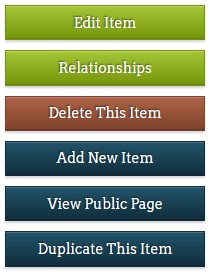
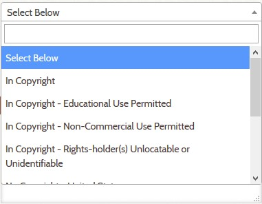

# Add or Edit an Item

This pages provides step by step instructions for how to:

-   [Add a new item](/archivist/add-edit-item/#add-a-new-item)
-   [Edit an existing item](/archivist/add-edit-item/#add-a-new-item)
-   [Delete an item](/archivist/add-edit-item/#delete-an-item)

You might also be interested in how to:

-   [Attach an image or PDF to an item](/archivist/attach-file/)
-   [Add a relationship to an item](/archivist/add-relationship/)

## Add a new item

Follow the steps below to add a new item to your Digital Archive.

1 &ndash; Go to the **_Add an Item_** page

:    There are two ways to get to the **_Add an Item_** page:

      - If **_Add item_** appears in the black menu bar at the top of the page, click it, *or*
      - Click **_Dashboard_** in the left admin menu, then click the blue **_Add a new item_** button

:   You will see a page similar to the screenshot below.

2 &ndash; Fill in the required fields

:   Most Digital Archive sites require you to fill in the following fields:

    - **_Title_**
    - **_Type_**
    - **_Subject_**

    Notes:

    - Which fields are required is determined by the [administrator](/administrator/getting-started-administrator).
    - The **_Identifier_** is filled in automatically for you - do not change it.
    - Use the **_Add Input_** buttons to add additional fields as needed.

3 &ndash; Fill in optional fields

:   Fill in any additional fields that you have information for.

4 &ndash; Choose to make the item public or private
:   Check the **_Public_** box  under the menu on the right to make the item public,
    or leave it  unchecked to keep it private and viewable only by archivists and administrators.  
    [Learn about public and non-public items](/archivist/what-gets-searched/).

5 &ndash; Click the **_Add Item_** button
:   When you click the **_Add Item_** button, your item we be saved to the Digital Archive.

    If you leave any required fields blank and click **_Add Item_**,
    red error messages appear at the top of the page as shown below. Provide the missing information and try again.

    

6 &ndash; Review the new item
:   After you add the item to the Digital Archive, check that the information you have 
entered is accurate and complete. To change or add information, see how to [edit an item](#edit-an-item).

---

## Edit an Item

Follow the steps below to edit an item to your Digital Archive.

1 &ndash; Go to the **_Edit Item_** page

:    There are two ways to get to the **_Add an Item_** page:

      - If **_Add item_** appears in the black menu bar at the top of the page, click it, *or*
      - Click **_Dashboard_** in the left admin menu, then click the blue **_Add a new item_** button

:   You will see a page similar to the screenshot below.

There are __ ways to access the Edit Item page:

- Edit links on the dashboard
- [Admin item page](/archivist/viewing-items-archivist/#public-item-view)
- [Public item page](/archivist/viewing-items-archivist/#admin-item-view)
- Archive search results in table view

Include

- Make changes to metadata fields
- Change the item from private to public
- Attach an image or PDF file to the item
- Add relationships to the item

**...I want to see what the item looks like to a user?**

Once you have saved a new item, click the **_View Public Page_** button in the menu on the right. You will see the item and its related information in a new tab. 

## Delete an Item

 Go to the item’s page 
    - Search for the item by title 
    - Search for the item by item number 
    - Click on the item in Recent Items  

- Click the Edit Item button if you are on the public view 
    - This will be under the metadata in blue, then click save  
Skip this step if you are on the admin dashboard 

- Delete S3 Files 
    - See How to add and delete items in S3 

- Delete the item from Omeka 
    - Click Delete This Item 
    - Click Delete 

---

## Tips & Tricks

**Searching within lengthy dropdown menus**

Databases with a large number of items may have many options for Type, Subject, and Rights. Instead of scrolling through a lengthy dropdown menu, you can type into a search field at the top of the dropdown menu to narrow your options. 

**Duplicating an existing item**

Once you have created and saved an item to the database, you can make a copy of it using the **_Duplicate This Item_** button in the menu on the right. You will see a new **_Add Item_** page appear, containing all of the same information as the original, but with its own Identifier number. The **_Title_** field now includes the word ---DUPLICATE--- as a reminder. 

---

## Step 8
> **Review** the newly added item

* Click the **View Public Page** button
* Make sure that the information appears the way you want it
* To make corrections, click the **Edit link** below the last field and go to Step 2

---

!!! note "See Also"
    To learn more, see the [Omeka documentation on adding an item](https://omeka.org/classic/docs/Content/Items/).
    However, keep in mind that the user interface for a basic Omeka site
    does not have all the features of the Digital Archive and therefore does not look exactly the same.