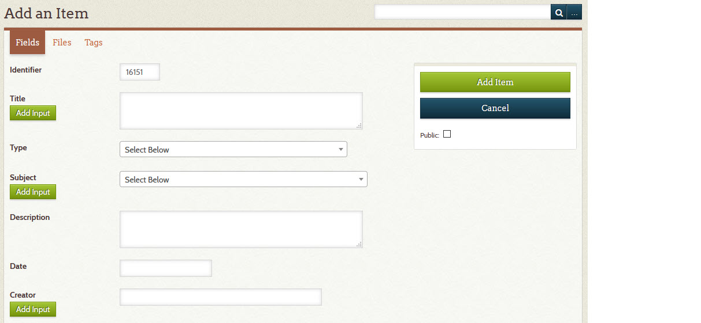

# Add or Edit an Item

This pages provides step by step instructions for how to:

-   [Add a new item](#add-a-new-item)
-   [View an item](#view-an-item)
-   [Edit an existing item](#edit-an-item)
-   [Duplicate an item](#duplicate-an-item)
-   [Delete an item](#delete-an-item)

You might also be interested in how to:

-   [Attach an image or PDF to an item](/archivist/attach-file/)
-   [Add a relationship to an item](/archivist/add-relationship/)

## Add a new item

Follow the steps below to add a new item.

1 &ndash; Go to the **_Add an Item_** page

:    There are two ways to get to the **_Add an Item_** page:

      - If **_Add item_** appears in the black menu bar at the top of the page, click it, *or*
      - Click **_Dashboard_** in the left admin menu, then click the blue **_Add a new item_** button

:   You will see a page similar to the screenshot below.

2 &ndash; Fill in the required fields

:   Most Digital Archive sites require you to fill in the following fields:

    - **_Title_**
    - **_Type_**
    - **_Subject_**

    Notes:

    - Which fields are required is determined by the [administrator](/administrator/getting-started-administrator).
    - The **_Identifier_** is filled in automatically for you - do not change it.
    - Use the **_Add Input_** buttons to add additional fields as needed.

3 &ndash; Fill in optional fields

:   Fill in any additional fields that you have information for.

4 &ndash; Choose to make the item public or private
:   Check the **_Public_** box  under the menu on the right to make the item public,
    or leave it  unchecked to keep it private and viewable only by archivists and administrators.  
    [Learn about public and non-public items](/archivist/what-gets-searched/).

5 &ndash; Click the **_Add Item_** button
:   When you click the **_Add Item_** button, your item will be added to the Digital Archive.

    If you leave any required fields blank and click **_Add Item_**,
    red error messages appear at the top of the page as shown below. Provide the missing information and try again.

    

6 &ndash; Review the new item
:   After you add the item to the Digital Archive, check that the information you have 
entered is accurate and complete. To change or add information, see how to [edit an item](#edit-an-item).

Be sure to read the next section on how to add an item because it contains additional
information that can be helpful when adding a new item.

---

## View an Item

You can view an item in two ways:

-   Using the Omeka admin interface
-   Using the public interface

This section will explain how to do both. Start with step 1 below
to view an item in the Omeka admin interface.

1 &ndash; Go to the admin **_Item_** page for the item you want to view

:   The quickest way to get to the **_Item_** page is by using the
    [quick access links](/archivist/special-features-archivist/#quick-access-links)
    as shown below.
    
      

    Click the **_View_** link to see a page similar to the one in the next screenshot.

2 &ndash; See the item's history

:   The lower right corner of the screenshot shows who created the item (`crm`)
    and who has worked on it (`gsoules` and `esantavicca`). The history does not
    record what changes an archivist made, but just knowing who edited an item and when
    can be very useful.

3 &ndash; Go to the public page for the item

:   As you can see from the green, red, and blue buttons on the right side of the page,
    you can perform a number of administrative functions from this page. Other
    sections will explain the buttons, but to view the item using the
    pubic interface, click the **_View Public Page_** button.

    When you click the button, the page displays the way public users see it as shown
    below. To return to the admin item page, click the **_View_** quick access link on the public page.

---

## Edit an Item

Follow the steps below to edit an item.

1 &ndash; Go to the **_Edit Item_** page
:   If you are viewing an item using the Omeka admin interface as explained in the
    previous section, you can edit the item by clicking the **_Edit Item_** button.
    Otherwise, the quickest way to get to the **_Edit Item_** page is by using the
    [quick access links](/archivist/special-features-archivist/#quick-access-links). They appear
    right below an item's metadata fields as shown below.
    
      

    Click the **_Edit Item_** button or the **_Edit_** link to see a page similar to the one shown below.

2 &ndash; Make your changes
:   Edit any of the fields on the page that you want to change.

    **Tip #1**: Quickly find vocabulary terms in the **_Type_**, **_Subject_**,
    and **_Place_** dropdown lists by typing into the search box that appears when you
    click on the dropdown. In the screenshot below, typing `neg` displayed
    three choices containing the word `Negative`. Click on a choice to select it.

    

    **Tip #2**: If the term you are looking for does not appear in a field's dropdown list,
    you can use the [Vocabulary Editor](/archivist/vocabulary-editor/)
    to add the term to your site's vocabulary for that field. The new term will show up in the
    list the next time you go to the **_Edit Item_** page.

    **Tip #3**: Type into the **_Creator_** field to get suggestions
    based on the names of creators in other items. In the example below, typing
    `rand` in the **_Creator_** field brought up four suggestions that were found in
    the **_Creator_** field of other items.  Click on a choice to select it. This
    suggestion features works for other fields too, but they must be configured in the
    [**_Suggest_** option](/plugins/avantelements/#suggest-option)
    of the AvantElements configuration page.

    

3 &ndash; Click the **_Save Changes_** button
:   When you click the **_Save Changes_** button, your item will be updated in the Digital Archive.

    If you leave any required fields blank and click **_Save Changes_**,
    red error messages appear at the top of the page as shown below. Provide the missing information and try again.

    

---

## Duplicate an Item

You can duplicate an existing item to save time when you need to add multiple
new items that will have the same metadata in most, but not all fields.
The duplicate feature will copy the metadata from an existing item into
the fields of a new item, but it will *not* copy:

-   The **_Identifier_**
-   Attached images or PDF files
-   Relationships

Follow the steps below to duplicate an existing item.

1 &ndash; View the item you want to duplicate

:   Before you can duplicate an item, you have to first view the item using the
    Omeka admin interface. Do this by performing step 1 in the section above on how
    to [view an item](#view-an-item).

2 &ndash; Click the **_Duplicate This Item_** button
:   After you click the button, the **_Add an Item_** page will display like if you
    were [adding a new item](/archivist/add-edit-item/#add-a-new-item), but most of
    the fields will be filled in with their values from the item being duplicated.

    The text `--- DUPLICATE ---` will be inserted as the first line of the **_Title_** field
    so you know that you are working on the duplicated item. Delete that text.

    The **__Identifier__** field will be blank. Don't type anything because an **__Identifier__**
    will get assigned automatically when you save the duplicate by clicking the **_Add Item_**. 

    

3 &ndash; Make changes
:   Edit any of the fields on the page that you want to change to make the duplicated
    item different than the original.

4 &ndash; Click the **_Add Item_** button
:   When you click the **_Add Item_** button, the duplicate item will be added to the Digital Archive.

    To create more duplicates, you can either duplicate the original item again, or
    duplicate the item that you just created.

---

## Delete an Item

Follow the steps below to delete an item.

1 &ndash; View the item you want to delete
:   Before you can delete an item, you have to first view the item using the
    Omeka admin interface. Do this by performing step 1 in the section above on how
    to [view an item](#view-an-item).

    **Proceed to step 2 below** *unless* the item has S3 files associated with it.

    You'll know if the item has S3 files, because instead of seeing the red **_Delete This Item_**
    button, you'll see a faded, disabled button that says something like `Has 3 files - Cannot Delete`.
    If you see the red **_Delete This Item_**, it's okay to proceed to step 2.

    Before you can delete an item that has S3 files associated with it, even if they are not
    attached to the item, you must first remove all of the files from S3. This ensures that
    those files don't get orphaned when the item goes away. If it doesn't seem right to delete
    the files, then reconsider if the item should be deleted.

    To delete the S3 files, click the S3 link to view the item's files on AWS. On AWS, select all of the
    files and then choose **_Delete_** from the **_Actions_** menu.

    Return to the admin **_Item_** page and refresh your browser to cause the Digital Archive to check
    again for S3 files. The red **_Delete This Item_** shoud appear and you can proceed to step 2.

2 &ndash; Click the **_Delete This Item_** button
:   When you click the **_Delete This Item_** button, a warning dialog will popup
    asking if you are sure you want to delete the item. If you are sure, click the
    dialog's **_Delete_** button.

!!! warning
    When you delete an item, it will be *permanently* removed from your Digital Archive.  
    **A deleted item cannot be recovered.**

