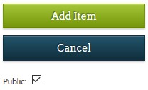
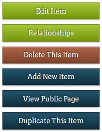
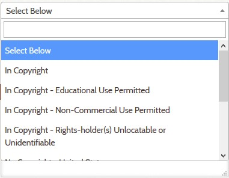

# Add a new Omeka Item

!!! note ""
    You must be logged into your Omeka account to perform these steps.

**Begin by** clicking the **_add item_** button in the upper right corner. 

Notice that a unique Identifier number has already been generated for you. It appears at the top of the page, and can only be changed when you first create a new item. 

---

## For *every* new item you add:

You must fill in the following fields for every new item.

**1. Give the item a TITLE** by typing in the **_Title_** textbox

**2. Select the item's TYPE** from the **_Type_** dropdown menu

**3. Select the item's SUBJECT** from the **_Subject_** dropdown menu (not required if the item's Type is Object)

**4. Select the RIGHTS** to the item from the **_Rights_** dropdown menu

---

## For items with additional information:

Many items have more related information than is contained in the required fields. You can enter information into the fields for **_description_**, **_date_**, **_creator_**, **_publisher_**, and **_source_** as it is available. 

---

## Publishing and saving a new item

If you are finished adding information to the new item and you are ready for it to appear in a user's search results, check the box marked **_public_** in the upper right. If the item needs more work later, or you don't want it to appear to outside users, leave the box unchecked. 

Once you have added all of the required and relevant information about the item, click the green **_add item_** button.

If you leave any of the required fields blank and try to add the item to the database, red error text appears at the top of the page to tell you what is missing. Complete the missing fields and try again.

---

## Optional next steps

[Attach a file to the item](../attach-file)

[Add relationships to the item](../working-with-relationships)

[Edit](../edit-item) or [Delete](../delete-item) the item

---

## What if...

**...the subject/type/rights option I need isn't listed?**

You can use the Vocabulary Editor to add additional terms for the subject, type and rights fields as needed for your collection.

[Learn how to edit vocabulary](../vocabulary-editor).

**...there are multiple titles or subjects for the item?**

When an item has more than one title (uncommon), subject, or creator, you need to add them in additional fields. Add an additional field by clicking the green **_Add Input_** button next to the field you want to add. 

**...I need to add or change something for the item?**

You can edit any of an item's fields after saving it, except for its Identifier.

[Learn how to edit an item](../edit-item)

**...I want to see what the item looks like to a user?**

Once you have saved a new item, click the **_View Public Page_** button in the menu on the right. You will see the item and its related information in a new tab. 

---

## Tips & Tricks

**Searching within lengthy dropdown menus**

Databases with a large number of items may have many options for Type, Subject, and Rights. Instead of scrolling through a lengthy dropdown menu, you can type into a search field at the top of the dropdown menu to narrow your options. 

**Duplicating an existing item**

Once you have created and saved an item to the database, you can make a copy of it using the **_Duplicate This Item_** button in the menu on the right. You will see a new **_Add Item_** page appear, containing all of the same information as the original, but with its own Identifier number. The **_Title_** field now includes the word ---DUPLICATE--- as a reminder. 

---

See [Field descriptions guide](field-descriptions.md) to learn about the fields listed above.

!!! note ""
    If the item needs more information, an image, or relationships, but you don’t
    have time to work on those things right now, record in the
    [Instructions field ](workflow-fields.md) what still needs to be done.

See [Field descriptions guide](field-descriptions.md) to learn about all fields.

---

If the item is not public, use the `Status` and/or `Restrictions` fields to indicate why.

  The item is now in the Omeka database. You can [edit the item](edit-item.md) to make changes.

---
---

## Step 8
> **Review** the newly added item

* Click the **View Public Page** button
* Make sure that the information appears the way you want it
* To make corrections, click the **Edit link** below the last field and go to Step 2

---

!!! note "See Also"
    To learn more, see the [Omeka documentation on adding an item](https://omeka.org/classic/docs/Content/Items/).
    However, keep in mind that the user interface for a basic Omeka site
    does not have all the features of the Digital Archive and therefore does not look exactly the same.