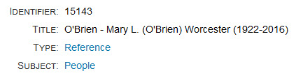
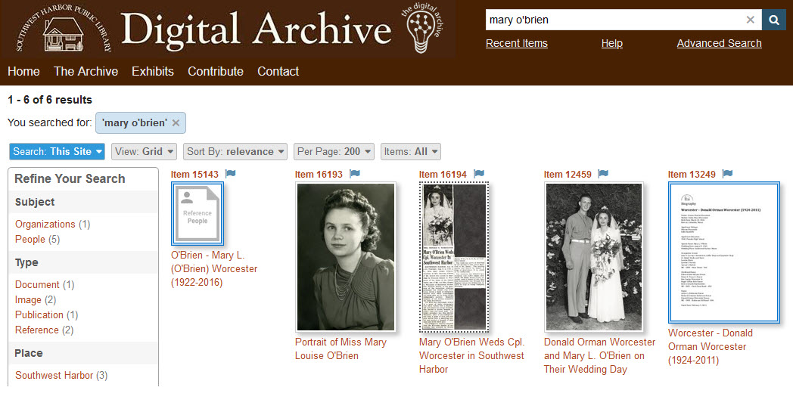
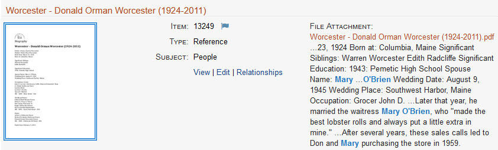
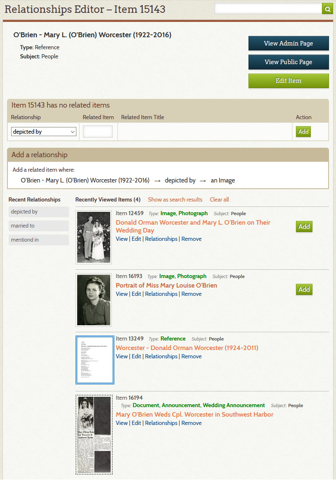
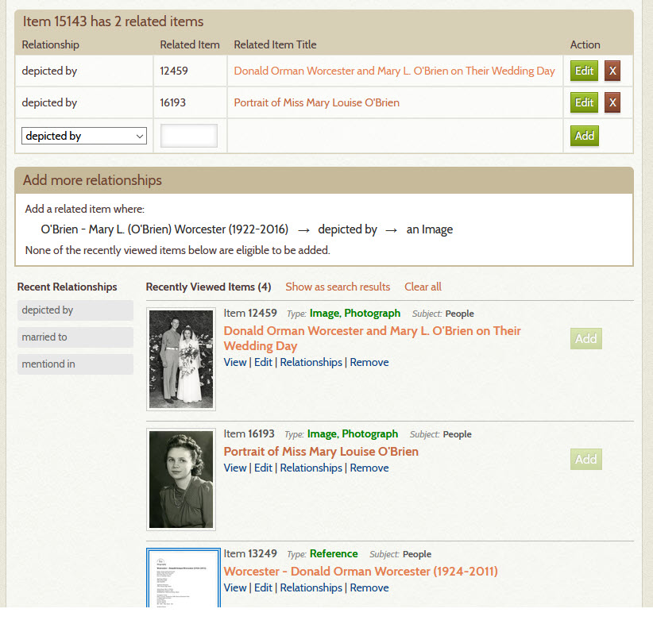
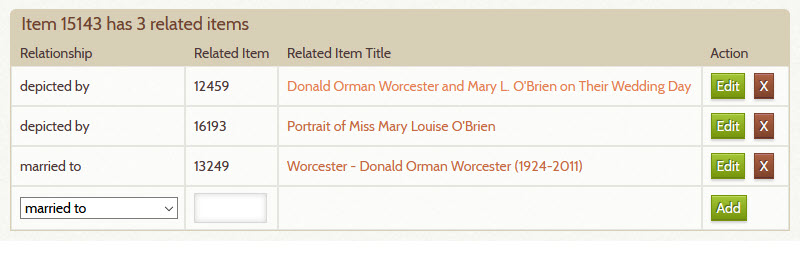
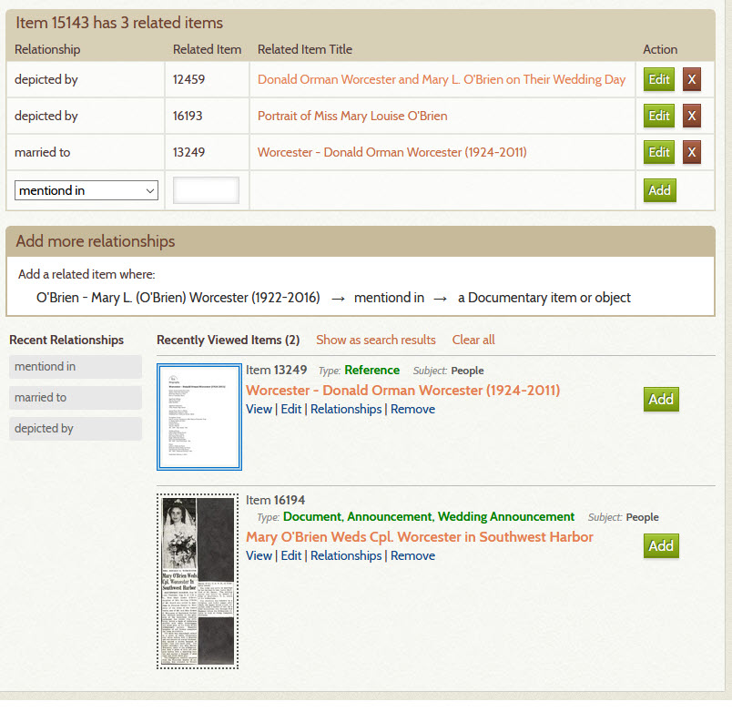
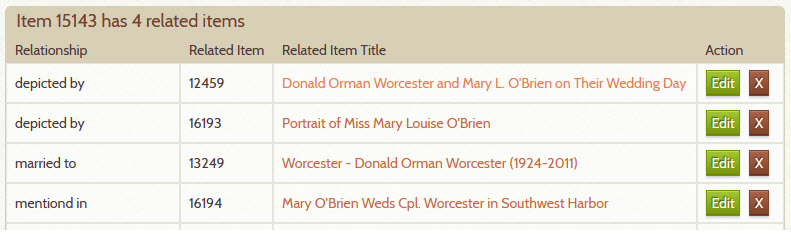
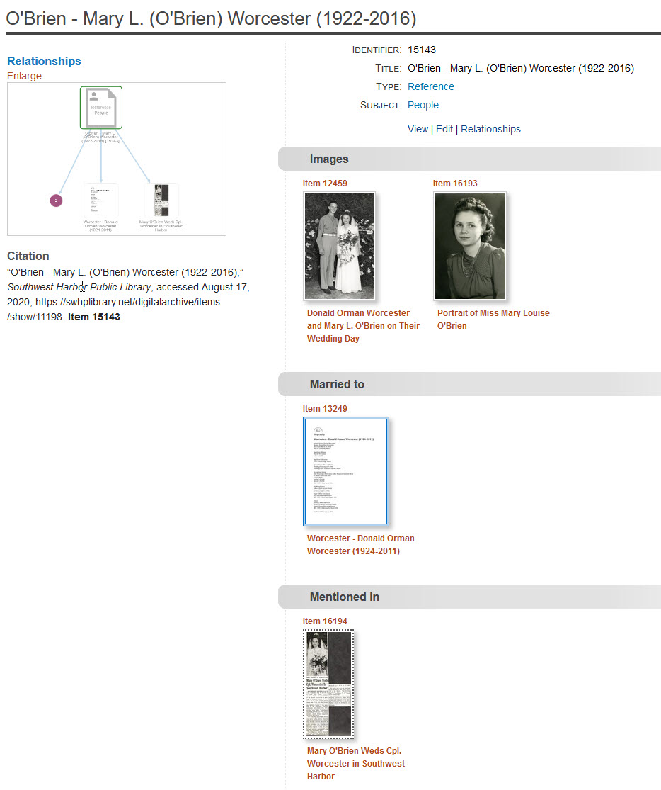

# Add Relationships to an Item

This page explains how to add relationships to an item by walking through an example.

To learn what relationships are, read the section on
[getting started with relationships](/relationships/getting-started-relationships/).

---

!!! note "Tip"
    To try the steps in this example using items in your own collection, open this page on your phone
    or tablet so that you can follow along without having to switch between browser windows.

## Three basic steps

There are just three steps for adding relationships:

-   Choose a primary item to add relationships to
-   Gather the items in your collection that are related to the primary item
-   Add the relationships

## Choose the primary item

The *primary* item simply means the item to which you are going to relate other items. This example
uses a person as the primary item, but the process is the same for adding
relationships to a building, boat, event, organization or anything else in your collection.

Once you know who or what you want to relate other items to, you'll need to create a  
[Reference Item](/relationships/reference-items/)
to serve as a digital stand-in for that person or thing. We'll do this in step 2 below.

In this example, our person is a woman named Mary O'Brien. The metadata for Mary's Reference Item looks like this:

You can add much more information to a Reference Item than appears above, but what's shown is all that's 
required and it only takes a minute to create. Don't worry if you don't really get what
Reference Items are all about &ndash; they'll make sense by the end of this page.

## Gather the related items

Suppose for a moment that instead of using the Digital Archive, you were making a scrapbook page for
Mary O'Brien. First you would clear off your work area, and then you would lay out everything
you have about her: photos, a newspaper clipping, and information about her husband Donald.

Follow the steps below to do the same thing using the Digital Archive.

1 &ndash; Clear your Recent Items list
:   The recent items list is your work area. To clear it off:

    -   Go to the [**_Recently Viewed Items_**](/user/recently-viewed/#recently-viewed-items-page) page
        by clicking the **_Recent Items_** link that appears on the banner of every page under the search box
    -   On the **_Recently Viewed Items_** page, click the **_Clear all_** link

2 &ndash; Create a Reference Item for the primary item
:   -   Follow the steps to [add a new item](/archivist/items/#add-a-new-item)
    -   Set the **_Type_**, **_Subject_**, and **_Title_** as shown in the previous section

3 &ndash; Find items that are related to the primary item
:   [Search](/user/how-to-search/) your Digital Archive for photos, articles, or other items that
    are associated with your primary item. The screenshot shows results in [Grid View](/user/viewing-search-results/#grid-view)
    of a [keyword search](/user/how-to-search/#search-using-keywords) for `mary o'brien`.
    
    The first result, item 15143, is Mary's
    Reference Item. The second and fourth items are photos she appears in. The third item is a newspaper clipping
    about her. The last item is a Reference Item for her husband Donald (see details in the second screenshot below).
    Note that the thumbnails for Reference Items have a double blue border to distinguish them from other items.

**Results of a keyword search for `mary o'brien`**

**The Reference Item for Mary's husband Donald**

The screenshot below shows the details for Donald Worcester's Reference Item which has a PDF attached to it.
A PDF can contain a gold mine of keywords. It was because of the presence of the keywords
`mary o'brien` in the PDF, that item 13249 came up in the search results above.

4 &ndash; View or flag related items
:   As you find items that you want to relate to your primary item, either view them or flag them.   
    When you view or flag an item, it gets added to your recently viewed items list.
    
    -   View an item by clicking its title in the search results, *or*
    -   [Flag an item](/user/recently-viewed/#flagging-items-to-view-later) by clicking the little
        gray flag next to its item number &ndash; the flag turns blue

    The screenshot above shows that the five items have been flagged.

5 &ndash; Go to the **_Recently Viewed Items_** page
:   Now that you have found and flagged the items you want to relate to Mary:

    -   Go to the [**_Recently Viewed Items_**](/user/recently-viewed/#recently-viewed-items-page) page to see them
    -   Click the **_Remove_** link on any items that may have crept in while you were searching
    -   Click the **_Relationships_** link on the primary item (Mary's Reference Item)

    The screenshot below shows the items that got flagged in step 3 above. 

## Add the relationships

You've now gathered all the items that are related to Mary. Now it's time to add relationships.

6 &ndash; Go to the Relationships Editor
:   You add, edit, or remove relationships using the [**_Relationships Editor_**](/relationships/relationships-editor/).

    To get to the editor from the **_Recently Viewed Items_** page:

    -   Click the the **_Relationships_** link for Mary's Reference item (see the pointing finger at
        the bottom of the screenshot above).
    -   The **_Relationships Editor_** displays as shown in the screenshot below.

    The page tells you that Mary's reference item #15143 has no related items.
 

7 &ndash; Relate photos to the primary item
:   The page above shows that for the *depicted by* relationship (in the dropdown list), two recently viewed items have an
    **_Add_** button to indicate that they are eligible to be added as related items. They are the two photos
    in which Mary appears &ndash; those photos depict Mary.
    
    Click the **_Add_** button for one of the photos. When the add completes, click the **_Add_** button
    for the other photo. The screenshot below shows that item 15143 now has two related items.

    
:   The two photos you just added still appear in the recently viewed items list, but their **_Add_** buttons
    are now disabled. No other items in the list have **_Add_** buttons because none *depict* Mary. If you like,
    you can remove the photos from the list by clicking their **_Remove_** links.

8 &ndash; Relate a Reference Item to the primary item

:   Now let's relate Mary to her husband:

    -   In the dropdown list, change `depicted by` to `married to`
    -   An **_Add_** button will appear next to Donald Worcester's Reference Item
    -   Click the **_Add_** button

    After relating Donald, Mary now has three relationships as shown below.

9 &ndash; Relate a document to the primary item

:   Finally, we'll add a relationship for Mary's engagement announcement:

    -   In the dropdown list, change `married to` to `mentioned in`
    -   An **_Add_** button will appear next to the announcement

    The screenshot below shows what happend when `mentioned in` was chosen for the relationship.
    Note that the **_Add_** button for Donald's Reference Item became enabled again. That's because
    that Reference Item is *eligible* to be related to the primary item in an *about/mentioned in*
    relationship, even though it might not be approrpriate. You have to use your knowledge of the
    items and how they relate to each other in deciding which ones to relate. Just because there's
    an **_Add_** button does not mean that the relationship make sense. To understand this better,  
    [learn how the **_Relationships Editor_** page](/relationships/relationships-editor/) works.

:   To complete this example, the screenshot below shows the effect of clicking the **_Add_** button
    for the wedding announcement. Mary's Reference Item is now related to four other items.

10 &ndash; See what you accomplished
:   Click the **_View Public Page_** button to see Mary's related items the way a visitor to
    your organization's Digital Archive will see them.

:   Hopefully you now understand why Reference Items are so important. They serve as the "glue" that binds
    other items together. They also provide a place to add information
    about a person or thing as it becomes available. For example, if you later learn some details about
    Mary's life, you can add them to the item's **_Description_** field or attach them in a PDF file. If
    you get a new photo of Mary, you can add it to your Digital Archive and relate it to this item very quickly.

---