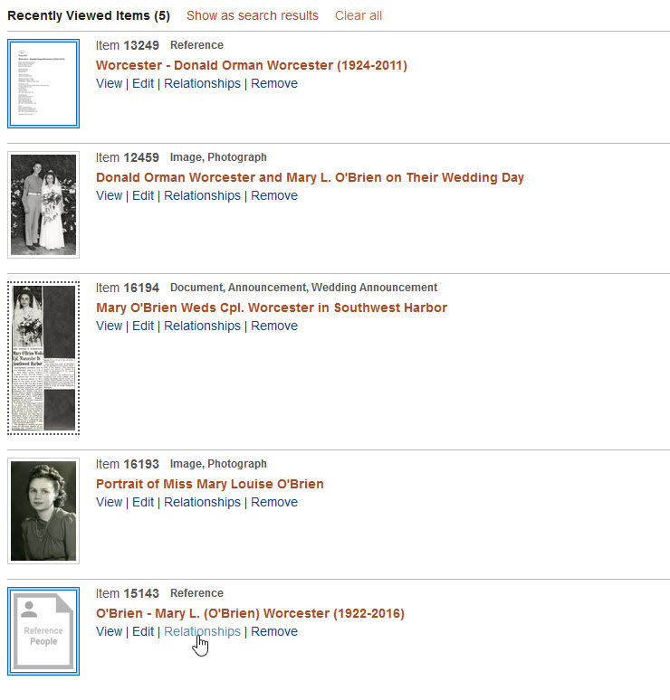

# Add a Relationship to an Item

This section explains *how* to add relationships to items in your collection.
To learn what relationships are and how they work, read the section on
[Getting Started with Relationships](/relationships/getting-started-relationships/).

## Relationships Quick Start

This section walks you through the how-to steps of relating photographs
of a person to an item about that person.

1 &ndash; Clear your Recent Items list
:   Click the **_Clear all_** link on the [**_Recently Viewed Items_**](/user/recently-viewed/#recently-viewed-items-page) page.
    
    You'll be using the **_Recently Viewed Items_** list in step 4, but to get started, we want it to be empty.

2 &ndash; Create a [Reference Item](/relationships/reference-items/#how-to-create-a-reference-item) for the person
:   [Add a new item](/archivist/items/#add-a-new-item) with these metadata values:

    -   Use the person's name in the **_Title_** field
    -   Choose `Reference` for the **_Type_** field
    -   Choose `People` for the **_Subject_** field

    Now you have an item that you'll be able to relate the photos to.

3 &ndash; Find two or three photos of the person
:   [Search](/user/how-to-search/) your Digital Archive to find a few different photos of your person.
    View each item or flag it for viewing later. Verify that the **_Type_** field
    for each photo starts with `Image, Photograph`

    As you view or flag the photos, they'll get added to your recently viewed items list.

4 &ndash; Go to the [**_Recently Viewed Items_**](/user/recently-viewed/#recently-viewed-items-page) page
:   Verify that the new Reference Item and your photos are in the list.

    Click the **_Remove_** link on other items that may have crept in while you lookied for photos.

5 &ndash; Add relationships to the Reference Item for your person
:   -   Click the Reference Item's **_Relationships_** link on the **_Recently Viewed Items_** page

      

    -   On the **_Relationships for Item_** page:
        -   Choose `depicted by` from the dropdown list in the **_Relationship_** column
        -   Click the **_Add_** button on each of your photographs

    You've now related the photos to the Reference Item for your person.        

6 &ndash; See what you accomplished
:   -   Click the **_View Public Page_** button to see your person and their photos.

    -   Click the title of one of the photos to see its Reference Item and the other photos.      

Congratulations! You've added your first relationships.