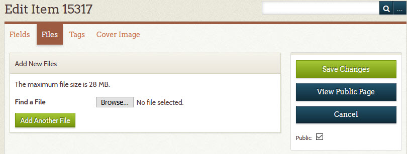
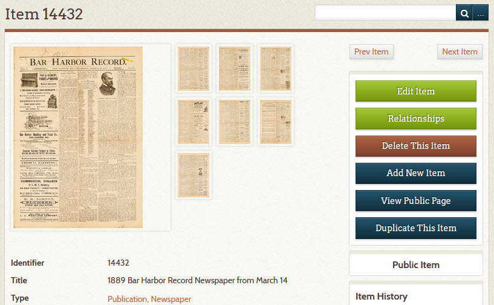
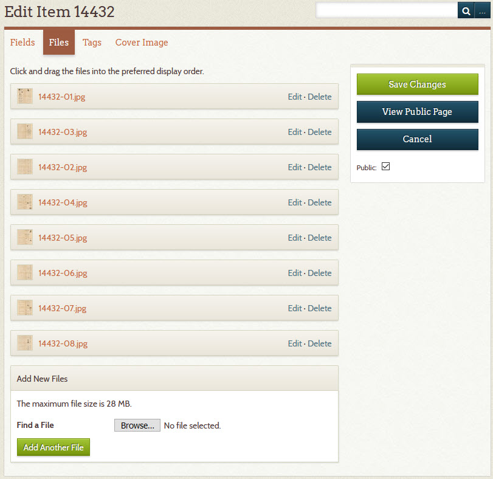
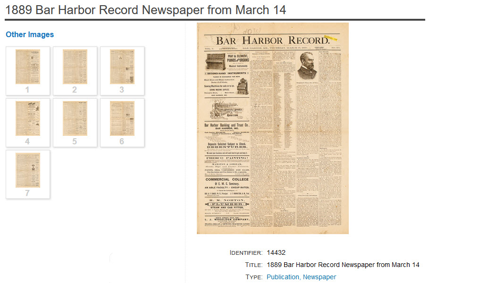
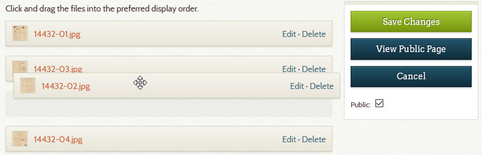
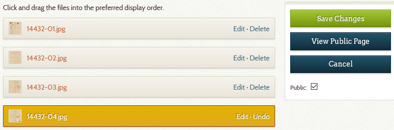

# Attach an Image or PDF to an Item

You can attach a digital image file or a PDF file to an item. A digital image file is like a scan of a
photograph or document, or a photograph taken with a digital camera.
*Attached* means that the file becomes associated with the item such that whenever you view the item's metadata,
you also see the image or PDF. You can attach multiple image and/or PDF files to a single item.

This page explains two methods for attaching image or PDF files to an item:

-   [Upload files to your Digital Archive](#upload-files-to-your-digital-archive)
-   [Choose files stored in S3](#choose-files-stored-in-s3)

If not [using S3](/archivist/using-s3/), you must use the first method. If using S3, you must use the second method.

---

!!! note "Searchable PDF files"
    If the attachment is a PDF file, and that PDF file is searchable, its text implicitly becomes part of the item's
    metadata just as if the text was contained in the item's **_Description_** field. A *searchable* PDF is one that either
    originated from a Word processor like Microsoft Word, or the PDF contains scanned text (like a scan of a
    newspaper article) that was processed with Optical Character Recognition (OCR) software to allow you to
    search the text when viewing the PDF. Use searchable PDFs whenever possible because they greatly increase
    the likelihood of someone finding the content on your site.
---

## Upload files to your Digital Archive

Follow the steps below to attach a file to an item by uploading the file to your Digital Archive.

1 &ndash; Go to the item's  **_Edit Item_** page
:   Learn how to [edit an item](/archivist/items/#edit-an-item).

2 &ndash; Go to the Files tab
:   On the **_Edit Item_** page, click on the **_Files_** tab.

    The screenshot below shows what the **_Files_** tab looks like for an item that has no file attachments.

    

3 &ndash; Click the **_Browse_** button
:   Clicking the **_Browse_** button opens the file explorer or file finder on your computer.

    -   Choose the file you want to upload
    -   Choose more files by clicking the **_Add Another File_** button for each additional file

    **Do not upload huge files**. To learn why, see [best practices for uploading files](/archivist/best-practices/#uploading-files).
    
4 &ndash; Click the **_Save Changes_** button
:  When you are done choosing a file or files, click the **_Save Changes_** button.

    The file(s) will be uploaded to your Digital Archive and attached to the item.

    You'll now be viewing the item's [admin page](/archivist/items/#view-an-item). It will display the files that
    are attached to the item. The screenshot below shows an item that has eight image attachments.

    

---

**The remaining steps are all optional.**    

---

5 &ndash; Change the file attachments (optional step)
:   To make changes to the attachments, click the **_Edit Item_** button.

    On the **_Edit Item_** page, click on the **_Files_** tab.

    You'll see the item's file attachments in a list as shown below.

    

6 &ndash; Reorder the attachments (optional step)
:   The first file in the list will be used as the item's thumbnail and it will
    be the large image displayed when you view an item. The other files will appear
    in the item page's **_Other Images_** section as shown below on the items public page.

    

    On the **_Files_** tab of the **_Edit Item_** page, you can click-drag a file to move it up or
    down in the list as shown below where file `14432-02.jpg` is being moved above `14432-03.jpg`
    so that the attachment order matches the file name numbering (these are newspaper pages and
    so the order is very important). When happy with the new order, click the **_Save Changes_** button.

    

7 &ndash; Delete an attachment (optional step)
:   -   Click the **_Delete_** link on each file you want to remove
    -   The file's row turns gold
    -   Click the **_Save Changes_** button

    

    Note: You never use the **_Edit_** link that appears before the **_Delete_** link.

8 &ndash; Add another attachment (optional step)
:   To attach more files to the item, follow the instructions in step 3 above.

9 &ndash; Replace an attachment with an updated file (optional step)
:   If you need to replace an existing image or PDF file with an updated version having the
    same file name, you should **first delete the attachment for the old version** following
    step 7 above, and then upload the replacement file as though it were a new attachment.
    If you don't delete the old file first, Omeka will give the updated file a different file
    name which can become confusing if you are relying on file names to know which Digital
    Archive files correspond to archival versions of those files that your are storing somewhere else.

## Choose files stored in S3

*Skip this section if your installation is not using S3*.

The steps for attaching an image or PDF to an item when [using S3](/archivist/using-s3/) are explained in these places:

-   [Logging into S3](/archivist/using-s3/#logging-into-s3)
-   [Uploading files to S3](/archivist/using-s3/#uploading-files-to-s3)
-   [Attaching S3 files to items](/archivist/using-s3/#attaching-s3-files-to-items)

> A note on using S3

Archivists at the Southwest Harbor Public Library have found that using S3 is far superior to
other methods they tried for managing archival files and their corresponding Digital Archive items.
Previously they used Dropbox to store archival assets, but the Dropbox approach required many
manual steps and was error prone. Dropbox can also get  expensive if you need accounts for
multiple archivists. S3 storage is inexpensive by comparison. Once set up, S3 works very well,
but to use it requires that all of your archival assets reside on S3 and are organized in folders as required
by the  [AvantS3 plugin](/plugins/avants3). In other words, AvantS3 is not something you can just start
using without the effort and expense required to switch over to S3 from another storage option.

