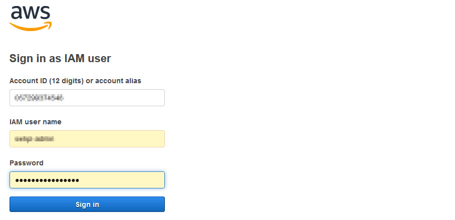
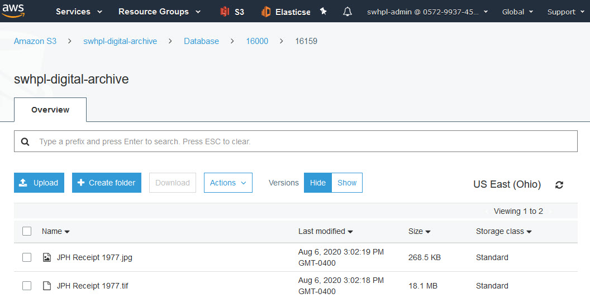
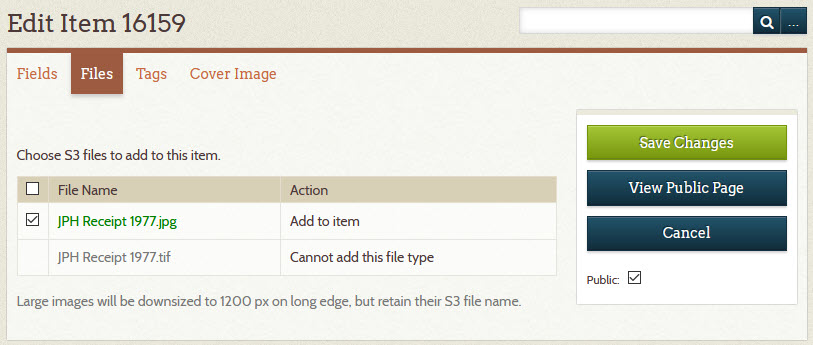
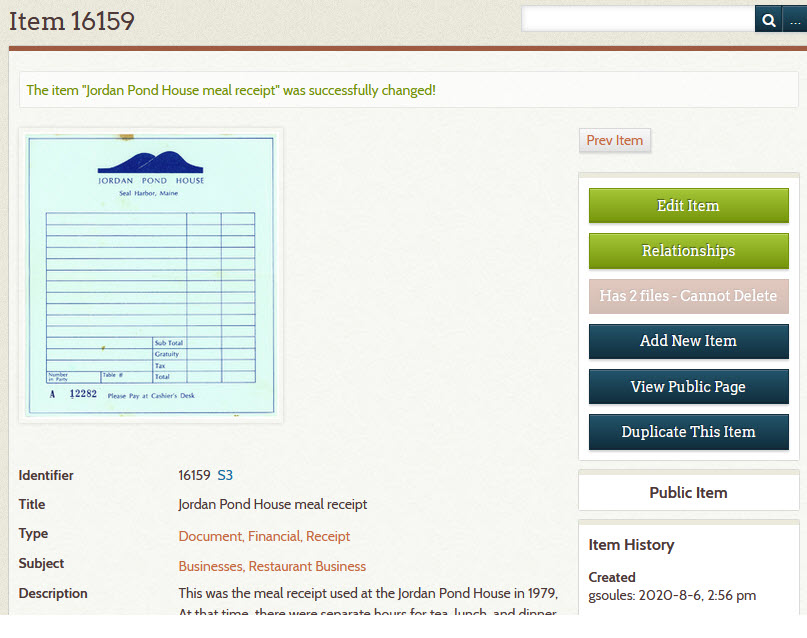
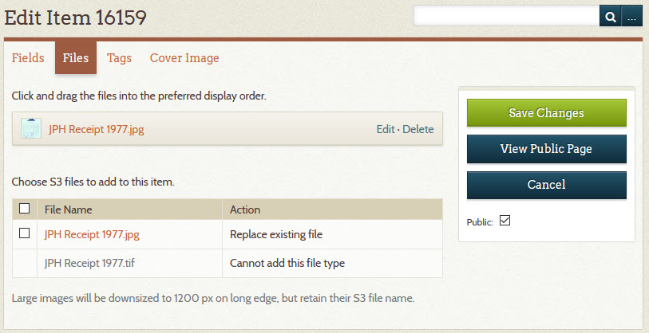

# Attach an Image or PDF to an Item

An item can have a digital image file or a PDF file attached to it. A digital image file is like a scan of a
photograph or document, or a photograph taken with a digital camera.
*Attached* means that the file becomes associated with the item such that whenever you view the item's metadata,
you also see the image or PDF. You can attach multiple image and/or PDF files to a single item.

This page explains two methods for attaching image or PDF files to an item:

-   [Upload files to your Digital Archive](#upload-files-to-your-digital-archive)
-   [Upload files to your S3 server](#upload-files-to-your-s3-server)

The second method is only available if your Digital Archive installation uses [AvantS3](/plugins/avants3)
to store archival assets on Amazon AWS S3. If you don't know what S3 is, use the first method.

---

!!! note "Searchable PDF files"
    If the attachment is a PDF file, and that PDF file is searchable, its text implicitly becomes part of the item's
    metadata just as if the text was contained in the item's **_Description_** field. A *searchable* PDF is one that either
    originated from a Word processor like Microsoft Word, or the PDF contains scanned text (like a scan of a
    newspaper article) that was processed with Optical Character Recognition (OCR) software to allow you to
    search the text when viewing the PDF. Use searchable PDFs whenever possible because they greatly increase
    the likelihood of someone finding the content on your site.
---

## Upload files to your Digital Archive

Follow the steps below to attach a file to an item by uploading the file to your Digital Archive.

1 &ndash; Go to the item's  **_Edit Item_** page
:   Learn how to [edit an item](/archivist/items/#edit-an-item).

2 &ndash; Go to Files tab
:   On the **_Edit Item_** page, click on the **_Files_** tab.

    The screenshot below shows what the **_Files_** tab looks like for an item that has no file attachments.

    

3 &ndash; Click the **_Browse_** button
:   Clicking the **_Browse_** button opens the file explorer or file finder on your computer.

    -   Choose the file you want to upload
    -   Choose more files by clicking the **_Add Another File_** button for each additional file

    **Do not upload huge files**. To learn why, see [best practices for uploading files](/archivist/best-practices/#uploading-files).
    
4 &ndash; Click the **_Save Changes_** button
:  When you are done choosing a file or files, click the **_Save Changes_** button.

    The file(s) will be uploaded to your Digital Archive and attached to the item.

    You'll now be viewing the item's [admin page](/archivist/items/#view-an-item). It will display the files that
    are attached to the item. The screenshot below shows an item that has eight image attachments.

    

---

**The remaining steps are all optional.**    

---

5 &ndash; Change the file attachments (optional step)
:   To make changes to the attachments, click the **_Edit Item_** button.

    On the **_Edit Item_** page, click on the **_Files_** tab.

    You'll see the item's file attachments in a list as shown below.

    

6 &ndash; Reorder the attachments (optional step)
:   The first file in the list will be used as the item's thumbnail and it will
    be the large image displayed when you view an item. The other files will appear
    in the item page's **_Other Images_** section as shown below on the items public page.

    

    On the **_Files_** tab of the **_Edit Item_**, you can click-drag a file to move it up or
    down in the list as shown below where file `14432-02.jpg` is being moved above `14432-03.jpg`
    so that the attachment order matches the file name numbering (these are newspaper pages and
    so the order is very important). When happy with the new order, click the **_Save Changes_** button.

    

7 &ndash; Delete an attachment (optional step)
:   -   Click the **_Delete_** link on each file you want to remove
    -   The file's row turns gold
    -   Click the **_Save Changes_** button

    

    Note: You never use the **_Edit_** link that appears before the **_Delete_** link.

8 &ndash; Add another attachment (optional step)
:   To attach more files to the item, follow the instructions in step 3 above.

9 &ndash; Replace an attachment with an updated file (optional step)
:   If you need to replace an existing image or PDF file with an updated version having the
    same file name, you should **first delete the attachment for the old version** following
    step 7 above, and then upload the replacement file as though it were a new attachment.
    If you don't delete the old file first, Omeka will give the updated file a different file
    name which can become confusing if you are relying on file names to know which Digital
    Archive files correspond to archival versions of those files that your are storing somewhere else.

## Upload files to your S3 server

*Skip this section if your installation is not using S3*.

1 &ndash; Go to the item's S3 page on AWS
:   The screenshot below shows the [admin item view page](/archivist/items/#view-an-item)
    for a newly created item that has metadata, but no attachments.
    
    Click the S3 link to get to the item's S3 page on AWS in a new browser tab.
    The S3 link is next to the item's **_Identifier_**.
    
    

    If you are going to S3 for the first time today, you'll need to login, but only once a day.

    

2 &ndash; Upload files to S3
:   You don't create an S3 folder for an item &ndash; it will just be there when you need it.

    Drag files onto the S3 page, or click the **_Upload_** button to
    browse for files on your computer.

    The screenshot below shows what the page looks like after uploading two files: a JPEG
    version of the file and the original high resolution TIFF file from the scanner.

    

    Once you are done uploading files, you can close the S3 tab.

    
3 &ndash; Select the S3 file(s) to attach to the item
:   Go to the **_Files_** tab of the [**_Edit Item_** page](/archivist/items/#edit-an-item).

    The S3 files from AWS appear in a list. Files that can be attached to the item have
    a checkbox next to them. Files without a checkbox are ones the Digital Archive, and browsers
    in general, do not support such as TIFF files, Word documents, and spreadsheets.

    The screenshot below shows both of the files that were uploaded to S3 in step 2 above,
    but only the JPG file has a checkbox.

    Check the boxes for the files you want to attach to the item.

    

4 &ndash; Click the **_Save Changes_** button
:   When you click the **_Save Changes_** button, the [AvantS3 plugin](/plugins/avants3) will:

    -   Download the checked files from your S3 server
    -   Downsize JPEG images to be 1200px on the long edge
    -   Attach the files to the item
    
    When the save has completed, the item will appear as shown below.

    

5 &ndash; Change the file attachments (optional)
:   The steps for reordering and deleting S3 attachments are the same as explained for  
    [uploading files to the Digital Archive](#upload-files-to-your-digital-archive) when not using S3.
    However, when you delete an attachment, the file itself remains in S3 and continues to
    show up in the S3 files list. That's because the list is only a reflection of what's stored
    on your S3 server. As such, you cannot accidentally delete an archival asset from the
    Digital Archive.

    To replace an attached file with a newer version having the same file name:
    
    -   Upload the newer file to S3
    -   S3 keeps a copy of the older version in case you make a mistake and need to recover it
    -   On the **_Files_** tab of the [**_Edit Item_** page](/archivist/items/#edit-an-item), check the box
        for the file that got updated
    -   Click the **_Save Changes_** button
    -   The Digital Archive will replace the older attachment with the newer one using the same file name 
        (you don't need to first delete the older file as you do when not using S3)

    In the screenshot below, note that the **_Action_** column value for file `JPH Receipt 1977.jpg`
    says `Replace existing file` whereas in step 3 above it said `Add to item`. That's because the
    Digital Archive knows which S3 files can be attached and which are already attached. This makes it
    easy to tell if you inadvertently forgot to attach an S3 file to the item.
    
    

> A note on using S3

Archivists at the Southwest Harbor Public Library have found that using S3 is far superior to
other methods they tried for managing archival files and their corresponding Digital Archive items.
The S3 method is simple, fast, easy, and safe.
Previously they used Dropbox to store archival assets, but the Dropbox approach required many
manual steps and was error prone. Dropbox can also get  expensive if you need accounts for
multiple archivists. S3 storage is relatively cheap by comparison. Once set up, S3 works very well,
but to use it requires that all of your archival assets reside on S3, organized in folders as required
by the  [AvantS3 plugin](/plugins/avants3). In other words, AvantS3 is not something you can just start
using without the effort and expense required to first switch over to S3 from another technology.

