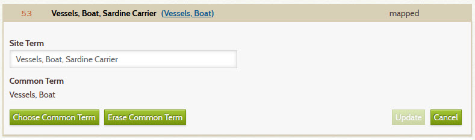
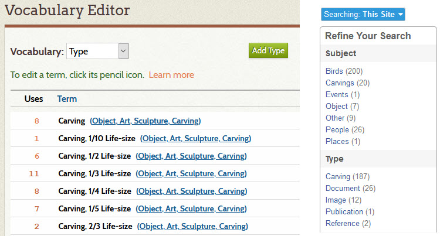

# Best Practices

The best practices on this page are recommendations from archivists at the Southwest Harbor
Public Library. They are based on their practical experience using the Digital Archive 
for four years with a collection of 12,000 items, 10,000 images, and 1,900 documents.

## Metadata

### Title field

The **_Title_** field is **more important than any other field** because:

-   The **_Title_** field appears everywhere in the user interface &ndash; it's what users see the most
-   Users read the title first to decide if they should view the full item
-   **Items appear highest in search results** when searched-for keywords are found in the title

**Recommendations:**

-   Write keyword-rich titles that concisely describe items in 10 words or less
-   Put important, but non-essential information in the **_Description_**, not the **_Title_**
-   Choose a titling convention and use it religiously. 

### Type field

Use the most precise vocabulary term available when choosing an item's **_Type_**.
For example, `Object, Clothing, Hat, Fedora` is more precise then just `Object, Clothing`
or `Object, Clothing, Hat`. If the more precise term is not in your site's vocabulary,
don't be lazy &ndash; take a minute to add it using the [Vocabulary Editor](/archivist/vocabulary-editor/).

Don't be too literal when choosing an item's **_Type_**. Specifically, the **_Type_** for a
documentary photograph of an object should be the object's type, not `Image, Photograph`.
A *documentary* photograph is a visual record of the object that lets
someone see the object online. For example, if you take a picture of a teacup that's in
your collection and attach the image to an item for that teacup, the type of the item should
be  `Object, Cup, Teacup`, not `Image, Photograph`. However, if you also have an old photo
of a woman drinking from that teacup, the **_Type_** for that photo *would be*
 `Image, Photograph` and its two subjects would be `People` and `Object, Cup, Teacup`.

Many organizations have items in their digital collections that they don't physically
posses. For example, if an archivist borrows, scans, and returns an albumen print,
they should set the **_Type_** of that item to `Image, Photograph, Photographic Print, Albumen Print`
because a high quality scan serves as a "digital surrogate" that reproduces the detail,
color, and sometimes even the texture, of a physical photograph. In contrast, if all
you have is a photocopy of an albumen print, that item's type should be 
`Document, Reprographic Copy, Photocopy` to reflect the poor quality of the image.

In summary, choose a **_Type_** that most closely indicates what the item is in the real word.

### Subject field

Like types, Subjects should be precise, but not too precise.

The **_Subject_** field is used to *classify* an item, but not uniquely
identify it. For example, the subject of a photograph of a boat can precisely indicate
the kind of boat, but not *which* boat. For example, the **_Subject_** could be
`Vessels, Ship, Sailing Ship, Schooner` but it should *not* be  
`Vessels, Ship, Sailing Ship, Schooner, Victory Chimes` which is a specific boat.

The limit on how specific subject terms should be has to do with the fact that in cataloging,
classification puts things into groups based on shared attributes such as boats that are all schooners.
The very nature of a group is that it contains multiple things. For a **_Subject_** to be the name
of a specific boat would be to create a group of one which is not classification, but identification.

A guideline for determining when a subject term has gotten as specific as it should be is to consider
what the next level would be. For schooners, would it be their names, their tonnage, the routes
they traveled, the number of masts? If the possibilities of the next level are very broad,
that's probably the cut off point. 

Another example is the subject `People` which has no lower level
classification. That's because to go one more level would mean having to decide the most important
way to further classify humans. Would it be by gender, ethnicity, religion, age, or height? There's no
clear choice and so `People` is not a hierarchy in most collections. If, however, your
collection is all about people of different races, than a people hierarchy would make sense. 

[Learn about when a **_Subject_** is optional](/technology/common-vocabulary-translator/#when-a-subject-is-optional).

**Keywords**

In the Digital Archive, archivists use keywords to provide additional specificity. For example, 
a good keyword-rich title for our schooner would be `Three-masted Windjammer Victory Chimes`. Combined with it's **_Subject_**
`Vessels, Ship, Sailing Ship, Schooner`, this item will show up in results for a keyword search for any
one of these keywords: `ship`, `schooner`, `three mast`, `windjammer`, `victory chimes`. Note that hits
on the last three keywords, which are all in the **_Title_**, will come up higher in search results than hit's
on `ship` or `schooner` which are only in the **_Subject_**. That's because in search results the Digital Archive gives much
more [weight](/archivist/what-gets-searched/#scoring) to the content of titles than to any other metadata field. It gives the next most weight content in the **_Description_** field.

In summary, the **_Subject_** field is used to classify items into groups of things
that have something in common, whereas keywords are used to uniquely identify a specific item within a group 

### Date and Creator fields

For photographs of objects, use the **_Date_** field to indicate the date of the item in the photograph, not the date that
the photograph was taken. Similarly, use the **_Creator_** field to identify the creator of the item, not
the person who took the picture. An exception would be artistic photographs that themselves are the item.

By default, the Digital Archive requires dates in one of these three forms:
```
YYYY-MM-DD
YYYY-MM
YYYY
```

If you don't know the exact date, you can use a year range and/or `c.` to indicate circa. For example:
```
1895 c.
1895 - 1897
1895 - 1897 c.
```
You can put other characters after the date (with a space in between) such as `?` to indicate not sure,
or `PM` to indicate that the date of a postcard is its postmark.

Your site's administrator can disable date validation, but the forms shown above ensure consistency and they
allow items to be sorted by date.

## Vocabularies

The [Common Vocabulary](/archivist/common-vocabulary/) contains 15,000 terms, but
there will be times when you'll need to add terms to your site's vocabulary because they don't 
exist in the Common Vocabulary.

##### Extending a term

As a general rule, when using the [Vocabulary Editor](/archivist/vocabulary-editor/) to add a new term,
always *extend* and *map* to an existing term. *Extend* means to use an existing term as a prefix
for the new term. *Map* means to use the new term as the **Site Term** and the existing term as the **Common Term**.

For example, you have a photograph of a special kind of boat known as a sardine carrier which is not in
the common vocabulary. Add the term like this:



The site term `Vessels, Boat, Sardine Carrier` *extends* the common term `Vessels, Boat`.

##### Elevating a term

An exception to the above is when you want to elevate a term. *Elevate* means to move a term up
higher within its hierarchy. For example, the focus of the Wendell Gilley Museum's collection is
bird carvings. For them, carvings are as important as images are in a photographic collection.
The museum elevated `Carving` to be a top level **_Type_** term by *not* using an existing common term as a prefix;
however, they still map to the common term `Object, Art, Sculpture, Carving`.

The screenshot below shows how they did this and its effect in the **_Refine Your Search_** panel
which shows that they also elevated `Birds` and `Carvings` to be top level **_Subject_** terms.



## Reference Items

Adhere *strictly* to these guidelines for [Reference Items](/relationships/reference-items/):

-   *Never* attach a photograph to a Reference Item
-   Only use Reference Items to store *metadata* about a person, place, or thing
-   Do attach one PDF if its content is solely about the Reference Item
-   Use the *depicts / depicted by* relationship to relate photos to a reference item
-   Use a [cover image](/relationships/reference-items/#cover-images-for-reference-items)
    to associate a photo with a Reference Item without attaching it

Attaching a photo to a Reference Item violates the [Archive Relational Model](/relationships/archive-relational-model/)
and will make things more difficult for you in the long run. Follow the guidelines and
you'll find that over time, as you acquire more information about, or photographs of, the
subject of a Reference Item, it will be quick and easy to add the information and photos
to your Digital Archive.

## Relationships

Use them.

To only add items to your Digital Archive without relating them to each other is to hide the stories in
your collection from people who want to learn about them.

At first, the effort to add relationships may seem daunting, but once you understand how they
work, learn how easy it is to add them, and experience seeing parts of your collection come
alive, sometimes discovering connections that you never even know existed, you'll be hooked.

## Uploading files

**Avoid uploading large, multi-megabyte files** when [attaching an image or document](/archivist/attach-file/)
to an item. Ideally, a file attachment should be less than a megabyte, though that's not always possible.

Images that you upload to the Digital Archive should generally be no more 1200px on the long edge.
To learn about resolution, see the [Scanning 101 workshop slides](Scanning-101-Workshot-by-George-Soules.pdf)
starting on page 52. If the image has a lot of detail, like a map, you might go as high as 2000px, but
better still, make the image [zoomable](/administrator/zoomable-images/).

An exception on file size is lengthy PDF files that have hundreds of pages and/or contain a lot of images. It is not uncommon
for an un-optimized PDF file to be tens or even hundreds of megabytes in size. As a general rule, try to keep them under 40MB.
To reduce the size of PDF files, learn about [creating PDF files from scans](/archivist/creating-pdfs).

Digital Archive sites are configured to reject the uploading of files that are larger than 150MB. This limit is
far larger than the recommended maximum size of about 40MB, but is set like this to allow for the occasional situation where
it's not possible to get by with a smaller file.

### Be kind to users
Large images and PDFs take longer to display which diminishes the user experience
for people without very high-speed internet service. Users of mobile devices who have to pay
extra, or whose cell service gets downgraded, when they exceed their bandwidth limit, will hate you.
**Don't be that organization that carelessly uploads huge files with no consideration for people who
have slow or metered internet access**.

## Archival file management

Put a process in place to manage and protect your archival assets using offsite or cloud storage.
As implied by the section below on uploading large files, the Digital Archive should only be used to store web-sized
images. **You must not use the Digital Archive as a repository for archival assets** such as the original,
multi-megabyte TIFF files that a scanner produces.

Whatever archival assess management scheme you use, **it should be quick and easy to locate and retrieve the high
resolution files** associated with items in your Digital Archive. As more and more people start viewing
your collection online, you will get more frequent requests for prints and high resolution digital files.
You need access to the high resolution files because web-sized images are not suitable for
printing except at very small sizes. If accessing your high resolution images involves a difficult
or cumbersome process, you will cringe every time you get an image request.

## Login credentials

Be security conscious. You might not think a Digital Archive account is that important,
or that the information is very sensitive, but to allow access to the wrong people is asking for trouble.  
A malicious person, or even a well-meaning one, can do a lot of damage.

Guard your collection by following these recommendations:

-   Do not use the same login for multiple people
-   Give each archivist their own user name and password
-   Do not share your login name and password with *anyone*
-   Do not set your password to something that's easy to guess
-   Do not use a password that you use for any other website

