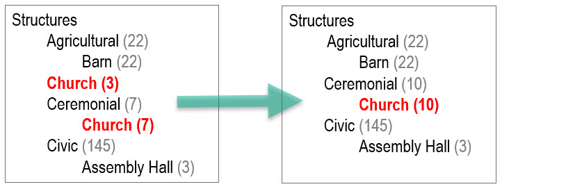

# Common Vocabulary

The Common Vocabulary is a set of hierarchically organized vocabulary terms. It can
be used by all Digital Archive sites that share their collections with each other.
Archivists for each site use the common vocabulary terms when choosing values for these metadata fields:

-   **_Type_**
-   **_Subject_**
-   **_Place_**

Each organization can also define its own **site vocabulary** containing terms that are specific
to its collection. Use of the Common Vocabulary ensures cataloging consistency across
collections, while  allowing each organization to extend or override the common terms using
the [Vocabulary Editor](/archivist/vocabulary-editor/).

The Common Vocabulary is a translation of the [Nomenclature](#nomenclature-40) vocabulary
into a simpler form. Learn about the [Common Vocabulary Translator](/technology/common-vocabulary-translator/).

---

!!! note ""
    You don't need to understand the Common Vocabulary to use it. Archivists can add and
    edit items, choosing **_Type_**, **_Subject_**, and **_Place_** terms from dropdown lists,
    without reading the information that follows. This page is for inquiring minds that want to
    know.

## How it works

The Common Vocabulary is more than just a set of common terms. It's a core feature of the
Digital Archive that is integrated with searching and the presentation of search results.
This section explains how the feature works.

The Digital Archive gives you the option to
[search one site or all sites](/user/how-to-search/#search-one-site-or-all-sites).
What you see for search results depends on which option you choose.

**When you search just one site**, the **_Refine Your Search_** panel displays **_Subject_**, 
**_Type_**, and **_Place_** terms from that organization's site vocabulary. In the screenshot
below, the first three columns show the **_Subject_** terms from three different sites.
    
**When you search All Sites**, the **_Refine Your Search_** panel displays terms from the Common Vocabulary.
In the screenshot below, the fourth column shows the results of an **All Sites** search with the
`Structures` term expanded to show its hierarchy.

In the screenshot, the green arrow is indicating that the
site-specific terms from the left columns are commingled and mapped to common terms
in the last column. Without the Common Vocabulary, all of the site terms (including
misspellings like "Bouys") would appear together in a very long list of inconsistently named terms.
With the Common Vocabulary, users see a relatively short list of terms which they can drill into
as shown for `Structures`

The previous example illustrates how the Common Vocabulary feature works with sites that
use a flat, keyword vocabulary. The next example shows how it works
with sites that use hierarchical vocabularies. 

The hierarchy on the left shows the term `Church`
in two places because one organization (with three church items) elevated the term `Church` from 
`Structures, Ceremonial, Church` to `Structures, Church`, a perfectly reasonable thing to do, 
especially if churches are the only ceremonial structures in their collection. To elevate a term means
to place it higher up in its hierarchy. Other organizations retained the `Structures, Ceremonial, Church`
hierarchy.

**Without** the Common Vocabulary feature, an **All Sites** search would commingle the
terms and display `Church (3)` above `Ceremonial` and `Church (7)` below `Ceremonial` as shown at left.

**With** the Common Vocabulary, `Church` appears just once, beneath `Ceremonial` as shown on the right.
 However, if you searched just the one site that uses the term `Structures, Church`, the word 
 `Church` would only appear above and at the same level as `Ceremonial` like it does for 
 `Church (3)` at left.

For a real life example of an organization that elevates site terms to better reflect its
collection, see the
[site term mapping demonstration](#site-term-mapping-demonstration) section below.

## Terminology

To better understand the Common Vocabulary, and so that the sections that follow will
make more sense, become familiar with the terminology below.

Term
:   A **term** is a *combination of words* that concisely describe or classify something. For example,
    the comma-separated list of words below forms a *single* term that describes a photograph
    that was printed using the cyanotype printing process that produces a cyan-blue print.

        Image, Photograph, Photographic Print, Cyanotype

Vocabulary
:   A **vocabulary** is a controlled list of terms that archivists use when cataloging items
    in their collection. Controlled means that archivists choose terms from lists rather than
    typing into a blank field. Choosing from a list ensures consistency and prevents
    archivists from using terms that are not appropriate for the collection, or entering misspelled words.

Hierarchy
:   Individual terms belong to tiered groups of related terms that are each unique, but have something in common.
    The examples below illustrate the meaning of **hierarchy**.

    These two terms are in the `Image` hierarchy:

        Image, Art, Drawing
        Image, Photograph, Photographic Print, Cyanotype

    These two terms are in the `Image, Photograph` hierarchy

        Image, Photograph, Negative
        Image, Photograph, Photographic Print, Cyanotype

    These two terms in the `Image, Photograph, Photographic Print` hierarchy

        Image, Photograph, Photographic Print, Albumen Print
        Image, Photograph, Photographic Print, Cyanotype

Leaf
:   The word or words following the last comma in a term are known as the **leaf**.
    If you think of a hierarchy as a tree with multiple branches, the leaf words are
    the leaves of the tree. Put another way, they are the deepest words in a
    hierarchy. In the examples above the leaf words are `Drawing`, `Cyanotype`,
    `Negative` and `Albumen Print`.

    In the Common Vocabulary, and also in
    [Nomenclature 4.0](/archivist/common-vocabulary/#nomenclature-40),
    every leaf is unique. This means that once leaf words are user for one term, those exact words can
    never be used as the leaf for another term. This explains why a term's leaf sometimes
    contains what seems like redundant words. For example, the terms below 
    describe physical structures.

        Structures, Factory, Cannery
        Structures, Civic, Performing Arts, Theater
        Structures, Quarry

    The terms below describe the businesses associated with those structures.

        Businesses, Cannery Business
        Businesses, Theater Business
        Businesses, Quarry Operation                 

    Even though the first three terms are in different hierarchy (`Structures`) than the second
    three terms (`Businesses`), all six terms are in the same **_Subject_** vocabulary and therefore
    must have unique leaf words. To accomplish this, the second set appends `Business` or `Operation`
    to the leaf words in the first set.

Common Vocabulary
:   The **Common Vocabulary** is a set of terms that multiple organizations all use in common
    as a way of providing consistency in these metadata fields: **_Type_**, **_Subject_**, **_Place_**.
    The Common Vocabulary is very large. It contains approximately 15,000 terms.

Site Vocabulary
:   A **site vocabulary** is a set of terms that are specific to one organization's Digital Archive site.  
    It only extends, or fills gaps in, the Common Vocabulary and is therefore usually very small.
    
    A typical site vocabulary, used in conjunction with the Common Vocabulary, might have only a
    few dozen terms or less. An exception would be an organization that wanted to use an entirely
    different vocabulary, such as
    [Library of Congress Subject Headings](http://id.loc.gov/authorities/subjects.html) or
    [AAT](http://www.getty.edu/vow/AATHierarchy?find=booklet&logic=AND&note=&english=N&prev_page=1&subjectid=300311670).
    In that case, they would have a large site vocabulary, but they could still maintain consistency
    with other sites by using **mapped site terms** as will be explained below.

Common Term
:   A **common term** is one that comes from the Common Vocabulary. Most organizations can utilize common terms
    for most of the items in their collection. In cases where there is no applicable common term, an
    archivist can create a **site term**.

Site Term
:   A **site term** is one that does *not* come from the Common Vocabulary. It is specific to an organization
    and is found in that organization's site vocabulary. While a site term is not in
    the Common Vocabulary, more than one organization might be using the same site term. If 
    many organizations are using the same site term, that term would be a candidate for inclusion in
    the Common Vocabulary.

    A site term is either **mapped** or **unmapped** as will be explained below. You use the
    [Vocabulary Editor](/archivist/vocabulary-editor/) to create and map site terms. 

Mapped Site Term
:   A **mapped site term** is a site term that is associated with (mapped to) a Common Vocabulary term. By mapping
    a site term to a common term, an organization gets the best of both worlds: a site-specific term for their
    organization and a common term that is consistent with terms that all organizations are using.

Unmapped Site Term
:   An **unmapped site term** is a site term that is not associated with (not mapped to) a Common Vocabulary term.
    In practice, an organization will only use unmapped site terms for a short period of time while they are
    deciding which Common Vocabulary terms to map them to. As a general rule, an organization should not use
    unmapped site terms. Even the most unusual item in a collection can be mapped to a Common Vocabulary term
    such as `Object, Other Object` or `Document, Other Documents` or `Image, Other Image` and several other
    catch-all terms.

## When to use site term mapping

Most organizations will find that they can use Common Vocabulary terms most of the time.
There are, however, cases when you need to create a site term and map it to a Common Vocabulary term.
Create a mapped site term when:

-   The term you want is not in the Common Vocabulary
-   You want a more specific term than the closest term in the Common Vocabulary

Here are examples for each case taken from the Southwest Harbor Public Library.

##### Case 1 &ndash; A term is not in the Common Vocabulary

The Library has a large number of documents from the Maine Historic Preservation Commission (MHPC). The
closet Common Vocabulary term is `Document, Report` but `Report` is too vague for these important items. To
address this, archivists used the [Vocabulary Editor](/archivist/vocabulary-editor/)
to create the **mapped site term** `Document, MHPC Survey` as shown below.

Notice that `MHPC Survey` is mapped to the common term `Document, Report`, but only includes `Document`
and not `Document, Report` in the site term. This is done to elevate an MHPC item to become a kind of
document in the Library's site vocabulary, but to have it show up in All Sites searches as a kind of report.
To better understand why you might elevate a term, and what effect it has, see the
[site term mapping demonstration](#site-term-mapping-demonstration).

If these surveys where a
major focus of the Library's collection, the site term could have been simply `MHPC Survey` which
would have made it a top level term at the same hierarchy level as `Document`, `Image`, or `Object`. 
An example of this kind of term elevation appears in the site term demonstration section below where 
a museum made `Carving` a top level term because carvings are the focus of its collection.

##### Case 2 &ndash; A Common Vocabulary term is not specific enough

The Library has some oil paintings and some watercolor paintings in its collection and wanted the
**_Type_** term to distinguish one kind of painting from the other, but the Common Vocabulary only
has `Image, Art, Painting`. To provide the desired specificity, the Library added the
**mapped site terms** shown below.

Notice that both terms *extend* the Common Vocabulary term `Image, Art, Painting` by using  
`Image, Art, Painting` as the beginning of each term. The Vocabulary Editor would have allowed the site
terms to be just `Oil Painting` and `Watercolor Painting`, but then, as
explained in the previous example, those would have become top-level **_Type_** terms
which would not be appropriate since paintings are not a focus of the collection.

## Site term mapping demonstration

The power of site term mapping is tied to the difference between searching one organization's
site and searching the sites of all organizations. As explained in the [how it works](#how-it-works)
section above, when you search **This Site**, the search results show site terms, and when you search
**All Sites**, the results show common terms.

The two screenshots that follow demonstrate this behavior. In both, the search results are for a
[keyword search](/user/how-to-search/#search-using-keywords) for `bird carving` and both show the same
set of results; however, notice that the appearance of the two search results pages is significantly different.

### All Sites search

    
### This Site search

### Comparison

Here are the differences between the first and second screenshots above:

-   The **_Refine Your Search_** panels look completely different, though both show:
    -   `Birds` as the **_Subject_** and
    -   `Carving` as the **_Type_**
-   In the search result rows, the terms in the **_Type_** and **_Subject_** fields are different:
    -   Common terms appear in the **All Sites** results
    -   Site terms appear in the **This Site** results

### Why the results are so different

The difference in search results above is due to
how archivists at the Wendell Gilley Museum, which has a collection focused on bird carvings, used the
[Vocabulary Editor](/archivist/vocabulary-editor/) to elevate `Carving` to be a top level **_Type_** term.
You can see this in the screenshot of the Vocabulary Editor below where terms like
 `Carving, Decoy` and `Carving, Miniature` are all mapped to the Common Vocabulary term  
 `Object, Art, Sculpture, Carving`. This is called elevating a term because it moves `Carving`
 up in the hierarchy from the fourth level to the first level.

## Origin of the Common Vocabulary

The "common vocabulary" originated at the Southwest Harbor Public Library in 2016. It was
created for the Digital Archive based on a tiny subset of the [Nomenclature 4.0](#nomenclature-40)
vocabulary. Archivists at the Library liked the descriptiveness of Nomenclature, and the fact that
it is hierarchical, but there were two issues. The first is that full Nomenclature terms are long and
unfriendly, and the second is that Nomenclature only contains terms for human-made objects.
To work around these issues, the Library developed a simplified set of terms using the best parts
of Nomenclature and adding additional terms for subjects like businesses, organizations, and events.

The Library's vocabulary became "common" as other libraries and historical societies started using
the Digital Archive. New installations of the software were installed with the Library's vocabulary terms,
but over time, each organization made changes and additions specific to their own collections. However,
they did not consult with each other and so terms that got added or changed in one organization became
inconsistent with terms in other organizations. That was okay when each site was standalone, but
that changed in 2018 when six organizations started sharing their collections online. All of a sudden
everyone's different, and sometimes inconsistent terms and misspellings, showed up in one place and
looked very messy as shown in the examples in the [how it works](#how-it-works) section above.

In 2020, in anticipation of even more sites sharing using the Digital Archive, AvantLogic conceived the Common Vocabulary
as a way to present a clean, consistent set of vocabulary terms to users who were searching across all of the
sites, while still allowing each organization to use its own site-specific terms. AvantLogic also extended the
Common Vocabulary to include the entire Nomenclature 4.0 vocabulary, plus dozens of additional terms.

## Nomenclature 4.0

According to the [Nomenclature website](https://www.nomenclature.info/apropos-about.app?lang=en), 
"Nomenclature is the most extensively used museum classification and controlled vocabulary for historical
and ethnological collections in North America. Nomenclature will not include all the terms any given
museum needs, and it will not be suitable for all purposes. But it is a practical, flexible, extensible
framework that has been used successfully by thousands of museums for more than three decades."

With some 15,000 terms, Nomenclature is extensive, though
not as extensive as [Library of Congress Subject Headings](http://id.loc.gov/authorities/subjects.html)
with nearly 350,000 terms. The Nomenclature hierarchy has a depth of up to six levels, whereas 95%
of Common Vocabulary terms have four levels or less. Contrast this to the
[Getty Art & Architecture Thesaurus (AAT)](http://www.getty.edu/vow/AATHierarchy?find=booklet&logic=AND&note=&english=N&prev_page=1&subjectid=300311670)
which use this nine level term for `Dogs`: 

    Agents, Living Organisms, Eukaryota, Animalia, Chordata, Vertebrata, Mammalia, Canidae, Canis

Nomenclature does not have a term for `Dogs` because they are not human-made objects. The Common Vocabulary
added this term as `Nature, Animals, Dogs`.

Updates to Nomenclature used to be released every few years and museums had to pay for the new releases,
but the terms are now updated on an ongoing basis and updates are available for free from the Nomenclature
website. To give a sense of the updates, 30 revisions were made between January 30, 2020 and May 18, 2020 version.
Here are examples:

-   Renamed `Maple Sugaring Tool` to `Sugaring Tool`
-   Added `Drink Box` (the preferred term for `Juice Box`)
-   Added `Land Grant`
-   Added `Surge Protector`

While most Digital Archive sites won't benefit from these kinds of updates, the Common Vocabulary
can ingest them if desirable. Because each Digital Archive site can add its own site terms,
an organization would never have to wait for a new term to be added to Nomenclature.

To learn how the Common Vocabulary gets created from Nomenclature, and how additional terms get added,
read about the [Common Vocabulary Translator](/technology/common-vocabulary-translator/). When the
Common Vocabulary Translator is used to add or modify a Common Vocabulary term, all Digital Archive
sites can be automatically updated to receive the update and to convert site terms to common terms if
appropriate. For example, if a number of sites have all added a mapped site term that then becomes a
Common Vocabulary term, the site term can be automatically converted to be a common term on those sites.

