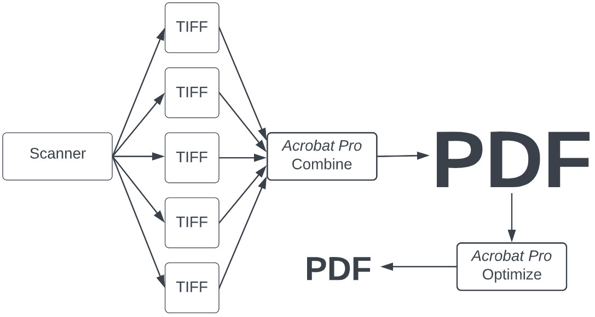

# Creating PDFs from scans

This section describes the best way to create a PDF file from files output by a scanner when you [scan documents or photographs](/archivist/scanning/#scanning).
The best way is one that:

-   Preserves all of the information your scanner produced.
-   Provides sufficient quality for viewing in the Digital Archive.
-   Creates a PDF file that can be viewed by users who have slow or metered internet access.

## Rules for creating a right-sized PDF file
Here is a summary of the best way to create a PDF in most situations.

-   [Configure your scanner software to create TIFF files](/archivist/scanning/#choosing-the-output-file-location-type).
-   [Scan using the appropriate PPI](/archivist/scanning/#choosing-the-right-ppi-when-scanning-images).
-   Use a PDF program like [Adobe Acrobat Pro](https://www.adobe.com/acrobat/complete-pdf-solution.html)
    or [FoxIt PDF Editor](https://www.foxit.com/pdf-editor/) to:
    -   [Combine the TIFF files into a PDF file](#combining-scan-files-into-a-pdf-file).
    -   Create an [optimized copy of the PDF](#how-to-optimize-a-pdf-file) that has a smaller file size than the original.
-   [Attach the smaller PDF](/archivist/attach-file/#attach-an-image-or-pdf-to-an-item) to a Digital Archive item.
-   Move the TIFF files and the unoptimized PDF to your [archival storage](/archivist/best-practices/#archival-file-management) area.

By following the steps above, you'll produce a right-sized PDF for uploading to the Digital Archive and you'll also
have original high-resolution scans that can be used for close examination of the scanned materials or for making prints.

### Why the rules are important and when they can be broken

#### Create TIFF files from the scanner
You scan to TIFF files because TIFFs store all of the information produced by the scanner. If you scan to JPEG or to PDF,
fine image detail that might be important to you later will be irreversibly lost. This is because both JPG and PDF files use a
compressed *lossy* format that throws data away to make files smaller.

An analogy for lossy compression would be like removing some of the down from a winter jacket so that you could squish it to be
small enough to fit inside your suitcase. When you unpacked the jacket, the remaining down might fluff up enough that you might
not notice any difference in how the jacket looks, but in really cold weather, it wouldn't keep you as warm as it used to. In contrast,
TIFF files use lossless compression which would be like squishing the jacket without removing any down, but if that wasn't enough,
you'd need to get a larger suitcase.

The exception to the TIFF rule is when the materials you are scanning do not need to be preserved with the highest quality possible.
Examples are type-written or typeset text where the words, not an image of the words, is what's most important. For letters,
books, and other textual material, you can scan the pages directly to a single PDF which is a much faster than scanning to
individual TIFF files. Furthermore, you can scan at 300 PPI and possibly using grayscale instead of color, to produce smaller files.

#### Optimize the PDF file created from the TIFF files   
You optimize a PDF to create a smaller copy because the original PDF file can be tens or hundreds of megabytes in size, making it
[too large to upload](/archivist/best-practices/#uploading-files) the the Digital Archive.

You can skip the PDF optimization step if the original PDF is of an [acceptable size for uploading to the Digital Archive](/archivist/best-practices/#archival-file-management). This may be the case when there are not a lot of pages and the scans were done using a PPI of 400 or less.

## How PDF files store images

Before proceeding, it may help to understand how PDF files store images and why PDF files can get to be so large.
A PDF file is simply a container for text and images. This container does not store the original TIFF, or JPEG, or PNG images that go into
into, but rather, it stores compressed versions of images in a lossy format like JPEG as was explained earlier. This makes the
size of the PDF smaller. However, after an image has been compressed and stored in the PDF, you cannot retrieve the original image
in its original form. Using the analogy of then winter jacket squished to fit inside a suitcase, once you take some of the down out,
you can't put it back in again and the jacket will never be as warm again as it used to be. For images this means you can never
retrieve the finest details that the scanner captured.

Image compression makes the PDF smaller, but it does not affect image *resolution* (to learn about resolution, see pages 52 - 61 of the 
[Scanning 101 workshop](Scanning-101-Workshot-by-George-Soules.pdf)). If the original image dimensions are 6000x4000 (high-resolution), the compressed image still has those same dimensions. However, even with compression, an image with large dimensions takes up more space in a PDF than
an image with lower resolution such as 1200x800. Thus, if you create a PDF from a lot of large images, like the TIFF files created by
a scanner, the PDF file size can become huge even after compression.

The only way to further reduce the size of a PDF containing high-resolution images is to down-size the images to have a resolution that
is lower, but still preserves enough detail so that the image looks good on a computer monitor. This is what happens when you optimize
a PDF as will be explained later.

## The importance of compression and resolution
A very important thing to understand about compression and resolution is that on a computer monitor, an uncompressed high-resolution
image will usually look the same as a compressed, lower-resolution image. They may even look nearly same when zoomed in to 200%, but
at 400% the compressed, lower-resolution image might look soft because the fine details are missing. If the original image was low quality,
such as a drugstore snapshot print, and didn't have that much detail to begin with, the difference between the two versions of the image
might be negligible anyway. In contrast, the difference would be very noticeable for a detailed original such as an engraving or
postage stamp. The difference would also be notable if you need to print the image. The original image may produce a nice print whereas
a print from a compressed, low-resolution image might look terrible.

To address these issues, create and save both the uncompressed high-resolution images (large TIFF files) and the compressed
lower-resolution images in a right-sized PDF. Use the large files for study or printing and use the smaller PDF for viewing on a computer
monitor via the Digital Archive.

## Using a PDF program to create and optimize a PDF file
The rules above for [creating a right-sized PDF file](#rules-for-creating-a-right-sized-pdf-file) include the two steps below.
The  sections that follow explain how to perform the steps.

-   Combine TIFF files into a PDF file
-   Create an optimized copy of the PDF

## Combine TIFF files into a PDF file
The easiest way to combine TIFF files into a PDF is to select all the files in Windows Explorer and then right-click
to bring up the menu item `Combine files in Acrobat` or `Combine files in Foxit`. On Windows 11 you may need to
first click on `Show more options` to get to the menu that shows the `Combine` option.

Once on the **_Combine Files_** dialog, you can click the **_Combine_** button to create the PDF. The PDF will open with a name like
`Binder.pdf` which you then Save As the file name you choose at the location where you want to store the file.

Acrobat provides an option on the **_Combine Files_** dialog to set the size of the PDF by choosing a small, medium, or large icon.
Choose the large icon.

That's all there is to it. You know have a large PDF that you can optimize to create a smaller PDF as explained in the next section.

## Create an optimized copy of the PDF
You create an optimized copy of a PDF by running the Acrobat or Foxit PDF optimizer and then doing a Save As to create a new file rather
than overwriting the original.

This section explains how to optimize a PDF file to make it smaller. There instructions are for Adobe Acrobat Pro or FoxIt PDF Editor.
If you are using other software, look to see if an optimization feature is available.

--- 

### Adobe Acrobat Pro

-   View the PDF to be optimized.
-   Choose **_File > Save as Other > Optimized PDF..._** from the menu

The screenshot below shows the options when **_Images_** is selected in the left menu.

Go to the [Optimization settings](#optimization-settings) section below.

---

### FoxIt PDF Editor

-   View the PDF to be optimized.
-   Choose **_File > Optimize PDF_** from the menu

The screenshot below shows the options when **_Compress Images_** is selected in the left menu.

Go to the [Optimization settings](#optimization-settings) section below.

---

### Optimization settings
The optimization settings for Acrobat and Foxit are nearly identical, but the two programs tend to produce
different results. Also, every PDF file is different and so you may need to experiment to get the best result
for a specific file.

This section focuses on the settings for color images, but the concepts are the same for monochrome images.
The key options are:

- **_Downsample_**
- **_Compression_**

Downsampling reduces the resolution of images contained in the PDF and compression makes the downsized images
take up less space in the PDF file. It is the combination of the two settings that makes the PDF file itself smaller.

#### Downsample options
Downsampling is the process of scaling an image down to smaller dimensions by discarding some of the image's
pixels using a downsampling algorithm. Here are guidelines for what options to choose.

- Choose `Bicubic Downsampling` for the downsampling algorithm.
- Type a ppi value in the first field and accept the value that appears in the second field.
- Choose a ppi that is between 1/2 and 1/4 of the resolution used for scanning.

As a guideline, cut the scanned resolution in half when the image may need to be viewed zoomed-in and
file size is less important. Cut it to a quarter if file size is most important.

Think of the ppi value like this. If you scanned an image at 600 ppi, typing 300 in the first field
would be equivalent to rescanning the image at 300 ppi and the result would be in an image that had
only 25% of the original pixels (because doubling the ppi quadruples image size and therefore halving
it reduces the size by 75%). Setting the ppi to 150 would result in an image that had only 4% of the
original pixels. The same percentage reductions would apply if the image was scanned at 400 ppi and you typed
200 or 100 in the first field.

The quality of the optimized PDF when viewed on a computer monitor will vary depending on the nature of
the images, and so you'll need to experiment to choose a value that results in a PDF that has both
acceptable quality and file size. When viewed on a computer monitor at 100%, you would probably not
notice the difference between 600, 300 and 150 ppi results, but when zoomed in to 200% or 400%, the
150 ppi result would look softer (not as sharp).

The screenshot below shows one of 13 scans from a photo album having pages 11.7" x 8.5" pages. The
red rectangle shows the part of the page that is shown in the next set of screenshots.

The screenshots below shows what part of a page from the photo album looks like when viewed on
a computer monitor zoomed in to 200%. The image was scanned at 600 ppi. From left to right, the
images are shown at 600 ppi (before the PDF was optimized), 300 ppi, and 150 ppi. The files sizes
(106 MB, 17 MB, and 6 MB) are for all 13 pages of the album.

You can see the effects of downsampling in the [PPI decision tree](Scanner-PPI-Decision-Tree-by-George-Soules.pdf)
document on pages 3 and 4.

#### Compression options

The **_Compression_** option is easy to choose.

- Choose `JPEG` for the type of compression.
- Choose `High` **_Quality_** when using Acrobat Pro.
- Choose `Medium` **_Quality_** when using Foxit.

Based on experiments, Acrobat produced good results with high quality, but not with medium quality. Foxit results for high and medium quality
were similar, but the resulting file size was much smaller with medium. However, Acrobat created an even smaller file at high quality than
Foxit did with medium. More testing is needed, but it may be that Acrobat is the better product for PDF optimization.

Whichever program you use, you'll need to do your own experiments to determine which settings
give you the best combination of quality and file size for specific PDF files.

## Alternate approach for creating a right-sized PDF
This section describes an alternate approach that is not recommended, but is explained in case you come up with this idea and
then don't get the result you expect.

The alternate approach is to first create right-sized JPEG files from the scanner's TIFFs and then combine the JPEGs into
a right-sized PDF. In other words, compress and down-size the TIFFs yourself instead of by optimizing the large PDF.

This approach eliminates the step of optimizing the PDF, but adds the step of converting and compressing the TIFFs into JPEGs.
It also requires that you calculate and set the correct resolution property for the JPEG files before combining them into the PDF. If you don't reset
the resolution, the PDF page may look tiny and have to be zoomed in a lot, perhaps 500% or more, to be readable.

The PDF looks tiny because PDF viewers
like Acrobat display images based on their resolution setting, e.g. 600 PPI, not on their actual resolution e.g. 6000 px x 4000 px. If you reduce a
6000 px x 4000 px TIFF to a 1200 px x 800 px JPEG and display it with the resolution set to 600 ppi, the image will be only 2" wide (1200 px / 600 ppi = 2");
You would need to change the resolution to 150 PPI for the image to display at 8" wide (1200 px / 150 ppi = 8").

This approach is not recommended because of the extra steps involved and also because you'll end up with a bunch of small JPEG files that you don't need
after the PDF has been created.

