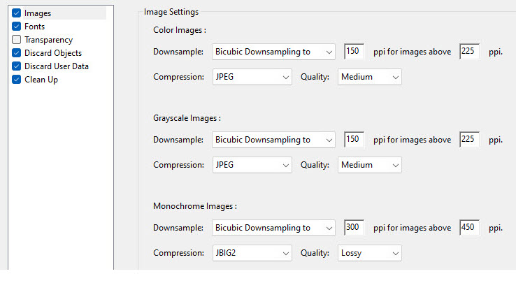
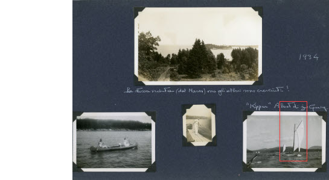
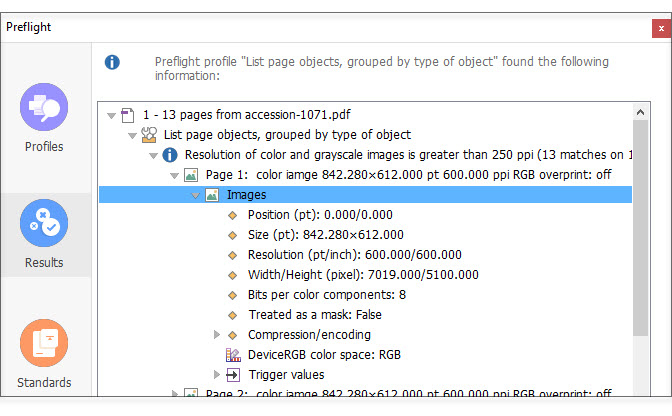

# Creating PDFs from scans

This section describes the best way to create a PDF file from files you create while [scanning](/archivist/scanning/#scanning).  
The *best* way is one that:

-   Preserves all of the information your scanner produced.
-   Provides sufficient quality for viewing in the Digital Archive.
-   Creates a PDF file that can be viewed by users who have slow or metered internet access.

## Rules for creating a right-sized PDF file
Here is a summary of the best way to create a PDF in most situations.

-   [Configure your scanner software to create TIFF files](/archivist/scanning/#choosing-the-output-file-location-type).
-   [Scan using the appropriate PPI](/archivist/scanning/#choosing-the-right-ppi-when-scanning-images).
-   Use a PDF program like [Adobe Acrobat Pro](https://www.adobe.com/acrobat/complete-pdf-solution.html)
    or [FoxIt PDF Editor](https://www.foxit.com/pdf-editor/) to:
    -   [Combine the TIFF files into a PDF file](#combining-scan-files-into-a-pdf-file).
    -   Create an [optimized copy of the PDF](#create-an-optimized-copy-of-the-pdf) that has a smaller file size than the original.
-   [OCR the optimized PDF](#ocr-optical-character-recognition)
-   [Attach the smaller PDF](/archivist/attach-file/#attach-an-image-or-pdf-to-an-item) to a Digital Archive item.
-   Move the TIFF files to your [archival storage](/archivist/best-practices/#archival-file-management) area.

The diagram below shows the steps above in graphic form.

By following the steps above, you'll produce a right-sized PDF for uploading to the Digital Archive and you'll also
have original high-resolution scans that can be used for close examination of the scanned materials or for making prints.

### Why the rules are important and when they can be broken

#### Rule: Create TIFF files from the scanner
You scan to TIFF files because TIFFs store all of the information produced by the scanner. If you scan to JPEG or to PDF,
fine image detail that might be important later for viewing or image post-production will be irreversibly lost.
This is because both JPG and PDF files use a compressed *lossy* format that throws data away to make files smaller.

An analogy for lossy compression would be like removing some of the goose down from a winter jacket so that you could squish it to be
small enough to fit inside your carry-on suitcase. When you unpack the jacket, the remaining down might fluff up enough that you won't
notice any difference in how the jacket looks, but in really cold weather, the jacket won't be as warm as it used to be. In contrast,
TIFF files use lossless compression which would be like squishing the jacket without removing any down, but if that wasn't enough,
you'd need to use a larger suitcase.

The exception to the TIFF rule is when the materials you are scanning do not need to be preserved with the highest quality possible.
Examples are type-written or typeset text where the words, not an image of the words, is what's most important. For letters,
books, and other textual material, you can scan the pages directly to a single PDF which is much faster than scanning to
individual TIFF files and then combining them into a PDF. Furthermore, you can scan at 300 PPI, possibly using grayscale instead
of color, to produce smaller files.

If you opt to create a PDF file directly from the scanner, you can still create an [optimized copy of the PDF](#create-an-optimized-copy-of-the-pdf)
that has a smaller file size than the original.

#### Rule: Optimize the PDF file created from the TIFF files   
You optimize a PDF to create a smaller *copy* while keeping the original PDF file which can be tens or hundreds of megabytes in size.
Using the winter jacket analogy, this
would be like having two identical winter jackets and removing goose down from one to take on your trip, but still having the other
to keep you warm on the coldest days. 

You can skip the PDF optimization step if the original PDF is of an [acceptable size for uploading to the Digital Archive](/archivist/best-practices/#uploading-files). This may be the case when there are not a lot of pages and the scans were done using a PPI of 400 or less.

## How PDF files store images

Before proceeding, it may help to understand how PDF files store images and why PDF files can get to be so large.
A PDF file is simply a container for text and images. This container does not store the original TIFF, or JPEG, or PNG images that go
into, but rather, it stores compressed versions of images in a lossy format like JPEG as was explained earlier. This makes the
size of the PDF smaller; however, after an image has been compressed and stored in the PDF, you cannot retrieve the original image
in its original form.

Using the analogy of the winter jacket squished to fit inside a suitcase, once you take some of the goose down out,
you can't put it back in again and the jacket will never be as warm again as it used to be. For images, this means you can never
retrieve the finest details that the scanner captured.

Image compression makes the PDF smaller, but it does not affect image *resolution* (to learn about resolution, see pages 52 - 61 of the 
[Scanning 101 workshop](Scanning-101-Workshot-by-George-Soules.pdf)). If the original image dimensions are 6000x4000 (high-resolution), the compressed image still has those same dimensions. However, even with compression, an image with large dimensions takes up more space in a PDF than
an image with lower resolution such as 1200x800. Thus, if you create a PDF from a lot of large images, like the TIFF files created by
a scanner, the PDF file size can become huge even after compression.

The only way to further reduce the size of a PDF containing high-resolution images is to downsize the images to have a resolution that
is lower, but still preserves enough detail so that the image looks good on a computer monitor. This is what happens when you optimize
a PDF as will be explained later.

## The importance of compression and resolution
A very important thing to understand about compression and resolution is that on a computer monitor, an uncompressed high-resolution
image will usually look the same as a compressed, lower-resolution image. They may even look nearly identical when zoomed in to 200%, but
at 400% the compressed, lower-resolution image might look soft because the fine details are missing.

If the original image was low quality,
such as a drugstore snapshot print, and didn't have that much detail to begin with, the visual difference between the two versions of the image
might be negligible. In contrast, the difference would be very noticeable for a detailed original such as an engraving or
postage stamp. The difference would also be noticeable if you printed the image on a photo printer. The original image may produce a nice
print whereas a print from a compressed, low-resolution image might look terrible.

To address these issues, create and save both the uncompressed high-resolution images (large TIFF files) and the compressed
lower-resolution images in a right-sized PDF. Use the large TIFF files for study or printing and use the smaller PDF for viewing on a computer
monitor via the Digital Archive.

## Using a PDF program to create and optimize a PDF file
The rules above for [creating a right-sized PDF file](#rules-for-creating-a-right-sized-pdf-file) include the two steps below.

-   Combine TIFF files into a PDF file
-   Create an optimized copy of the PDF

## Combine TIFF files into a PDF file
The easiest way to combine TIFF files into a PDF is to select all the files in Windows Explorer and then right-click
to bring up the menu item `Combine files in Acrobat` or `Combine files in Foxit`. On Windows 11 you may need to
first click on `Show more options` to get to the menu that shows the `Combine` option.

Once on the **_Combine Files_** dialog, you can click the **_Combine_** button to create the PDF. The PDF will open with a name like
`Binder.pdf` which you then Save As a file name you choose at a location where you want to store the file.

Acrobat provides an option on the **_Combine Files_** dialog to set the size of the PDF by choosing a small, medium, or large icon,
but during experimentation it had no effect.

That's all there is to it. You know have a large PDF that you can optimize to create a smaller PDF as explained in the next section.

## Create an optimized copy of the PDF
You create an optimized copy of a PDF by running the Acrobat or Foxit PDF optimizer and then doing a Save As to create a new file rather
than overwriting the original.

This section explains how to optimize a PDF file to make it smaller. These instructions are for Adobe Acrobat Pro or FoxIt PDF Editor.
If you are using other software, look to see if an optimization feature is available.

--- 

### Adobe Acrobat Pro

-   View the PDF to be optimized.
-   Choose **_File > Save as Other > Optimized PDF..._** from the menu

The screenshot below shows the options when **_Images_** is selected in the left menu.

Go to the [Optimization settings](#optimization-settings) section below.

---

### FoxIt PDF Editor

-   View the PDF to be optimized.
-   Choose **_File > Optimize PDF_** from the menu

The screenshot below shows the options when **_Compress Images_** is selected in the left menu.

Go to the [Optimization settings](#optimization-settings) section below.

---

### Optimization settings
The optimization settings for Acrobat and Foxit are nearly identical. The key options are:

- **_Downsample_**
- **_Compression_**

Downsampling reduces image resolution and compression make the downsized images
take up less space in the PDF file. The combination of the two settings makes the PDF file itself smaller.

#### Downsample options
Downsampling is the process of scaling an image down to smaller dimensions by discarding some of the image's
pixels using a downsampling algorithm. Here are guidelines for what options to choose.

- Choose `Bicubic Downsampling` for the downsampling algorithm.
- Type a ppi value in the first field and accept the value that appears in the second field.
- Choose a ppi that is between 1/2 and 1/4 of the resolution used for scanning.

As a guideline, cut the scanned resolution in half when the image quality is most important.
Cut it to a quarter when file size is most important, or experiment with in-between values.

#### Compression options

Compression makes an image take up less space in a file without changing the image's resolution.

- Choose `JPEG` for the type of compression.
- Choose `High` **_Quality_** when using Acrobat Pro.
- Choose `Medium` **_Quality_** when using Foxit.

Based on experiments, Acrobat produced good results with High quality, but not with Medium quality. Foxit results for High and Medium quality
were similar, but the resulting file size was much smaller with Medium. However, Acrobat created an even smaller file at High quality than
Foxit did with Medium.

#### More on downsampling and compression
Think of the ppi value that you specify in the first field of the **_Downsample_** option like this.
If you scanned an image at 600 ppi, typing 300 in the first field
would be equivalent to rescanning the image at 300 ppi and the result would be in an image that had
only 25% of the original pixels (because doubling the ppi quadruples image size and therefore halving
it reduces the size by 75%). Setting the ppi to 150 would result in an image that had only 4% of the
original pixels. The same percentage reductions would apply if the image was scanned at 400 ppi and you typed
200 or 100 in the first field.

The screenshot below shows one of 13 scans from a photo album having pages 11.7" x 8.5" pages. The
red rectangle shows the part of the page that is shown in the next set of screenshots.

The screenshots below shows a part of the photo album page above zoomed to 200% on a computer monitor.
The page was scanned at 600 ppi and then converted to a PDF. The image at left is from the PDF
before it was optimized. The other two images are from versions of the PDF optimized at 300 ppi and 150 ppi.
The files sizes (106 MB, 17 MB, and 6 MB) are for the PDF files containing all 13 pages of the album.

In comparing the three images above, notice how the hand-written text above the image is sharp at 600 ppi
and 300 ppi, but is a little soft at 150 ppi. However, the sailboats look almost the same in all three images.
That's because the print itself did not contain much fine detail to begin with.

You can see more examples of downsampling in the [PPI decision tree](Scanner-PPI-Decision-Tree-by-George-Soules.pdf)
document on pages 3 and 4.

## OCR (optical character recognition)
Use OCR to make a PDF searchable both in the Digital Archive and while viewing the PDF. Only perform this step if the PDF contains
type-written or typeset text that you want people to be able to search using the Digital Archive.
OCR may not work on hand-written or highly-stylized text.

OCR adds searchable text internally within the PDF file, but the increase in file size is negligible.

Occasionally, the OCR process will cause some pages in the PDF to become skewed. You either have to live with it or remove
and add back those pages, which will then no longer be searchable.

### OCR with Adobe Acrobat Pro

-   View the PDF to be optimized.
-   Choose the **_Scan & OCR_** tool.
-   On the **_Scan & OCR_** tool page:
    -   Choose **_Recognize Text > In the file_**.
    -   Click the **_Recognize Text_** button.
-   Save the file.

---

### OCR with FoxIt PDF Editor
When you use Foxit to open a PDF that has not been processed for text recognition, a dialog will automatically appear with a link that says
`Recognize Text`. Click the link to start the OCR process. If the dialog is not displayed, you can initiate OCR by clicking
the **_Quick OCR_** button on the **_Home_** tab. When the process completes, save the file.

## PDF image analysis
For people who really want to understand what's going on with the images inside a PDF file, both Acrobat and Foxit provide a tool
called Preflight. This is optional reading for inquiring minds.

To access the Preflight tool:

-   **Acrobat**: From the **_Tools_** page choose **_Print Production > Preflight_**
-   **Foxit**:  From the **_Convert_** tab choose **_Preflight_**

Here's how to learn about the images in a PDF file (there are many other things you can learn too).

On the **_Preflight_** dialog:

-   Select the **_Profiles_** section (left menu in Foxit as shown below, upper tabs in Acrobat)
-   Expand **_PDF analysis_**
-   Click on **_List page objects, grouped by type of object_**
-   Click the **_Analyze_** button

The **_Results_** section is automatically selected. In the **_Results_** section:

-   Expand **_Resolution of color and grayscale images ..._** 
-   Expand Page 1 (or another page)
-   Expand **_Images_**

The image data is shown in the screenshot below. The image is  a scan of a photo album page that is 11.7" wide. The data shows that the image
dimensions are 7019 px x 5200 px and that the resolution is 600 ppi. Doing the math tells us that this image will display at 11.7" wide
because 7019 px / 600 ppi = 11.7".

If you were to optimize the PDF by reducing the resolution to 300 ppi, the data would change to look as shown below. Cutting the resolution
in half (from 600 to 300) had a corresponding affect on the dimensions which are now 3510 px x 2550 px. Doing the math tells us that this
image will also display at 11.7" wide because 3510 px / 300 ppi = 11.7".

The data above confirms that the reduction in resolution from 600 to 300 had the desired affect within the PDF. More importantly,
in this example, the size of the PDF file was reduced from 106 MB to 53 MB using High quality compression. The file size is 28 MB using
Medium quality compression, and 13 MB using Low quality compression.

## Alternate approach for creating a right-sized PDF
This last section describes an alternate approach that is not recommended but is explained in case you come up with this idea and
then don't get the result you expect.

The alternate approach is to first create right-sized JPEG files from the scanner's TIFFs and then combine the JPEGs into
a right-sized PDF. In other words, compress and downsize the TIFFs yourself instead of optimizing a large PDF.

This approach eliminates the step of optimizing the PDF, but adds the step of converting and compressing the TIFFs into JPEGs.
It also requires that you calculate and set the correct resolution for the JPEG files before combining them into the PDF.
You need to use a program like Photoshop or IrfanView to set the resolution.
If you don't reset the resolution correctly, the PDF page may look tiny and have to be zoomed in a lot, perhaps 500% or more, to be readable.

The PDF looks tiny because PDF viewers
like Acrobat display images based on their resolution, e.g. 600 ppi, not on their resolution dimensions e.g. 6000 px x 4000 px.
If you reduce and convert that large image to 1200 px x 800 px and display it with the resolution set to  
600 ppi, the image will display ("print") on the screen at only 2" wide (1200 px / 600 ppi = 2").  
You would need to change the resolution to 150 ppi for the image to display at 8" wide (1200 px / 150 ppi = 8").

This approach is not recommended because of the extra steps involved and also because you'll end up with a bunch of small JPEG files that you don't need
after the PDF has been created.

