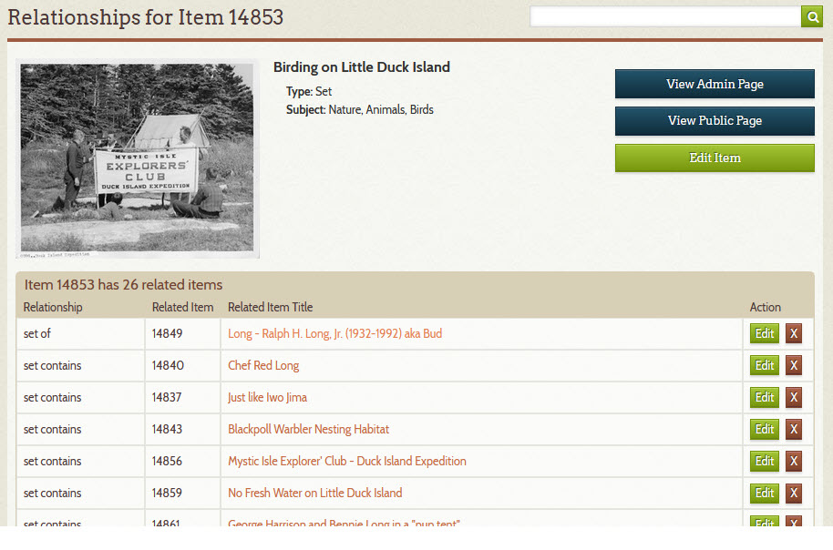
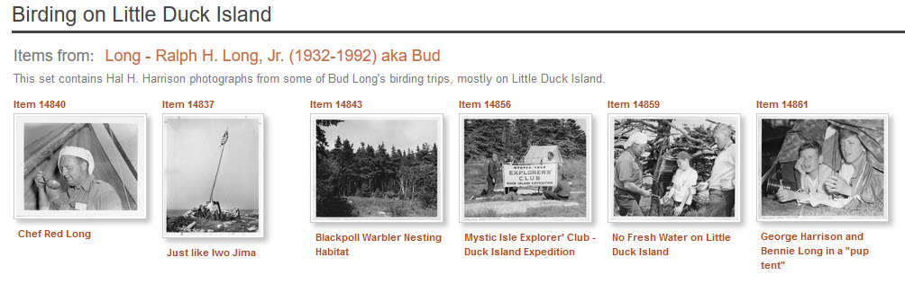

# Create an Item Set

This page explains how to create an item set. [Learn about item sets](/relationships/kinds-of-relationships/#item-sets).

The steps for creating an item set are nearly the same as for
[adding relationships to an item](/archivist/add-relationship/) and so only the differences
are expanded upon here.

1 &ndash; Clear your Recent Items list
:   -   Go to the [**_Recently Viewed Items_**](/user/recently-viewed/#recently-viewed-items-page) page
    -   Click the **_Clear all_** link

2 &ndash; Create an Item Set item 
:   -   Follow the steps to [add a new item](/archivist/items/#add-a-new-item)
    -   Choose `Set` from the **_Type_** field's dropdown list
    -   Choose an appropriate Subject

3 &ndash; Find and flag items that will go into the item set
:   -   [Search](/user/how-to-search/) your Digital Archive for items you want to put in the set
    -   View each item *or*
    -   [Flag each item](/user/recently-viewed/#flagging-items-to-view-later)

4 &ndash; Go to the **_Recently Viewed Items_** page
:   -   Go to the [**_Recently Viewed Items_**](/user/recently-viewed/#recently-viewed-items-page) page
    -   Click the **_Relationships_** link on the item set item created in step 1 above

5 &ndash; Add the items to the set
:   -   On the **_Relationships Editor_** page, choose the *set contains* relationship from the dropdown list
    -   Click the **_Add_** button for each of the items in the recently viewed items list

6 &ndash; Relate the item set to another Reference Item (optional)
:   If you will use the item set to
    [divide a large subject into smaller parts](/relationships/kinds-of-relationships/#dividing-a-large-subject-into-smaller-parts),
    add a *set of* relationship from the item set to the parent item as shown in the screenshot above where item set 14853
    is a *set of* item 14849. When viewed, the item set will look like the screenshot below.

---

