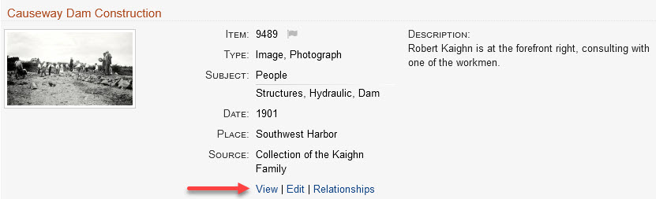

# Working with Items

This page provides step by step instructions for how to:

-   [View an item](#view-an-item) using the admin interface
-   [Add a new item](#add-a-new-item)
-   [Edit an existing item](#edit-an-item)
-   [Duplicate an item](#duplicate-an-item)
-   [Delete an item](#delete-an-item)

You might also be interested in how to:

-   [Attach an image or PDF to an item](/archivist/attach-file/)
-   [Add a relationship to an item](/archivist/add-relationship/)

## View an item

Most of the time you'll [view items using the public interface](/user/viewing-items),
but sometimes you'll need to use the admin interface to access
[features that are only available to archivists](#admin-item-page-features).

#### Get to the admin item page

You can get to an item's admin page from four places.

Public item page
:   When on an item's public page, you can view (or edit) the item in the
    admin interface with one click using the quick access links that display after the
    last metadata item (red arrow below). These links are only visible to archivists
    and administrators. You must be logged in to see them.
    
      

Search results
:   The quick links also appear when viewing search results (red arrow below).

      

Recently Viewed Items page
:   The quick links also appear on the **_Recently Viewed Items_** page.

      

Dashboard page
:   When on the [**_Dashboard_**](/archivist/logging-in/#avant-dashboard) page,
    you can view a recently added or modified item in the admin interface by
    clicking the item's title. You can edit the item by clicking its **_Edit_** link.

#### Admin item page features

A screenshot of the admin page for item 9489 appears below.

The admin page has these features:

-   Buttons you can click to:
    -   [Edit the item](#edit-an-item)
    -   [Add relationships to the item](/archivist/add-relationship/)
    -   [Delete the item](#delete-an-item)
    -   [Add a new item](#add-a-new-item)
    -   [View the item's public page](/user/viewing-items/)
    -   [Duplicate the item](#duplicate-an-item)

-   A history of:
    -   Who created the item (`crm`)
    -   Who has since worked on the item (`gsoules` and `esantavicca`)

-   When [AvantS3](/plugins/avants3) is installed, an S3 link appears next to the item's
    **_Identifier_**. The link provides one-click access to the item's archival assets on
    your Amazon AWS S3 server.    

---

## Add a new item

Follow the steps below to add a new item.

1 &ndash; Go to the **_Add an Item_** page

:    There are two ways to get to the **_Add an Item_** page:

      - If **_Add item_** appears in the black menu bar at the top of the page, click that link, *or*
      - Click **_Dashboard_** in the left admin menu, then click the blue **_Add a new item_** button

:   You will see a page similar to the screenshot below.

2 &ndash; Fill in the required fields

:   Most Digital Archive sites require you to fill in the following fields:

    - **_Title_**
    - **_Type_**
    - **_Subject_**

    [Learn about best practices](/archivist/best-practices/) for choosing titles and subjects.

    Notes:

    - Which fields are required is determined by the [administrator](/administrator/getting-started-administrator).
    - The **_Identifier_** is filled in automatically for you - do not change it.
    - Use the **_Add Input_** buttons to add additional fields as needed.

3 &ndash; Fill in optional fields

:   Fill in any additional fields that you have information for.

    For tips on filling in fields, see the next section on how to [edit an item](#edit-an-item).

4 &ndash; Choose to make the item public or private
:   Check the **_Public_** box  under the menu on the right to make the item public,
    or leave it  unchecked to keep it private and viewable only by archivists and administrators.  
    To learn about public and non-public items, see the section on
    [what gets searched](/archivist/what-gets-searched/).

5 &ndash; Click the **_Add Item_** button
:   When you click the **_Add Item_** button, your item will be added to the Digital Archive.

    If you leave any required fields blank and click **_Add Item_**,
    red error messages will appear at the top of the page as shown below. Provide the missing information and try again.

    

    [Learn about when a **_Subject_** is and is not required](/developer/common-vocabulary-translator/#common-vocabulary-type-and-subject).

6 &ndash; Review the new item
:   After you add the item, you will be on the [admin item page](#admin-item-page-features).

    Verify that the information you entered is accurate and complete. To learn how to  
    change or add information, see the next section on how  to edit an item.

---

## Edit an Item

Follow the steps below to edit an item.

1 &ndash; Go to the **_Edit Item_** page
:   See the instructions above for [how to get to the admin item page](#get-to-the-admin-item-page).
    Those instructions will tell you all the ways that you can get to the **_Edit Item_** page with one click.

    A screen shot for the **_Edit Item_** page is shown below.

    

2 &ndash; Make your changes
:   Edit any of the fields on the page that you want to change.

    [Learn about best practices](/archivist/best-practices/) for choosing titles and subjects.

    **Tip #1**: Quickly find vocabulary terms in the **_Type_**, **_Subject_**,
    and **_Place_** dropdown lists by typing into the search box that appears when you
    click on the field's dropdown. In the screenshot below, typing `neg` displayed
    three choices containing the word `Negative`. Click on a choice to select it.

    

    **Tip #2**: If the term you are looking for does not appear in a field's dropdown list,
    you can use the [Vocabulary Editor](/archivist/vocabulary-editor/)
    to add the term to your site's vocabulary for that field. The new term will show up in the
    list the next time you go to the **_Edit Item_** page.

    **Tip #3**: Type into the **_Creator_** field to get suggestions
    based on the names of creators in other items. In the example below, typing
    `rand` in the **_Creator_** field brought up four suggestions that were found in
    the **_Creator_** field of other items.  Click on a choice to select it. This
    suggestion features works for other fields too, but they must be configured in the
    [**_Suggest_** option](/plugins/avantelements/#suggest-option)
    of the AvantElements configuration page.

    

3 &ndash; Click the **_Save Changes_** button
:   When you click the **_Save Changes_** button, your item will be updated in the Digital Archive.

    If you leave any required fields blank and click **_Save Changes_**,
    red error messages appear at the top of the page as shown below. Provide the missing information and try again.

    

    [Learn about when a **_Subject_** is and is not required](/developer/common-vocabulary-translator/#common-vocabulary-type-and-subject).

---

## Duplicate an Item

You can duplicate an existing item to save time when you need to add multiple
new items that will have the same metadata in most, but not all fields.
The duplicate feature will copy the metadata from an existing item into
the fields of a new item, but **it will not copy**:

-   The **_Identifier_**
-   Attached images or PDF files
-   Relationships
-   Tags

Follow the steps below to duplicate an existing item.

1 &ndash; View the item you want to duplicate
:   Before you can duplicate an item, you have to first view the item using the
    admin interface. See the instructions above for how to [view an item](#view-an-item).

2 &ndash; Click the **_Duplicate This Item_** button
:   On the item's admin page, click the **_Duplicate This Item_** button.
    After you click the button, the **_Add an Item_** page will display as if you
    were [adding a new item](#add-a-new-item), but most of
    the fields will be filled in with the values from the item being duplicated.

    The text `--- DUPLICATE ---` will be inserted as the first line of the **_Title_** field
    so you know that you are working on a duplicated item. Delete that text.

    The **__Identifier__** field will be blank. Don't type anything there because an **__Identifier__**
    will get assigned automatically when you save the duplicate by clicking the **_Add Item_**. 

    

3 &ndash; Make changes
:   Edit any of the fields on the page that you want to change so that the duplicated
    item is different than the original.

4 &ndash; Click the **_Add Item_** button
:   When you click the **_Add Item_** button, the duplicate item will be added to the Digital Archive.

    To create more duplicates, you can either duplicate the original item again, or
    duplicate the item that you just created.

---

## Delete an Item

Follow the steps below to delete an item.

1 &ndash; View the item you want to delete
:   Before you can delete an item, you have to first view the item using the
    admin interface. See the instructions above for to [view an item](#view-an-item).

    **Proceed to step 2 below** *unless* the item has S3 files associated with it.

    You'll know if the item has S3 files, because instead of seeing the red **_Delete This Item_**
    button, you'll see a faded, disabled button that says something like `Has 3 files - Cannot Delete`.
    If you see the red **_Delete This Item_**, it's okay to proceed to step 2.

    Before you can delete an item that has S3 files associated with it, even if they are not
    attached to the item, you must first remove all of the files from S3. This ensures that
    those files don't get orphaned when the item goes away. If it doesn't seem right to delete
    the files, then reconsider if the item should be deleted.

    To delete the S3 files, click the S3 link to view the item's files on AWS. On AWS, select all of the
    files and then choose **_Delete_** from the **_Actions_** menu.

    Return to the admin **_Item_** page and refresh your browser to cause the Digital Archive to check
    again for S3 files. The red **_Delete This Item_** should appear and you can proceed to step 2.

2 &ndash; Click the **_Delete This Item_** button
:   On the item's admin page, click the **_Delete This Item_** button. When you click the button,
    a warning dialog will pop up asking if you are sure you want to delete the item. Click the
    **_Delete_** button on the popup dialog.

!!! warning
    When you delete an item, it will be *permanently* removed from your Digital Archive.  
    **A deleted item cannot be recovered.**

