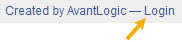
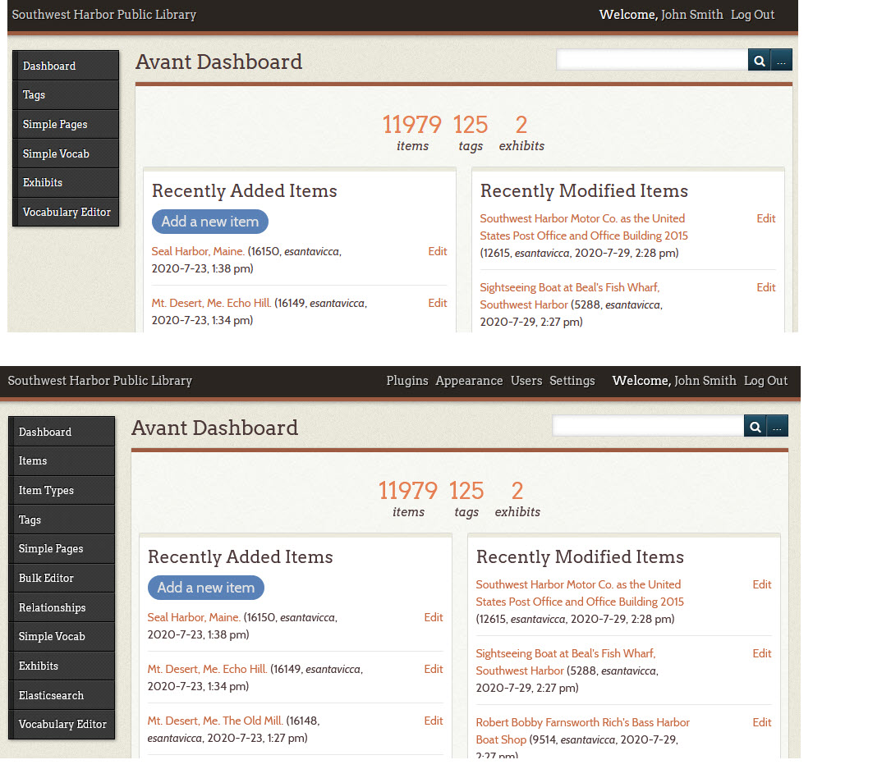

# Logging into the Digital Archive

*Archivists* and *Administrators* must login to the Digital Archive to add or edit
items or make modifications to the installation. There is also a special class of
*User* called [*Guest*](/administrator/add-new-user/#guest-user) that can login to see information that is not
available to the general public, but they cannot add or edit items.

[Learn about different kinds of users](/administrator/add-new-user/#kinds-of-users).

## How to login

Follow these steps to login to the Digital Archive:

1 &ndash; Click the login link
:   Go to the site and click the `Login` link located at the lower right on every page

    

2 &ndash; Enter your user name and password
:   On the `Login` page, enter your user name and password. When you log in as an *Archivist* or
    *Administrator*, a dark gray menu bar will appear at the top of the page.

    See [best practices for login credentials](/archivist/best-practices/#login-credentials).

3 &ndash; Access admin features 

:       

    Click your name in the dark gray menu bar to get to the **_Avant Dashboard_** page.
    From the dashboard you can get to all *backend* features, that is, features that
    only logged in users have access to.

## Avant Dashboard

The **_Avant Dashboard_** page shows you the items you have recently added and recently modified.
The dashboard's top and left admin menus provide access to a number of features that archivists and
administrators use. When logged in as an archivist you see fewer features
(first screenshot below) than when logged in as an administrator (second screenshot below).

!!! Note "Tip"
    To get back to the public Digital Archive interface, but still stay logged in,
    click the name of your organization at the top left of the dashboard. In the
    screenshots above, the organization name is "Southwest Harbor Public Library."
    While using the public interface, you'll know you are logged in because the dark
    gray menu bar will appear at the top of every page. You can get back to the
    dashboard at any time by clicking your name in the top menu bar.
