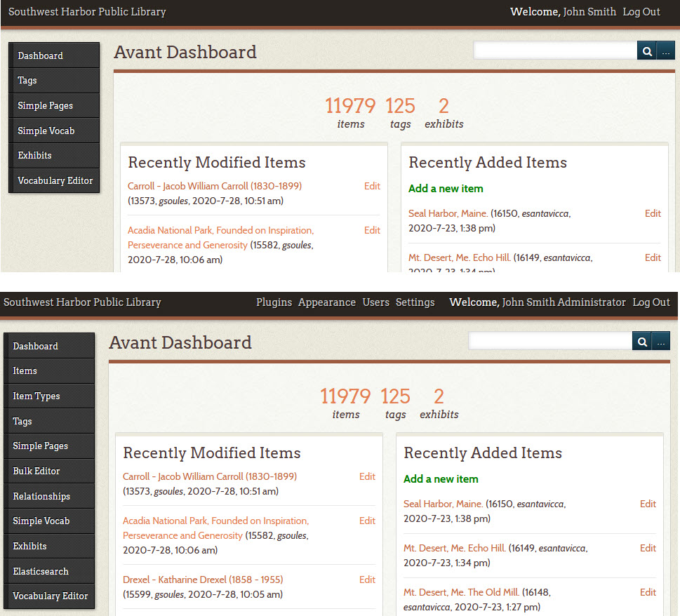

# Logging into the Digital Archive

*Archivists* and *Administrators* must login to the Digital Archive to add or edit items or make modifications to the installation. There is also a special class of *User* called *Guest* that must login if they want to see information that is not available to the general public.

## How to login

Follow these steps to login to the Digital Archive:

Click the login link
:   Go to the site and click the `Login` link located at the lower right on every page

    

Enter your user name and password
:   On the `Login` page, enter your user name and password. If you logged is as an *Archivist* or
    *Administrator*, a dark gray menu bar will appear at the top of the page.

        

Access admin features 

:   Click your name in the dark menu bar to get to the _**Avant Dashboard**_ page.
    From the dashboard you can get to all *backend* features, that is, features that
    only logged in users have access to.

## Avant Dashboard

_**Avant Dashboard**_ page shows you the items you have recently modified and added.
Its top and left **_admin menus_** provide access to a number of features that archivists and
administrators use. When logged in as an archivist you see fewer features
(first screenshot below) than when logged in as an administrator (second screenshot below).

!!! Note "Tip"
    To get back to the public Digital Archive interface, but still stay logged in,
    click the name of your organization at the top left of the dashboard. In the
    screenshots above, the organization name is "Southwest Harbor Public Library."
    While using the public interface, you'll know you are logged in because the dark
    gray menu bar will appear at the top of every page. You can get back to the
    dashboard at any time by clicking your name in the top menu bar.

## Kinds of users

The terminololgy for users in this documentation differs from
[Omeka terminology for user roles](https://omeka.org/classic/docs/Admin/Users/).  
The table below shows the differences.

Digital Archive term | Omeka user role
---:|:---
Guest|researcher
Archivist|admin *or* contributor
Administrator|super

When logged is as a *Guest* you will not see the dark gray menu bar; however you will be able to views items
that are not visible to users who are not logged in. You will also be able to see the private fields
for all items.