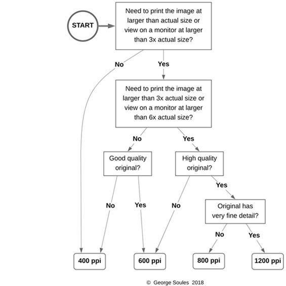
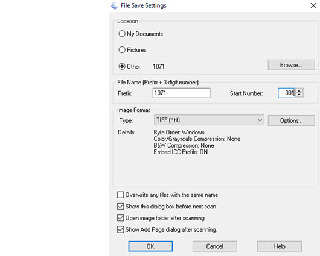

# Scanning

Scanning presents one of the biggest challenges for archivists. The best way to get comfortable with scanning is to
understand what all the different options mean and how to choose the right ones. All of that is covered in the
[Scanning 101 workshop](Scanning-101-Workshot-by-George-Soules.pdf).

### Choosing the right PPI when scanning images.

The diagram below will help you quickly determine what PPI to use to scan an image. For type-written and
typeset *documents*, you can generally use 300 ppi, but for *images*, the choice depends on the
quality of the original and what you intend to do with the scan.

[Read the full explanation of the diagram above](Scanner-PPI-Decision-Tree-by-George-Soules.pdf) and see examples
of the differences between scans made at different resolutions.

## How PPI and color affect file size

-   An image that is scanned at 600 ppi will produce a file that is 4 times the size as one scanned at 300 ppi.
    That's right, four times larger, not two times. Think about it this way. If your kitchen floor has tiles
    that are 12" squares, each tile occupies 1 square foot. But if they were 24" squares, they would each occupy 4
    square feet.
-   A resolution of 300 ppi is plenty for letter-size documents that are primarily text. And unless the
    documents contain color, they can be scanned using 8-bit Grayscale. An exception would be, for example, a type-written
    page that had been written or doodled on using a colored pen, or if the page contained a color image.
    A resolution of 300 ppi is also fine for OCR (optical character recognition) purposes.
-   An image scanned as 24-bit color, will produce a file that is 3 times the size as the same image scanned as 8-bit Grayscale.
    That's because 24 bits is 3 times as many bits as 8 bits. Similarly, the file for an image scanned as 16-bit Grayscale
    will be 2/3 the size of the file for the same image scanned as 24-bit color.

## Typical scanner settings

The most common settings for scanning a color image using the Epson scanner software are shown in the screenshot below.
The biggest variable is the **_Resolution_** setting which can range from 300 ppi to 1200 ppi depending on what you are scanning.
You'll also change the **_Image Type_** from color to grayscale when scanning black & white documents or images.
Don't change the **_Document Size_** because it's set automatically to the scanner table size or to the size
of the marquee you choose on the **_Preview_** screen. 

### Choosing the output file location type

To set the location and type of the output file produced by the scanner:

-   Click the **_File Save Settings_** button next to the **_Scan_** button (looks like a folder and a photo).
-   On the **_File Save Settings_** dialog shown below:
    -   Choose `Other` for the **_Location_**.
    -   Browse to the folder where you want to save the scans.
    -   Set **_Image Format_** to `TIFF` or to `PDF` (never choose any of the other options).  
        Learn about [creating PDFs from scans](/archivist/creating-pdfs/) to choose the right image format option.
    -   Click the **_OK_** button.

## Performing the actual scan using the Epson Scan software
Follow these steps to scan an image or document that you have placed on the scanner table.

-   Click the **_Preview_** button.
-   The scanner will quickly scan the entire scanner table and display the **_Preview_** screen.
-   On the **_Preview_** screen:
    -   If the preview is not rotated correctly, correct it using the rotate left or right buttons.
    -   Move the mouse over the preview area. The cursor will change to a large plus (+).
    -   Click the mouse at the upper-left corner of the item to be scanned and drag to the lower-right corner.
    -   When you release the mouse, a dashed rectangle will delimit the area to be scanned.
    -   Adjust the scan area if necessary by moving the cursor over the rectangle until the cursor changes to a double-headed arrow,
        then click-drag to adjust.
-   On the main EPSON Scan dialog, click the **_Scan_** button.
-   The scanner will operate, and when finished, it will create a file.

When scanning several items that all the same size, you only need to perform the preview step for the first item.
After that, you can put the next item in the same place on the scanner table and the just click the **_Scan_** button.

## Scanning multiple items at the same time
You can save a lot of time when scanning small items, such as snapshot-sized photos, by placing multiple items on the
scanner table and scanning each of them in a single operation. When you follow the steps below, the scanner will scan
each item one at a time, which takes time for each scan, but you will spend less time opening the scanner lid, placing
items, closing the lid etc.

-   Click the **_Preview_** button.
-   On the **_Preview_** screen:
    -   Perform the same operation described above to draw a marquee around the first item.
    -   Release the mouse button, move to the upper-left corner of the next item, and click-drag a marquee around it.
        The dashed rectangle on the first marquee turns to a solid rectangle.
    -   Repeat for each item.
    -   When done drawing all the marquees, click the **_All_** button. Dashed rectangles will appear
        for all of the marquees as shown in the screenshot below. If you don't click the button, only the selected marquee gets scanned.
-   On the main EPSON Scan dialog, click the **_Scan_** button.
-   The scanner will scan the area delimited by each marquee, one at a time, and create a separate file for each marquee.

There are buttons in the **_Marquee_** section of the **_Preview_** screen that you can use when drawing
marquees, but just following the steps above will be quickest and easiest most of the time.

## Preview tips
-   Drag the **_Preview_** screen window to make the preview area larger.
-   Use the **_Zoom_** button to zoom in on just the area delimited by one marquee. Do this when you need to make a more precise selection.
-   Use the **_Delete_** key to delete the currently selected marquee(s).
-   Move a marquee by click-dragging inside (the mouse turns to a hand).
-   If you are selecting multiple items that all are the same size, you can draw the marquee for one and then click
    the **_Copies the selected marquee_** button to duplicate the marquee and drag it over another item. The button looks
    like two overlapping squares.

--- 

Learn about [creating a PDF file](/archivist/creating-pdfs/) from your scans.    

---
