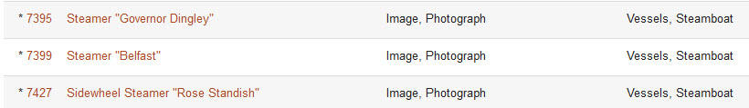
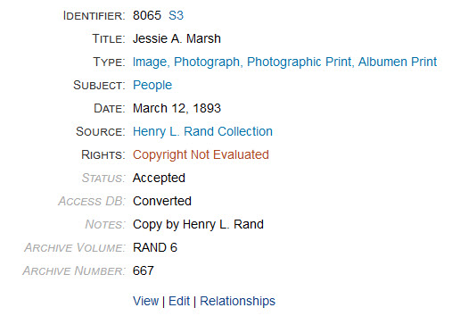
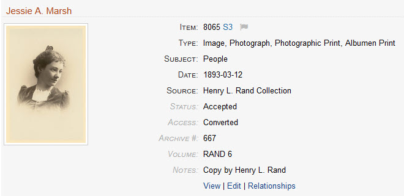
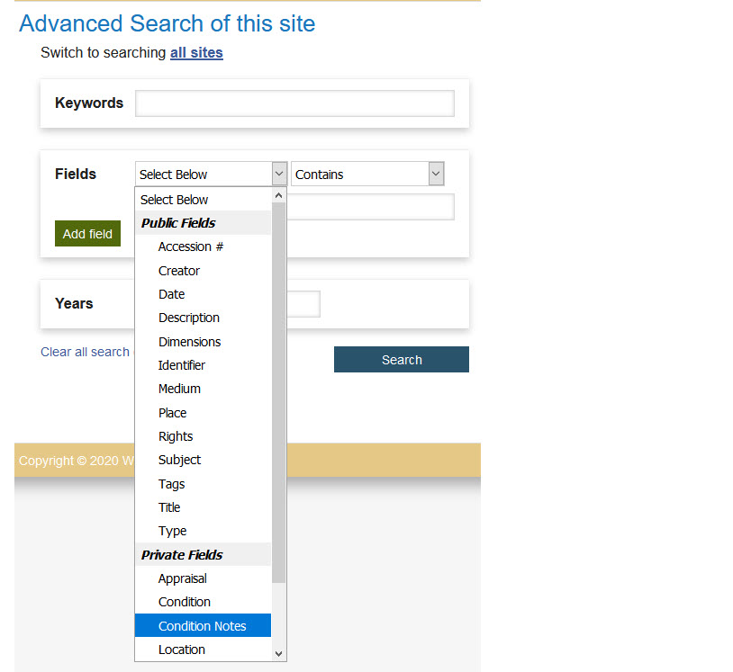
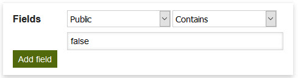
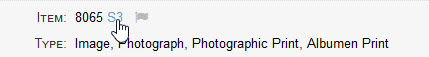
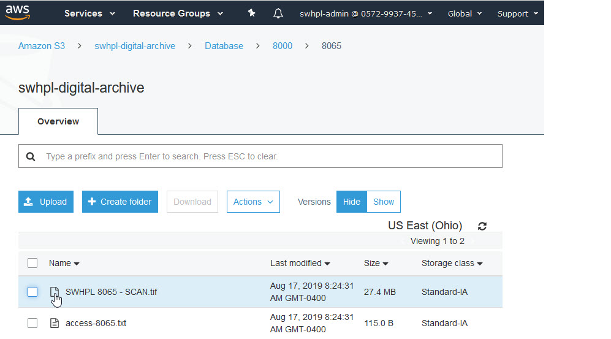

# Special Features for Archivists

An archivist has access to data and features that a public user (not logged in) cannot see.

An archivist can see:

-   [Non-public items](#non-public-items)
-   [Private metadata fields](#private-metadata-fields)
-   [Quick access links](#quick-access-links) to often used admin pages
-   [Private fields](#private-fields-in-advanced-search) on the Advanced Search page
-   [An S3 link](#s3-link-to-an-items-archival-assets) to an item's archival assets
-   [A menu bar](#admin-menu-bar) used to access admin pages

The following sections describe each of these features.     

## Non-public items

An archivist can see non-public items, that is, items that have their **_Public_** 
checkbox unchecked on the 
[**_Add Item_**](/archivist/items/#add-a-new-item) or [**_Edit Item _**](/archivist/items/#edit-an-item) 
page. In search results, non-public items have an asterisk next to their **_Identifier_** as 
shown below. This is just a convenience to make you aware that an item is non-public.

## Private metadata fields

An archivist can see an item's private fields when viewing the item's public page.
The first screenshot below shows the metadata portion of an item page.
The fields that appear in gray italics are private &ndash; public users cannot see them.
Private fields also appear the same way in search results in
[**_Table View_**](/user/viewing-search-results/#table-view) with Details layout
as shown in the second screenshot.

Item page showing private fields

Search results showing private fields

## Quick access links

Links to let you quickly work with an item appear on both the item pages and in search results in
[**_Table View_**](/user/viewing-search-results/#table-view) with Details layout.
These links are shown below and in the two screenshots above.

Clicking a link takes you directly to the corresponding admin page so that you 
can instantly view or edit the item, or work with its relationships.

## Private fields in Advanced Search

As archivist can use the [**_Advanced Search_**](/user/how-to-search/#advanced-search) page
to search both public and private metadata fields. Public users only see public fields
in the **_Fields_** dropdown list, but for archivists, the list is divided into two groups
named *Public Fields* and *Private Fields* as shown in the screenshot below.

!!! note ""
    The private fields only appear in the dropdown list when you are searching your
    organization's site. If you are searching `All Sites`, you will only see the public
    fields. Notice in the screenshot above, the title says "Advanced Search of this site".
    The private fields won't appear when the title says "Advanced search of all sites".

##### Using Advanced Search to find non-public items

One of the fields in the *Private Fields* group is named **_Public_** (not shown in the screenshot).
You can use that field to restrict search results to either public or non-public items. To find
only non-public items, set the search value to `false` as shown below. Set it to `true` to find only
public items.

## S3 link to an item's archival assets

When [AvantS3](/plugins/avants3) is installed, an S3 link appears next to an item's
**_Identifier_**. Click the link to go directly to the item's archival assets on
your Amazon AWS S3 server.

On the AWS site, you can click on an asset to download it. In the example below,
the asset is the original 27.4 MB scan corresponding to the web-sized Digital
Archive image for item 8065.
  

## Admin menu bar

When an archivist is logged in, a dark gray menu bar appears at the top of each page.
When viewing a public page, you can click your name in the menu bar to get to the
[Avant Dashboard](/archivist/logging-in/#avant-dashboard) admin page.

