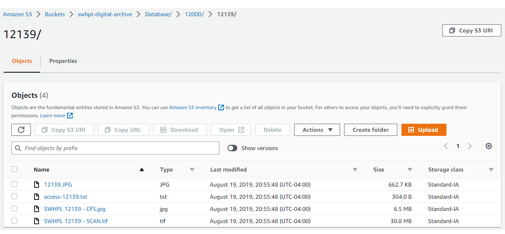
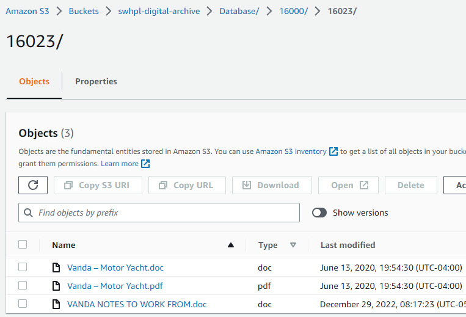
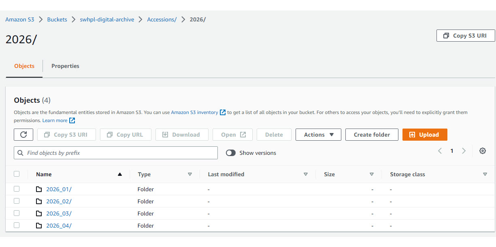
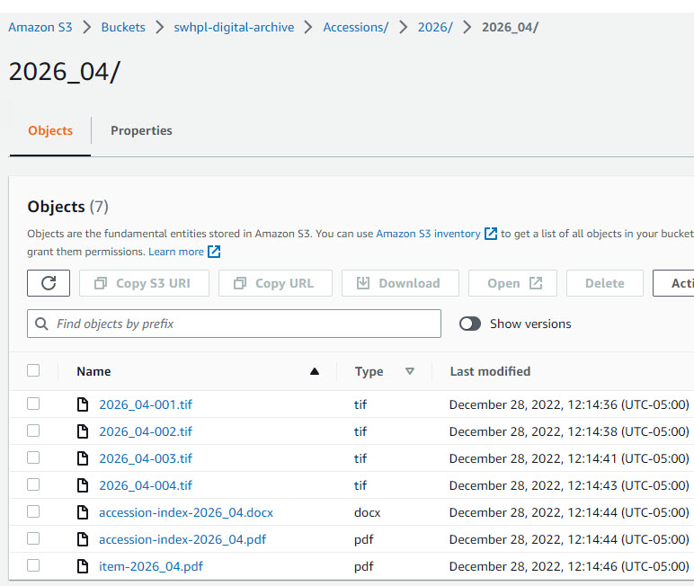
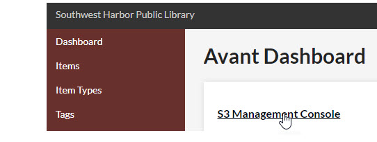
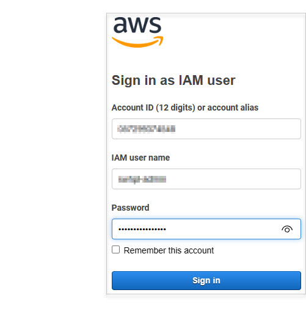
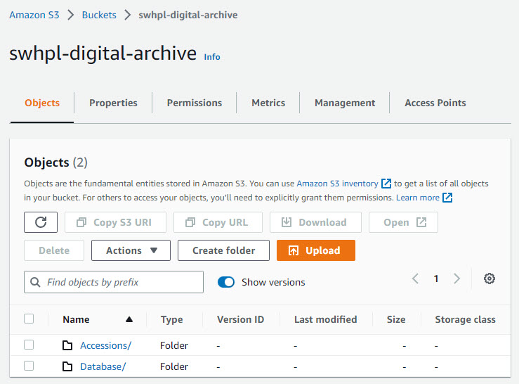

# Using S3
This section explains how the Southwest Harbor Public Library (SWHPL) uses
[Amazon Simple Storage Service (S3)](https://aws.amazon.com/s3/?p=ft&c=st&z=3)
to store its archival digital files in the cloud. The information should be generally applicable to any
site that wants to use S3 with their Digital Archive.

!!! Note ""
    To use S3, you must enable the [AvantS3](/plugins/avants3/) plugin which integrates S3 with the Digital Archive.

While S3 is not as straightforward or as easy to use as other cloud storage services like Google Drive or Dropbox, it is a fast, safe,
economical, and powerful alternative. Most importantly, it is fully integrated with the Digital Archive thanks to the AvantS3 plugin.

S3 is not a traditional folder-oriented hierarchical file system like you are familiar with on a PC or a Mac. S3 storage is implemented
using things called buckets, objects, and prefixes, but fortunately these can be thought of and viewed using familiar terms like folders, subfolders,
and files.

SWHPL's S3 bucket is named `swhpl-digital-archive` and is divided into two top-level folders:

-   **Items Storage folder**
-   **Accessions Storage folder**

## Items Storage folder
The Items Storage folder `swhpl-digital-archive > Database` stores files that are associated with individual items in the Digital Archive database.
All files for a single item are kept together in a subfolder that has the same name as the item's identifier number.
For example, the files for item `12139` are stored in a folder named `12139`.

At the top level of the Items Storage folder are 16 grouping subfolders named `1000`, `2000`, up to `16000`. Each of these folders
can contain up to 1,000 subfolders for individual items. For example, folder `12000` contains folders for items `12000`,
`12001`, `12002` and so on. The grouping folders make it easy to find an item's folder. If you are looking for the files
for item `12139` you first go to the `12000` grouping folder and then look for `12139`.

The screenshot below shows the files for item `12139` which is a photograph.

Here is an explanation of the four files associated with item `12139`:

-   `12139.jpg` is a web-sized copy of the photograph downsized from `SWHPL-12139-CFS.jpg`.
-   `access-12139.txt` contains information about the item from the Microsoft Access database.
-   `SWHPL-12139-CFS.jpg` is a high-resolution, post-processed copy of `SWHPL-12139-SCAN.tif`.  
    CFS stands for Cleaned For Study which means that the images may have been cropped, straightened,
    retouched, or had adjustments such as contrast improvement.
-   `SWHPL-12139-SCAN.tif` is the large scanner file, 30.8 MB, whereas the other files are smaller.

Other items may have more or fewer files, but this example is typical. Each file serves a purpose:

-   Use `12139.jpg` as the web-size image for the Digital Archive.
-   To see the original scan (archival image), view `SWHPL-12139-SCAN.tif`.
-   To make a print or provide someone with a high-resolution file, use `SWHPL-12139-CFS.jpg`.
-   The original metadata for the item is preserved in `access-12139.txt`.

The next example is for [Reference Item](/relationships/reference-items/) `16023`. The files for a Reference Items
usually include a Word document (called a reference sheet) used to record and format the information, and a PDF
version of the Word document for use in the Digital Archive. There may be other files as well such as related
research materials like the notes-to-work-from document in the example below.

Keeping the original Word document together with the PDF makes it easy for an archivist to update the Reference Item
if necessary. They update the Word document, create a new PDF, upload both files to S3, and then replace the item's
old PDF with the updated PDF.

## Accessions Storage folder
The Accessions Storage folder `swhpl-digital-archive > Accessions` stores files that belong to an accession or sub-accession. At the top level of the Accessions Storage folder are
subfolders having a four-digit number that matches as accession number for a *primary* accession in the [Accessions table](#accessions-table). If an accession has sub-accessions, folders for the sub-accessions are stored in the primary accession's folder.
[Learn about accessioning](/archivist/accessioning).

For example, primary accession `2026` has a top-level folder in the Accessions Storage folder and each of its sub-accessions have their
own subfolder like, `2026_01`, `2026_02` and so on. In S3 it looks like this:

Click on the sub-accession folder name to see its files as shown in the screenshot below.

As accession folder can contain any number of files of different types. The example above was used for clarity because it
only has seven files, but typically there can be a lot more. Keeping all the files for an accession together makes it easy
for an archivist to learn what files are in the accession and to find a file of particular interest.

## Which kind of storage to use

Where you store files, in Items Storage or in Accessions Storage, depends on whether the
files are for an accession or for an item that does not belong to an accession. The rules are explained below.

### Items Storage folder
You create a new subfolder in the Items Storage folder *only* when adding a new item to the Digital Archive *and* the item's
files do not belong to an accession.

Here are examples of when you need to create a new subfolder in the Items Storage folder:

-   Adding a new item from files in the digital backlog.
-   Adding a new Reference Item that has a PDF file created from a Word document.

In both of the above example, the item files are not part of an accession and thus are not in Accessions Storage. Therefore, they must
be kept in Items Storage.

### Accessions Storage folder
You create a new subfolder in the Accessions Storage folder when adding a new accession.

If later you add an individual item to the Digital Archive and that item's files are in Accessions Storage,
you *don't* create a subfolder in Items Storage folder for that item because the item's files are already in Accessions Storage.
If you need to create additional files while curating the item, for example, a web-sized JPEG of an image, you add those
files to the accession's folder in Accessions Storage.

### Special cases
By following the rules above, an item's files will either be in Accessions Storage or in Items Storage, but
never in both places. However, the case may arise where an accession contains a file that you want to attach to
an existing item that is not part of that accession.

For example, while processing a new accession you scan something that would be a perfect addition to an existing item,
but that item is not part of the accession. In that case, you can make a web-sized JPEG of the scan and store it in the
item's subfolder in Items Storage. That way, the original scan stays in Accessions Storage, but the JPEG gets stored with the
item's other files in Items Storage.

## Logging in to AWS S3
Follow the steps below to login to the AWS Management Console for S3.

-   Login to the Digital Archive and go to the Dashboard.
-   Click the `S3 Management Console` link to get to the AWS login page.
-   If you are already logged in to S3, the link will take you to the management console.

On the AWS login page, enter your login credentials and click the **_Sign in_** button.

The management console is shown in the screenshot below.

-   Click on `Accessions` to get to the Accessions Storage folders *or*
-   Click on `Database` to get to the Items Storage folders

## Uploading S3 files

## Attaching S3 files to items
## Accessing S3 files
## Using S3 Browser
## S3 Cautions
-   Permanent deletions
-   Move or rename is really a copy
