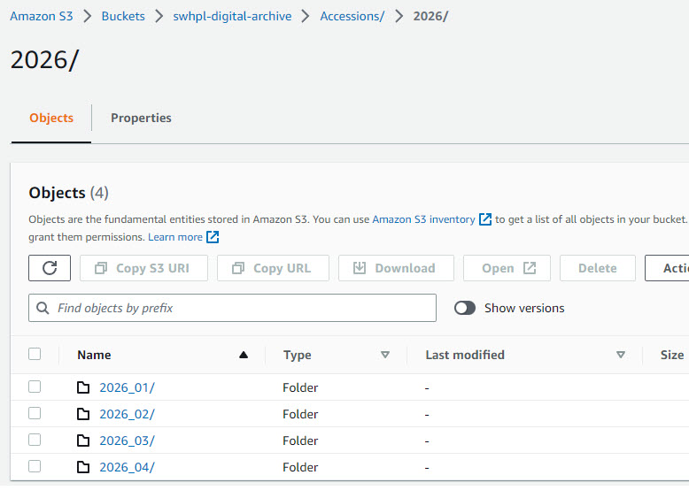
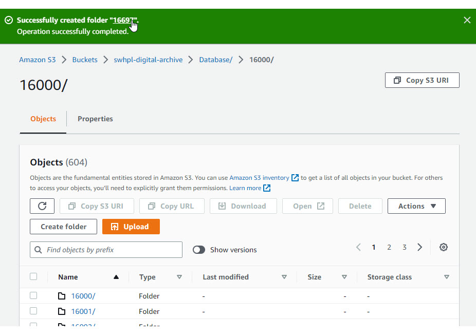
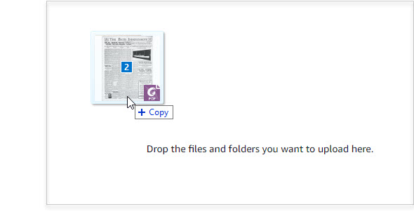
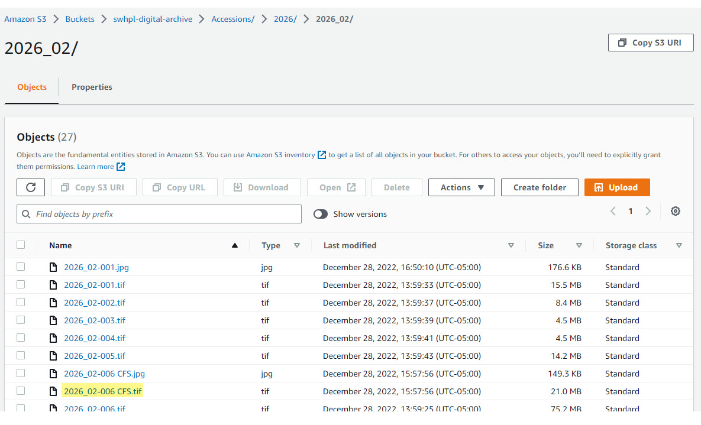

# Using S3
This section explains how to work with
[Amazon Simple Storage Service (S3)](https://aws.amazon.com/s3/?p=ft&c=st&z=3)
to store digital files in the cloud and attach them to items in the Digital Archive.
The examples are from the Southwest Harbor Public Library (SWHPL) Digital Archive.

!!! Note ""
    To use S3, you must enable the [AvantS3](/plugins/avants3/) plugin which integrates S3 with the Digital Archive.

While S3 is not as straightforward or as easy to use as other cloud storage services like Google Drive or Dropbox, it is a fast, safe,
economical, and powerful alternative. Most importantly, it is integrated with the Digital Archive thanks to the AvantS3 plugin.

For organizations that have two or more archivists, S3 is more economical than services like Dropbox which require that you pay extra for additional users. With S3, you can create additional users for no additional cost and assign each user either full or read-only access
to your files.

## S3 advantages
These are the primary advantages that S3 offers for a Digital Archive site:

-   Safe storage of archival digital assets such as original scans and other types of files.
-   Online access to digital assets by archivists working remotely.
-   Easy access to digital assets with a single click from the Digital Archive.
-   Easy one-click attachment of files to Digital Archive items.
-   Automatic downsizing of JPEG files when attached to an item.

## Logging into S3
Follow the steps below to log in to the Amazon Web Services (AWS) Management Console for S3,
subsequently referred to as simply the S3 console.

-   First log in to the Digital Archive and go to the Dashboard.
-   Then click the `S3 Management Console` link to get to the AWS login page.
-   You can also access the S3 console by going directly to `console.aws.amazon.com/s3`.

If you are already logged into S3, the link will take you to the S3 console.

On the AWS sign-in page, enter your credentials and click the **_Sign in_** button.

After you click the **_Sign in_** button, the S3 console appears as shown below.

In the screenshot above, the bottom of the S3 console shows the two kinds of storage
used for the Digital Archive as will be explained in the following sections.

-   Clicking on `Accessions` gets you to Accessions Storage
-   Clicking on `Database` gets you to Items Storage

## Storage for Items and Accessions

S3 is not a traditional folder-oriented hierarchical file system like you are familiar with on a PC or a Mac. S3 storage is implemented
using things called buckets, objects, and prefixes, but fortunately, these can be thought of and viewed using familiar terms like folders, subfolders, and files. You do however have to be very careful when working with S3 as explained in the [S3 limitations and cautions](#s3-limitations-and-cautions) section.

SWHPL's S3 storage for the Digital Archive is in a *bucket* named `swhpl-digital-archive`. It is divided into two top-level storage folders:

-   **Items Storage**
-   **Accessions Storage**

Items Storage is used to store the files for individual Digital Archive items whereas Accessions Storage is used to store
all of the files for an accession and its sub-accessions.

### Items Storage folder
The Items Storage folder `swhpl-digital-archive > Database` stores files that are associated with individual items in the Digital Archive database.
All files for a single item are kept together in a subfolder that has the same name as the item's identifier number.
For example, the files for item `12139` are stored in a folder named `12139`.

#### Item groups
At the top level of the Items Storage folder are 16 grouping subfolders named `1000`, `2000`, up to `16000`. Each of these folders
can contain up to 1,000 subfolders for individual items. For example, folder `12000` contains folders for items `12000`,
`12001`, `12002` and so on. The grouping folders make it easy to find an item's folder. If you are looking for the files
for item `12139` you first go to the `12000` grouping folder and then look for `12139`.

#### Image item example

The screenshot below shows the files for item `12139` which is a photograph.

The four files associated with item `12139` are as follows:

-   `12139.jpg` is a web-sized copy of the photograph downsized from `SWHPL-12139-CFS.jpg`.
-   `access-12139.txt` contains information about the item from the Microsoft Access database.
-   `SWHPL-12139-CFS.jpg` is a high-resolution, post-processed copy of `SWHPL-12139-SCAN.tif`.  
    CFS (Cleaned For Study) is a SWHPL term which means that the images may have been cropped, straightened,
    retouched, or had adjustments such as contrast improvement.
-   `SWHPL-12139-SCAN.tif` is the large scanner file, 30.8 MB, whereas the other files are smaller.

Other items may have more or fewer files, but this example is typical. Each file serves a purpose:

-   Use `12139.jpg` as the web-size image for the Digital Archive.
-   To see the original scan (archival image), view `SWHPL-12139-SCAN.tif`.
-   To make a print or provide someone with a high-resolution file, use `SWHPL-12139-CFS.jpg`.
-   The original metadata for the item is preserved in `access-12139.txt`.

#### Reference item example
The next example is for [Reference Item](/relationships/reference-items/) `16023`. The files for a Reference Item
usually include a Word document (called a reference sheet) used to record and format the information, and a PDF
version of the Word document for use in the Digital Archive. There may be other files as well such as related
research materials like the notes-to-work-from document in the example below.

Keeping the original Word document together with the PDF makes it easy for an archivist to update the Reference Item
if necessary. They update the Word document, create a new PDF, upload both files to S3, and then replace the item's
old PDF with the updated PDF.

### Accessions Storage folder
The Accessions Storage folder `swhpl-digital-archive > Accessions` stores files that belong to an accession or sub-accession. At the top level of the Accessions Storage folder are
subfolders having a four-digit number that matches an accession number for a *primary* accession in the [Accessions table](#accessions-table). If an accession has sub-accessions, folders for the sub-accessions are stored in the primary accession's folder.
[Learn about accessioning](/archivist/accessioning).

For example, primary accession `2026` has a top-level folder in the Accessions Storage folder and each of its sub-accessions have their
own subfolder like, `2026_01`, `2026_02` and so on. In S3 it looks like this:

If you click on sub-accession `2026_04`, you'll see its files as shown in the screenshot below.

An accession folder can contain any number of files of different types. The example above was used for clarity because it
only has seven files, but typically there can be a lot more. Keeping all the files for an accession together makes it easy
for an archivist to learn what files are in the accession and to find a file of particular interest.

### Which kind of storage to use

Whether you store files in Items Storage versus Accessions Storage depends on whether the
files are for an accession or for an item that does not belong to an accession. The rules are explained below.

#### When to use Items Storage
You create a subfolder in the Items Storage folder *only* when *both* of these conditions are true:

-   You are adding a new item to the Digital Archive.
-   The item's files do not belong to an accession.

Here are examples of when you need to create a new subfolder in the Items Storage folder:

-   Adding a new item from files in the digital backlog.
-   Adding a new item from digital files that came from your camera.
-   Adding a new Reference Item that has a PDF file created from a Word document.

In the three examples above, the item files are not part of an accession and thus are not in Accessions Storage. Therefore, they must
be put into Items Storage.

#### When to use Accessions Storage
You create a subfolder in the Accessions Storage folder only when 
[adding a new accession](/archivist/accessioning/#add-a-new-accession-to-the-accessions-table).

#### Special cases
By following the rules above, an item's files will either be in Accessions Storage or in Items Storage, but
not in both places. However, the case may arise where an accession contains a file that you want to attach to
an existing item that is not part of that accession.

For example, while processing a new accession you scan something that would be a perfect addition to an existing item,
but that item is not part of the accession. In that case, you can make a web-sized JPEG of the scan and store it in the
item's subfolder in Items Storage. That way, the original scan stays in Accessions Storage, but the JPEG gets stored with the
item's other files in Items Storage.

Another special case is when you add an individual item to the Digital Archive and that item's files are part of an accession.
You *don't* create a subfolder in Items Storage folder for that item because its files are already in Accessions Storage.
If you need to create additional files while curating the item, for example, a web-sized JPEG of a scan, you add those
files to the accession's folder in Accessions Storage.

One last case is items that are part of an accession, but were added to the Digital Archive before support for accessions
was added to the AvantS3 plugin. Some of the files for those items might be in both Accessions Storage and in Items Storage.
You can detect an item like this because [when you view it](#accessing-s3-files), you'll see an `S3` link next to both the
item's identifier and its accession number whereas for other items, the link only appears next to one or the other.

## Uploading files to S3
Before you can upload files to S3, you must first [log into S3](#logging-into-s3).
You may also need to create an S3 folder that will contain the files.

### Create a new S3 folder
If the folder that you want to upload files to does not yet exist, create it following the steps below.

-   Determine the name of the new folder:
    -   For an item, the folder name is the item's identifier number. As such, you need to first add the item to
        the Digital Archive so that you know its identifier before you can create an S3 folder for the item.
    -   For an accession, the folder name is the accession number or sub-accession number.        
-   Go to the S3 folder that will *contain* the new folder.
    -   For an item, the containing folder is `swhpl-digital-archive > Database > `#####` where
        `#####` is the item's [group folder](#item-groups).
    -   For a primary accession, the containing folder is `swhpl-digital-archive > Accessions`.
    -   For a sub-accession, the containing folder is `swhpl-digital-archive > Accessions` > `####` where
        `####` is the number of the primary accession.
-   Click the **_Create folder_** button to get to the page shown below.

On the **_Create folder_** page, type the new folder name in the **_Folder name_** field and click the **_Create folder_** button.
To go to the new folder, click the folder name link in the upper-left where it says "Successfully created folder." Or you
can navigate to the new folder in the usual way.

### Upload files to an S3 folder

-   In the S3 console, go to the S3 folder. If the folder does not exist, [create the folder](#creating-a-new-s3-folder).
-   On your computer, open the folder that contains the files to be uploaded.
-   Drag files from your computer folder onto the S3 page.

The entire screen becomes a drop target as shown in the screenshot below.

As an alternative to dragging files to upload, you can click the S3 **_Upload_** button to go to an S3 page
that will let you browse for files or a folder on your computer.

After you drag the files, an upload confirmation page appears as shown below. Verify that the files
it shows are the ones you want to upload and then click the **_Upload_** button.

During the upload, a progress bar appears at the top of the page as shown below. When the upload completes, a status page appears.

## Attaching S3 files to items
To attach S3 files to an item:

-   Edit the item
-   Choose the **_Files_** tab
-   Check the box next to each file you want to upload
-   Click the **_Save Changes_** button

Check the files you want to attach and click the **_Save Changes_** button.

The [AvantS3 plugin](/plugins/avants3) will:

-   Download the checked files from Amazon S3 to your Digital Archive server.
-   Downsize JPEG images to be 1200px on the long edge.
-   Attach the files to the item.
    
After the save, when you edit the item again, the **_Files_** tab will appear as shown below.

In the screenshot above, note that the **_Action_** column says `Replace existing file` whereas
in the previous screenshot it said `Add to item`. That's because the Digital Archive knows which S3
files can be used as new attachments and which are already attached. This makes it easy to tell if
you inadvertently forgot to attach an S3 file to the item.

### Which files appear in the Files tab

The files that appear in the **_Files_** tab come from:

-   [Items Storage](#items-storage-folder) if the item has no accession number.
-   [Accessions Storage](#accessions-storage-folder) if the item has an accession number.

In the previous example, the files came from Items Storage. The screenshot below shows files that come from Accessions Storage.

For both Items and Accessions storage, files that can be attached to the item have a checkbox next to them.
Files without a checkbox are ones the Digital Archive, and browsers in general, do not support such
as TIFF files and Word documents.

Notice in the example above, that file `2014-002.jpg` is unchecked. This is because the archivist chose to
not attach it to the item.

### Reorder or delete attachments

The steps for reordering and deleting S3 attachments are the same as explained for 
[uploading files to the Digital Archive](/archivist/attach-file/#upload-files-to-your-digital-archive) when not using S3.
However, when you delete an attachment, the file itself remains in S3 and continues to
show up in the S3 files list. That's because the list is only a reflection of what's stored
on S3. As such, you cannot accidentally delete an archival asset from the Digital Archive.

### Replace an attached file with an updated version

To replace an attached file with a newer version having the same file name:
    
-   Upload the newer file to S3.
-   S3 keeps a copy of the older version in case you make a mistake and need to recover it.
-   On the **_Files_** tab of the [**_Edit Item_** page](/archivist/items/#edit-an-item), check the box
    for the file that got updated.
-   Click the **_Save Changes_** button.
-   The Digital Archive will replace the older attachment with the newer one using the same file name 
    (you don't need to first delete the older file as you do when not using S3).

## Accessing S3 files
The previous sections have been about uploading files to S3 and attaching S3 files to Digital Archive items.
It is often the case, however, that you simply want to see the S3 files for an item or an accession.

For example, suppose a patron is viewing item 16693 and requests a high-resolution copy of the photograph.
To immediately access the high-resolution image, all you have to do is view the item and click the `S3` 
link as shown by the red arrow in the screenshot below.

 Clicking the link takes you to the S3 folder where the file is stored as
shown below. You can then download the file to make it available to the person who requested it.

When an item's files are in Items Storage instead of in Accessions Storage, the `S3` link appears next
to the identifier number, as shown below, instead of the accession number. The `S3` links only appear
when you are logged-in to the Digital Archive as an administrator.

## S3 limitations and cautions
There are some things to be aware of when using the S3 console.

-   When you delete a file, a hidden version of the file remains.
-   When you delete a folder, a hidden version of the folder and all of its file remains.
-   When you rename or move a file or folder, a hidden version of the original folder remains.

It's like this for safety reasons, so that you can undo a mistake. However, if you rename, or move
a folder that contains a lots of files, you are actually doubling the amount of storage required for
those files. If you delete a file or folder, you are not actually freeing up any space.

Furthermore, the S3 console will not let you preview an image and it won't let you download more than one file at a time.

To work around the S3 conole's limitations, use the [S3 Browser utility](#s3-browser-utility).

## S3 Browser utility
[S3 Browser](https://s3browser.com) is a 3rd-party Windows utility that makes it possible and/or easier to perform tasks
than with the AWS Management Console for S3.

These S3 Browser features do not exist in the S3 console:

-   Preview an image (with the S3 console, you have to download the image to view it).
-   Download multiple files or a folder (the S3 console only lets you download one file at a time).
-   Permanently delete files and folders (requires S3 Browser Pro configured with admin credentials)

### Preview an image
To preview and image with the S3 Browser utility:

-   Select the file
-   Choose the **_Preview_** tab in the lower panel

### Download multiple files
To download multiple files with the S3 Browser utility:

-   Select the files
-   Click the **_Download_** button
-   On the **_Select Folder dialog_**, choose where to put the files

### Permanently delete a deleted folder
Permanently deleting a folder in the S3 console can be a tedious process, especially when it contains
subfolders.

First delete the folder using the S3 console, then follow the steps below.

-   Choose an S3 folder (e.g. `Accessions`) from the upper right panel that contains the folder you want to delete.
-   Choose the **_Versions_** tab in the lower panel.
-   Wait for the version information to load (takes several seconds).
-   Choose `Show only deleted files` from the **_Filters_** dropdown at lower right.
-   Wait for the filtered version information to appear.
-   Select the folder to be deleted and all of its contents.
-   Click the **_Delete_** button (with red X) at the bottom of the panel.
-   Click the **_Yes_** button on the confirmation dialog.
-   The version information will refresh.
-   Choose the **_Tasks_** tab in the lower panel so you won't keep having to wait for the version information to load.
