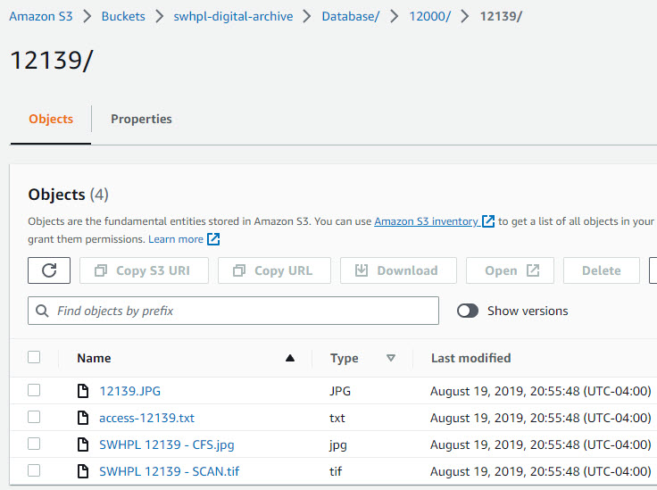

# Using S3
This section explains how to work with
[Amazon Simple Storage Service (S3)](https://aws.amazon.com/s3/?p=ft&c=st&z=3)
to store digital files in the cloud and attach them to items in the Digital Archive.
The examples are from the Southwest Harbor Public Library (SWHPL) Digital Archive.

!!! Note ""
    To use S3, you must enable the [AvantS3](/plugins/avants3/) plugin which integrates S3 with the Digital Archive.

While S3 is not as straightforward or as easy to use as other cloud storage services like Google Drive or Dropbox, it is a fast, safe,
economical, and powerful alternative. Most importantly, it is integrated with the Digital Archive thanks to the AvantS3 plugin.

For organizations that have two or more archivists, S3 is more economical than services like Dropbox which require that you pay extra for additional users. With S3, you can create additional users for no additional cost and assign each user either full or read-only access
to your files.

## Logging into S3
Follow the steps below to login to the Amazon Web Services (AWS) Management Console for S3.

-   First login to the Digital Archive and go to the Dashboard.
-   Then click the `S3 Management Console` link to get to the AWS login page.
-   You can also access the console by going directly to `console.aws.amazon.com/s3`.

If you are already logged into S3, the link will take you to the management console.

On the AWS sign-in page, enter your credentials and click the **_Sign in_** button.

After you click the **_Sign in_** button, the management console appears as shown below.

The bottom of the consoleIn the screenshot above, the bottom of the console shows the two kinds of storage
used for the Digital Archive as will be explained in the following sections.

-   Clicking on `Accessions` gets you to Accessions Storage
-   Clicking on `Database` gets you to Items Storage

## Storage for Items and Accessions

S3 is not a traditional folder-oriented hierarchical file system like you are familiar with on a PC or a Mac. S3 storage is implemented
using things called buckets, objects, and prefixes, but fortunately these can be thought of and viewed using familiar terms like folders, subfolders, and files. You do however have to be very careful when working with S3 as explained in the [S3 cautions](#s3-cautions) section.

SWHPL's S3 storage for the Digital Archive is in a *bucket* named `swhpl-digital-archive`. It is divided into two top-level storage folders:

-   **Items Storage**
-   **Accessions Storage**

Items Storage is used to store the files for individual Digital Archive items whereas Accessions Storage is used to store
all of the files for an accession and its sub-accessions.

### Items Storage folder
The Items Storage folder `swhpl-digital-archive > Database` stores files that are associated with individual items in the Digital Archive database.
All files for a single item are kept together in a subfolder that has the same name as the item's identifier number.
For example, the files for item `12139` are stored in a folder named `12139`.

#### Item groups
At the top level of the Items Storage folder are 16 grouping subfolders named `1000`, `2000`, up to `16000`. Each of these folders
can contain up to 1,000 subfolders for individual items. For example, folder `12000` contains folders for items `12000`,
`12001`, `12002` and so on. The grouping folders make it easy to find an item's folder. If you are looking for the files
for item `12139` you first go to the `12000` grouping folder and then look for `12139`.

#### Image item example

The screenshot below shows the files for item `12139` which is a photograph.

The four files associated with item `12139` are as follows:

-   `12139.jpg` is a web-sized copy of the photograph downsized from `SWHPL-12139-CFS.jpg`.
-   `access-12139.txt` contains information about the item from the Microsoft Access database.
-   `SWHPL-12139-CFS.jpg` is a high-resolution, post-processed copy of `SWHPL-12139-SCAN.tif`.  
    CFS (Cleaned For Study) is a SWHPL term which means that the images may have been cropped, straightened,
    retouched, or had adjustments such as contrast improvement.
-   `SWHPL-12139-SCAN.tif` is the large scanner file, 30.8 MB, whereas the other files are smaller.

Other items may have more or fewer files, but this example is typical. Each file serves a purpose:

-   Use `12139.jpg` as the web-size image for the Digital Archive.
-   To see the original scan (archival image), view `SWHPL-12139-SCAN.tif`.
-   To make a print or provide someone with a high-resolution file, use `SWHPL-12139-CFS.jpg`.
-   The original metadata for the item is preserved in `access-12139.txt`.

#### Reference item example
The next example is for [Reference Item](/relationships/reference-items/) `16023`. The files for a Reference Items
usually include a Word document (called a reference sheet) used to record and format the information, and a PDF
version of the Word document for use in the Digital Archive. There may be other files as well such as related
research materials like the notes-to-work-from document in the example below.

Keeping the original Word document together with the PDF makes it easy for an archivist to update the Reference Item
if necessary. They update the Word document, create a new PDF, upload both files to S3, and then replace the item's
old PDF with the updated PDF.

### Accessions Storage folder
The Accessions Storage folder `swhpl-digital-archive > Accessions` stores files that belong to an accession or sub-accession. At the top level of the Accessions Storage folder are
subfolders having a four-digit number that matches as accession number for a *primary* accession in the [Accessions table](#accessions-table). If an accession has sub-accessions, folders for the sub-accessions are stored in the primary accession's folder.
[Learn about accessioning](/archivist/accessioning).

For example, primary accession `2026` has a top-level folder in the Accessions Storage folder and each of its sub-accessions have their
own subfolder like, `2026_01`, `2026_02` and so on. In S3 it looks like this:

If you click on sub-accession `2026_04`, you'll see its files as shown in the screenshot below.

As accession folder can contain any number of files of different types. The example above was used for clarity because it
only has seven files, but typically there can be a lot more. Keeping all the files for an accession together makes it easy
for an archivist to learn what files are in the accession and to find a file of particular interest.

### Which kind of storage to use

Whether you store file in Items Storage versus Accessions Storage depends on whether the
files are for an accession or for an item that does not belong to an accession. The rules are explained below.

#### When to use Items Storage
You create a subfolder in the Items Storage folder *only* when *both* of these conditions are true:

-   You are adding a new item to the Digital Archive.
-   The item's files do not belong to an accession.

Here are examples of when you need to create a new subfolder in the Items Storage folder:

-   Adding a new item from files in the digital backlog.
-   Adding a new item from digital files that came from your camera.
-   Adding a new Reference Item that has a PDF file created from a Word document.

In the three examples above, the item files are not part of an accession and thus are not in Accessions Storage. Therefore, they must
be put into Items Storage.

#### When to use Accessions Storage
You create a subfolder in the Accessions Storage folder only when 
[adding a new accession](/archivist/accessioning/#add-a-new-accession-to-the-accessions-table).

#### Special cases
By following the rules above, an item's files will either be in Accessions Storage or in Items Storage, but
not in both places. However, the case may arise where an accession contains a file that you want to attach to
an existing item that is not part of that accession.

For example, while processing a new accession you scan something that would be a perfect addition to an existing item,
but that item is not part of the accession. In that case, you can make a web-sized JPEG of the scan and store it in the
item's subfolder in Items Storage. That way, the original scan stays in Accessions Storage, but the JPEG gets stored with the
item's other files in Items Storage.

Another special case is when you add an individual item to the Digital Archive and that item's files are part of an accession.
You *don't* create a subfolder in Items Storage folder for that item because its files are already in Accessions Storage.
If you need to create additional files while curating the item, for example, a web-sized JPEG of a scan, you add those
files to the accession's folder in Accessions Storage.

## Uploading files to S3
2 &ndash; Upload files to S3
:   Once logged in you will see the S3 page for the item. S3 *automatically* creates and manages a 
    location for the uploaded files based on the item's **_identifier_** &ndash; you don't have to 
    create a folder or do anything else before uploading files.
    
    Drag files onto the S3 page, or click the **_Upload_** button to
    browse for files on your computer.

    The screenshot below shows what the page looks like after uploading two files for item 16159: a JPEG
    version of the file and the original high resolution TIFF file from the scanner.

    

    Once you are done uploading files, you can close the S3 browser tab.

## Attaching S3 files to items
    
3 &ndash; Select the S3 file(s) to attach to the item
:   Go to the **_Files_** tab of the [**_Edit Item_** page](/archivist/items/#edit-an-item).

    The S3 files from AWS appear in a list. Files that can be attached to the item have
    a checkbox next to them. Files without a checkbox are ones the Digital Archive, and browsers
    in general, do not support such as TIFF files, Word documents, and spreadsheets.

    The screenshot below shows both of the files that were uploaded to S3 in step 2 above,
    but only the JPG file has a checkbox.

    Check the boxes for the files you want to attach to the item.

    

4 &ndash; Click the **_Save Changes_** button
:   When you click the **_Save Changes_** button, the [AvantS3 plugin](/plugins/avants3) will:

    -   Download the checked files from your S3 server
    -   Downsize JPEG images to be 1200px on the long edge
    -   Attach the files to the item
    
    When the save has completed, the item will appear as shown below.

    

5 &ndash; Change the file attachments (optional)
:   The steps for reordering and deleting S3 attachments are the same as explained for  
    [uploading files to the Digital Archive](#upload-files-to-your-digital-archive) when not using S3.
    However, when you delete an attachment, the file itself remains in S3 and continues to
    show up in the S3 files list. That's because the list is only a reflection of what's stored
    on your S3 server. As such, you cannot accidentally delete an archival asset from the
    Digital Archive.

    To replace an attached file with a newer version having the same file name:
    
    -   Upload the newer file to S3
    -   S3 keeps a copy of the older version in case you make a mistake and need to recover it
    -   On the **_Files_** tab of the [**_Edit Item_** page](/archivist/items/#edit-an-item), check the box
        for the file that got updated
    -   Click the **_Save Changes_** button
    -   The Digital Archive will replace the older attachment with the newer one using the same file name 
        (you don't need to first delete the older file as you do when not using S3)

    In the screenshot below, note that the **_Action_** column value for file `JPH Receipt 1977.jpg`
    says `Replace existing file` whereas in step 3 above it said `Add to item`. That's because the
    Digital Archive knows which S3 files can be attached and which are already attached. This makes it
    easy to tell if you inadvertently forgot to attach an S3 file to the item.
    
    

## S3 Cautions
-   Permanent deletions
-   Move or rename is really a copy
## Using the S3 Browser utility
