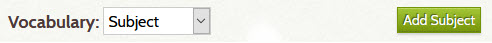
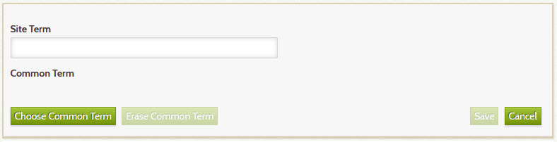
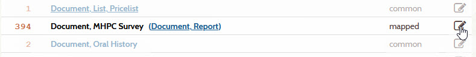
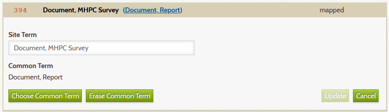
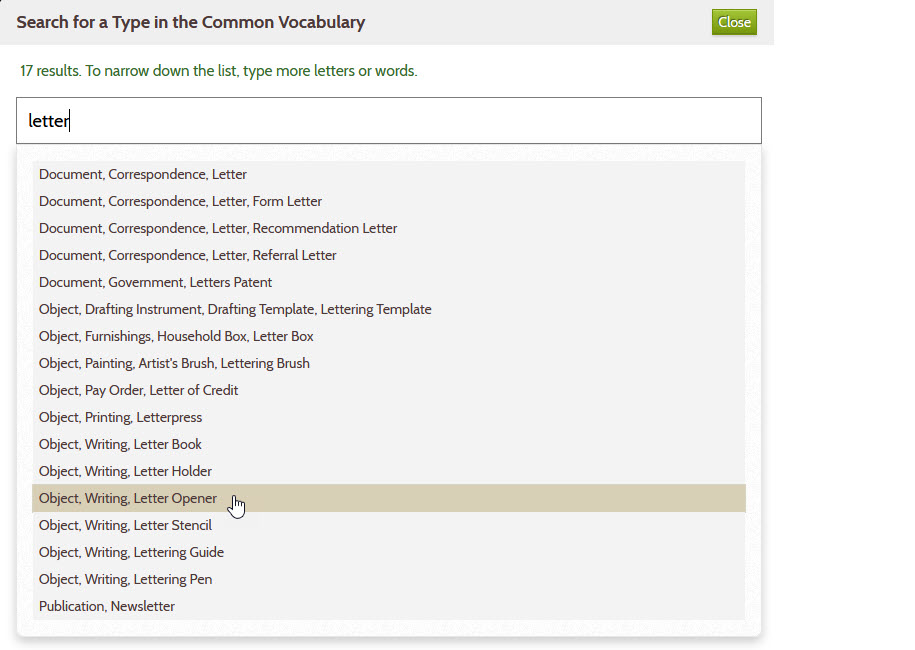

# Vocabulary Editor

Don't use comma in Place names unless for hierarchy e.g. `Bangor ME` not `Bangor, ME`

Also cover Simple Vocab

## Add a new vocabulary term

Follow these steps to add a new term:

1 &ndash; Choose the vocabulary kind
:   Select **_Type_**, **_Subject_**, or **_Place_** from the dropdown list at the top of the page.
    The page will update to show the terms currently defined for that kind.

    

2 &ndash; Click the **_Add_** button at the top of the page
:   In this sample above, the button says **_Add Subject_** because the user
    choose the subject vocabulary. Click the button to open
    an edit form as shown below.

    

3 &ndash; Fill in the form
:   Do *one* of the following:

    -   Enter a **_Site Term_** *or*
    -   [Choose a **_Common Term_**](#choosing-a-common-term) *or*
    -   Enter a **_Site Term_** *and* choose a **_Common Term_**

4 &ndash; Click the **_Save_** button
:   When you click the **_Save_** button, the term will be added to your
    site's vocabulary and will appear in the corresponding field's dropdown
    list when you add or edit an item.
    For example, when you add a new subject term, the new term will appear in the
    **_Subject_** dropdown.

## Edit a vocabuary term

Follow these steps to change an existing term:    

1 &ndash; Open the edit form for the term
:   Click the pencil icon located to the far right of the term.
     

2 &ndash; Edit the term
:   Change the **_Site Term_** and/or [choose a **_Common Term_**](#choosing-a-common-term)

     

3 &ndash; Click the **_Update_** button
:   When you click the **_Update_** button and confirm that you want to make the update:

    -   The term will be changed in your site's vocabulary
    -   It will appear in the corresponding field's dropdown list when you add or edit an item
    -   Every item that uses that term will be updated with the change

## Remove a vocabulary term

To remove an existing term, follow the steps above to edit an existing term,
but then click the red **_Remove_** button in the lower right.
**The button will only appear if the item has zero uses.** To remove a term
that is being used by one or more items, first edit each of those items to
use a different term. When no item is using the term, you can remove it.

## Choosing a common term

The sections above explained how to add or edit a common term. To choose
a common term, follow these steps:

1 &ndash; Open the common term chooser dialog
:   To open the dialog, click the **_Choose Common Term_** button in the term's edit form.

2 &ndash; Start typing in the field that says `Enter words here`
:   As you type, terms that match what you enter will appear as suggestions
    as shown below.

    

3 &ndash; Click the term you want
:   In the example above, when you click on `Object, Writing, Letter Opener`, the
    chooser dialog will close and that term will appear in the **_Common Term_** field
    of the edit form.

