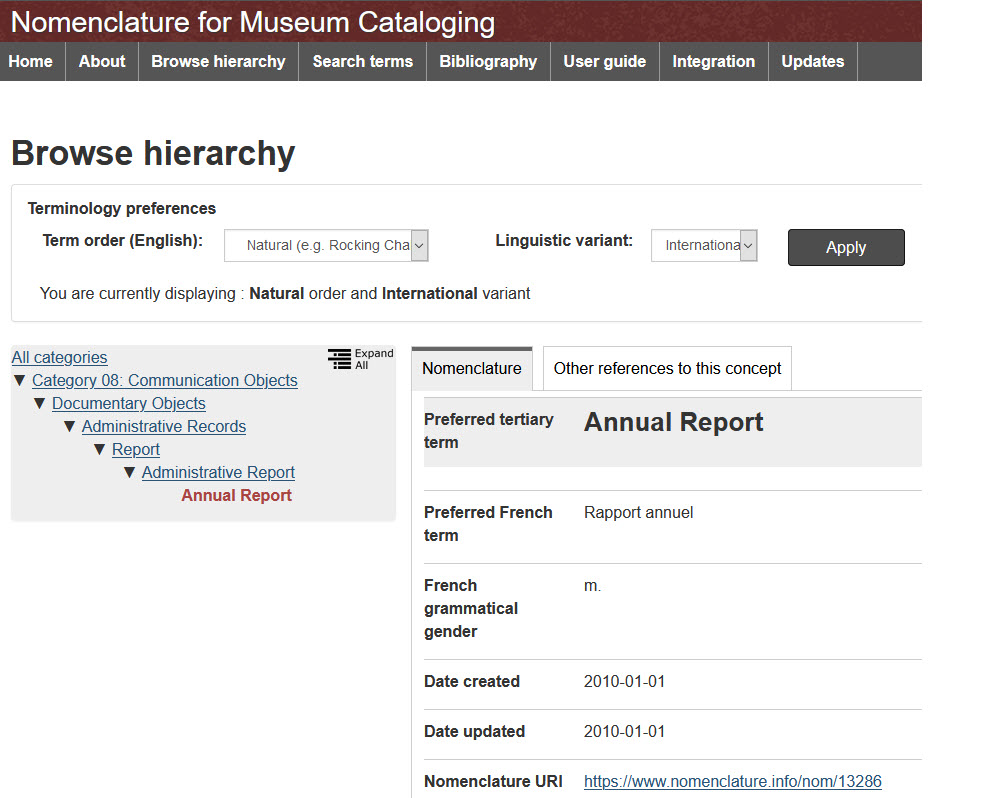

# Vocabulary Editor

The Vocabulary Editor lets you work with the [Common Vocabulary](/archivist/common-vocabulary/)
to define the set of common and site-specific vocabulary terms that archivists will use
when working with items in your collection. The Vocabulary Editor lets you define terms for these metadata fields:

-   **_Type_**
-   **_Subject_**
-   **_Place_**

To define terms for other fields, use the
[**_Simple Vocab_**](https://omeka.org/classic/docs/Plugins/SimpleVocab/) plugin.

> Launch the Vocabulary Editor

To get to the Vocabulary Editor, click **_Vocabulary Editor _** in the left admin menu.
You'll then see a page similar to the one shown below that lists the terms that are
currently defined for your site.


!!! note "For New Digital Archive Installations"
    A new Digital Archive installation may have very few terms defined. Unlike some other
    collection management software you may have used that pre installs thousands
    of terms you will never use, the Digital Archive requires that you decide which terms
    archivists will be able to choose from when working with items in your collection.
    As you discover the need for additional terms, you can add them quickly and easily
    using the Vocabulary Editor. 

> Meaning of fonts and colors in the Vocabulary Editor

The Vocabulary Editor uses different effects to convey information about terms.
In the previous screenshot above, all of the terms appear as blue, underlined text to 
indicate that they are common terms; however, you may see other effects as shown below.


This table explains the numbered effects shown above.

 # | Appearance | Meaning
---: | ---: | :---
1 | Red | Unmapped site term
2 | Text inside blue button | A suggested common term (see [Apply a suggested term](#apply-a-suggested-term))
3 | Blue, no underline | Common term with no corresponding Nomenclature term
4 | Blue,  underlined | Common term corresponding to a Nomenclature term
5 | Black | Mapped site term with common term in parentheses.

---

!!! note ""
    Before continuing, be sure you are familiar with the [Common Vocabulary](/archivist/common-vocabulary/).

> The sections that follow explain how to:

-   [Apply a suggested term](#apply-a-suggested-term)
-   [See which items use a term](#see-which-items-use-a-term)
-   [Choose a common term](#choose-a-common-term)
-   [Add a new vocabulary term](#add-a-new-vocabulary-term)
-   [Edit an existing vocabulary term](#edit-a-vocabulary-term)
-   [Remove a vocabulary term](#remove-a-vocabulary-term)
-   [Merge terms](#merge-terms)
-   [See all vocabulary terms](#see-all-vocabulary-terms)
-   [See Nomenclature definitions](#see-nomenclature-definitions)

## Apply a suggested term

Sometimes you'll see a blue button like the one below next to a red unmapped site term.


The blue button is a special feature that provides you with a suggestion. When you add or edit
an unmapped site term, the Vocabulary Editor looks for a common term that has the same
leaf as the unmapped site term. When there's a match, the blue button appears as a suggestion
for you to use the matching common term.

In this example, the matching leaf is `Cyanotype`. If you like the suggestion, you can click
the button, and then click **_Update_** on the confirmation dialog (shown below), to change
the term to use the suggestion and to update any items that use the term. 


The suggested term is usually appropriate, but not always, so be sure you want to use the term before
you click the **_Update_** button. There is no undo, but if you update the term by mistake, you can
always [edit the term](#edit-a-vocabulary-term) to change it back to what it was before.

## See which items use a term

To see which items use a specific term, click the number that appears to the left of the term.
The screenshot below shows that 35 items use the term `Image, Art, Drawing`. You can click on
`35` to see search results for the 35 items that use that term as their **_Type_**.


A zero will appear if no items use that term. Unless you anticipate that archivists
will need the term in the future, [remove it from the vocabulary](#remove-a-vocabulary-term).

## Choose a common term

The next two sections on adding and editing terms require that you choose a term
from the Common Vocabulary. To choose a common term, follow these steps:

1 &ndash; Open the common term chooser dialog
:   To open the dialog, click the **_Choose Common Term_** button in the term's edit form (see next section).

2 &ndash; Start typing in the field at the top of the chooser dialog
:   As you type, terms that match what you enter will appear as suggestions
    as shown below.

    

3 &ndash; Click the term you want
:   In the example above, when you click on `Object, Writing, Letter Opener`, the
    chooser dialog will close and that term will appear in the **_Common Term_** field
    of the edit form.

## Add a new vocabulary term

Follow these steps to add a new term:

1 &ndash; Choose the vocabulary kind
:   Select **_Type_**, **_Subject_**, or **_Place_** from the **_Vocabulary_** dropdown list at the top of the
    Vocabulary Editor page. The page will update to show the terms defined for your site for that kind.

    

2 &ndash; Click the **_Add_** button at the top of the page
:   In the screenshot above, the button says **_Add Subject_** because **_Subject_**
    is selected in the **_Vocabulary_** dropdown. It will say **_Add Type_** or 
    **_Add Place_** when **_Type_** or **_Place_** are selected. Click the button to open
    an edit form as shown below.

    

3 &ndash; Fill in the form
:   Do *one* of the following:

    -   Enter a **_Site Term_** *or*
    -   [Choose a **_Common Term_**](#choose-a-common-term) *or*
    -   Enter a **_Site Term_** *and* choose a **_Common Term_**

4 &ndash; Click the **_Save_** button
:   When you click the **_Save_** button, the term will be added to your
    site's vocabulary and will appear in the corresponding field's dropdown
    list when you add or edit an item.
    For example, when you add a new subject term, the new term will appear in the
    **_Subject_** dropdown when you are adding or editing an item.

## Edit a vocabulary term

Follow these steps to change an existing term:    

1 &ndash; Open the edit form for the term
:   Click the pencil icon located to the far right of the term.
     

2 &ndash; Edit the term
:   Change the **_Site Term_** and/or [choose a different **_Common Term_**](#choose-a-common-term).

     

    In practice, you should never need to use the **_Erase Common Term_** button unless you wanted
    to convert a mapped site term to unmapped. Use of unmapped site terms is not recommended.

3 &ndash; Click the **_Update_** button
:   When you click the **_Update_** button and confirm that you want to make the update:

    -   The term will be changed in your site's vocabulary
    -   It will appear in the corresponding field's dropdown list when you add or edit an item
    -   Every item that uses that term will be updated with the change

## Remove a vocabulary term

To remove an existing term, follow the steps above to edit an existing term,
but then click the red **_Remove_** button in the lower right.
**The button will only appear if the term is not used by any items.** To remove a term
that is being used by one or more items, first edit each of those items to
use a different term. When no item is using the term, you can remove it.

## Merge terms

Occasionally you'll run into the situation where you have two similar terms that you would like
to merge into one, but each term is being used by different items. Simply edit one term to match
the other (or change both to the term you like), and the Vocabulary Editor will automatically
merge the two terms into one and update all the items that use them to use the new term. After the
merge you'll see that the usage count for the merged term is the sum of the usage counts for the
original terms.

## See all vocabulary terms

To see all the terms for a vocabulary, click the view hierarchy link located at upper right
of the **_Vocabulary Editor_** page. The name of the link depends on which vocabulary you are editing.
For example, if you are editing the **_Type_** vocabulary, the link will be **_View Type Hierarchy_**.

The screenshot below shows the first few dozen terms for the **_Type_** vocabulary.
To get back to the Vocabulary Editor, click the **_Return to Vocabulary Editor_** link at upper right.


Searching the page
:   The **_Vocabulary Hierarchy_** page is *very* long. For **_Type_** and **_Subject_** terms, it contains
    thousands of terms. You can use your browser's search feature to find terms on that page. On most
    browsers, you can get a search box by pressing **_Ctrl-F_** on Windows, or **_Command-F_** on Mac.

Nomenclature definitions
:   Terms that have a blue hyperlink at the end are from [Nomenclature 4.0](/archivist/common-vocabulary/#nomenclature-40).
    Click the link to [see that term on the Nomenclature website](#see-nomenclature-definitions).
    See the next section below for more information.

Public Page
:    You can share a public link to the **_Vocabulary Hierarchy_** page by editing the URL to remove
    remove `admin`. For example, if the URL is

    `https://swhplibrary.net/digitalarchive/admin/vocabulary/tree?kind=1`

    then the public URL is as shown below (click it to see what the public page looks like)

    [`https://swhplibrary.net/digitalarchive/vocabulary/tree?kind=1`](https://swhplibrary.net/digitalarchive/vocabulary/tree?kind=1)

## See Nomenclature definitions

In the Vocabulary Editor, terms that come from [Nomenclature 4.0](/archivist/common-vocabulary/#nomenclature-40) appear in blue,
underlined type as shown in the screenshot below.


Click on a blue, underlined term to see its definition on the
[nomenclature.info website](https://www.nomenclature.info/apropos-about.app?lang=en).
The screenshot below shows the nomenclature.info page for the Nomenclature term `Annual Report`.



The page above reveals that the Digital Archive common term for `Document, Report, Annual Report`
is the same as Nomenclature term #13286 which has a six level hierarchy:

``` text
Category 08: Communication Objects
    Documentary Objects
        Administrative Records
            Report
                Administrative Report
                    Annual Report
```

This comparison is useful for someone who has experience working with Nomenclature
and wants to understand how Digital Archive common terms map to Nomenclature terms.
