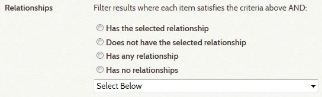

# Working with Relationships

This section is a follow-up to and deeper dive into the section on
[Understanding Relationships](/user/understanding-relationships).
Be sure to read that information before reading this section.

## Relationship Types

The type of a relationship must make sense with the two items it relates. For example, only people
can be married to each other. A house can be *designed by* a person or a business, but not by a
place or another house. A place can be the *location of* a house, but a house cannot be located
in an event or in a person. What kind of items are compatible with a specific relationship type
is determined by Relationship Rules.

To get a better sense of relationship types, take a look at the Relationship Types & Rules table.
It lists every type of relationship currently in use among items in the Archive. It also spells
out the rules that apply to the two items involved in the relationship.

## Relationship Direction

A relationship can be either uni-directional or bi-directional. A bi-directional relationship reads the same in both directions. For example, John is married to Mary and Mary is married to John. Married to is a label that describes the relationship in either direction.

A uni-directional relationship reads one way in the forward direction and another way in the reverse direction. For example, John designed a house and the house was designed by John. These phrases sound right because the order of the items matches the direction of the relationship. If the item order or direction is wrong, you end up with the non-nonsensical relationships of a house that designed John, and John being designed by a house. Fortunately, the rules for a relationship’s type ensure correct item order and direction when an archivist adds or edits a relationship.

A uni-directional relationship has two different labels. In the relationship between John and his house, designed is one label and designed by is the other. Each label is the inverse of the other, but they describe the same relationship. If you look  again at the Relationship Types & Rules table, you’ll see that the row for designed has the same Id 17 as the row for designed by. You’ll also see that there is only one row for married to which has Id 8. This is because the married to label is used in both directions. Note that the table lists relationships in alphabetical order by label, which is why the Id numbers do not appear sequentially.

## Genealogical Relationships

An archivist only ever specify a child of or parent of relationship between two people (there is no, grandparent, grandchild, or sibling relationship type) and the software does the rest. This feature sometimes reveals long ancestry chains that would never be apparent when looking at a single item. Two examples in the Archive are item 3687 for Ralph Warren Stanley that shows great great great grandparents, and item 13572 for John Carroll that shows great great grandchildren.

## Relationship Order

All relationships are important, but the curator decides which ones a user will see first when viewing an item. In the Digital Archive, images of an item such as a person, house, or boat, are considered most important and always appear immediately after the item’s metadata. Genealogical relationships come next followed by Reference items that mention the item, and then places where the item is located, and so on. By always presenting related items in the same order, users quickly become comfortable with the interface and know what to expect as they go from item to item.
Viewing Relationships

The fact that every relationship in the archive has a type, direction, and order, makes it possible for the Digital Archive software to present related items most effectively when users are viewing relationships for an item. The software:

    Groups related items by relationship type.
    Groups indirectly related items with their directly related item.
    Displays the relationship label for each group relative to the item being viewed, that is, in a direction from that item to its related items.
    Derives ancestor and descendant chains starting from a People item’s parents and children.
    Lists groups in order of importance.

Administrators can search for items with specific relationships using the Relationship options at the bottom of the Advanced Search page in the admin interface as shown in the screenshot below.

