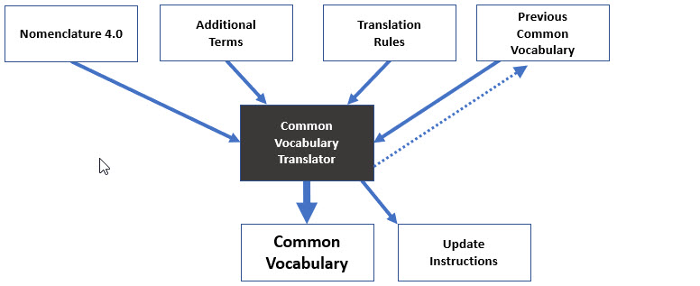

# Common Vocabulary Translator

The Common Vocabulary Translator (CVT) is a software program that translates the nearly 15,000
[Nomenclature 4.0](/archivist/common-vocabulary/#nomenclature-40) terms into the simpler
[Common Vocabulary](/archivist/common-vocabulary) terms used in the Digital Archive. It also adds
additional terms to the Common Vocabulary that do not exist in Nomenclature.

This page explains:

-   [Terminology](#terminology)
-   [Rationale for translation rules](#translation-rationale)
-   [Translation process](#translation-process)
-   [Translation software](#translation-software)

---

!!! note "Advanced Topic"
    This information is for anyone who wants to know how the Common Vocabulary gets created,
    but it is written for someone who will be working with the CVT software and therefore is fairly technical.

## Terminology

To understand the CVT, become familiar with the terminology below.

### Nomenclature hierarchy

The Nomenclature term hierarchy can be up to six levels deep, though not every term uses all
six levels. The levels are shown below, but note that Nomenclature uses the word *term* to mean
both the entire term and each of the last three levels of the complete term. This can be confusing
which is why this documentation only uses *term* to mean the entire set of words for a complete term.
It refers to the last three levels of a complete Nomenclature term as the Primary, Secondary, and
Tertiary *parts*.

``` text
1  Category
2  Class
3  Sub Class
4  Primary term
5  Secondary term
6  Tertiary term
```    

Here are three examples of Nomenclature terms:

``` text
Category 01: Built Environment Objects
    Building Components
        Construction Materials
            Building Stone
                Dimension Stone
                    Dressed Stone

Category 07: Distribution & Transportation Objects
    Land Transportation T&E
        Animal-Powered Vehicles
            Carriage
                Buckboard

Category 08: Communication Objects
    Documentary Objects
        Graphic Documents
            Photograph
                Negative
```                    

### Common Vocabulary hierarchy

The CVT translates Nomenclature terms into simpler Common Vocabulary terms based on a set
of translation rules that will be explained later. The rules tell the CVT how to translate
the terms shown in the previous section into the terms shown below.

``` text
Object, Building Stone, Dimension Stone, Dressed Stone

Transportation, Carriage, Buckboard

Image, Photograph, Negative
```

As you can see, Common Vocabulary terms are typically much simpler and easier to read than
Nomenclature terms. In fact, approximately 95% of Common Vocabulary terms have four or fewer
levels in their hierarchy. Only about 5% have five levels and none have six.

### Leaf

**Leaf** means the words at the deepest level in a hierarchy. In examples in both sections above,
the leaf words are: `Dressed Stone`, `Buckboard`, and `Negative`.
The CVT preserves Nomenclature leaf words to ensure that they are the same as, and can be
matched with, the same leaf words used in other collection software, like PastPerfect,
that uses Nomenclature.

Nomenclature 4.0 supports leaf words in both *inverted* and *natural order*.
Examples of each follow.

Inverted Order | Natural Order
:--- | :--- 
Negative, Glass Plate | Glass Plate Negative
Negative, Roll File | Roll Film Negative
Negative, Sheet Film | Sheet Film Negative

The Common Vocabulary uses natural order because it's easier to read. 

!!! note "Important"
    Commas are not allowed in Common Vocabulary leaf words because
    comma is reserved as a hierarchy level indicator. This is particularly
    important in place names where comma is  a commonly used separator.
    So for example, in the Common Vocabulary use `Bangor ME` as the leaf,
    not `Bangor, ME`.


### Tail
**Tail** is a CVT term used in the translation rules. The tail consists of a Nomenclature term's
Primary, Secondary, and Tertiary parts, if all three exist. If a term has no Tertiary part,
the tail consists of the Primary and Secondary parts. If a term has no Secondary part,
the tail is just the Primary part. Some higher level terms have no Primary part, but still
have a leaf which is either the Sub Class or Class part. In those cases, the tail and the
leaf are the same.

## Translation rationale 

The purpose of the Common Vocabulary is to fulfil the need for a rich, practical, and
easy to read set of vocabulary terms that archivists can use in cataloging collections
which not only contain physical objects like those found in museums, but also contain
items about people, places, structures, events, and organizations.

Nomenclature has thousands of terms for *naming* human-made *objects*, but none for things like
plants or animals, businesses or organizations, or places like towns and villages.
Object names alone are not sufficient for cataloging many Digital Archive items, especially
[Reference Items](/relationships/reference-items) which serve as stand-ins for real-world entities
like people, boats, and houses.

While Nomenclature by itself does not fill the need, it does provide the hierarchical
organization, and most of the **leaf** words, used by the Common Vocabulary.

The rationale for how Nomenclature gets translated to Common Vocabulary, is provided in the following sections.

### Common Vocabulary **_Type_** and **_Subject_**

Before continuing, it is important to explain the proper use of, **_Type_** and **_Subject_**
(when the words **_Type_** and **_Subject_**
appear in small caps, they refer to an item's **_Type_** and **_Subject_** metadata fields).

In the Digital Archive, an object name alone is not always sufficient for cataloging an item.
Every item must have a **_Type_**, and unless the type is a physical object that can be
unambiguously described by a Common Vocabulary term, the item must also have a **_Subject_** that further
classifies the **_Type_**. For example, an item with **_Type_** `Object, Cup, Teacup` needs no further
classification, but an item of **_Type_** `Image, Photograph` *must* have a **_Subject_** to
classify the photo as being part of a group of similar photos. For example, the subject of a photograph
could be `People` to indicate that it's a photo of humans.

A **_Subject_** is not required for an object item, but it should be provided to indicate the nature of
the object when the **_Type_** alone is not enough. For example, the **_Type_**
`Object, Art, Sculpture, Carving` names an item as a carving, but does not say what kind of carving.
Setting the item's **_Subject_** to  
`Nature, Animals, Birds` puts the object into the class of carvings of animals, specifically, birds.

#### Top level types and subjects

The table below shows the top level **_Type_** and **_Subject_** terms in the Common Vocabulary.

Type         | Subject
:---         | :---
 Document    | Businesses
 Image       | Events
 Map         | Nature
 Object      | Object
 Publication | Organizations
 Reference   | Other
             | People
             | Places
             | Recreation
             | Structures
             | Transportation
             | Vessels

Archivists at the Southwest Harbor Public Library derived the terms
based on four years working with the collections of cultural heritage organizations
on Mount Desert Island in Maine. Together, the
collections contain more than 20,000 items, nearly 25,000 images, and over 3,000
documents. They chose simple words that a) reflect the focus of the collections and b)
have obvious meaning. While the choices are subjective, they
are meeting the cataloging needs of many organizations.

### Top level translations

The table below gives a general sense of which Nomenclature Categories translate to which
Common Vocabulary top level terms. To see how specific Classes, Subclasses, and
individual terms translate, you can look at the the [translation rules](#translation-rules)
that the CVT follows.

Nomenclature Category                                   | Common Vocabulary
:---                                                    | :---
Category 01: Built Environment Objects                  | All translate to `Object` except for terms with Nomenclature Class `Structures` which translates to `Structures`
Category 02: Furnishings                                | All translate to `Object`
Category 03: Personal Objects                           | All translate to `Object`
Category 04: Tools & Equipment for Materials            | All translate to `Object`
Category 05: Tools & Equipment for Science & Technology | All translate to `Object`
Category 06: Tools & Equipment for Communication        | All translate to `Object` except `Picture Postcard` which translates to `Image`
Category 07: Distribution & Transportation Objects      | All translate to either `Object`, `Transportation`, or `Vessel` depending on whether they are some kind of transport vehicle like a car or boat, or a component like a tire or a sail.
Category 08: Communication Objects                      | Most translate to `Document`, `Image`, `Map` or `Publication` unless they are none of those, in which case they translate to `Object`.
Category 09: Recreational Objects                       | All translate to `Object`
Category 10: Unclassifiable Objects                     | All translate to `Object`

Except for `Object`, `Structures`, `Transportation` and `Vessels`, the table above does not
translate any Nomenclature terms to the other subjects listed in the previous table such
as `Businesses`, `Events`, and `Nature`. That's because none of the other subjects classify
human-made subjects and therefore there are no corresponding Nomenclature terms.

While `Vessel` is a form of `Transportation`, it is elevated to be a top level term
because boats and ships are so prominent in the collections of coastal communities like Mount Desert Island.
### Rationale for how Nomenclature terms get translated

There are many ways that Nomenclature could be morphed into the Common Vocabulary.  
Here is the reasoning behind the way the CVT does it.

Terms for museum-size objects
:   Nomenclature terms for smallish physical objects, like those that might be part of a museum's
    collection, are translated to *both* the **_Type_** vocabulary *and* to the **_Subject_** vocabulary.
    
    Terms for museum-sized objects become both **_Type_** *and* **_Subject_** terms because collections
    generally have either an actual object such as a hat, or they have a photograph of, or documents about,
    an object such as a person. For the hat, the item's **_Type_** would be `Object, Clothing, Hat`
    with no **_Subject_**. For a photograph of a hat factory, the item's **_Type_** would be
    `Image, Photograph` and the **_Subject_** would be `Structures, Factory`.
    
    The idea is that *most object terms can be used for either* **_Type_** or the **_Subject_**
    depending on whether the item is *part* of the collection (**_Type_**)
    or if the item in the collection depicts, or is about, the item (**_Subject_**).

Terms for huge objects    
:   Nomenclature terms for very large physical objects like houses, boats, and bridges,
    are translated *only* to the **_Subject_** vocabulary; however, the CVT adds two special
    terms to the **_Type_** vocabulary, `Object, Structure` and `Object, Transportation`,
    to use as the **_Type_** for huge objects.

    Terms for large physical objects like bridges are translated to the **_Subject_** vocabulary
    and *not* added to the **_Subject_** vocabulary as they are for museum-size objects, because
    museums rarely have these kinds of objects in their collections and so there's no sense in having all
    the terms for those objects cluttering up the **_Type_** vocabulary.
    
    In a case where a collection does actually contain
    something like a church building, the church item's **_Type_** can be set to the special
    **_Type_**  `Object, Structure` and its **_Subject_** can be set to `Structures, Ceremonial, Church`.

    If a collection contains many large objects, such as cars, the organization can use the  
    [Vocabulary Editor](/archivist/vocabulary-editor) to add top-level **_Type_** terms for various kinds of
    automobiles, and map them to `Object, Transportation`.

Other terms
:   Most other Nomenclature terms for objects that are mostly two dimensional, are translated *only* to the
    **_Type_** vocabulary as `Document`, `Image`, `Map`, or `Publication`.

    Terms for things like people, animals, businesses, organizations, and events that do not exist in
    Nomenclature, are added to the **_Subject_** vocabulary.

    Terms for the names of towns and villages are added to the **_Place_** vocabulary.

    The term `Reference` is added to the **_Type_** vocabulary.
    [Learn about Reference Items](/relationships/reference-items).

    To see exactly what non-Nomenclature terms the CVT adds to the Common Vocabulary,
    you can look at the
    [additional terms file](https://github.com/gsoules/AvantCommonVocabulary/blob/master/data/input-additional-terms.csv)
    which tells the CVT what terms to add. 

## Translation process

This section explains how the CVT actually performs the translation from Nomenclature terms
to Common Vocabulary terms. In the diagram below, the black box in the middle represents the
CVT software. The boxes in the top row represent data files that the CVT reads, and the
boxes in the bottom row represent data files that the CVT creates.



### Translation Rules

The translation rules are contained in a
[translations file](https://github.com/gsoules/AvantCommonVocabulary/blob/master/data/input-translations.csv)
which is a spreadsheet of rows
and columns in CSV format. Each row in the translation tables defines one translation rule.

Every rule column is optional except for **_Category_** and **_Translation_**.
If the **_Category_** or **_Translation_** columns is blank, the CVT ignores the entire row.
This allows you to place blank rows between groups of rules.

The CVT processes terms in the
[Nomenclature file](https://raw.githubusercontent.com/gsoules/AvantCommonVocabulary/master/data/input-nomenclature-sortEn_2020-05-18.csv)
one at a time to translate them into corresponding terms in the
[Common Vocabulary file](https://raw.githubusercontent.com/gsoules/AvantCommonVocabulary/master/data/digital-archive-vocabulary.csv).
For each Nomenclature term,
the CVT looks for a matching translation rule by starting with the first rule in the translation file,
and going to the next rule, until it finds a match.

The CVT ignores Nomenclature rows having a **_level_** column value of 1 or 2 because those
rows have no leaf words and therefore do not represent a Nomenclature terms.
A level 1 row only has a Category value. A level 2 row has a Category and a Class.

To find a matching rule, the CVT interprets each rule by comparing the rule's A - F column values,
from left to right, against the corresponding values from the Nomenclature row being processed.
If *every* non-blank rule column value matches the corresponding Nomenclature row value,
the CVT applies the rule, otherwise it skips to the next rule. The CVT only applies one rule to a row
(it does not keep looking for matching rules once it finds the first match).

**Important:** More restrictive rules must occur in the translation file *above* less restrictive rules,
 otherwise, the CVT will apply a less restrictive rule before it encounters a more restrictive rule.
 For example, a rule that applies to *any* Nomenclature row having a certain Class, must appear *after*
 a more restrictive rule that applies only to rows of that Class that have a specific Sub-class or Primary part.

#### Translation rule columns
The table below explains each of the translation rule columns.

 Column | Name | Usage 
 :---: | :--- | :---
A | **_Category_**   | Match a value from the Nomenclature **_Natural_Order_EN_Category_** column
B | __*Class*__      | Match a value from the Nomenclature **_Natural_Order_EN_Class_** column
C | **_Sub_Class_**  | Match a value from the Nomenclature **_Natural_Order_EN_Sub_Class_** column
D | **_Primary_**    | Match a value from the Nomenclature **_Natural_Order_EN_Primary_Term_** column
E | **_Secondary_**  | Match a value from the Nomenclature **_Natural_Order_EN_Secondary_Term_** column
F | **_Identifier_** | Match a value from the Nomenclature **_Identifier_** column. Use this column when the rule should only apply to a single Nomenclature term.
G | **_Translation_**| A pattern specifying the Common Vocabulary term. The pattern contains one or more of the substitution elements explained in the next section. 
H | **_Replace_**    | Zero or more *pairs* of values in double quotes, separated by a comma, specifying before and after values. the CVT applies the replacement to the translated text after performing the translation.
J |**_Notes_**       | Comments (ignored by the CVT)

As an example, if a rule's **_Replace_** column contained the pair `"Lodging Facility", "Lodging"`,  
matching the term  `Structures, Commercial, Lodging Facility, Hotel`, the term
would get changed to `Structures, Commercial, Lodging, Hotel`.

#### Substitution Elements

The **_Translation_** column of a translation rule must contain one or more of the following substitution elements:

Substitution  | Meaning
--- | ---
`{class}`     | The value of the **_Natural_Order_EN_Class_** column of the Nomenclature row. Used when the Nomenclature class should be included as-is in the resulting Common Vocabulary term.
`{sub_class}` | The value of the **_Natural_Order_EN_Sub_Class_** column of the Nomenclature row. Used when the Nomenclature sub class should be included as-is in the resulting Common Vocabulary term.
`{tail}`      | The [tail](#tail) of the Nomenclature term. Used for most rules.
`{leaf}`      | The [leaf](#leaf) of the Nomenclature term. Used instead of `{tail}` only when the tail value contains more levels of information than are necessary for the resulting Common Vocabulary term.

The `{tail}` and `{leaf}` elements are mutually exclusive and so only one or the other should be used. These two terms
are only ever used at the end of the translation text.

Examples of rules in the **_Translation_** column:
```
Transportation|{sub_class}|{tail}
Object|Tools & Equipment|{class}|{tail}
Object|Armaments|{leaf}
```

#### Translation Process

The CVT processes one Nomenclature row at a time. When the CVT finds a matching rule for
a row, it applies the rule to the row as follows:

1.  Perform the substitutions listed in the table above
2.  Make any replacements specified in the **_Replace_** column
3.  Emit the resulting string as the Common Vocabulary term

## Translation software

The CVT is implemented as a Python program that was developed by
George Soules of AvantLogic Corporation. The source code and data files are
available as open source in the [AvantCommonVocabulary](https://github.com/gsoules/AvantCommonVocabulary)
repository on GitHub.

##### Usage

```
>>> build_common_vocabulary.py
```

##### Input Files

The program reads these files from the `/data` folder located in the Python script's folder.

```
input-nomenclature-sortEn_2020-05-18.csv
input-translations.csv
input-additional-terms.csv
input-previous-digital-archive-vocabulary.csv

```

##### Outputs Files
The program creates these files in the `/data` folder located in the Python script's folder.  
It also uploads the files to digitalarchive.us/vocabulary

```
digital-archive-vocabulary.csv
digital-archive-diff.csv
```

##### Notes

-   The `digital-archive-diff.csv` will contain update instructions if the CVT found differences
    between `input-previous-digital-archive-vocabulary` and the newly created
    `digital-archive-diff.csv`.
    [Learn how to apply the updates to Digital Archive sites](/developer/site-maintenance/#common-vocabulary-updates).

-   If `input-previous-digital-archive-vocabulary` does not exist as an input file:
    -   `digital-archive-diff.csv` will be empty because there can be no differences without
    a previous vocabulary to compare to.
    -   The CVT will create a new copy of `input-previous-digital-archive-vocabulary.csv`
        (the dashed line in the CVT diagram above) by copying the newly generated  
        `digital-archive-vocabulary.csv` file.

##### Nomenclature data

To get the latest version of Nomenclature 4.0:

1.  [Download it as an Excel file](https://www.nomenclature.info/api/download/dataset/nom/nomenclature-sortEn.xlsx)
    from  
    `https://www.nomenclature.info/api/download/dataset/nom/nomenclature-sortEn.xlsx`
2.  Open the `.xlsx` file and save it as a CSV file
3.  If Excel displays a `We found a problem` error, click `YES` to recover the file
4.  Save the file as `CSV UTF-8`
5.  Delete the `.xlsx` file since it's no longer needed

To compare old and new versions of Nomenclature using the *Beyond Compare* program,  
do a *text* compare, *not* a table compare.
