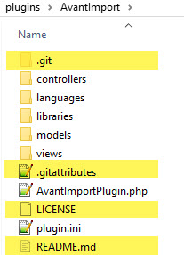

# GitHub and GitHub Desktop

---

## Create a new repository

- Run GitHub Desktop
- Choose `File > New Repository` from the top menu bar
- For **_Name_** use the same name as the folder containing the files.
  For example, if you are adding a new plugin located in `/plugins/AvantImport`, type `AvantImport` as the repository name.
- Provide a **_Description_** or leave it blank (you can add one later in GitHub online)  
- For **_Local path_**, choose the folder *containing* the folder that you want to make the repository from. For example,
  navigate to `/plugins`, **not** to the `AvantImport` folder.
- Check the **Initialize this repository with a README** checkbox
- Leave **_Git ignore_** as `None`
- Choose GNU GPLv3 for **_License_**
- Click the `Create Repository` button

The folder now contains new Git files as shown in the example below for the newly created AvantImport  
*local repository*. The files and folders highlighted in yellow were added by Git.

## Publish repository to GitHub

To upload the local repository to GitHub:

- Click the **_Publish repository_** button at the top of GitHub Desktop
- On the confirmation dialog, uncheck or check the `Keep this code private` checkbox
- Click the **_Publish repository_** button

## Commit changes locally

As you make changes to files in your text editor and save them locally, you also see the changes in GitHub Desktop.

- The green icon indicates added files. 
- The red icon indicates removed files. 
- The yellow icon indicates modified files. 

To commit the changes to the local repository (but not to GitHub in the cloud), you need to add a brief
comment describing the changes and then click the **_Commit to master_** button.

!!! Warning
    By default, every change is selected with a check mark as shown above. The comment and subsequent commit
    will apply to *all changed files in a single commit*, but this is usually *not* what you
    want to do.

    It is better to uncheck all the boxes and then comment/commit one at a time as explained below.

    If you accidentally commit all the files, see [how to rollback a commit](#rollback-a-commit-without-losing-any-changes)

To commit changes:

- Uncheck all the changes and then select the file(s) that your comment will apply to
- Type a brief comment
- Click the **_Commit to master_** button
- Repeat until all the files you want to commit have disappeared from the list of changes

## Push changes to GitHub

To push your committed changes to GitHub, click the **_Push origin_** button at the top of GitHub Desktop.

## Rollback a commit

Follow these steps to rollback a commit without losing any changes. Use this technique in the situation where
you inadvertently commit a set of files as a group, but meant to commit them individually with separate comments for each.

- In Windows Explorer, go the folder for the repository requiring the rollback.
- Right click and choose `Git Bash Here`
- Type `git log –-oneline` to see previous commits.
- If the list is too long to fit, type ‘q’ to quit listing.
- Locate the commit that you want to revert to (near the top of the listing).
  In the screenshot below, the most recent commit was `b7b3014`. To undo it,
  you need to reset to `8ae22a6`.
- Type `git reset ###` where `###` is the ID of that commit `e.g. d1f4960`.
- Press `Enter`
- Type `exit` to close the window.
- Commit each of the files again, and when all of them are committed, push the changes to the server. If you don’t commit all of them before pushing, you’ll get an error when you do the push because the files on the server will be out of sync with the local repository.

Before the reset to `8ae22a6`

After the reset

The steps above will move the Git HEAD pointer back to the older commit without modifying any of the files in the working directory. Thus, after performing these steps, all changed files will appear in the Git Desktop Changes tab so that you can commit them again.

Use of reset by itself is the same at `reset --mixed`. See [this video](https://www.youtube.com/watch?v=A3s8KxgDYRk) to learn more.

If you want to rollback and also restore all files to their state at the earlier commit, do a
 `reset --hard`, but be careful.

Note that for some reason copy/pasting from here into the Git Bash window does not work correctly. So just type commands manually.

## Change the commit comment

Follow these steps in the situation where you typed the wrong commit message and you have not done any other commits (it’s the message for the most recent commit).

- In Windows Explorer, go the folder for the repository you need to change the message for.
- Right click and choose `Git Bash Here``
- Type `git commit --amend -m "new message`.
- Type `exit` to close the window.

If you had already pushed the commit, you’ll need to push it again in which case you’ll see a ‘Merge branch’ commit in the history which presumably is syncing the old message on the server with the newly changed message.

See [this post](https://gist.github.com/nepsilon/156387acf9e1e72d48fa35c4fabef0b4) to learn about how to deal with older commits.

## Untrack files already in a repository

See [this article](http://www.codeblocq.com/2016/01/Untrack-files-already-added-to-git-repository-based-on-gitignore/)
and [this one](https://alvinalexander.com/git/git-rm-file-git-repository-dont-track-accidentally-added)
on how to untrack files that have already
been added to a repositiory.

