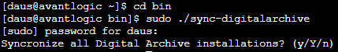

# Digital Archive site maintenance

---

## Omeka updates

## Plugin and Theme updates

To update the `plugins` and `themes` folders on all Digital Archive sites:

-   Go to cPanel for `digitalarchive.us` and choose `Terminal`
-   `cd bin`
-   `sudo ./sync-digitalarchive`
-   Type the password for user `daus`
-   Type an option:
    -   `y` to perform a dry run
    -   `Y` to perform the sync
    -   `n` or any other character to exit
-   Press `Enter`



The output is written to `log.txt`

## Common vocabulary updates

## Running scripts

### Root privlidges
A user with root privileges can run bash scripte that modify files on every Digital Archive installation on the server.

To assign a user root privileges via sudo:
-   Go to WHM and choose `Manage Wheel Groupt Users`
-   Add a user to the wheel group

A user in the `wheel` group can use the system's `su` and `sudo` utilities.

### Making a script executable
Use the `chmod` command to make a script file executable. For example, you can make file `foo` executable with this command:

```
chmod +x foo
```

To execuate the `foo` script type:

```
./foo
```

If a script requires root privileges, use `sudo` to run it. For example:

```
sudo ./foo
```
