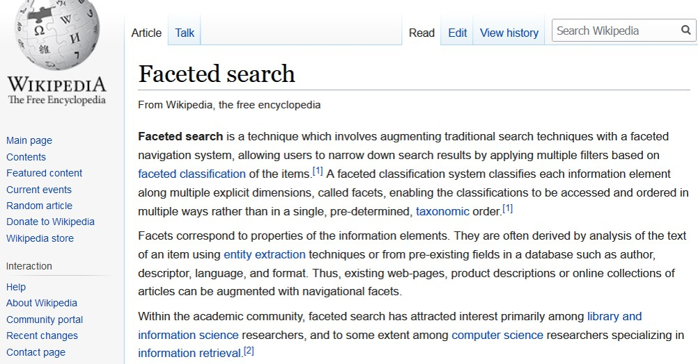

# Glossary

## Digital Archive terminology

This page explains the terminology used in this documenation and within the
Digital Archive.

-   Within an entry, words in *italics* are defined in this glossary
-   Words in parenthesis following an entry name indicate the context in which the entry is used

!!! note ""
    This glossary is under development and is not complete.

---

##### AvantLogic
[AvantLogic Corporation](http://avantlogic.com/) is the company that developed and currently maintains the
Digital Archive. *Omeka* plugins that begin with `Avant` were developed by AvantLogic.

##### AWS
Amazon Web Services

##### Collection
The *database* *items* for one organization.

##### Common Vocabulary
Subject, Type, and Place terms that are common to all shared Digital Archive sites.

##### Database
A database is an organized collection of data, generally stored and accessed electronically from a computer system.
The Digital Archive uses `MySQL` as its database.

##### Elasticsearch
A technology hosted on *AWS* that makes fast, shared searching possbile.

##### Element (Omeka)
An element is a container for a single *metadata* value. When you are editing an item, you enter data into
metadata fields, one for each element. Examples of elements are `Title`, `Description`, `Creator`, and `Date`.

##### Facets
Facets are *terms* used to aid in discovery.

##### Facets panel
The area on the far left of the Digital Archive search results page that displays *facets*.

##### Index (Elasticsearch)
An index is like a table in a database. 

##### Item (Omeka)
An item contains information about an object in a *collection* including its *metadata*, attached images and documents,
and a record of when the item was created and by whom. The metadata for an item is stored in elements.

##### Keyword
Any word in item metadata and text attachments.

##### Left admin menu
The menu on the left side of every page when logged into the Digital Archive as either
an archivist or administrator. Some left menu items only appear when logged in as an
administrator.

##### Local search
Results from just one *collection*.

##### Mapping
Associating a *vocabulary* *term* with a *facet* term

##### Metadata
Metadata is data that provides information about other data. For example, the metadata for a book is not the
contents of the book itself, but information *about* the book such as its title, author, and publisher. The
metadata for a photograph is not the image itself, but information *about* the image such as where and when
it was taken and by whom. 

##### Nomenclature 4.0
Nomenclature is a structured and controlled list of object terms organized in a classification system to provide
a basis for indexing and cataloging collections of human-made objects. Nomenclature is used in the creation
and management of object records in human history collections within museums and other organizations, and it
focuses on objects relevant to North American history and culture. Nomenclature is the most extensively used
museum classification and controlled vocabulary for historical and ethnological collections in North America.

[Visit the Nomenclature website](https://www.nomenclature.info/apropos-about.app?lang=en)

##### Omeka
Omeka provides open-source web publishing platforms for sharing digital collections and creating media-rich online exhibits.
Omeka is a project of the Corporation for Digital Scholarship, the Roy Rosenzweig Center for History and New Media, and George Mason University, with funding from multiple organizations.

The Digital Archive uses Omeka Classic as its foundation.

[Visit the Omeka website](https://omeka.org/)

##### Organization
A museum, library, historical society or other entity that makes its *collection* available
online using the Digital Archive.

##### Plugin
A plugin is a software component that adds or modifies features of existing computer programs.

##### Shared search
Comingled results from multiple collections.

##### Super user (Omeka)
An Omeka super user is someone having an Omeka login that allows them to do anything and everything in Omeka. Super users are the only users with access to the top navigation tabs for Plugins, Appearance, Users, and Settings.

##### Term
A word or short phrase in a *vocabulary* or *facet*.

##### Vocabulary
Terms that classify and index *collection* items.

