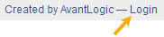

# Welcome to Digital Archive Docs

This website contains documentation about the Digital Archive.

!!! warning "Notice"
    This documentation is under development. It is incomplete and may contain incorect information.
    Do not rely on what you see here until this notice has been removed.

---

## Who this documentation is for
The documentation is divided into categories for these kinds of people:

- Users
- Archivists
- Administrators
- Developers

A fifth category is documentation about Digital Archive plugins that is of broad interest.

Each category is explained below. Some people will fall into more than one category.  
For example, an administrator is usually also an archivist and a user.

!!! note "Tip" 
    Use the **navigation** pane at left to locate the documentation that's right for you.  
    Or type in the **search box** to find topics of interest.

### User documentation
User documentation is for people who use the Digital Archive for research or just for fun.

A user (also commonly referred to as an end-user) can see all public items in a Digital Archive collection,
but has no access to non-public items, or private data associated with all items.

### Archivist documentation
Archivist documentation is for archivists and volunteers who maintain the collection content
for a Digital Archive site. They add new items, edit existing items, upload images, and establish
relationships among items.

An archivist has a user name and password that allow them to login to a Digital Archive site. Once logged in, they
can see all public items in the collection as well as non-public items and private data associated with all items.

Typically, an archivist's login will not allow them to make changes to the Digital Archive installation unless
the archivist is also an **Administrator**.

### Administrator documentation
Administrator documentation is for the person who performs administrative functions for their organization's
Digital Archive site. They edit vocabularies, configure plugin options, add new user accounts, define relationship
types and rules, and perform other similar tasks.

An administrator has a user name and password that allow them to login to a Digital Archive site. Once logged in, they
have all the privileges of an **Archivist**, but can also perform administrative functions.

### Developer documentation
Developer documentation is for technical people responsible for maintaining multiple Digital Archive sites.
They are responsible for database management, programming, software upgrades, web server management,
maintaining this documentation, and a variety of other tasks requiring technical expertise.

A Digital Archive developer must be familiar with the following technologies:

- HTML 
- CSS
- JavaScript
- PHP
- Python
- SQL
- XML
- Omeka
- Zend Framework
- [GitHub](developer/github.md)
- Linux
- Elasticsearch
- AWS S3

### Digital Archive plugins

Digital Archive plugin documentation is in a separate category because it should be of interest to
everyone except for end users.

-   **Archivists** should be familiar with the features of various plugins
-   **Administrators** need to know how to configure plugins
-   **Developers** install, maintain and enhance plugins

## Logging into the Digital Archive

*Archivists* and *Administrators* must login to the Digital Archive to add or edit items or make modifications to the installation. There is also a special class of *User* called *Guest* that must login if they want to see information that is not available to the general public.

### How to login

Follow these steps to login to the Digital Archive:

-   Go to the site and click the `Login` link located at the lower right on every page

-   On the `Log In` page, enter your user name and password. If you logged is as an *Archivist* or
    *Administrator*, a dark gray menu bar will appear at the top of the page. To access features
    that are only available to *Archivist* or *Administrator* logins, click your login name which
    appears at the far right in the menu bar.

-   If you are logged is as a *Guest* you will not see the dark gray menu bar; however you will be able to views items
    that are not visible to users who are not logged in. You will also be able to see the private fields
    for all items.

### Terminology

The terminololgy used in this documentation differs from
[Omeka terminology for user roles](https://omeka.org/classic/docs/Admin/Users/).  
The table below shows the differences.

Digital Archive term | Omeka user role
---:|---
Guest|researcher
Archivist|admin *or* contributor
Administrator|super

---

This documentation was written by AvantLogic Corporation.

Please report errors and omissions to <gsoules@avantlogic.com>.

