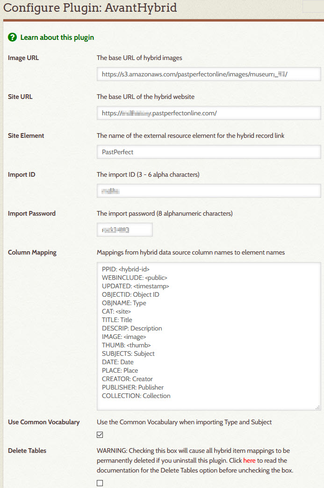

# AvantHybrid

---

The AvantHybrid plugin provides support for Digital Archive items that originate from, and are maintained
in, another database but are displayed by, and searchable from, the Digital Archive.
They are called *hybrid* items because they are composed of data from two difference sources.

---

>   Terminology

Hybrid item
:   A hybrid item is a Digital Archive item that corresponds to a **source record** that is stored in a **source database**.

Source record
:   A source record is a **source database** record which has a corresponding **hybrid item** in the Digital Archive.
    The word "record" is a database term referring to a collection of fields about the same item in a database. While the terms *record*
    and *item* are synonymous, this AvantHybrid documentation uses  record as a way to distinguish data stored in a
    **source database** from an item's data stored in the Digital Archive.

Source database
:   A source database is a database that is separate from and external to the Digital Archive. It stores **source record**s.
    The dBase database used by PastPerfect is an example of a source database.

Source database software
:   Source database software refers to a computer program that is used to add, edit, and delete records in
    a **source database**. PastPerfect is an example of source database software.

Image server
:   An image server is a web server that stores the images associated with the records in a  
    **source database**. Amazon S3 is an example of an image server. It is used by PastPerfect Online.

---

> AvantHybrid features

The AvantHybrid plugin:

-   Imports data that has been exported from a source database. The import feature:
    -   Creates new hybrid items for new source records
    -   Updates the metadata of hybrid items for which their source records have changed
    -   Deletes hybrid items that no longer exist in the source database
-   Displays hybrid items in the Digital Archive by displaying an item's:
    -   Metadata which AvantHybrid imported from the source database
    -   Images located on the source database software's image server

> Example

Here is an example to help tie together the features and terminology. It uses PastPerfect as the
source database software, but the AvantHybrid plugin has no knowledge of PastPerfect or the format of its data.
AvantHybrid will work with data exported from any source database as long as it conforms to the
[data format](#data-format) described later.

When you add a new source record and image in PastPerfect:

-   The PastPerfect source database software:
    -   Adds the record's data to PastPerfect's dBase source database
    -   Stores the record's image on the local PastPerfect desktop computer or network
-   When you synchronize PastPerfect with PastPerfect Online, PastPerfect uploads the image to the
    Amazon S3 image server used by PastPerfect Online
-   When you export data from PastPerfect's dBase source database and then use AvantHybrid to import the data into the
    Digital Archive, AvantHybrid:
    -   Creates a new hybrid item corresponding to the new PastPerfect source record
    -   Copies the source record's metadata to the hybrid item's metadata fields
    -   Records the URLs for the source record's image, but does not copy the image file
-   When you view the hybrid item in the Digital Archive, the AvantHybrid plugin:
    -   Displays the hybrid item's metadata
    -   Makes a request to the Amazon S3 image server to display the hybrid item's image
-   If later you edit the source record's metadata in PastPerfect, export the data from PastPerfect,
    and import the data into the Digital Archive, AvantHybrid will *completely replace*, not merge,
    the hybrid item's metadata with the data from the source record.
---

!!! note "Important"
    Do not edit the metadata fields of hybrid items using the Digital Archive. Only make changes using the
    source database software. As explained in the last bullet above, metadata imported from a source
    record completely replaces existing hybrid metadata. As such, if you were to edit the hybrid item
    in the Digital Archive, a subsequent import of the data for that item would clobber your changes.

## Configuration options
AvantHybrid has these configuration options:

Image URL
:   Use this option to specify the base URL for hybrid images and thumbnails.

Site URL
:   Use this option to specify the base URL for hybrid records. This option is only required
    if the **_Site Element_** option is specified.

Site Element
:   Use this option to specify the name of the Omeka element that you want to use to display
    a link to the webpage that is the source of a hybrid item's metadata and images. That 
    element should be specified in the [External Link option](/plugins/avantelements/#external-link-option)
    of the AvantElements plugin. If this option is used, the **_Site URL_** option must be specified.

Synchronization Password
:   This option specifies an eight character password that must be passed when making a remote
    request to AvantHybrid to update hybrid items that have been added, updated, or deleted.

Column Mapping
:   Use this option to associate source columns with hybrid element properties and elements.

Delete Tables
:   WARNING: Checking this option will cause all hybrid item mappings to be permanently deleted if you uninstall this plugin.

## Data format

`<image>` and `<thumb>`
:   The `<image>` and `<thumb>` columns must each contain a semicolon-separated list of
    zero or more file names which when appended to the **_Image URL_** option value will produce a valid
    image or thumbnail URL.

    The image and thumb values must correspond to each other, that is, they must have the same number of
    values, and the values must be for the same image. For example:  
    `015/002614.jpg;016/002614-2.jpg` and `015/thumbs/002614.jpg;016/thumbs/002614-2.jpg`

`<public>`
:   A `1` in this column indicated that the hybrid items should be public. Any other values means it is not public. 

## Synchronization

The AvantHybrid plugin synchronizes data exported from a source database with hybrid items in the
Digital Archive. It can work with data from any source as long as the data can be exported into a CSV
file that meets the AvantHybrid requirements. 

## Remote request

The AvantHybrid plugin will respond to a remote request where the following arguments are posted:

-   `action`
-   `filename`
-   `password`

Action
:   The action must be `hybrid-update`. The action will add, update, or delete hybrid items in the Digital Archive
    that have been added, updated, or deleted in the source database.

Filename
:   The filename must be the name of a CSV file located in `public_html/digitalarchive/files/hybrid`.

    The file must have columns corresponding to those specified in the **_Column Mapping_** configuration
    option value. The order of the columns in the file need not match the order specified in the option,
    but the spelling and letter casing of the file's column names must exactly match the mapping.

    The file must contain a header row containing the column names, followed by one row for *every* record
    in the source database. The `<hybrid-id>` value must be provided for *every* row, but the other columns
    should only be provided for source records that have been added or changed. If the `<timestamp>` column
    is blank, AvantHybrid assumes that the record has not changed. AvantHybrid does not use the value of the
    `<timestamp>` column except for this purpose.

    If a record has been deleted in the source database, it should *not* be included in the file. AvantHybrid
    will determine which hybrid item(s) to delete based on their omission from the file. That is, AvantHybrid
    will check for the presence of every hybrid item in the Digital Archive within the file and if it does not
    find one, it will delete that hybrid item.

Password
:   The password must match the **_Synchronization Password_** configuration option value.

## Common Vocabulary
If the [AvantVocabulary](/plugins/avantvocabulary/) plugin is installed and activated, AvantHybrid will attempt
to convert **_Type_** and **_Subject_** values from the source database to [Common Vocabulary](/archivist/common-vocabulary/)
terms. If the source value matches a [Common Vocabulary leaf](/technology/common-vocabulary-translator/#leaf), the
value will be changed to the corresponding Common Vocabulary term. For example, the source term `Yearbook` will
automatically be changed to `Publication, Yearbook`. For this to work, source leaf values must be in Nomenclature
*natural order*.

## Dependencies
The AvantHybrid plugin requires that the [AvantCommon] plugin be installed and activated.

## Installation

To install the AvantHybrid plugin, follow these steps:

1. First install and activate the [AvantCommon] plugin.
1. Download the latest release from <https://github.com/gsoules/AvantHybrid>
1. Unzip `AvantHybrid-master.zip` into your Omeka `plugins` folder
1. Rename the folder to `AvantHybrid`
1. Activate the plugin from the Omeka `Plugins` page

## Warning

Use this software at your own risk.

##  License

This plugin is published under [GNU/GPL].

This program is free software; you can redistribute it and/or modify it under
the terms of the GNU General Public License as published by the Free Software
Foundation; either version 3 of the License, or (at your option) any later
version.

This program is distributed in the hope that it will be useful, but WITHOUT
ANY WARRANTY; without even the implied warranty of MERCHANTABILITY or FITNESS
FOR A PARTICULAR PURPOSE. See the GNU General Public License for more
details.

You should have received a copy of the GNU General Public License along with
this program; if not, write to the Free Software Foundation, Inc.,
51 Franklin Street, Fifth Floor, Boston, MA 02110-1301 USA.

Copyright
---------

-   Created by [gsoules](https://github.com/gsoules) 
-   Copyright George Soules, 2020.
-   See [LICENSE](https://github.com/gsoules/AvantHybrid/blob/master/LICENSE) for more information.

[AvantCommon]:        avantcommon.md