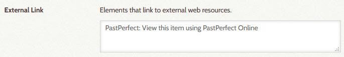

# AvantHybrid

---

The AvantHybrid plugin provides support for Digital Archive items that originate from, and are maintained
in, another collection management program, such as PastPerfect, but are displayed by, and searchable from,
the Digital Archive. They are called *hybrid* items because they are formed from two difference sources of data.

AvantLogic developed this plugin, along with the [PastPerfect Exporter](/technology/pastperfect-exporter/)
to provide a way for organizations who use PastPerfect, to share their collections
using the Digital Archive while continuing to perform collection management using PastPerfect. However, 
*the AvantHybrid plugin has no knowledge of PastPerfect or the format of its data*. AvantHybrid will work with
data from any source database as long as its data conforms to the [data format](#data-format) described later.


---

>   Terminology

Hybrid item
:   A hybrid item is a Digital Archive item that corresponds to a **source record** that is stored in a **source database**.

Source database
:   A source database is a database that is separate from and external to the Digital Archive.  
    A source database stores **source record**s.
    The [dBase](https://en.wikipedia.org/wiki/DBase) database used by PastPerfect is an example of a source database.

Source record
:   A source record is a **source database** record which has a corresponding **hybrid item** in the Digital Archive.
    The word "record" is a database term referring to a collection of fields about the same item in a database. While the terms *record*
    and *item* are synonymous, this AvantHybrid documentation uses *record* as a way to distinguish data stored in a
    **source database** from a **hyrbid item**'s data stored in the Digital Archive.

Source database software
:   Source database software refers to a computer program that is used to add, edit, and delete records in
    a **source database**. PastPerfect is an example of source database software.

Image server
:   An image server is a web server that stores the images associated with the records in a  
    **source database**. Amazon S3 is an example of an image server. It is used by PastPerfect Online.

---

> AvantHybrid features

The AvantHybrid plugin:

-   **[Imports data](#data-import)** that has been exported from a source database. The import feature:
    -   Creates new hybrid items for new source records added to the source database
    -   Updates hybrid items whose source records have changed in the source database
    -   Deletes hybrid items that no longer exist in the source database
-   **Displays hybrid items** in the Digital Archive by displaying an item's:
    -   Metadata which AvantHybrid imported from the source database
    -   Images located on the source database software's image server
-   **Lets you attach files** (such as a PDF or a zoomable image) hybrid items
-   **Lets you add relationships** to, hybrid items

> Example

Here is an example to help tie together the features and terminology.

When you add a new source record and image in PastPerfect:

-   The PastPerfect source database software:
    -   Adds a new record to PastPerfect's dBase source database
    -   Stores the record's image on the local PastPerfect desktop computer or network
-   When you run PastPerfect's Web Publishing Wizard, PastPerfect uploads the image to the
    Amazon S3 image server used by PastPerfect Online
-   When you run the [PastPerfect Exporter](/technology/pastperfect-exporter/) to import data
    into the Digital Archive, AvantHybrid:
    -   Creates a new hybrid item corresponding to the new PastPerfect source record
    -   Copies the source record's metadata to the Digital Archive
    -   Records the URLs for the source record's image(s), but does not copy the image files
        to the Digital Archive (the images only ever exists on the Amazon S3 server)
-   When you view the hybrid item in the Digital Archive, the AvantHybrid plugin:
    -   Displays the hybrid item's metadata from the Digital Archive
    -   Makes a request to the Amazon S3 image server to display the hybrid item's images
-   When you later edit the source record's metadata in PastPerfect and then run the
    PastPerfect Exporter, AvantHybrid will *completely replace*, not merge,
    the hybrid item's metadata with the data from the source record.
---

!!! note "Important"
    Do not edit the metadata fields of hybrid items using the Digital Archive. Only make changes using the
    source database software. As explained in the last bullet above, metadata imported from a source
    record completely replaces existing hybrid metadata. As such, if you were to edit the hybrid item
    in the Digital Archive, a subsequent import of the data for that item would clobber your changes.

    After changing records in PastPerfect, or adding images to records, be sure to run PastPerfect's
    Web Publishing Feature to syncronize your local PastPerfect data and images with PastPerfect Online.
    If you don't do this, the data and images exported by the PastPerfect Exporter into the Digital Archive
    will become out of sync with the data and images on PastPerfect Online.

## Configuration options
AvantHybrid has these configuration options. Once they are properly set for your installation,
you'll probably never need to update them again.

Image URL
:   Use this option to specify the base URL for hybrid images and thumbnails. AvantHybrid will
    append the values of the `<image>` and `<thumb>` columns to form the URL for an image.

Site URL
:   Use this option to specify the base URL for hybrid records. This option is only required
    if the **_Site Element_** option is specified. AvantHybrid will
    append the value of the `<site>` column to form the URL for a source record's online webpage.

Site Element
:   Use this option to specify the name of the Omeka element used to display
    a link to the webpage for a source record.  If this option is used, the **_Site URL_**
    option must be specified. The element should be specified in the
    [External Link option](/plugins/avantelements/#external-link-option)
    of the AvantElements plugin as shown in the screenshot below taken from the AvantElements configuration page.



Import ID
:   This option specifies a three to six character site ID that must be passed when making a remote
    request to AvantHybrid to import source records.

Import Password
:   This option specifies an eight character password that must be passed when making a remote
    request to AvantHybrid to import source records.

Column Mapping
:   Use this option to associate source record columns with hybrid item element properties and
    Omeka element names. The option requires that *all* of the following properties be mapped:

    -   `<hybrid-id>` is an identifier that uniquely identifies a source record in the source database
    -   `<image>` forms the URL for the source record's image when appended to **_Image URL_**
    -   `<thumb>` forms the URL for the source record's thumbnail when appended to **_Image URL_**
    -   `<public>` is a value of '1' if the hybrid item should be public
    -   `<site>` forms a link to the source record's webpage when appended to **_Site URL_**

    The mappings for these properties are highlighted in yellow in the screenshot that follows.

Use Common Vocabulary
:   Checking this option will cause AvantHybrid to attempt to convert **_Type_** and **_Subject_** values from
    each source record to [Common Vocabulary](/archivist/common-vocabulary/) terms. If the source record value
    matches a [Common Vocabulary leaf](/technology/common-vocabulary-translator/#leaf), AvantHybrid will change
    the value  to the corresponding Common Vocabulary term. For example, it will automatically change , the
    source record Type `Yearbook` to `Publication, Yearbook`. If no match is found, AvantHybrid will prepend `Other, `
    to the value. For this to work, source leaf values must be in Nomenclature  *natural order*
    (the [PastPerfect Exporter](/technology/pastperfect-exporter/) automatically convert's PastPerfect's
    inverted order to natural order).

Delete Tables
:   WARNING: Checking this option will cause all of these configuration options, and all information about
    hybrid items, to be permanently deleted if you uninstall this plugin.

Here is a screenshot showing all of the AvantHybrid configuration options.
The yellow highlighter points out required Column Mapping properties


## Data format

This section describes the format of the data that columns in source records must conform to.

`<hybrid-id>`
:   A number or text value that uniquely identifies a source record.

    Example: `58DF9E02-0D98-429B-B9E8-666324969299`

`<image>` and `<thumb>`
:   The `<image>` and `<thumb>` columns must each contain a semicolon-separated list of
    zero or more file names which when appended to the **_Image URL_** option value will form a valid
    image or thumbnail URL on the source database's image server. The two columns must have the same
    number of values, in the same sequence, for the same image.

    Example:  
    <image\> : `015/002614.jpg;016/002614-2.jpg`  
    <thumb\> : `015/thumbs/002614.jpg;016/thumbs/002614-2.jpg`

    If the source record has no images, both values must be blank.

`<public>`
:   A `1` in this column indicates that the hybrid item should be public. Any other values means it is not public.

`<site>`
:   The value of this column, when appended to the **_Site URL_** option value, must form a valid URL that
    links to the source record's
    web page. If the value itself contains `<hybrid-id>`, AvantHybrid will replace `<hybrid-id>` with the value
    of the `<hybrid-id>` column when forming the URL.  
     
    Example: `archive/<hybrid-id>`
    
    The link might not be valid if the item is private since private items may not have a source record web page.

Element names
:   All other columns are the names of Omeka elements and must contain values appropriate for those
    elements. Multiple values for the same element can be specified as a semi-colon separated list.
    For example, the **_Subject_** column can contain a semi-colon separated list of subject terms.

## Data import

The AvantHybrid plugin imports one source record at a time upon receipt of an HTTP request to add,
update, or delete the corresponding hybrid item. There is no other mechanism for importing source
records into the Digital Archive as hybrid items. The HTTP requests are made by a program such as
the [PastPerfect Exporter](/technology/pastperfect-exporter/).

### HTTP requests

The HTTP request must POST to the Digital Archive site's `avant/remote` page. For example:

``` text
https://yourdomain.net/digitalarchive/avant/remote
```

Each HTTP request must POST the following arguments:

-   `id`
-   `password`
-   `action`
-   `options`
-   `data`

id
:   The value of the `id` argument must match the AvantHybrid **_Import ID_** configuration option value.
    If the IDs don't match, AvantHybrid will deny the request.

password
:   The value of the `password` argument must match the AvantHybrid **_Import Password_** configuration option value.
    If the passwords don't match, AvantHybrid will deny the request.

action
:   The value of the `action` argument must be one of the actions listed in the HTTP actions section below.

options
:   The value of the `options` argument must be a comma separated list of zero or more of the following options:

    -   `bulk`
    -   `trace`

    The `trace` option is for developers how want to see information about how AvantHybrid processed the request.

    The `bulk` option is explained later in the Bulk import section.

data
:   The value of the `data` option must a plain text string containing JSON for the source record data.
    The data must conform to the [Data format](#data-format) described above. An example appears below.

``` text
{'PPID': 'B427FDC4-5A2A-42AA-A146-337349578482', 'OBJECTID': '001-056-1-2161',
'OBJNAME': 'Annual Meeting report', 'TITLE': 'Annual Meeting of the Garden Club of America',
'IMAGE': '008/00105612161.jpg', 'THUMB': '008/thumbs/00105612161.jpg', 'WEBINCLUDE': '1',
'SITE': 'archive/<hybrid-id>', 'CAT': 'Archives', 'SUBJECTS': 'Gardens;History',
'DATE': '1934', 'PLACE': '', 'CREATOR': '', 'PUBLISHER': '', 'COLLECTION': '',
'DESCRIP': 'Yellow bound yearbook program with pencil reading Garden Club of Mt. Desert.'}
```

### HTTP actions

The `action` argument of the HTTP request must be one of the following:

-   `hybrid-fetch`
-   `hybrid-add`
-   `hybrid-update`
-   `hybrid-delete`
-   `hybrid-delete-all`

hybrid-fetch
:   The `hybrid-fetch` action requests that AvantHybrid return a list of all hybrid items in the Digital
    Archive. The list is a JSON string containing a key/value pair for every hybrid item. The 
    key is the hybrid item's Id and the value is the date and time when the hybrid item was added to or
    last updated in the Digital Archive. The example below shows a partial response to this request.

``` json
{
    "status":"OK",
    "site-id":"xyz",
    "results":
        {
            "B427FDC4-5A2A-42AA-A146-337349578482":"2020-09-15 10:41:47",
            "4DC3489E-DDB2-40F7-BA97-289319265115":"2020-09-15 13:03:12",
            "8ACFFAE1-E96A-4A88-935A-425394802117":"2020-09-15 13:03:11",
            "FEF5148F-B4B4-4261-825A-428752422927":"2020-09-15 13:03:13",
            ...
        }
}
```

hybrid-add
:   The `hybrid-add` action requests that AvantHybrid create a new hybrid item for the source record 
    contained in the `data` argument.

hybrid-update
:   The `hybrid-update` action requests that AvantHybrid update the existing hybrid item for the source record 
    contained in the `data` argument.

hybrid-delete
:   The `hybrid-delete` action requests that AvantHybrid delete the existing hybrid item for the source record 
    contained in the `data` argument. The `data` only needs to contain the `<hbrid-id>` for the source record.

hybrid-delete-all
:   The `hybrid-delete-all` action requests that AvantHybrid delete *every* hybrid item from the Digital Archive.
    It will also delete any files attached to those items and remove any relationships for those items.

    **Use this action with caution**. The only time you should use it are if you no longer want records from
    another database to appear in the Digital Archive.

    **Important:** The delete all action is performed as a [bulk import](#bulk-import) whether or not
    `bulk` is passed in the `options` argument. As such, you must
    [rebuild the sites Elasticsearch indexes](/administrator/reindex) after performing this action.


### For developers

The AvantHybrid's import feature is normally invoked via a remote POST request to the Digital Archive
site's `avant/remote` page. It can also be invoked by a developer who is logged in as an administrator and makes
a GET request passing the POST arguments as query string parameters as shown in the example below.

`http://localhost/omeka/avant/remote?id=xyz&password=abcd1234&action=hybrid-add&options=trace&debug`

The `debug` argument is used to make the response appear in the browser as plain text instead of as JSON.

### Request response

A request to AvantHybrid *always* returns a 200 response code. Any other code would mean that
either the request URL was invalid (404 response code) or there was a server error (e.g. 500 response code).
The response is JSON that contains three values: `status`, `site-id`, and `results` as shown in the example below.

``` json
{
    "status":"OK",
    "site-id":"xyz",
    "results":"Updated item 1052 for record B427FDC4-5A2A-42AA-A146-337349578482"
}
```

If AvantHybrid accepted the request, the value of `status` will be `OK` and the value of `site-id` will match the `id`
argument passed to the request. For security purposes, the caller should verify that the IDs match. A `status` other than
`OK` will indicate why the request was rejected (for example, an invalid ID, password, or action).

The `results` value for an accepted request is usually just an informative message indicating what action
AvantHybrid performed. If `trace` was passed to the request in the `options` argument, the result may
contain additional information of interest to developers. The exception is the `hyrbrid-fetch` request
which returns a JSON string of hybrid items as the result.

### Bulk import

When `bulk` is passed to the request in the `options` argument, AvantHybrid assumes that the requestor
will be making repeated HTTP requests and wants them to be executed as quickly as possible. To more
quickly perform an add, import, or delete action, AvantHybrid does not update the site's local and shared
Elasticsearch indexes as part of the action. As such, after all of the bulk HTTP requests have been
made, **you must** [rebuild the site's Elasticsearch indexes](/administrator/reindex).

### The import process

As this documentation has explained, AvantHybrid only imports one source record at a time. It has no
knowledge of the source database or what source records need to be added, updated, or deleted in the
Digital Archive. Correct synchronization, via HTTP requests to AvantHybrid, between the source database
and the Digital Archive is entirely the responsibility of the program making the HTTP requests. To
learn more, read about the [PastPerfect Exporter](/technology/pastperfect-exporter/).


## Dependencies
The AvantHybrid plugin requires that the [AvantCommon] plugin be installed and activated.

In order to use the **_Use Common Vocabulary_** configuration option, the [AvantVocabulary] plugin
must be installed and activated.

## Installation

To install the AvantHybrid plugin, follow these steps:

1. First install and activate the [AvantCommon] plugin.
1. Download the latest release from <https://github.com/gsoules/AvantHybrid>
1. Unzip `AvantHybrid-master.zip` into your Omeka `plugins` folder
1. Rename the folder to `AvantHybrid`
1. Activate the plugin from the Omeka `Plugins` page

## Warning

Use this software at your own risk.

##  License

This plugin is published under [GNU/GPL].

This program is free software; you can redistribute it and/or modify it under
the terms of the GNU General Public License as published by the Free Software
Foundation; either version 3 of the License, or (at your option) any later
version.

This program is distributed in the hope that it will be useful, but WITHOUT
ANY WARRANTY; without even the implied warranty of MERCHANTABILITY or FITNESS
FOR A PARTICULAR PURPOSE. See the GNU General Public License for more
details.

You should have received a copy of the GNU General Public License along with
this program; if not, write to the Free Software Foundation, Inc.,
51 Franklin Street, Fifth Floor, Boston, MA 02110-1301 USA.

Copyright
---------

-   Created by [gsoules](https://github.com/gsoules) 
-   Copyright George Soules, 2020.
-   See [LICENSE](https://github.com/gsoules/AvantHybrid/blob/master/LICENSE) for more information.


[AvantCommon]:        avantcommon.md
[AvantVocabulary]:    avantvocabulary.md
