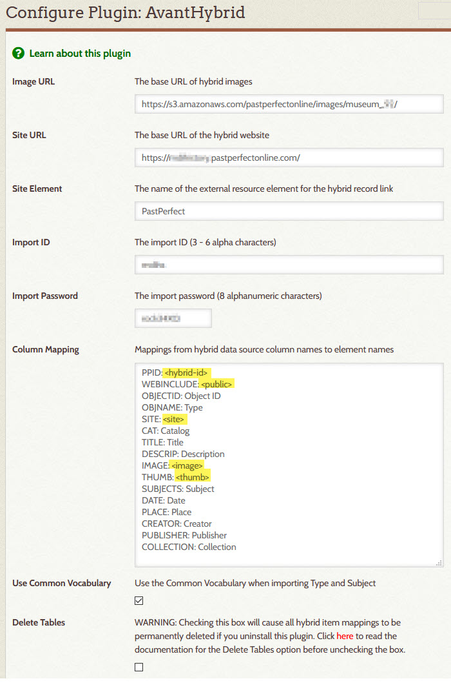

# AvantHybrid

---

The AvantHybrid plugin provides support for Digital Archive items that originate from, and are maintained
in, another database but are displayed by, and searchable from, the Digital Archive.
They are called *hybrid* items because they are formed from two difference sources of data.

---

>   Terminology

Hybrid item
:   A hybrid item is a Digital Archive item that corresponds to a **source record** that is stored in a **source database**.

Source database
:   A source database is a database that is separate from and external to the Digital Archive. It stores **source record**s.
    The [dBase](https://en.wikipedia.org/wiki/DBase) database used by PastPerfect is an example of a source database.

Source record
:   A source record is a **source database** record which has a corresponding **hybrid item** in the Digital Archive.
    The word "record" is a database term referring to a collection of fields about the same item in a database. While the terms *record*
    and *item* are synonymous, this AvantHybrid documentation uses *record* as a way to distinguish data stored in a
    **source database** from a **hyrbid item**'s data stored in the Digital Archive.

Source database software
:   Source database software refers to a computer program that is used to add, edit, and delete records in
    a **source database**. PastPerfect is an example of source database software.

Image server
:   An image server is a web server that stores the images associated with the records in a  
    **source database**. Amazon S3 is an example of an image server. It is used by PastPerfect Online.

---

> AvantHybrid features

The AvantHybrid plugin:

-   Imports data that has been exported from a source database. The import feature:
    -   Creates new hybrid items for new source records
    -   Updates the metadata of hybrid items for which their source records have changed
    -   Deletes hybrid items that no longer exist in the source database
-   Displays hybrid items in the Digital Archive by displaying an item's:
    -   Metadata which AvantHybrid imported from the source database
    -   Images located on the source database software's image server
-   Allows you to use the Digital Archive to add attach additional files (such as a PDF
    or a zoomable image), and add relationships to, hybrid items

> Example

Here is an example to help tie together the features and terminology. It uses PastPerfect as the
source database software, but the AvantHybrid plugin has no knowledge of PastPerfect or the format of its data.
AvantHybrid will work with data exported from any source database as long as it conforms to the
[data format](#data-format) described later.

When you add a new source record and image in PastPerfect:

-   The PastPerfect source database software:
    -   Adds the record's data to PastPerfect's dBase source database
    -   Stores the record's image on the local PastPerfect desktop computer or network
-   When you synchronize PastPerfect with PastPerfect Online, PastPerfect uploads the image to the
    Amazon S3 image server used by PastPerfect Online
-   When you export data from PastPerfect's dBase source database and then use AvantHybrid to import the data into the
    Digital Archive, AvantHybrid:
    -   Creates a new hybrid item corresponding to the new PastPerfect source record
    -   Copies the source record's metadata to the hybrid item's metadata fields
    -   Records the URLs for the source record's image, but does not copy the image file
-   When you view the hybrid item in the Digital Archive, the AvantHybrid plugin:
    -   Displays the hybrid item's metadata
    -   Makes a request to the Amazon S3 image server to display the hybrid item's image
-   If later you edit the source record's metadata in PastPerfect, export the data from PastPerfect,
    and import the data into the Digital Archive, AvantHybrid will *completely replace*, not merge,
    the hybrid item's metadata with the data from the source record.
---

!!! note "Important"
    Do not edit the metadata fields of hybrid items using the Digital Archive. Only make changes using the
    source database software. As explained in the last bullet above, metadata imported from a source
    record completely replaces existing hybrid metadata. As such, if you were to edit the hybrid item
    in the Digital Archive, a subsequent import of the data for that item would clobber your changes.

## Configuration options
AvantHybrid has these configuration options:

Image URL
:   Use this option to specify the base URL for hybrid images and thumbnails. AvantHybrid will
    append the values of the `<image>` and `<thumb>` columns to form the URL for an image.

Site URL
:   Use this option to specify the base URL for hybrid records. This option is only required
    if the **_Site Element_** option is specified. AvantHybrid will
    append the value of the `<site>` column to form the URL for a source record's online webpage.

Site Element
:   Use this option to specify the name of the Omeka element used to display
    a link to the webpage for a source record. The 
    element should be specified in the [External Link option](/plugins/avantelements/#external-link-option)
    of the AvantElements plugin. If this option is used, the **_Site URL_** option must be specified.

Import ID
:   This option specifies a six character site ID that must be passed when making a remote
    request to AvantHybrid to import source records.

Import Password
:   This option specifies an eight character password that must be passed when making a remote
    request to AvantHybrid to import source records.

Column Mapping
:   Use this option to associate source record columns with hybrid item element properties and elements.
    The option requires that all of the following properties be mapped:

    -   `<hybrid-id>` is an identifier that uniquely identifies a source record in the source database
    -   `<timestamp>` a non-blank value indicates that the source record has changed
    -   `<image>` forms the URL for the source record's image when appended to **_Image URL_**
    -   `<thumb>` forms the URL for the source record's thumbnail when appended to **_Image URL_**
    -   `<public>` is a value of '1' if the hybrid item should be public
    -   `<site>` forms a link to the source record's webpage when appended to **_Site URL_** 

Use Common Vocabulary
:   Checking this option will cause AvantHybrid to attempt to convert **_Type_** and **_Subject_** values from
    each source record to [Common Vocabulary](/archivist/common-vocabulary/) terms. If the source record value
    matches a [Common Vocabulary leaf](/technology/common-vocabulary-translator/#leaf), the value will be changed
    to the corresponding Common Vocabulary term. For example, the source record Type `Yearbook` will
    automatically be changed to `Publication, Yearbook`. If no match is found, AvantHybrid will prepend `Other, `
    to the value. For this to work, source leaf values must be in Nomenclature  *natural order*.
    The [AvantVocabulary](/plugins/avantvocabulary/) plugin must be installed and activated to use this feature.

Delete Tables
:   WARNING: Checking this option will cause all of these configuration options, and all information about
    hybrid items, to be permanently deleted if you uninstall this plugin.

## Data format

This section describes the format of the data that rows in the import file must conform to.

`<hybrid-id>`
:   Any value that uniquely identifies a source record.

    Example: `58DF9E02-0D98-429B-B9E8-666324969299`

    If the Digital Archive contains a hybrid item having
    a hybrid ID that does not exist in this column for any row of the import file, the AvantHybrid plugin
    will interpret this to mean that the hybrid-item's source record has been deleted from the source database,
    and delete the Hybrid item from the Digital Archive. Any files or relationships attached to the  hybrid
    item using the Digital Archive will be deleted as well.

`<timestamp>`
:   -   A blank value means the source record identified by `<hybrid-id>` exists in the source database,
        but has not changed since the last import
    -   A non-blank value means that the source record identified by `<hybrid-id>`has either been added
        to or changed in the source database since the last import
    
    While the example below shows a valid timestamp, the AvantHybrid
    plugin does not use this value for any other purpose than to detect records that have be added or changed.  
    Example: `2020-09-03 12:01:06`

`<image>` and `<thumb>`
:   The `<image>` and `<thumb>` columns must each contain a semicolon-separated list of
    zero or more file names which when appended to the **_Image URL_** option value will form a valid
    image or thumbnail URL on the source database's image server. The two columns must have the same
    number of values, in the same sequence, for the same image. Both values must be blank if the source
    record has no images.
    Example:  
    `<image>` : `015/002614.jpg;016/002614-2.jpg`  
    `<thumb>` : `015/thumbs/002614.jpg;016/thumbs/002614-2.jpg`

`<public>`
:   A `1` in this column indicated that the hybrid items should be public. Any other values means it is not public.

`<site>`
:   The value of this column, when appended to the **_Site URL_** option value, will form a valid URL to the source record's
    webpage. If the value itself contains `<hybrid-id>`, AvantHybrid will replace `<hybrid-id>` with the value
    of the `<hybrid-id>` column when forming the URL.  
    Example: `archive/<hybrid-id>`

Element names
:   All other columns are the names of Omeka elements and must contain values appropriate for those
    elements. Multiple values for the same element can be specified in a semi-colon separated list.

## Data import

The AvantHybrid plugin imports data that is exported from a source database into a CSV file that
conforms to the data format described in the previous section.

The plugin:

-   Creates a new hybrid item in the Digital Archive for each source record that has been added to the
    source database since the last import
-   Updates an existing hybrid item in the Digital Archive for each source record that has been updated in the
    source database since the last import
-   Deletes hybrid items from the Digital Archive that have been deleted from the source database
    since the last import

### Remote request

The AvantHybrid's import feature is normally invoked via a remote POST request to the Digital Archive
site's `avant/remote` page. It can also be invoked by a developer who is logged in as an administrator and makes
a GET request via query string parameters.

The AvantHybrid plugin will respond to a remote request where the following arguments are posted:

-   `action`
-   `filename`
-   `site`
-   `password`

Action
:   The action must be `hybrid-import`. The action will add, update, or delete hybrid items in the Digital Archive
    that have been added, updated, or deleted in the source database.

Filename
:   The file name must be the name of a CSV import file located in `public_html/digitalarchive/files/hybrid`.

    The file must have columns corresponding to those specified in the **_Column Mapping_** configuration
    option value. The order of the columns in the file need not match the order specified in the option,
    but the spelling and letter casing of the file's column names must exactly match the mapping.

    The file must contain a header row containing the column names, followed by one row for *every* record
    in the source database. The `<hybrid-id>` value must be provided for *every* row, but the other columns
    should only be provided for source records that have been added or changed. If the `<timestamp>` column
    is blank, AvantHybrid assumes that the source record has not changed and ignores all of the other columns.

    If a record has been deleted in the source database, it must *not* be included in the import file. AvantHybrid
    will determine which hybrid item(s) to delete based on their omission from the file.

Site
:   The site must match the **_Site ID_** configuration option value.

Password
:   The password must match the **_Import Password_** configuration option value.

If the same file is inadvertently posted more than once, the AvantHybrid will interpret and act on the data in a
way that will leave the Digital Archive in the same state as it was following the original post. In other words,
no harm will be done.

### Remote request response

The remote request returns a 200 response code with text that starts with `OK` to indicate that the import was successful.
Any other code or text indicates that the import failed. Upon receiving a successful response, the program making the request
should record a timestamp to use when performing the next export:

-   Any source records that are added to or changed in the source database after that timestamp should be included
    in the next export
-   Any source records that are deleted in the source database after that timestamp should be excluded from the next export
-   The hybrid ID for all other source records should be included in the next export, but all other columns should be blank

## Dependencies
The AvantHybrid plugin requires that the [AvantCommon] plugin be installed and activated.

## Installation

To install the AvantHybrid plugin, follow these steps:

1. First install and activate the [AvantCommon] plugin.
1. Download the latest release from <https://github.com/gsoules/AvantHybrid>
1. Unzip `AvantHybrid-master.zip` into your Omeka `plugins` folder
1. Rename the folder to `AvantHybrid`
1. Activate the plugin from the Omeka `Plugins` page

## Warning

Use this software at your own risk.

##  License

This plugin is published under [GNU/GPL].

This program is free software; you can redistribute it and/or modify it under
the terms of the GNU General Public License as published by the Free Software
Foundation; either version 3 of the License, or (at your option) any later
version.

This program is distributed in the hope that it will be useful, but WITHOUT
ANY WARRANTY; without even the implied warranty of MERCHANTABILITY or FITNESS
FOR A PARTICULAR PURPOSE. See the GNU General Public License for more
details.

You should have received a copy of the GNU General Public License along with
this program; if not, write to the Free Software Foundation, Inc.,
51 Franklin Street, Fifth Floor, Boston, MA 02110-1301 USA.

Copyright
---------

-   Created by [gsoules](https://github.com/gsoules) 
-   Copyright George Soules, 2020.
-   See [LICENSE](https://github.com/gsoules/AvantHybrid/blob/master/LICENSE) for more information.

[AvantCommon]:        avantcommon.md
