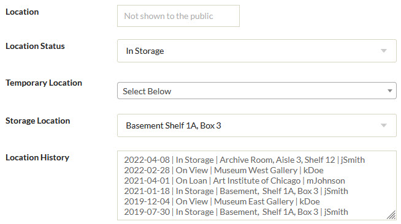

# AvantLocation

The AvantLocation plugin provides a way for an organization, such as a museum, to track the physical location of an object over time as it moves from one place to another. For example, suppose you have a Digital Archive item for a bird carving that is in storage. You then move the object to be on view in the museum, later move it back to storage, then loan it to to another museum, and finally return it to storage. The plugin lets you record date and location for each move. When you view the object's Digital Archive item, you'll see a history of where the object has been.

The plugin operates on five Omeka elements that you create to store the following kinds of location information:

- Permanent storage location
- Temporary storage location
- Location status
- Location history
- Public location (optional)

You can use any names you like for the elements. You will tell the AvantLogic plugin the names of the elements using the configuration options described in the next section.

You can create other location-related elements such as location notes, but the plugin does will do anything with them.

## Configuration options

AvantLocation has several configuration options. A screenshot showing all the options appears at the end of this section. The first five options let your provide the names of the elements that you are using to track locations. The remaining options let you specify values that affect what information the plugin displays.

---

Storage Location Element
:   Use this option to provide the name of the element that is used to record an object's permanent storage location. Typical values for this element would be a facility, room, shelf, bin, or folder. Use of the [Simple Vocab](https://omeka.org/classic/docs/Plugins/SimpleVocab/) plugin is a good way to provide a list of valid storage locations. You could also use a [suggest field](/plugins/avantelements/#suggest-option) for this element.

Temporary Location Element
:   Use this option to provide the name of the element that is used to record an object's temporary location when it is not in storage. The value describes where the item currently resides. Typical locations would be a gallery in your own museum, the name of another museum to which you have loaned the item, or the name of an offsite facility where the object is being restored. Use of the [Simple Vocab](https://omeka.org/classic/docs/Plugins/SimpleVocab/) plugin is a good way to provide a list of valid temporary locations.

:   Think of the temporary location as *any location that is not the permanent storage location*. When you move an object back to permanent storage, the plugin will automatically set the temporary location to blank.

Location Status Element
:   Use this option to provide the name of the element that is used to record an object's location status. Typical values for this element would be `On View`, `In Storage`, `On Loan`, or `Out for Restoration`. Use of the [Simple Vocab](https://omeka.org/classic/docs/Plugins/SimpleVocab/) plugin is a good way to provide a list of valid status values.

In Storage Status
:   Use this option to provide the text of the **Location Status** value that you use to mean that the object is in permanent storage. For example, set it to `In Storage`. It is important that the value you specify *exactly matches* the corresponding value used for the **Location Status** element.

Public Location Element
:   Use this option to provide the name of a read-only element that is used to store a location value this will be visible to the public. Leave this option blank if you never want to show a location to the public. The Public Location element is discussed later in the [Public Location](/plugins/avantlocation/#public-location) section

Location History Element
:   Use this option to provide the name of the element that is used to record an object's location history. The element should be a textarea field which is the default field type. Location history is explained later in the [Location History](/plugins/avantlocation/#location-history) section.

---

Location History Columns
:   Use this option to provide a vertical-bar-separated list of the names of the columns that will appear as titles in the location history table. A typical value would be `Date|Status|Location|Who`.

Public Location Values
:   Use this option to provide a comma-separated list of the location status values that the public is allowed to see. This is explained later in the [Public Location](/plugins/avantlocation/#public-location) section.

Location Move Date
:   Use this option to provide a date such as `2022-04-07` that the plugin will use when it automatically adds a new first row to the Location History element. Leave the value blank to use the current date.

Location Move By
:   Use this option to provide a the name of a person such as `jSmith` that the plugin will be use when it automatically adds a new first row to the Location History element. Leave the value blank to use the user name of the logged in Omeka user.

---
Here is a screenshot showing all of the AvantLocation configuration options.

---

## What the plugin does

The AvantLogic plugin automatically sets the values of these location tracking elements based on where you have indicated that an object has moved:

-   **Location History**
-   **Temporary Location**
-   **Public Location**

The behavior is designed to automatically track an object's movement with minimal effort on your part. In most cases, all you need to do is choose the **Location Status** and/or the **Temporary Location** and the plugin will update the history.

## How it works

When you edit and save an item to change an object's **Location Status** and/or **Temporary Location**, the AvantLocation plugin will:

- Add a new first row to the **Location History** element to show the new status and/or location.
- If the **Location Status** is changed to the **In Storage Status** value, the plugin automatically sets the value of **Temporary Location** to blank.
- If the **Location Status** is changed to anything except the **In Storage Status** value, the plugin will report an error if the  **Temporary Location** is blank.
- Set the value of the read-only **Public Location** element to the new location, or to blank, as explained in the [Public Location](/plugins/avantlocation/#public-location) section below.

When you edit and save an item to change an object's **Storage Location** and **Location Status** is set to the **In Storage Status** value, the AvantLocation plugin will:

- Add a new first row to the **Location History** element to show the new storage location

### Public Location

You will probably want to make all of your location tracking elements private so that the public cannot see them. There is one exception which is the **Public Location** element. This is an optional, read-only element that the AvantLocation plugin automatically sets for you based on the value of the **Location Status** element and the value of the **Public Location Values** configuration option.

In the screenshot above, the **Public Location Values** configuration option is set to `On Loan,On View`. Whenever the value of the **Location Status** element is set to one of those values, the plugin will set the **Public Location** element to the same value. But when the **Location Status** element is set to another value, the plugin will set the **Public Location** element to blank so that it will not appear at all to public users. For example, when **Location Status** is set to `In Storage`, the **Public Location** element will be set to blank because `In Storage` does not match `On Loan` or `On View`.

### Location History

The **Location History** element uses a textarea field to maintain a history in reverse-chronological order (most recent move appears at the top of the field). The AvantLogic plugin automatically adds a new first row to this field whenever you change an object's **Location Status** and/or **Temporary Location**. When **Temporary Location** is not blank, the row shows the **Temporary Location** value. When **Temporary Location** is blank, the row shows the **Storage Location** value.

---

**Editing location tracking fields**

The screenshot below shows how location tracking elements look on the Omeka Edit page.

In this example, **Location Status** is `In Storage` and so there is no **Temporary Location** value. The **Public Location Values** configuration option is set to `On Loan,On View` and so the plugin set the value of the **Location** element to blank. Notice in the screenshot above that the **Location** field shows gray text that says "Not shown to the public". That's because the field uses the [AvantElements Placeholder](/plugins/avantelements/#placeholder-option) option to show that text on the Edit page when the field has no value.

You can see that the first row of the **Location History** field reflects the object's current location status and location. The remaining rows show where the object has been for the past few years. The individual values in the **Location History** field rows are separated by a `|` which the AvantLogic plugin interprets as a table column separator.

You can edit the contents of the **Location History** element if you need to, for example, to correct a date or the identifier of the person responsible for the move. Just be careful to keep the `|` separators in the right places.

---

**Viewing location tracking fields**

The screenshot below shows how location tracking elements look when a logged-in user is viewing an item. The gray italic elements names are to remind you that those fields are private.

The table's column titles (Date, Status, Location, and Who) come from the plugin's **Location History Columns** configuration option.

Notice how when the object went back into storage on `2022-04-08`, it was stored in a new location (archive room instead of basement). The plugin automatically records the current value of the **Storage Location** element in the history whenever the **Temporary Location** element's value is blank or `<none>`. Thus, if the object is moved to a new storage location, the new location gets recorded in the history.

**Changing the location for a batch of items**

When you need to change the location information for a batch of items, such as when loaning several objects to another museum, you can use the **Location Move Date** and **Location Move By** fields on the [AvantLocation configuration](/plugins/avantlocation/#configuration-options) page to set a date and a person identifier that will be used as the Date and Who values in the **Location History**. This way, the date can reflect the actual date of the move (instead of the date on which you edit the items) and the person can be someone other than the Digital Archive administrator who is editing the items.

When you are done editing a batch of items, be sure to go back to the AvantLocation configuration page to set the **Location Move Date** and **Location Move By** back to blank.

## Dependencies
The AvantHybrid plugin requires that the [AvantCommon] plugin be installed and activated.

## Installation

To install the AvantLocation plugin, follow these steps:

1. First install and activate the [AvantCommon] plugin.
1. Download the latest release from <https://github.com/gsoules/AvantLocation>
1. Unzip `AvantLocation-master.zip` into your Omeka `plugins` folder
1. Rename the folder to `AvantLocation`
1. Activate the plugin from the Omeka `Plugins` page

## Warning

Use this software at your own risk.

##  License

This plugin is published under [GNU/GPL].

This program is free software; you can redistribute it and/or modify it under
the terms of the GNU General Public License as published by the Free Software
Foundation; either version 3 of the License, or (at your option) any later
version.

This program is distributed in the hope that it will be useful, but WITHOUT
ANY WARRANTY; without even the implied warranty of MERCHANTABILITY or FITNESS
FOR A PARTICULAR PURPOSE. See the GNU General Public License for more
details.

You should have received a copy of the GNU General Public License along with
this program; if not, write to the Free Software Foundation, Inc.,
51 Franklin Street, Fifth Floor, Boston, MA 02110-1301 USA.

Copyright
---------

-   Created by [gsoules](https://github.com/gsoules) 
-   Copyright George Soules, 2022.
-   See [LICENSE](https://github.com/gsoules/AvantLocation/blob/master/LICENSE) for more information.

[AvantCommon]: avantcommon.md

 

