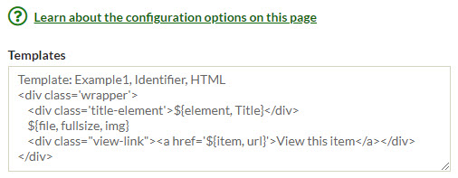

# MapsAlive

The MapsAlive plugin lets you display your Omeka content (metadata and images) on an interactive map that was
created with [MapsAlive](https://www.mapsalive.com). MapsAlive is a web application that lets you create
interactive maps and diagrams that you can  insert into web pages like this one.

**Try it now with the map below.** Click or touch the red dot markers, pan and zoom the map, and select locations from the menu.
The text and pictures you see are being requested in real time by the plugin from the Southwest Harbor Public Library's
[Omeka database](https://myomekasite.net).

<script type="module" id="ma-85015" src="https://tour.mapsalive.com/85015/mapsalive-module.js"></script>
<div class="ma-85015" data-flex-height="300" style="margin-bottom:12px"></div>

## How it works

The MapsAlive plugins works by letting your Omeka installation act as a
MapsAlive [Live Data](https://www.mapsalive.com/docs/livedata-intro/) server that provides the interactive map
with information from your Omeka items.

It works like this:

-   A user clicks or touches a hotspot on your interactive map.
-   The map makes a [Live Data request](https://www.mapsalive.com/docs/livedata-request-hotspot/#requesting-hotspot-content) to the plugin to get information for that hotspot. The request includes:
    -   The identifiers of the item or items that contain the information for the hotspot.
    -   The name of a [template](/plugins/mapsalive/#templates) that describes how the information should be presented.
-   The plugin gets the information from the Omeka database and inserts it into places in the template that you [specify](/plugins/mapsalive/#specifiers).
-   The plugin sends the filled-in template back to the map.
-   The map displays the information.

If you update the information in Omeka, for example to fix a typo, the change will be seen by the next person who uses the map.

## Configuration options

The MapsAlive plugin has only one configuration field call Templates. You use it to define one or more templates that contain HTML or JSON that the plugin will use when it responds to a Live Data request from the map.

Below is a screenshot showing the configuration page with one template. The parts that are enclosed inside `${...}` are the places where information from Omeka will be inserted into the template when the maps makes a Live Data request.



## Templates

Templates specify the form and appearance of the information that the plugin returns in response to a Live Data request from a MapsAlive interactive map. The first line of the template specifies its name and other information. The remaining lines are the template's HTML or JSON.

##### Syntax:

``` plaintext
"Template:" <template-name> “,” <item-identifier> “,” <format>
```

Where:

-   `<template-name>` is a name you choose for the template. Each template must have a unique name and only letters, digits, and `_` are allowed. Template names are case-sensitive.
-   `<item-identifier>` is the name of the Omeka element to be used as the unique identifier for the Omeka items that will provide information for the template. Typically it will be the `Identifier` element, but you can use any element, such as `Catalog #`,that *uniquely* identifies items. If more than one item has the same identifier, the plugin will only get information for one of the items.
-   `<format>` is either `HTML` or `JSON` to describe the contents of the template. Typically you will write templates as HTML, but you can write them in JSON if you want to let the map's JavaScript process and format the data. Use of JSON templates is discussed later on.

Below is an example of a template followed by an example of what the resulting Live Data response might look like. If you compare the two, you'll see that the response is the template filled in with information from an Omeka item.

**Template**

``` plaintext
Template: Example1, Identifier, HTML
<div>${element, Title}</div>
${file, thumbnail, img}
<div><a href='${item, url}View this item</a></div>
```

**Live Data response**

``` html
<div>Southwest Harbor Motor Co.</div>
https://myomekasite.net/files/thumbnails/10247/10247.jpg' width='300' height='246
<div><a href='https://myomekasite.net/items/show/6861View this item</a></div>
```

The screenshot below shows what the HTML would look like when it appears on a map inside a [popup](https://www.mapsalive.com/docs/ref-popups/). It's very plain, but we'll jazz it up later in the section on [styling using CSS](/plugins/mapsalive/#styling-with-css).


## Specifiers

A template will contain one or more specifiers that indicate what kind of Omeka item information should be inserted into the template when the map makes a Live Data call. There are four kinds of specifiers:

-   [Element specifier](/plugins/mapsalive/#element-specifier)
-   [File specifier](/plugins/mapsalive/#file-specifier)
-   [Item specifier](/plugins/mapsalive/#item-specifier)
-   [Data specifier](/plugins/mapsalive/#data-specifier)

The syntax for a specifier is:

``` plaintext
"${" <specifier-kind> [ <arguments> ] "}"
```

The closing curly brace must be on the same line as the opening curly brace.

Specifier arguments are described later for each kind of specifier.

#### Specifier item index

A specifier can include an optional item index argument to indicate which of multiple items the specifier is for. If you don't provide the item index, it defaults to 1 meaning the first or only item.

To better understand what the item index is for, suppose you have two items about a building. The first item has a photo, but no other information. The second has a description of the building plus another photo. You could use the template below to display the text from the second item and the photos from both items.

``` plaintext
Template: Example2, Identifier, HTML
<div>${element, Description, 2}</div>
<div>${file, img, 1}</div>
<div>${file, img, 2}</div>
```

#### Live Data

You pass item Ids to the plugin using the `items` argument with `,` as an Id separator. For example you would use `1001,1002` to pass Id `1001` and `1002`.

---

### Element specifier

The element specifier requests the value of a metadata element for an Omeka item.

##### Syntax:

``` plaintext
“${element”, <element-name> [ “,” <item-index> ] “}”
```

Where:

-   `<element-name>` is the name of an Omeka element.
-   `<item-index>` is an optional parameter explained in the [specifier item index](/plugins/mapsalive/#specifier-item-index) section above.

##### Examples:
``` plaintext
${element, Title}
${element, Description, 2}
```

#### Unpublished items and private elements

The element specifier will only return a value for published items. It returns an empty string for items that have not been published. For a published item, it will return a value for any element including ones you have made private or hidden using a plugin like [AvantCommon](/plugins/avantcommon/#private-elements-option) or [HideElements](https://omeka.org/classic/plugins/HideElements/). So be careful not to include an element specifier for an element that you do not want the public to see.

---

### File specifier

The file specifier requests information about a file attached to an Omeka item.

##### Syntax:

``` plaintext
“${file”, <derivative-size>, <property> [ “,” <item-index> ] [ “,” <file-index> ]  “}”
```

Where:

-   `<derivative-size>` is `thumbnail`, `fullsize`, or `original`. Derivative in an Omeka term that refers to the various sizes of images that Omeka derives from the original image uploaded to an item.
-   `<property>` is `img`, `url`, `width`, or `height` (explained in the [file specifier properties](/plugins/mapsalive/#file-specifier-properties) section).
-   `<item-index>` is an optional parameter explained in the [specifier item index](/plugins/mapsalive/#specifier-item-index) section above.
-   `<file-index>` is an optional parameter to indicate which of the item's files the request is for. If the parameter is omitted, the default is `1` meaning the first (or only) file attached to the item. In the examples below, the last three lines are using a file index to request images for the first, second, and third files of the first item.

##### Examples:
``` plaintext
${file, fullsize, img}
${file, original, url, 2}
${file, thumbnail, img, 1, 1}
${file, thumbnail, img, 1, 2}
${file, thumbnail, img, 1, 3}
```

#### File specifier properties
There are four file specifier properties, but you will nearly always use the `img` property unless you are using a JSON template.

-   `url` is the location of the file on the Omeka site.
-   `width` and `height` are the dimensions of the image in pixels.
-   `img` returns a fully-formed `` tag for the image to save you from having to code the tag yourself and to ensure that the image dimensions are provided.

Below is an example use of the `img` property followed by the &lt;img> tag it creates for you.
``` plaintext
${file, thumbnail, img}
```

``` html
https://myomekasite.net/files/thumbnails/10247/10247.jpg' width='300' height='246

```
---
!!! note "Important"
    Always provide the **width** and **height** attributes for an **&lt;img>** tag used to display Live Data hotspot content in a MapsAlive
    map. If you don't, the popup may initially appear too small and then resize after the browser has downloaded the image and determined its dimensions. Providing the width and height on the &lt;img> tag results in a much better experience for people using your interactive map. 
---

### Item specifier

The item specifier requests the URL or the Omeka Id for an Omeka item. Note that the Omeka Id for an item is not necessarily the same as the value of the item's `Identifier` element.

##### Syntax:

``` plaintext
“${item”,  <property> [ “,” <item-index> ] “}”
```

Where:

-   `<property>` is `url` or `id`. The URL is the one used to display the item on an Omeka site. The Id is the number that Omeka uses to identify the item in the Omeka database.
-   `<item-index>` is an optional parameter explained in the [specifier item index](/plugins/mapsalive/#specifier-item-index) section above.

##### Example:

The example below shows a template that uses both kinds of item specifier properties.

``` plaintext
Template: Example3, Identifier, HTML
<div>${item, id}</div>
<div>${item, url}</div>
```

The HTML below shows what the template would produce for an Omeka item having Id 102.

``` html
<div>102</div>
<div>http://localhost/omeka/items/show/102</div>
```

--- 

### Data specifier

The data specifier gets a data value that was passed from the map and inserts it into the template.

##### Syntax:

``` plaintext
“${data” [ “,” <data-index> ] “}”
```

Where:

-   `<data-index>` is an optional parameter to indicate which data value the request is for. If the parameter is omitted, the default is `1` meaning the first (or only) data value.

##### Example:

``` plaintext
Template: Example4, Identifier, HTML
<div>${data}</div>
<div>${data, 2}</div>
```

#### Live Data

You pass data values to the plugin using the `data` argument. When passing more than one value, use `~~` as a separator. For example you would use `this~~that` to pass the two values `this` and `that`.  

---

## Repeat section

A template can contain one *repeat section* to emit the same HTML or JSON repeatedly for a list of items passed to the plugin.

To explain the power of a repeat section, let's first describe a scenario that does not use this feature. Suppose
you have four items where the first item has description text of a location and the other three items have photos 
of the location. A map could show the text and three images by using the template below and passing four item identifiers.

``` plaintext
Template: Example5, Identifier, HTML
<div >${element Description, 1}</div>
<div>${file, fullsize, img, 2}</div>
<div>${file ,fullsize, img, 3}</div>
<div>${file, fullsize, img, 4}</div>
```

The template above works well if each hotspot on your map has three photos associated with it; however, by using a repeat section,
you can create a template like the one below that does the same thing as the template above, but will work with any number of photos including zero.

``` plaintext
Template: Example6, Identifier, HTML
<div>${element, Description}</div>
[--
<div>${file, fullsize, img}</div>
--]
```

As shown in the example above, the repeat section is delimited by lines containing `[--` and `--]`. These repeat section delimiters must be on their own line with no other text before or after them. The repeat section can contain one or more rows.

To use a template with a repeat section, the map passes two sets of item identifiers. The first set is used for the specifiers that are outside of (above or below) the repeat section, and the second set is used for specifiers within the repeat section. This will be made more clear in the next section on using the plugin with an interactive map.

The one restriction when using a repeat section is that specifiers in the rows within the repeat section cannot use a [specifier item index](/plugins/mapsalive/#specifier-item-index). That's because each row in a repeat section gets its data from just one of the items in the second set of items that the map passes as was explained in the previous paragraph.

#### Live Data

You pass repeat section item Ids to the plugin using the `items` argument by distinguishing the repeating item Ids from the non-repeating Ids by using `;` as a separator. For example you would use `1001;2001,2002` to pass the non-repeating Id `1001` and two repeating Ids `2001` and `2002`.

## Using the plugin with an interactive map

Up until now this documentation has talked about templates and specifiers, and made mention of the map making Live Data calls, but it has not yet explained how the map communicates with the plugin to request Live Data. That's what's covered in this section. This section does however assume that you have read the MapsAlive documentation for using its Live Data feature [request hotspot content](https://www.mapsalive.com/docs/livedata-request-hotspot/) from a server, which in this case, is your Omeka installation.


### Simple example

## Styling with CSS

The examples have deliberately been kept simple, but in practice you'll usually want to include CSS class names in your HTML templates so that the map's CSS can style the HTML elements.

``` plaintext
Template: CssDemo, Identifier, HTML
<div class='wrapper
   <div class='title-element${Title}</div>
   <div class='description-element${Description}</div>
   <div>${file,fullsize}</div>
   <a target='_blank' href='${item-url,3}View this item</a>
</div>
```

## Using JSON templates

#### HTML vs JSON
Use HTML when your map will make [Live Data requests for hotspot content](https://www.mapsalive.com/docs/livedata-request-hotspot/). This is the simplest method and is recommended for most people.

Use JSON when your map will make [Live Data requests for data](https://www.mapsalive.com/docs/livedata-request-data/). This is an advanced method used by programmers.


``` plaintext
Template: Example2, Catalog #, JSON
{
   "title":"${element, Title}",
   "image":"${file, thumbnail, url}",
   "width":"${file, thumbnail, width}",
   "height":"${file, thumbnail, height}",
   "link":"${item, url}"
}
```

```
{
   "title":"Southwest Harbor Motor Co.",
   "image":"https://myomekasite.net/files/thumbnails/10247/10247.jpg",
   "width":"300",
   "height":"246",
   "link":"https://myomekasite.net/items/show/6861"
}
```


## JSON errors
The MapsAlive plugin does rudimentary validation of JSON code to ensure that it valid, but it won't tell you where the error is. To determine the cause of a JSON error, try using an online tool like <https://jsonformatter.org/> or <https://jsonformatter.curiousconcept.com/>.

### Live Data request

## Developing a template

Explain/show how to test using query string in a browser.

```
http://localhost/omeka/mapsalive?template=demo&items=96.2.2,81.1.81,21.01.03
```


