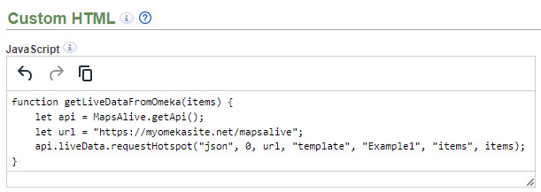
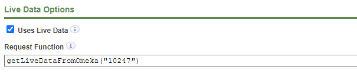
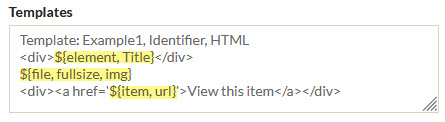
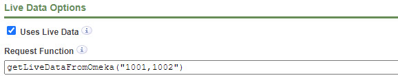
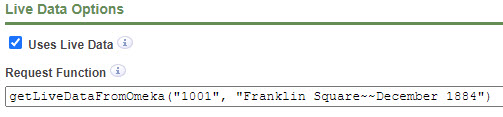
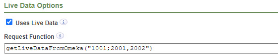

# MapsAlive

The MapsAlive plugin lets you display your Omeka content (metadata and images) on an interactive map that was
created with [MapsAlive](https://www.mapsalive.com). MapsAlive is a web application that lets you create
interactive maps and diagrams that you can  insert into web pages like this one.

**Try it now with the map below.** Click or touch the red dot markers, pan and zoom the map, and select locations from the menu.
The text and pictures you see are being requested in real time by the plugin from the Southwest Harbor Public Library's
[Omeka database](https://myomekasite.net).

<script type="module" id="ma-85023" src="https://tour.mapsalive.com/85023/mapsalive-module.js"></script>
<div class="ma-85023" data-flex-height="300" style="margin-bottom:12px"></div>

#### Maps that use this plugin
Here are interactive maps that use this plugin. They will give you ideas for how you can use an interactive map with your own Omeka items.

- [Sanborn 1922](https://mapsalive.com/samples/85023)
- [Colby 1887](https://mapsalive.com/samples/85015)
- [Southwest Harbor, Maine 2015](https://mapsalive.com/samples/85022)

## How it works

The MapsAlive plugin lets your Omeka site act as a MapsAlive [Live Data](https://www.mapsalive.com/docs/livedata-intro/) server.
An interactive map makes requests to the server and the server responds with information from your Omeka items.

It works like this:

-   A user selects a hotspot on your interactive map by mousing over, or clicking, or touching it.
-   The map asks the MapsAlive plugin to get information for that hotspot.
-   The plugin gets the information from items in your Omeka database.
-   The plugin inserts the data into an HTML [template](/plugins/mapsalive/#templates) that you define.
-   The plugin sends the HTML back to the map.
-   The map displays the information about the hotspot the user selected.

## Getting started

Here are the steps for creating an interactive map that displays information from your Omeka items. Assuming you are familiar with using MapsAlive, these steps should take about five minutes.

1 &ndash; Define a template
:   On the MapsAlive plugin's [configuration page](/plugins/mapsalive/#configuration-options), define a template. The screenshot below shows a template that creates HTML for an Omeka item's title, photo, and a "View this item" link.

    

    For convenience, here is a template that you can copy/paste:

<div style="margin-left:26px">
``` plaintext
Template: Example1, Identifier, HTML
<div>${element, Title}</div>
${file, fullsize, img}
<div><a href='${item, url}'>View this item</a></div>
```
</div>

2 &ndash; Create a MapsAlive tour
:   In MapsAlive, [create a new MapsAlive tour](https://www.mapsalive.com/docs/start-first-tour/). Use a map image that shows locations of items in your Omeka database. Add a few hotspots to the map and place them on locations of interest.

3 &ndash; Add a request function to the tour
:   In MapsAlive, add a [request function](/plugins/mapsalive/#request-function) that will call the MapsAlive plugin.

    - Choose **Tour > Custom HTML** from the Tour Builder menu.
    - On the [**_Custom HTML_**](https://www.mapsalive.com/docs/start-custom-html) screen, type the function shown below into the [JavaScript](https://www.mapsalive.com/docs/start-custom-html/#javascript) field.
    
    - Change `Example1` to be the name of the template you defined in step 1 above.
    - Change `myomekasite.net` to be your Omeka site. Leave `/mapsalive` at the end of the URL.

    For convenience, here is a function that you can copy/paste:

<div style="margin-left:26px">
``` plaintext
function getLiveDataFromOmeka(items) {
    let api = MapsAlive.getApi();
    let url = "https://myomekasite.net/mapsalive";
    api.liveData.requestHotspot("json", 0, url, "template", "Example1", "items", items);
}
```
</div>

4 &ndash; Make the hotspots call the request function
:   When a user mouses over, clicks, or touches a hotspot, the hotspot will call the request function which will call the MapsAlive plugin. The plugin will return the Omeka item information for that hotspot as the HTML defined in your template.

    - Choose **Hotspot > Advanced Hotspot Options** from the Tour Builder menu.
    - Find the **Live Data Options** section on the [MapsAlive **_Advanced Hotspot Options_**](https://www.mapsalive.com/docs/livedata-request-hotspot/#request-function) screen.

        

    For each hotspot:
    
    - Check the **Uses Live Data** option.
    - Type a call to the request function as shown in the screenshot above.
    - Change `10247` to be the Omeka item identifier that contains information for that hotspot.


5 &ndash; Try out your interactive map 
:   -   View your map on the MapsAlive [Tour Preview](https://www.mapsalive.com/docs/start-tour-preview/) screen.
    -   Test that your hotspots display your Omeka item data.

For more information, see the section on [using the plugin with a MapsAlive map](/plugins/mapsalive/#using-the-plugin-with-a-mapsalive-map).

If you need help using [MapsAlive](https://www.mapsalive.com) or this plugin, contact support@mapsalive.com.    

## Configuration options

The MapsAlive plugin has only one configuration field called [Templates](/plugins/mapsalive/#templates). You use the field to define one or more templates that contain HTML or JSON that the plugin will use when it responds to a Live Data request from the map.

Below is a screenshot showing the configuration page. The parts of the template text that are enclosed inside `${...}` and highlighted in yellow are [specifiers](/plugins/mapsalive/#specifiers) indicating where information from Omeka items will be inserted into the template when the map makes a Live Data request.



## Templates

Templates specify the form and appearance of the information that the plugin returns in response to a Live Data request from a MapsAlive interactive map. The first line of the template specifies its name and other information. The remaining lines are the template's HTML or JSON.

##### Syntax:

``` plaintext
"Template:" <template-name> “,” <item-identifier> “,” <format>
```

Where:

Option | Description
---|---
&lt;template&#8209;name&gt;|A name you choose for the template. Each template must have a unique name and only letters, digits, and `_` are allowed. Template names are case-sensitive.
item&#8209;identifier|The name of the Omeka element to be used as the unique identifier for the Omeka items that will provide information for the template. Typically it will be the `Identifier` element, but you can use any element, such as `Catalog #` that *uniquely* identifies items.<br><br>If more than one item has the same identifier, the plugin will only get information for one of the items.<br><br>To use the Omeka item Id as the identifier, specify `omeka_id`.
format|Either `HTML` or `JSON` to describe the contents of the template. Typically you will write templates as HTML, but you can write them in JSON if you want to let the map's JavaScript process and format the data. Use of JSON templates is discussed later on.

Below is an example of a template followed by an example of what the resulting Live Data response might look like. If you compare the two, you'll see that the response is the template, where each specifier in the template has been filled in with information from an Omeka item.

**Template**

``` plaintext
Template: Example1, Identifier, HTML
<div class='wrapper'>
    <div class='title-element'>${element, Title}</div>
    ${file, fullsize, img}
    <div><a href='${item, url}'>View this item</a></div>
</div>
```

**Live Data response**

``` html
<div class='wrapper'>
    <div class='title-element'>Southwest Harbor Motor Co.</div>
    
    <div><a href='https://myomekasite.net/items/show/6861>View this item</a></div>
</div>
```

The screenshot below shows what the information from the Omeka item might look like when displayed on a map inside a [popup](https://www.mapsalive.com/docs/ref-popups/) that has been [styled using CSS](/plugins/mapsalive/#styling-with-css).


## Specifiers

A template can contain one or more specifiers that indicate what kind of Omeka item information should be inserted into the template when the map makes a Live Data call.

There are four kinds of specifiers:

-   [Element specifier](/plugins/mapsalive/#element-specifier)
-   [File specifier](/plugins/mapsalive/#file-specifier)
-   [Item specifier](/plugins/mapsalive/#item-specifier)
-   [Data specifier](/plugins/mapsalive/#data-specifier)

The syntax for a specifier is:

``` plaintext
"${" <specifier-kind> [ <options> ] "}"
```

The closing curly brace must be on the same line as the opening curly brace.

Specifier options are described later for each kind of specifier.

#### Specifier item index

A specifier can include an item index option to indicate which of multiple items the specifier is for. If you don't provide the item index, it defaults to 1 meaning the first or only item.

To better understand what the item index is for, suppose you have two items about a building. The first item has a photo, but no other information. The second has a description of the building plus another photo. You could use the template below to display the description from the second item and the images from both items.

``` plaintext
Template: Example2, Catalog #, HTML
<div>${element, Description, 2}</div>
<div>${file, img, 1}</div>
<div>${file, img, 2}</div>
```

#### How a hotspot passes item identifiers to the plugin

A map hotspot passes item identifiers to the plugin in a comma-separated list. In the example below, the hotspot is passing `"1001,1002"` to provide the identifiers for items `1001` and `1002`.



It you pass values that don't match any of your Omeka items, blank values will be used for any [element specifiers](/plugins/mapsalive/#element-specifier) that refer to those items.

---

### Element specifier

The element specifier requests the value of a metadata element for an Omeka item.

##### Syntax:

``` plaintext
“${element”, <element-name> [ “,” <item-index> ] “}”
```

Where:

Option | Description
---|---
&lt;element&#8209;name&gt;|The name of an Omeka element.
&lt;item&#8209;index&gt;|An optional item index explained in the [specifier item index](/plugins/mapsalive/#specifier-item-index) section above.

##### Examples:
``` plaintext
${element, Title}
${element, Description, 2}
```

#### Unpublished items and private elements

The element specifier only returns a value for published items. It returns an empty string for items that have not been published. For a published item, it will return a value for *any* element including ones you have made private or hidden using a plugin like [AvantCommon](/plugins/avantcommon/#private-elements-option) or [HideElements](https://omeka.org/classic/plugins/HideElements/). So be careful not to include an element specifier for an element that you do not want the public to see.

---

### File specifier

The file specifier requests information about a file, usually an image, attached to an Omeka item.

##### Syntax:

``` plaintext
“${file”, <derivative-size>, <property> [ “,” <item-index> ] [ “,” <file-index> ]  “}”
```

Where:

Option | Description
---|---
&lt;derivative&#8209;size&gt;|One of these sizes: `thumbnail`, `fullsize`, or `original`.<br><br>Derivative is an Omeka term that refers to the various sizes of images that Omeka derives from the original image uploaded to an item.
&lt;property&gt;|One of these file properties: `img`, `url`, `width`, or `height`.<br><br>These properties are explained in the [file specifier properties](/plugins/mapsalive/#file-specifier-properties) section below.
&lt;item&#8209;index&gt;|An optional item index explained in the [specifier item index](/plugins/mapsalive/#specifier-item-index) section above.
&lt;file&#8209;index&gt;|An optional file index to indicate which of the item's files the request is for.<br><br>If the option is omitted, the default is 1 meaning the first (or only) file attached to the item.<br><br>In the examples below, the last three lines are using a file index to request images for the first, second, and third files of the first item.

##### Examples:
``` plaintext
${file, fullsize, img}
${file, original, url, 2}
${file, thumbnail, img, 1, 1}
${file, thumbnail, img, 1, 2}
${file, thumbnail, img, 1, 3}
```

#### File specifier properties
There are four file specifier properties, but usually, you will only use the `img` property.

Option | Description
---|---
url|The location of the file on the Omeka website.
width|The width of an image file in pixels.
height|The height of an image file in pixels.
img|This is a special feature that returns a fully-formed `` tag for the image. It saves you from having to code the tag yourself and it ensures that the tag includes the image dimensions plus CSS to adjust the image to fit its container if the container is narrower and/or shorter than the image's width and height.

This is how you use the `img` property:

``` plaintext
${file, fullsize, img}
```

Here is an example showing the &lt;img> tag that gets created for you.
``` html

```

### Item specifier

The item specifier requests the URL or the Omeka Id for an Omeka item. Note that the Omeka Id for an item is not necessarily the same as the value of the item's `Identifier` element.

##### Syntax:

``` plaintext
“${item”,  <property> [ “,” <item-index> ] “}”
```

Where:

Option | Description
---|---
&lt;property&gt;|One of item file properties: `url` or `id`.<br><br>The URL is the one used to display the item on an Omeka site.<br><br>The Id is the number that Omeka uses to identify the item in the Omeka database.
&lt;item&#8209;index&gt;|An optional item index explained in the [specifier item index](/plugins/mapsalive/#specifier-item-index) section above.

##### Example:

The example below shows a template that uses both kinds of item specifier properties.

``` plaintext
Template: Example3, Identifier, HTML
<div>${item, id}</div>
<a href="${item, url}">View this item</a>
```

The HTML below shows what the template would produce for an Omeka item having Id 102.

``` html
<div>102</div>
<a href="https://myomekasite.net/items/show/102">View this item</a>
```

--- 

### Data specifier

The data specifier gets a data value that was passed from the map and inserts it into the template. It is useful when you want the map to display information that is not available from an Omeka item. For example, you might have Omeka items with photos of a location on the map, but none on the items have a metadata element that says what the location is. The Live Data call for the hotspot at that location on the map could pass the name of the location.

##### Syntax:

``` plaintext
“${data” [ “,” <data-index> ] “}”
```

Where:

Option | Description
---|---
&lt;data&#8209;index&gt;|An optional data index to indicate which data value the request is for. If the option is omitted, the default is 1 meaning the first (or only) data value.

##### Example:

``` plaintext
Template: Example4, Identifier, HTML
<div>${data}</div>
<div>${data, 2}</div>
```

#### #### How a hotspot passes data values to the plugin

A map hotspot passes data values to the plugin in a double-tilde-separated list. In the example below, the hotspot is passing the item identifier `1001` and the text `"Franklin Square~~December 1884"` to provide the two data values `Franklin Square` and `December 1884`.



``` javascript
function getLiveDataFromOmeka(items, data) {
   let api = MapsAlive.getApi();
   let url = "https://myomekasite.net/mapsalive";
   api.liveData.requestHotspot("json", 0, url, "items", items, "template", "demo", "data", data);
}
```

A convenient way to provide data for individual hotspots is to store the data values as the hotspot's content using the text editor on the MapsAlive [**_Edit Hotspot Content_** screen](https://www.mapsalive.com/docs/ref-hotspots/#hotspot-content-editor). For example, you could type `"Franklin Square~~December 1884"` as the hotspot's content. To pass the content to the MapsAlive plugin for use by a data specifier, code your [request function](/plugins/mapsalive/#request-function) to pass the content in the `data` argument like this:

``` javascript
function getLiveDataFromOmeka(items) {
   let api = MapsAlive.getApi();
   let url = "https://myomekasite.net/mapsalive";
   let data = api.currentHotspot.plainText;
   api.liveData.requestHotspot("json", 0, url, "items", items, "template", "demo", "data", data);
}
```

---

## Repeat section

A template can contain one *repeat section* to emit the same HTML or JSON repeatedly for a list of items passed to the plugin.

To explain the power of a repeat section, let's first describe a scenario that does not use this feature. Suppose
you have four items where the first item has title text identifying a location and the other three items have photos 
of the location. A map could show the text and three images by using the template below and passing four item identifiers.

``` plaintext
Template: Example5, Identifier, HTML
<div >${element Title, 1}</div>
<div>${file, fullsize, img, 2}</div>
<div>${file ,fullsize, img, 3}</div>
<div>${file, fullsize, img, 4}</div>
```

The template above works well if each hotspot on your map has three photos associated with it; however, by using a repeat section,
you can create a template like the one below that does the same thing as the template above, but will work with any number of photos including zero.

``` plaintext
Template: Example6, Identifier, HTML
<div>${element, Title}</div>
[--
<div>${file, fullsize, img}</div>
--]
```
As shown in the example above, the repeat section is delimited by lines containing `[--` and `--]`. The delimiters must be on their own line with no other text before or after them. The repeat section can contain one or more rows.

### Using a repeat section

To use a template that contains a repeat section, the map makes a Live Data call passing two sets of item identifiers as explained in the Live Data call section below. The first set is used for the specifiers that are outside of (above or below) the repeat section, and the second set is used for specifiers within the repeat section.

The one restriction when using a repeat section is that specifiers in the rows *within* the repeat section cannot use a [specifier item index](/plugins/mapsalive/#specifier-item-index). That's because each row in a repeat section gets its data from just one of the items in the second set of items that the map passes as was just explained.

#### How a hotspot passes identifiers for repeating items to the plugin

A map hotspot passes it passes identifiers for both the non-repeating and repeating items together in a semicolon-separated list. In the example below, the hotspot is passing `"1001;2001,2002"` to provide the non-repeating identifier `1001` and two repeating identifiers `2001` and `2002`. If you only want to pass repeating items, code `0` before the semicolon like this: `"0;2001,2002"`



The resulting HTML when using template Example6 above might look like this:

``` html
<div>Franklin Square</div>


```

## Using the plugin with a MapsAlive map

The [getting started](/plugins/mapsalive/#getting-started) section at the beginning of this documentation explains what you need to do to create an interactive map that displays information from your Omeka items.
This section provide some additional information, but to fully understand how it all works, read the MapsAlive documentation for using its [Live Data](https://www.mapsalive.com/docs/livedata-intro) feature to [request hotspot content](https://www.mapsalive.com/docs/livedata-request-hotspot/).

#### Request function

The request function is what connects your interactive map with this plugin. When a user mouses over, clicks, or touches a hotspot, the hotspot will call the request function which will call the MapsAlive plugin. The plugin will return the Omeka item information for that hotspot as the HTML defined in your [template](/plugins/mapsalive/#templates). 

A request function is a JavaScript function that you code on the MapsAlive [**_Custom HTML_**](https://www.mapsalive.com/docs/start-custom-html) screen in the [JavaScript](https://www.mapsalive.com/docs/start-custom-html/#javascript) field. A typical request function is shown below. In this example the function is named `getLiveDataFromOmeka` but you can call it anything you like.

``` javascript
function getLiveDataFromOmeka(items) {
   let api = MapsAlive.getApi();
   let url = "https://myomekasite.net/mapsalive";
   api.liveData.requestHotspot("json", 0, url, "template", "mytemplate", "items", items, "data", "");
}
```

The table below explains the arguments passed to the [requestHotspot API method](https://www.mapsalive.com/docs/api-methods/#livedatarequesthotspot) when it is used to call the MapsAlive plugin.

Argument | Description
---|---
"json"|Tells MapsAlive that the response will come back from the MapsAlive plugin as JSON. Always specify "json" regardless of whether your template uses HTML or JSON format.
0|Tells MapsAlive to only requests the data once and cache the response so that it does not call the MapsAlive plugin more than once for the same hotspot.
url|The root URL of your Omeka site with `/mapsalive` at the end. Adding `/mapsalive` to the URL is what causes the MapsAlive plugin to be called.
template|Tells the plugin which template to use. Template names are case-sensitive.
items|Passes a comma-separated list of item identifiers to the plugin. See [how a hotspot passes item identifiers to the plugin](/plugins/mapsalive/#how-a-hotspot-passes-item-identifiers-to-the-plugin). Also see [how a hotspot passes identifiers for repeating items to the plugin](/plugins/mapsalive/#how-a-hotspot-passes-identifiers-for-repeating-items-to-the-plugin) 
data|Passes a double-tilde-separated list of data values to the plugin. This argument/value pair can be omitted if you are not passing data. It is shown here with an empty string only for clarity. [See how a hotspot passes data values to the plugin](/plugins/mapsalive/#how-a-hotspot-passes-data-values-to-the-plugin).


## Using JSON templates

All of the examples in this documentation have been for templates that contain HTML. This is the simplest method and is recommended for most people.

Programmers may choose to use JSON templates if they prefer to only obtain data from Omeka items and write their own JavaScript logic to create the HTML that will present the data.

Below is an example of a JSON template followed by an example of the Live Data response.

``` plaintext
Template: Example6, Identifier, JSON
{
   "title":"${element, Title}",
   "image":"${file, thumbnail, url}",
   "width":"${file, thumbnail, width}",
   "height":"${file, thumbnail, height}",
   "link":"${item, url}"
}
```

```
{
   "title":"Southwest Harbor Motor Co.",
   "image":"https://myomekasite.net/files/thumbnails/10247.jpg",
   "width":"300",
   "height":"246",
   "link":"https://myomekasite.net/items/show/6861"
}
```

**Important**: When you use a JSON template, your map must make [Live Data requests for data](https://www.mapsalive.com/docs/livedata-request-data/) *instead of* making [Live Data requests for hotspot content](https://www.mapsalive.com/docs/livedata-request-hotspot/).

#### Developing a JSON template

The MapsAlive plugin does rudimentary validation of JSON code to ensure that it is well-formed, but if there's an error, it won't tell you where the error is. To determine the cause of a JSON error, try using an online tool like <https://jsonformatter.org/> or <https://jsonformatter.curiousconcept.com/>.

A good way to develop a JSON template is to test the template by calling it directly from a browser before using it in a Live Data call from the map. For example, you could test the template above by typing a URL like this into your browser:

```
https://myomekasite.net/mapsalive?template=Example6&items=1100
```

The browser will display JSON like in the example above.
 
 Note that when you use this technique with an HTML template, the result will also be JSON, but in the form shown below. It's the form that MapsAlive expects for a Live Data response that is returning HTML. To learn more, see the [JSON response](https://www.mapsalive.com/docs/livedata-request-hotspot/#json-response) section in the MapsAlive user guide.

```
{
    "html":"the HTML from the template"
}
```

---

## Styling with CSS

The examples in this documentation have deliberately been kept simple, but in practice you'll usually want to include CSS class names in your HTML templates so that the map's CSS can style the HTML elements.

The HTML below contains class names `wrapper` and `title-element` that make it easy to apply styling.

``` plaintext
Template: Example7, Identifier, HTML
<div class='wrapper'>
    <div class='title-element'>${element, Title}</div>
    ${file, fullsize, img}
    <div><a href='${item, url}'>View this item</a></div>
</div>    
```

The first screenshot below shows what the HTML looks like without styling and the second screenshot shows what it looks like with styling.


The CSS for the second screenshot appears below. You put the CSS for a map's hotspots in the map's CSS section on the [Custom HTML](https://www.mapsalive.com/docs/start-custom-html/?h=custom+htm#css) screen in MapsAlive.

``` css
.wrapper img {
   border: 2px solid black;
}

.wrapper {
   padding: 4px 12px 0 12px;
   text-align: center;
}

.title-element {
   font-size: 18px;
   font-weight: bold;
   margin-bottom: 4px;
   color: firebrick;
}

.view-link a {
   color: green;
   font-size: 16px;
   text-decoration: none;
}
```


