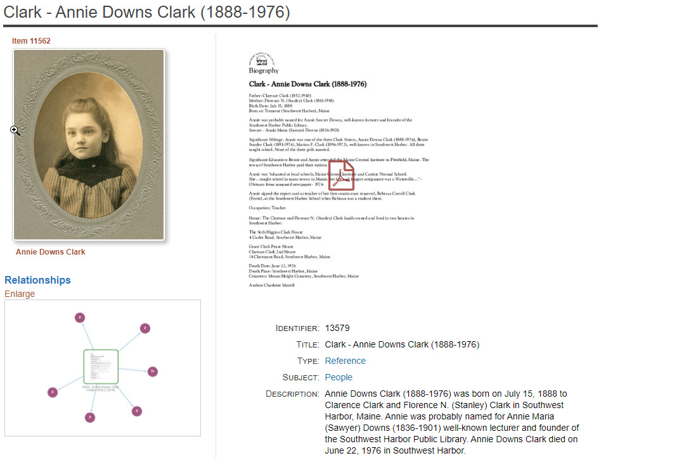
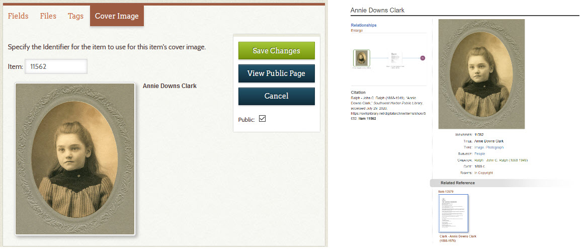

# Cover Images for Reference Items

The Cover Image feature allows you to use the image for one item as the representative
image for a Reference Item, but without attaching the image to the Reference Item.
A Reference Item *should not have an image attached to it*, but it can have a PDF
attachment if there is too much information about the item to be contained in the
item's **_Description_** field. The Digital Archive does not enforce this guideline,
but it is a best practice.

The cover image appears in the upper left corner of the Reference Item’s page as though
it were attached with a paperclip. This feature gives some "life" to the Reference Item's
page so that you see the person, not just the PDF file.

## Setting a cover image

To set the cover image for an item:

-   Edit the item
-   Choose the **_Cover Image_** tab
-   In the **_Item_** field, enter the **_Identifer_** number of the item containing the image
-   Click the **_Save Changes_** button

In the screenshots below, the left side shows the **_Cover Image_** tab for item
13579 which appears the example above. The number 11562 has been entered into the
tab's **_Item_** field. The right side is the item page for item 11562. This illustrates
how the image from item 11562 is being used as the cover for item 13579.

    