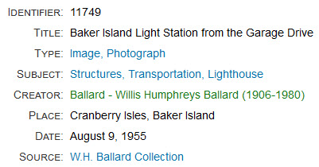

# Implicit Relationships

An implicit relationship is one where two items are related to each other by virtue
of having common data that creates an association between them. In contrast, an explicit
relationship is one in which an archivist manually [adds a relationship](/archivist/add-relationships)
between two items.

The Digital Archive recognizes two kinds of implicit relationships:

-   Implicit Field relationship
-   Implicit Reference Item relationship

The next two sections explain both kinds, but it's important to note that the Digital Archive
creates these relationships *automatically* &mdash; the archivist does not have to explicitly add them.

## Implicit field relationship

When the value of the field in one item is the same as the field for another item,
those two items have an implicit field relationship. The Digital Archive site administrator
uses the [Implicit Link option of the AvantElements plugin](/plugins/avantelements/#implicit-link-option)
to specify which fields work this way.

You can tell in the example below that the **_Type_**, **_Subject_**, and **_Source_**
fields have implicit relationships because their text appears as blue hyperlinks.

When you click one of the hyperlinks, you’ll be taken to a search results page listing other
items in the collection that have the same value as the link text. In the example above, clicking
on the **_Subject_** link `Structures, Transportation, Lighthouse` will display search results of all
other items for lighthouses as shown below.

## Implicit Reference Item relationship

When an item’s **_Creator_** or **_Publisher_** field text exactly matches the **_Title_**
field text of a Reference Item, the item has an implicit Reference Item relationship to the
Reference Item. The implicit relationship is either *created by* or *published by*.

In the example above, the green hyperlink for the **_Creator_** field has exactly the same value
as a Reference Item for person that is titled `Ballard – Willis Humphreys Ballard (1906-1980)`.
When you click that link, you'll be taken to the page for that Reference Item. On that page,
you'll see all of the items that person created as shown in the example below.

## Implicit versus explicit relationships

One way to think of the difference between implicit and explicit relationships is that the
Digital Archive software automatically identifies implicit relationships by finding matching
text in two items, whereas only an archivist who is familiar with the collection can determine
how two items are explicitly related. For example, the software does not know that Mary was
married to John, or that she was a library trustee. Even if that information is contained in a
Reference Item for Mary, the software does not have artificial intelligence to parse a biography
in one item and automatically identify relationships based on content in other items. The
software provides the mechanism for recording and displaying relationships, but it is the
archivist’s job to identify and set them.

### The importance of an exact match

The Digital Archive software automatically creates the hyperlinks for implicit relationships,
but, to maintain implicit Reference Item relationships for  **_Creator_** and **_Publisher_**,
the archivist must ensure that the text in the **_Creator_** and **_Publisher_** fields exactly matches
the **_Title_** text for the corresponding **_Creator_** or **_Publisher_** Reference Item.
Any difference at all, such as an extra space, will break the implicit relationship.
Fortunately, the software provides two mechanisms to help maintain an exact match:

-   If you edit the **_Title_** of an existing **_Creator_** or **_Publisher_** item, e.g. to fix a typo,
    the software will automatically find all other items in the collection that have the original title
    (the value before you changed it) as their **_Creator_** or **_Publisher_**. It will then update all of
    those items with your change.
-   While adding or editing an item, when entering a **_Creator_** or **_Publisher_** value, you can
    type just part of the value, e.g. a person’s last name, and a list of matching **_Creator_** or
    **_Publisher_** titles will appear for you to choose from so that you don’t have to type the name
    and possibly introduce a mismatch.

### Technology

The logic for implicit field relationships is provided by the [AvantElements plugin](/plugins/avantelements).  
The logic for implicit Reference Item relationships is provided by the [AvantRelationships plugin](/plugins/avantrelationships).