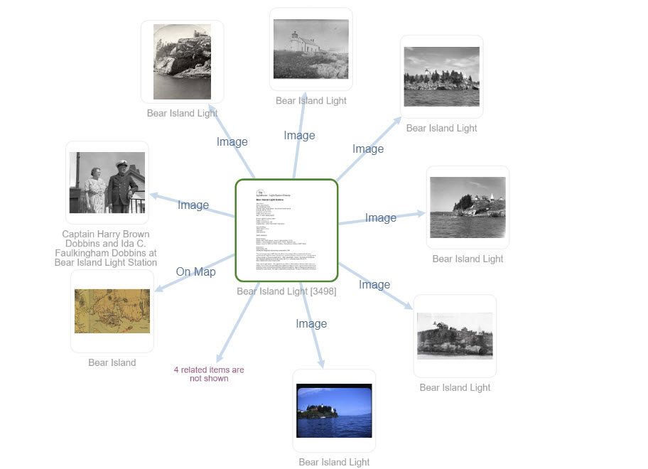
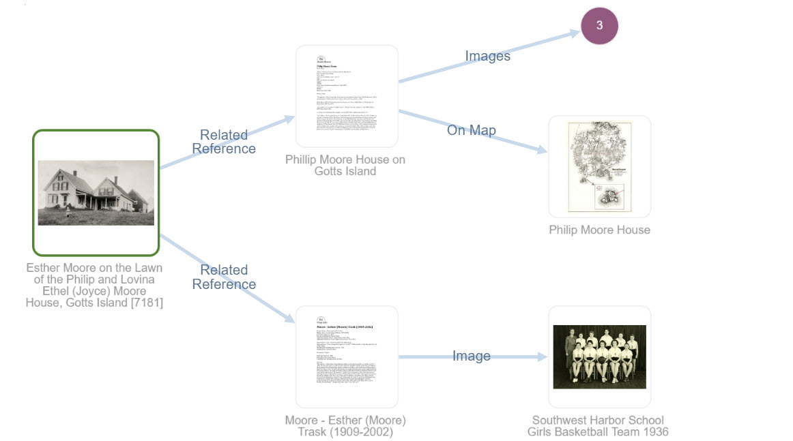
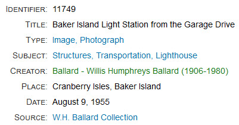
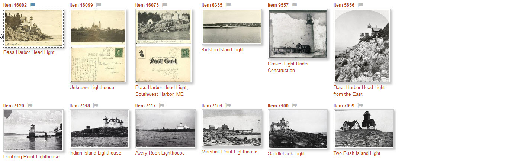
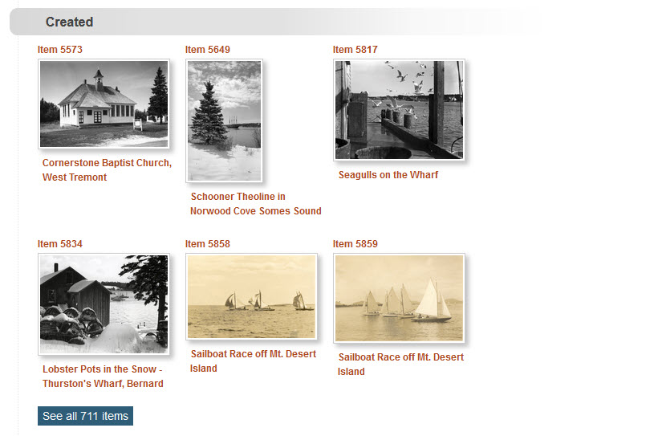
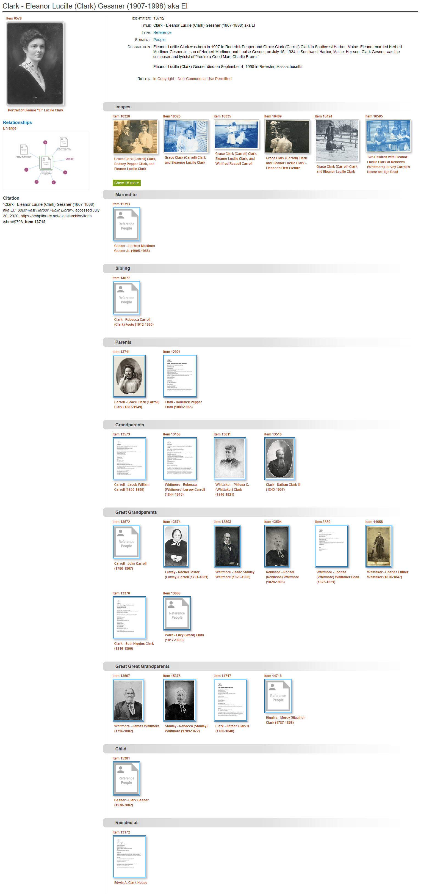
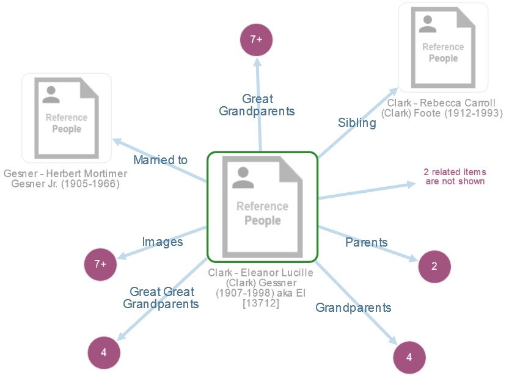

# Kinds of Relationships

The Digital Archive supports these kinds of relationship:

-   Direct relationships
-   [Indirect relationships](#indirect-relationships)
-   [Field relationships](#field-relationships)
-   [Title relationships](#title-relationships)
-   [Genealogical relationships](#genealogical-relationships)
-   [Items sets](#item-sets)

An archivist *explicitly* establishes direct relationships. All of the other kinds of
relationships are *implicit* and are automatically established by the Digital Archive software.

## Direct relationships

A direct relationship is one that directly connects two items.
The [visualization](/user/viewing-related-items/#visualization)
below shows that the item in the center titled *Bear Island Light*
has a direct relationship to seven images, one map, and four other items not shown
because there is not enough room.  
[View this item in the Digital Archive](https://swhplibrary.net/digitalarchive/items/show/8532)

Every relationship that an [archivist adds](/archivist/add-relationship/) is between two items and therefore
is a direct relationship. An archivist cannot add an indirect relationship.

## Indirect relationships

An indirect relationship connects two items to each other via another item. 
The visualization below shows that the item on the left, a photograph of Esther Moore as a
little girl playing in front of her home on Gotts Island, has a direct relationship to two items,
and an indirect relationship to a photograph, a map, and three image items as indicated by the
purple dot.  
[View this item in the Digital Archive](https://swhplibrary.net/digitalarchive/items/show/6439)

Indirect relationships are identified automatically by the Digital Archive &ndash; an 
archivist does not explicitly create them. In this example, both the photo of Esther in 1914 as a child on
Gotts island, and the photo at the lower right on the visualization of Esther as an adult when she was the girl's
basketball team coach at Southwest Harbor High School in 1938, have a direct relationship
to her [Reference Item](/relationships/reference-items/) titled *Moore - Esther (Moore) Trask (1909-2002)*.
*Because both photos are directly related to her Reference Item, they are indirectly
related to each other.*

When one item is related to another, it is inevitable that the other item is related to yet another
item and so on. The idea of [six degrees of separation](https://en.wikipedia.org/wiki/Six_degrees_of_separation)
makes for interesting reading on this topic and illustrates why seeing too many levels of indirection
would be confusing. In the Digital Archive, when viewing an item, a user sees at most two degrees
of separation to related items. The first degree is the direct relationship from the item being viewed to
a directly related item. The second degree is the direct relationship from a directly related item to
an indirectly related item.

## Field relationships

When the value of a field in one item is the same as the value of the same field for another item,
those two items have an implicit field relationship. The Digital Archive site administrator
uses the [Implicit Link option of the AvantElements plugin](/plugins/avantelements/#implicit-link-option)
to specify which fields work this way.

You can tell in the example below that the **_Type_**, **_Subject_**, and **_Source_**
fields have implicit relationships because their text appears as blue hyperlinks. For example,
all items that have the value `Image, Photograph` in the **_Type_** field have implicit relationships.

When you click one of the hyperlinks, you’ll be taken to a search results page listing other
items in the collection that have the same value as the link text. In the example above, clicking
on the **_Subject_** link `Structures, Transportation, Lighthouse` will display search results of all
other items for lighthouses as shown below.

## Title relationships

When an item’s **_Creator_** or **_Publisher_** field text exactly matches the **_Title_**
field text of a Reference Item, the item has an automatic *title relationship* to the
Reference Item. The implicit relationship is either *created by* or *published by*.

In the example above, the green hyperlink for the **_Creator_** field has exactly the same value
as a Reference Item for a person that is titled *Ballard – Willis Humphreys Ballard (1906-1980)*.
When you click that link, you'll be taken to the page for that Reference Item. On that page,
you'll see all of the items that person created as shown in the example below.

#### The importance of an exact match

The Digital Archive software automatically creates the hyperlinks for title relationships,
but, for this feature to work, the archivist must ensure that the text in the **_Creator_**
and **_Publisher_** fields *exactly* matches the **_Title_** text for the corresponding
**_Creator_** or **_Publisher_** Reference Item.
Any difference at all, such as an extra space, will break the implicit relationship.

The Digital Archive provides two mechanisms to help maintain an exact match:

-   When you edit the **_Title_** of a **_Creator_** or **_Publisher_** item, e.g. to fix a typo,
    the software automatically finds all other items in the collection that have the original title
    (the value before you changed it) as their **_Creator_** or **_Publisher_** and updates them
    with your change.
-   While adding or editing an item, as you type into the **_Creator_** or **_Publisher_** field,
    suggestions appear. The suggestions come from the **_Title_** fields of Reference Items.
    By choosing a suggestion you ensure an exact match. 

## Genealogical relationships

While the Digital Archive is not intended to be a genealogy tool, it automatically finds ancestor
and descendant chains. This ancestry feature works for Reference Items
having a subject of `People`. It automatically follows *child of* relationships to
locate parents, grandparents, and so on until the chain ends. It follows *parent of* 
relationships to locate children, grandchildren, and so on. The mechanism will identify
siblings and show multiple spouses, but it does not identify cousins.

The example below shows the Reference Item 13712 for Lucille Clark along
with all of the items related to it. The screenshot is very long because this item
has so many related items. At the end is another screenshot showing the visualization.

[View this item](https://swhplibrary.net/digitalarchive/items/show/9703).

##### Close up of visualization
The screenshot below is what the visualization in the screenshot above looks like when you
click the **_Enlarge_** link that appears above the visualization in the **_Relationships_** section.

## Item sets

An item set is a two or more items that an archivist has chosen to group together into a set.

[Learn how to create an item set](/archivist/item-set/).

!!! note ""
    The remainder of the documentation for item sets is coming soon.

---
