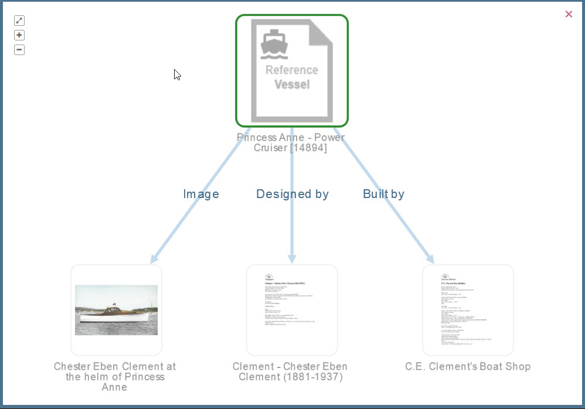
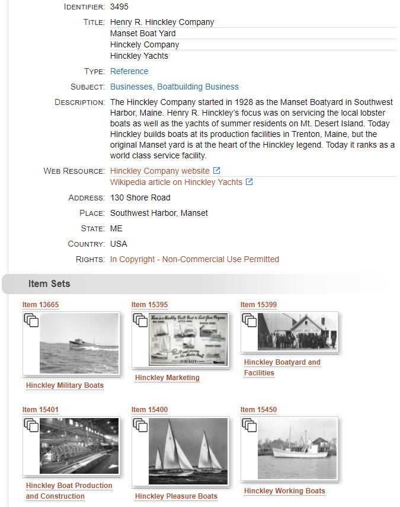

# Kinds of Relationships

## Direct relationships

The visualization graph below illustrates the **direct** relationships between Reference
Item 14894 titled *Princess Anne Power Cruiser* and three other items directly related to it.
From left to right, the directly related items are an image that *depicts* the boat, a
Reference Item about the man who *designed* the boat, and another Reference Item about the
business that *built* the boat. Those last two Reference Items each have a PDF attached to them
which you can see as their thumbnails in the graph. Item 14894 has no attachment which is
why its thumbnail has a placeholder image.

## Indirect relationships

When one item is related to another, it is inevitable that the other item is related to yet another
item and so on. The idea of [six degrees of separation](https://en.wikipedia.org/wiki/Six_degrees_of_separation)
makes for interesting reading on this topic and illustrates how seeing too many relationships
would get confusing. In the Digital Archive, when viewing an item, a user sees at most two degrees
of separation to related items. The first degree is the direct relationship from the item being viewed to
a directly related item. The second degree is the direct relationship from a directly related item to
an indirectly related item.

The visualization graph below illustrates the **indirect** relationships a user sees when viewing item 7181,
a photograph of Esther Moore as a small child in front of her home on Gotts Island. The graph shows two
direct relationships from item 7181 to Reference item for the house and the child. Each Reference item
is in turn directly related to other items shown at the far right: a map of showing the location of the
house on Gotts Island, and a school photograph showing Esther as an adult when she was the girl's
basketball team coach at Southwest Harbor High School. The basketball team photograph and the map
are *indirectly* related to item 7181.

## Implicit relationships

An implicit relationship is one where two items are related to each other by virtue
of having common data that creates an association between them. In contrast, an explicit
relationship is one in which an archivist manually [adds a relationship](/archivist/add-relationships)
between two items.

The Digital Archive recognizes two kinds of implicit relationships:

-   Implicit Field relationship
-   Implicit Reference Item relationship

The next two sections explain both kinds, but it's important to note that the Digital Archive
creates these relationships *automatically* &mdash; the archivist does not have to explicitly add them.

### Implicit field relationship

When the value of the field in one item is the same as the field for another item,
those two items have an implicit field relationship. The Digital Archive site administrator
uses the [Implicit Link option of the AvantElements plugin](/plugins/avantelements/#implicit-link-option)
to specify which fields work this way.

You can tell in the example below that the **_Type_**, **_Subject_**, and **_Source_**
fields have implicit relationships because their text appears as blue hyperlinks.

When you click one of the hyperlinks, you’ll be taken to a search results page listing other
items in the collection that have the same value as the link text. In the example above, clicking
on the **_Subject_** link `Structures, Transportation, Lighthouse` will display search results of all
other items for lighthouses as shown below.

### Implicit Reference Item relationship

When an item’s **_Creator_** or **_Publisher_** field text exactly matches the **_Title_**
field text of a Reference Item, the item has an implicit Reference Item relationship to the
Reference Item. The implicit relationship is either *created by* or *published by*.

In the example above, the green hyperlink for the **_Creator_** field has exactly the same value
as a Reference Item for person that is titled `Ballard – Willis Humphreys Ballard (1906-1980)`.
When you click that link, you'll be taken to the page for that Reference Item. On that page,
you'll see all of the items that person created as shown in the example below.

### Implicit versus explicit relationships

One way to think of the difference between implicit and explicit relationships is that the
Digital Archive software automatically identifies implicit relationships by finding matching
text in two items, whereas only an archivist who is familiar with the collection can determine
how two items are explicitly related. For example, the software does not know that Mary was
married to John, or that she was a library trustee. Even if that information is contained in a
Reference Item for Mary, the software does not have artificial intelligence to parse a biography
in one item and automatically identify relationships based on content in other items. The
software provides the mechanism for recording and displaying relationships, but it is the
archivist’s job to identify and set them.

#### The importance of an exact match

The Digital Archive software automatically creates the hyperlinks for implicit relationships,
but, to maintain implicit Reference Item relationships for  **_Creator_** and **_Publisher_**,
the archivist must ensure that the text in the **_Creator_** and **_Publisher_** fields exactly matches
the **_Title_** text for the corresponding **_Creator_** or **_Publisher_** Reference Item.
Any difference at all, such as an extra space, will break the implicit relationship.
Fortunately, the software provides two mechanisms to help maintain an exact match:

-   If you edit the **_Title_** of an existing **_Creator_** or **_Publisher_** item, e.g. to fix a typo,
    the software will automatically find all other items in the collection that have the original title
    (the value before you changed it) as their **_Creator_** or **_Publisher_**. It will then update all of
    those items with your change.
-   While adding or editing an item, when entering a **_Creator_** or **_Publisher_** value, you can
    type just part of the value, e.g. a person’s last name, and a list of matching **_Creator_** or
    **_Publisher_** titles will appear for you to choose from so that you don’t have to type the name
    and possibly introduce a mismatch.

#### Implicit relationship technology

The logic for implicit field relationships is provided by the [AvantElements plugin](/plugins/avantelements).  
The logic for implicit Reference Item relationships is provided by the [AvantRelationships plugin](/plugins/avantrelationships).

## Genealogical Relationships

While the Digital Archive is not intended to be a genealogy tool, it automatically finds ancestor
and descendant chains. This ancestry feature works for Reference Items
having a subject of `People`. It automatically follows *child of* relationships to
locate parents, grandparents, and so on until the chain ends. It follows *parent of* 
relationships to locate children, grandchildren, and so on. The mechanism will identify
siblings and show multiple spouses, but it does not identify cousins.

The first screenshot below shows and example of the Reference Item for Lucille Clark. It is cut off at the
bottom, but the second screenshot shows the entire contents of the page.

##### Entire page
The screenshot shows the entire contents of the page as three columns. The second and third
columns are actually the middle and end of the page, but are shown side-by-side
for readability.

##### Close up of visualization
The screenshot below is what the visualization in the screenshot above looks like when you
click the **_Enlarge_** link that appears above the visualization in the **_Relationships_** section.

