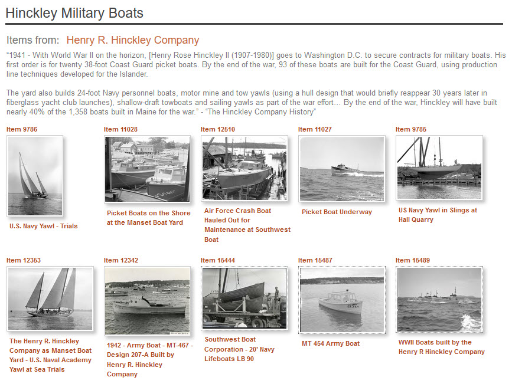

# Kinds of Relationships

The Digital Archive supports these kinds of relationship:

-   Direct relationships
-   [Indirect relationships](#indirect-relationships)
-   [Field relationships](#field-relationships)
-   [Title relationships](#title-relationships)
-   [Genealogical relationships](#genealogical-relationships)
-   [Items sets](#item-sets)

An archivist *explicitly* establishes direct relationships. All of the other kinds of
relationships are *implicit* and are automatically established by the Digital Archive software.

## Direct relationships

A direct relationship is one that directly connects two items.
The [visualization](/user/viewing-related-items/#visualization)
below shows that the item in the center titled *Bear Island Light*
has a direct relationship to seven images, one map, and four other items not shown
because there is not enough room.  
[View this item in the Digital Archive](https://swhplibrary.net/digitalarchive/items/show/8532)

Every relationship that an [archivist adds](/archivist/add-relationship/) is between two items and therefore
is a direct relationship. An archivist cannot add an indirect relationship.

## Indirect relationships

An indirect relationship connects two items to each other via another item. 
The visualization below shows that the item on the left, a photograph of Esther Moore as a
little girl playing in front of her home on Gotts Island, has a direct relationship to two items,
and an indirect relationship to a photograph, a map, and three image items as indicated by the
purple dot.  
[View this item in the Digital Archive](https://swhplibrary.net/digitalarchive/items/show/6439)

Indirect relationships are identified automatically by the Digital Archive &ndash; an 
archivist does not explicitly create them. In this example, both the photo of Esther in 1914 as a child on
Gotts island, and the photo at the lower right on the visualization of Esther as an adult when she was the girl's
basketball team coach at Southwest Harbor High School in 1938, have a direct relationship
to her [Reference Item](/relationships/reference-items/) titled *Moore - Esther (Moore) Trask (1909-2002)*.
*Because both photos are directly related to her Reference Item, they are indirectly
related to each other.*

When one item is related to another, it is inevitable that the other item is related to yet another
item and so on. The idea of [six degrees of separation](https://en.wikipedia.org/wiki/Six_degrees_of_separation)
makes for interesting reading on this topic and illustrates why seeing too many levels of indirection
would be confusing. In the Digital Archive, when viewing an item, a user sees at most two degrees
of separation to related items. The first degree is the direct relationship from the item being viewed to
a directly related item. The second degree is the direct relationship from a directly related item to
an indirectly related item.

## Field relationships

When the value of a field in one item is the same as the value of the same field for another item,
those two items have an implicit field relationship. The Digital Archive site administrator
uses the [Implicit Link option of the AvantElements plugin](/plugins/avantelements/#implicit-link-option)
to specify which fields work this way.

You can tell in the example below that the **_Type_**, **_Subject_**, and **_Source_**
fields have implicit relationships because their text appears as blue hyperlinks. For example,
all items that have the value `Image, Photograph` in the **_Type_** field have implicit relationships.

When you click one of the hyperlinks, you’ll be taken to a search results page listing other
items in the collection that have the same value as the link text. In the example above, clicking
on the **_Subject_** link `Structures, Transportation, Lighthouse` will display search results of all
other items for lighthouses as shown below.

## Title relationships

A title relationship is an implicit relationship where a field's text exactly matches the **_Title_** field text of a
[Reference Item](/relationships/reference-items/). For this kind of relationship to work, a field
most be configured as a title-relationship field. The fields that most commonly use this feature are
**_Creator_** and **_Publisher_**, but it will work with any field that is properly configured.

In the example above, the green hyperlink for the **_Creator_** field has exactly the same value
as a Reference Item for a person that is titled *Ballard – Willis Humphreys Ballard (1906-1980)*.
When you click that link, you'll be taken to the page for that Reference Item. On that page,
you'll see all of the items that person created as shown in the example below.

Note that when you view one of the individual items shown in the `Created` section above,
it will *not* have a corresponding `Created By` section with a thumbnail for its creator
Reference Item (`Ballard` in this example). That's because its **_Creator_** field links back
to the creator Reference Item as in shown in the previous screenshot.

##### Field configuration

To configure a field to enable title relationships, add the field's name to the:

-   [**_Title Relationships_**](/plugins/avantrelationships/#title-relationships-option) 
    option on the AvantRelationships configuration page
-   [**_Title Sync_**](/plugins/avantelements/#title-sync-option) option on the
    AvantElements configuration page    
-   [**_Suggest_**](/plugins/avantelements/#suggest-option) option on the
    AvantElements configuration page    

##### The importance of an exact match

The Digital Archive software automatically creates the hyperlinks for title relationships,
but, for this feature to work, the archivist must ensure that the text in the title-relationship
field *exactly* matches the **_Title_** text for the corresponding Reference Item.
Any difference at all, such as an extra space, will break the implicit relationship.

The Digital Archive provides two mechanisms to help maintain an exact match:

Auto update
:   When you edit the **_Title_** of a Reference Item that contains text that exactly matches the  
    title-relationship field value in other items, the software automatically updates those
    fields with your change when you save the item. For example, if five items have `John Smith`
    as the value of their **_Creator_** field, and you edit the corresponding Reference Item **_Title_**
    to be `John Smyth`, the five items will be automatically updated with the new value when you save
    the Reference Item.

Suggestions
:   While adding or editing an item, as you type into a field that has been configured
    to provide suggestions (third bullet in the previous section), suggestions matching what you
    type appear as you type. The suggestions come from the values of that same field in other items.
    Although the suggestions don't come from the **_Title_** field of Reference Items, the fact that they
    come from other title-relationship fields means they will most likely match Reference Item titles.
    By choosing a suggestion, you ensure an exact match. 

## Genealogical relationships

While the Digital Archive is not intended to be a genealogy tool, it automatically finds ancestor
and descendant chains. This ancestry feature works for Reference Items
having a subject of `People`. It automatically follows *child of* relationships to
locate parents, grandparents, and so on until the chain ends. It follows *parent of* 
relationships to locate children, grandchildren, and so on. The mechanism will identify
siblings and show multiple spouses, but it does not identify cousins.

The example below shows the Reference Item 13712 for Lucille Clark along
with all of the items related to it. The screenshot is very long because this item
has so many related items. At the end is another screenshot showing the visualization.

[View this item](https://swhplibrary.net/digitalarchive/items/show/9703).

##### Close up of visualization
The screenshot below is what the visualization in the screenshot above looks like when you
click the **_Enlarge_** link that appears above the visualization in the **_Relationships_** section.

## Item sets

An item set is two or more items that an archivist has chosen to group together so that when you view
one item, you see the other items in the set. If that sounds a lot like relationships, it's because
item sets are actually a special kind of relationship. [Learn how to create an item set](/archivist/item-set/).

Item sets are especially useful in two cases

-   Grouping items that share a common attribute
-   Dividing a large subject into smaller parts

### Items having a common attribute

A seemingly unrelated set of items can be related to each other by virtue of sharing a 
common attribute. For example, a photograph of a man standing in his yard, another
of a boat in the water, and a third photo of a lake, may have nothing in common except that the man is standing in
snow, the boat's rigging is encrusted with ice, and the lake is frozen &ndash; all are winter scenes.

You could use [Omeka's tags feature](https://omeka.org/classic/docs/Content/Tags/) to tie these items together,
but a tag is only a few words, whereas an item set is itself an item with its own metadata. An item set, for
example, allows you to use the item's **_Description_** field to tell the story of this particular
set of winter photos. An item set's item also has a **_Type_** and **_Subject_** which makes it discoverable
in the **_Refine You Search_** panel. In short, item sets are much more powerful than tags for connecting seemingly
unrelated items.

Below is an example of an item set that contains pictures of vessels that archivists have been unable to identify.
Other than the fact that all of the images are of boats, these items have nothing in common except that all are unknown.

An item can be contained in more than one item set, so for example, a photo of an unknown person on an unknown boat
could be in this set and also is a set for unknown people.

The metadata for the Unknown Vessels item set looks like this:

### Dividing a large subject into smaller parts

Sometimes a topic is too big for one item. For example, the Southwest Harbor Public Library has hundreds of
photographs related to the Henry R. Hinckley Company in Maine. In operation for more than ninety years, the
company has manufactured working boats, pleasure boats, and military boats. The Library used item sets to 
divide these photos into groups that make it easy for a user to focus on the kinds of boats they are
interested in. The item for the Henry R. Hinckley Company is shown below. It's metadata is at the top and
thumbnails for its six item sets are at the bottom.

The next screenshot shows what you see when you click on the title of the first item set above,
the one for Hinckley Military Boats.

The metadata for the Hinckley Military Boats item set looks like this:

---
