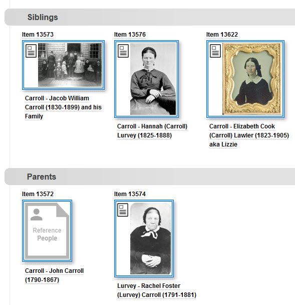

# Reference Items

## What is a Reference Item

A **Reference Item** is an Omeka item that relates other items in the collection to each other.
Think of a **Reference Item** as a stand-in for a person, boat, house, business or other real world
entity that is not actually part of your collection, but is related to items that *are*
in your collection. Photographs, maps, documents, and objects like teacups are *not* Reference Items,
but you can connect them together using Reference Items. Two common examples of using Reference Items follow.

### Relating photos to each other
Suppose you have three photographs of a women. Scans of the photos are in your collection,
but of course, the actual flesh and blood women is not.
To relate her photos to each other, like you would do by putting them on the same page
in a scrapbook, you could:

-   Create a Reference Item as a *stand-in* for the actual women
-   Add a *depicts* relationship from each photo to the Reference Item

The Digital Archive would then know that the three image items are pictures of the women.
When you view one of the photos, or view the Reference Item, you'll see
all three photos, plus the metadata for the Reference Item, as shown below.

As you can see from the example above, this Reference Item 13575 has very little metadata,
perhaps because that's all you know about the woman. Later, if you get more information
about her, you can type it into the **_Description_** field or attach it to the item as a PDF file.
What's important to understand is that *it does not matter how little or how much metadata a
Reference Item has* because its primary purpose is to connect other items together. Conveying
information is important, but secondary.

### Relating reference items to each other
To extend the previous example, suppose you have pictures of Mary Ann's, sisters, brother, and mother,
but not one of her father. You could:

-   Created a Reference Item for each sibling and for the each parent
-   Add a *depicts* relationship from each photo to its corresponding Reference Item
-   Skip the step above for dad because you don't have a picture of him
-   Add a *child of* relationship from each sibling Reference Item to each parent Reference Item

The Digital Archive would then know enough to automatically produce the search results shown below
when you view item 13575 for Mary Ann Carrol. You would see similar results when viewing any of the
related items.

As you can see, Reference Items are simple, but powerful. If you have not done so already, be sure to learn
about the [Archive Relational Model](/relationships/archive-relational-model/) to understand relationships
in general.

### Other uses of Reference Items
The examples above have used
[direct relationships](/relationships/kinds-of-relationships/#indirect-relationships)
between between a photo and a Reference Item, and between two Reference Items.
The Digital Archive automatically derives indirect, genealogical, and creator relationships
from the direct relationships between Reference Items and other items.

Learn about:

-   [Indirect relationships](/relationships/kinds-of-relationships/#indirect-relationships)
-   [Genealogical relationships](/relationships/kinds-of-relationships/#genealogical-relationships)
-   [Creator relationships](/relationships/kinds-of-relationships/#creator-relationships)

## How to create a Reference Item
Creating a Reference Item is easy:

-   Follow the steps to [add an item](archivist/add-edit-item/#add-or-edit-an-item)
-   Choose `Reference` from the **_Type_** field's dropdown list
-   Choose an appropriate Subject such as `People`

To add a relationship between a Reference Item and another item,
see [Add a relationship to an Item](/archivist/add-relationship/)

## Cover images for Reference Items

The Cover Image feature allows you to use the image for one item as the representative
image for a Reference Item, but without attaching the image to the Reference Item. In
the example immediately above, the Reference Items for the siblings, and for Rachel Foster Carroll,
are all using cover images. The Reference Item for John Carroll has no image because no
photograph is available for him.

In the first example above, none of the three photos of Mary Ann Carrol are for Reference Items,
and therefore they don't use cover images. In both examples, you can easily tell which items
are Reference Items and which are not: The thumbnail for a Reference Item has a light blue
double border.

---

!!! note "Important"
    A Reference Item *should not have an image attached to it*, but it can have a PDF
    attachment.  
    The Digital Archive does not enforce this guideline, but it is a best practice
    because attaching an image to a Reference Item is inconsistent with the 
    [Archive Relational Model](/relationships/archive-relational-model/) which uses the
    *depicts* relationship to associate a Reference Item with all of its images.

### What a cover image looks like

The cover image appears in the upper left corner of the Reference Item’s page as though
it were attached with a paperclip. This feature gives some "life" to the Reference Item's
page so that you see the person, not just the PDF file. The cover image also appears as
the thumbnail for Reference Items that do not have a PDF file attached to them such as
the ones in the
[second example above](/relationships/reference-items/#relating-reference-items-to-each-other).

### Setting a cover image

To set the cover image for an item:

-   Edit the item
-   Choose the **_Cover Image_** tab
-   In the **_Item_** field, enter the **_Identifier_** number of the item containing the image
-   Click the **_Save Changes_** button

In the screenshots below, the left side shows the **_Cover Image_** tab for item
13579 which appears the example above. The number 11562 has been entered into the
tab's **_Item_** field. The right side is the item page for item 11562. This illustrates
how the image from item 11562 is being used as the cover for item 13579.

    